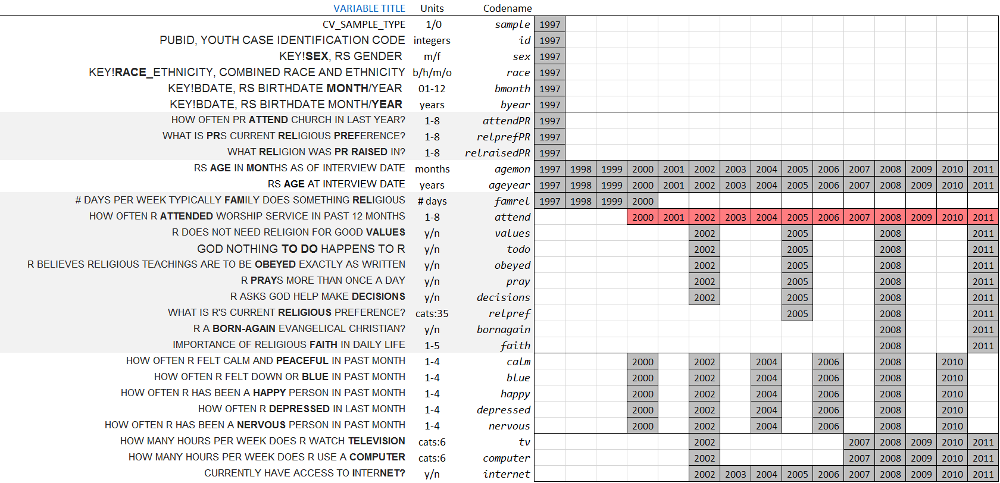
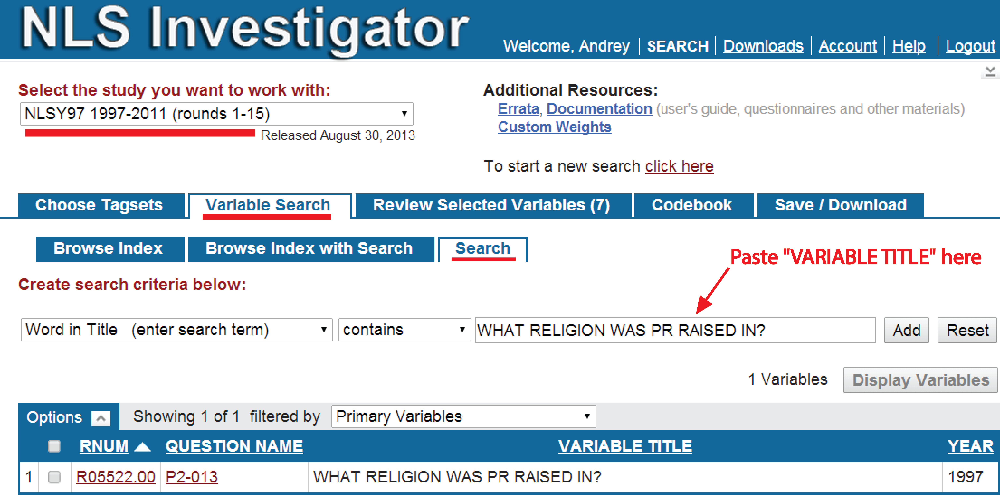

Deriving clean dataset <code>dsL</code> from NLSY97 extract. 

<!--  Set the working directory to the repository's base directory; this assumes the report is nested inside of only one directory.-->
```{r, echo=F, message=F} 
library(knitr)
opts_knit$set(root.dir='../')  #Don't combine this call with any other chunk -especially one that uses file paths.
```

<!-- Set the report-wide options, and point to the external code file. -->
```{r set_options, echo=F, message=T}
require(knitr)
opts_chunk$set(
  results='show', 
  message = TRUE,
  comment = NA, 
  tidy = FALSE,
#   fig.height = 4.8, 
#   fig.width = 6.5, 
  out.width = NULL,
  fig.path = 'figure_rmd/Metrics/',     
  dev = "png",
  dpi = 400
)
echoChunks <- FALSE
options(width=120) #So the output is 50% wider than the default.
read_chunk("./Data/Derive_dsL_from_Extract.R") # the file to which knitr calls for the chunks
```

```{r DeclareGlobals, echo=echoChunks, message=FALSE}
```

```{r LoadPackages, echo=echoChunks, message=FALSE}
```

# Preparing the dataset
## Data Retrieval
Using [NLS Investigator][NLSWeb] a list of variables was downloaded from [NLS][NLS] datasets. All the downloaded materials  were unzipped into  the folder [/Data/Extracts/NLSY97_Religiosity_20042014](https://github.com/andkov/Longitudinal_Models_of_Religiosity_NLSY97/tree/master/Data/Extracts/NLSY97_Religiosity_20042014), located in the GitHub Repository. 
(The naming convention is "Study_Focus_DDMMYYYofDownload")   

#### The downloaded zip.forlder included:    
NLSY97_Religiosity_20042014.cdb - **codebook** containing item descriptions  
NLSY97_Religiosity_20042014.csv - **data** in comma delimited format  
NLSY97_Religiosity_20042014.NLSY97 - **tagset**, the list of variables in the downloaded dataset  
NLSY97_Religiosity_20042014.dtc - STATA **dictionary** file of selected variables, contains data as well
  

We import the raw data of NLSY97 from .**csv** file  and make initial clean up. 
<!-- run initial import from the databank defined by tagset. --> 
```{r LoadData, echo=echoChunks, message=FALSE}
```
The STATA **dictionary** file printed below  lists the selected variables : unique NLSY97 reference numbers (RNUM) are paired wtih their descriptive labels (VARIABLE TITLE). 

## Selected variables
```{r, echo=echoChunks, message=FALSE}
print(dsSourceLabels)
```

```{r TweakData, echo=echoChunks, message=FALSE, results='hide'}
```

After renaming the variables, we arrange data in wide format (variable/occasions as columns), arriving at the basis dataset <code>dsSource</code>, which contains 
```{r, echo=TRUE}
ncol(dsSource)
```
variables and
```{r, echo=TRUE}
nrow(dsSource)
```
respondents.

Dictionary file is imported into Excel file "ItemMapping_20042014.xlsx", where variables are renamed and organized with respect to occasssions of their measurement. Renaming and  additional data grooming is done  by <code>@knitr TweakData</code> chunk in  the sourced .R file. The result is variable-by-occasion databox slice. 


##  Databox

[Interactive version][databoxStatcanvas]


Variables on vertical dimension and occasions on horizontal intersect over grey-filled boxes displaying the year of the wave for which data are available.  Variable **attend** is marked by red to indicate that it is the primary quantification of religiosity in the statistical models used in this study. 

The variable dimension of the databox slice is represented by three identifiers adjacent to the left of the grid. 

+ **Variable Title** - verbatim identifier from NLSY97    
+ **Unit** - describes the scales used to measure variables  
+ **Codename** - the (new) name of the variable, as it is used in R code  

## Selected variables 

The light grey background highlights the variables related to religion and spirituality.  The first section of items (**attendPR**, **relprefPR**, **relraisedPR**) gives data on the religiosity of [parents][NLSparents] of the respondents, whose households were sampled into NLSY97. Another grey section lists the items related to the religiosity of the youth, which give data on their religious behaviors (**relpref**, **attend**, **pray**, **decisions**) and attitudes (**values**, **todo**, **obeyed**, **bornagain**, **faith**). 

Context variables and covariates are on white background. The top section gives basic demographics: the month (**bmonth**) and year (**byear**) of birth, sex (**sex**), race (**race**), as well as the indicator whether the individual is a member of the cross-sectional sampling or a special oversample of minorities (**sample**).  Two age variables are located between the religiosity sections: age at the time of the interview in months (**agemon**) and years (**ageyear**). At the bottom are self-reports on emotional wellbeing (**calm**, **blue**, **happy**, **depressed**, **nervous**) and media activities (**internet**, **computer**, **tv**) of respondents. 

To review original questionnaire cards of NLSY97 as well as descriptive statistics for the selected variables see the [Interactive version][databoxStatcanvas]

## dsL - initial dataset
This databox slice corresponds to the dataset <code>dsL</code>

  

which transposes the former, distributing variables on the horizontal axis.  Variable **year** keeps track of measurement round and  separated two kinds of variables: those, which values do not change with time and those that were measured at multiple occasions. This distinction will be of convenience in later discussion of statistical models. The dataset in figure 3.3 is referred to as <code>dsL</code> throughout this work and the accompanying R code .  It defines the scope of NLSY97 data used in the current study and has a direct correspondence to the databox slice from figure 3.2. While other variables of interest might be added in course or reproduction of this research, it is useful to think of such dataset as a midway point between raw data and model-specific datasets


## Factor labels
Section **Labeling Factors** in the [Metrics][metrics] report explains how script [LabelingFactorLevels][labels] sourced in here augements the dataset <code>dsL</code> with a copy of initial variables, labeled and saved as factors.
```{r LabelFactors, echo=T, message=T}
```
By adding or removing an "F" to the end of the variable, one can select the variable either in the raw metric (**attend**) or as a labeled factor (**attendF**):
```{r}
ds<- dsL[dsL$id==1,c("id","year","attend","attendF")]
str(ds)
print(ds)
```

## Saving clean dataset
Finally, we output the created clean dataset <code>dsL</code> as a .cvs file. Also, it is saved in an .rds format, native to R, which preserves factor levels, not saved in .csv. This report is computationally intensive, so it is typically omitted from the reproduction cycle. Instead, from now on, the initial point of departure for data projects will be the import of **dsL.rds** file produced by this report.
```{r SaveDerivedData, echo=T, message=T}
```


## Working with NLS Investigator

To explore the variables in the native context of NLS, go to [NLS Investigator][NLSWeb] (you will have to register a free account to keep track of your progress), select "NLYS97 1997-2011" in the first dropdown box and then click  "Choose File" under "Upload Tagset." Select the file __NLSY97_Religiosity_20042014.NLSY97__ from the folder __/Data/Extract/NLSY97_Religiosity_20042014__. All the variables from this extract will be loaded into NLS Web Investigator.

Alternatively, one can locate the particular item of interest by copying and pasting its "Variable Title" it into "Word in Title" search line of the [NLS Investigator](https://www.nlsinfo.org/investigator/pages/login.jsp), as indicated in the graphic below. 




# Read more 

Reports in <code>./Models/Descriptives</code>:   

+ [Metrics][metrics] - how values of items are labeled  (__Continue__)     
+ [Descriptives][descriptives] - basic stats of various items       
+ [Attendance][attend] - focus on church attendence over time      
+ [Databox][databox]     

See also   

+ [Deriving Data from NLYS97 extract][derive]
+ [Data Manipulation Guide][manipulate]


```{r child, child = '../Models/Descriptives/Citations.Rmd'}

```
