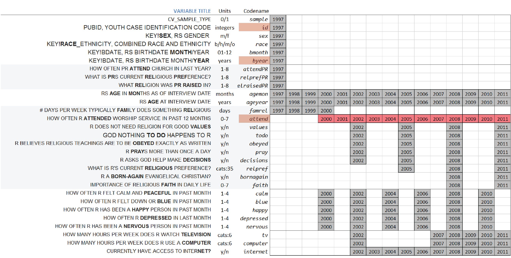

Deriving clean dataset **dsL** from NLSY97 extract
==================================================

This report narrates the origin of dataset used in the study.

<!--  Set the working directory to the repository's base directory; this assumes the report is nested inside of only one directory.-->

<!-- Set the report-wide options, and point to the external code file. -->

Working with NLS Investigator
-----------------------------

To explore the variables in the native context of NLS, go to [NLS
Investigator](https://www.nlsinfo.org/investigator/pages/login.jsp) (you
will have to register a free account with them to keep track of you
progress), select "NLYS97 1997-2011" in the first dropdown box and then
click on "Choose File" under "Upload Tagset." Select the file
"NLSY97\_Religiosity\_20042014.NLSY97" from the folder
"**/Documentation/data/NLSY97\_Religiosity\_20042014**", in the GitHub
repository. All the variables from this extract will be loaded into NLS
Web Investigator.

Alternatively, one can locate the particular item of interest by copying
and pasting its "Variable Title" it into "Word in Title" search line of
the [NLS
Investigator](https://www.nlsinfo.org/investigator/pages/login.jsp), as
indicated in the graphic below.

### Data Retrieval

Using [NLS
Investigator](https://www.nlsinfo.org/investigator/pages/login.jsp) a
list of variables was downloaded from [NLS](http://www.bls.gov/nls/)
datasets. All the downloaded materials were unzipped into the folder
[/Data/Extracts/NLSY97\_Religiosity\_20042014](https://github.com/andkov/Longitudinal_Models_of_Religiosity_NLSY97/tree/master/Data/Extracts/NLSY97_Religiosity_20042014),
located in the GitHub Repository. (The naming convention is
"Study\_Focus\_DDMMYYYofDownload")

#### The downloaded zip.forlder included:

NLSY97\_Religiosity\_20042014.cdb - **codebook** containing item
descriptions  
NLSY97\_Religiosity\_20042014.csv - **data** in comma delimited format  
NLSY97\_Religiosity\_20042014.NLSY97 - **tagset**, the list of variables
in the downloaded dataset  
NLSY97\_Religiosity\_20042014.dtc - STATA **dictionary** file of
selected variables, contains data as well

We import the raw data of NLSY97 from .**csv** file and make initial
clean up.
<!-- run initial import from the databank defined by tagset. -->

The STATA **dictionary** file printed below lists the selected variables
: unique NLSY97 reference numbers (RNUM) are paired wtih their
descriptive labels (VARIABLE TITLE).

#### Selected variables

            RNUM                                VARIABLE_TITLE
    1   R0323900              # DAYS/WK TYP FAM RELIGIOUS 1997
    2   R2165200              # DAYS/WK TYP FAM RELIGIOUS 1998
    3   R3483100              # DAYS/WK TYP FAM RELIGIOUS 1999
    4   R4881300              # DAYS/WK TYP FAM RELIGIOUS 2000
    5   S2977900 CURRENTLY HAVE ACCESS TO INTERNET? (SAQ) 2003
    6   S4676700 CURRENTLY HAVE ACCESS TO INTERNET? (SAQ) 2004
    7   S6308900 CURRENTLY HAVE ACCESS TO INTERNET? (SAQ) 2005
    8   S8329800 CURRENTLY HAVE ACCESS TO INTERNET? (SAQ) 2006
    9   T0737600 CURRENTLY HAVE ACCESS TO INTERNET? (SAQ) 2007
    10  T2779700 CURRENTLY HAVE ACCESS TO INTERNET? (SAQ) 2008
    11  T4494400 CURRENTLY HAVE ACCESS TO INTERNET? (SAQ) 2009
    12  T6141400 CURRENTLY HAVE ACCESS TO INTERNET? (SAQ) 2010
    13  T7635300 CURRENTLY HAVE ACCESS TO INTERNET? (SAQ) 2011
    14  R1193900                  CV_AGE(MONTHS)_INT_DATE 1997
    15  R2553400                  CV_AGE(MONTHS)_INT_DATE 1998
    16  R3876200                  CV_AGE(MONTHS)_INT_DATE 1999
    17  R5453600                  CV_AGE(MONTHS)_INT_DATE 2000
    18  R7215900                  CV_AGE(MONTHS)_INT_DATE 2001
    19  S1531300                  CV_AGE(MONTHS)_INT_DATE 2002
    20  S2000900                  CV_AGE(MONTHS)_INT_DATE 2003
    21  S3801000                  CV_AGE(MONTHS)_INT_DATE 2004
    22  S5400900                  CV_AGE(MONTHS)_INT_DATE 2005
    23  S7501100                  CV_AGE(MONTHS)_INT_DATE 2006
    24  T0008400                  CV_AGE(MONTHS)_INT_DATE 2007
    25  T2011000                  CV_AGE(MONTHS)_INT_DATE 2008
    26  T3601400                  CV_AGE(MONTHS)_INT_DATE 2009
    27  T5201300                  CV_AGE(MONTHS)_INT_DATE 2010
    28  T6651200                  CV_AGE(MONTHS)_INT_DATE 2011
    29  R1194100                          CV_AGE_INT_DATE 1997
    30  R2553500                          CV_AGE_INT_DATE 1998
    31  R3876300                          CV_AGE_INT_DATE 1999
    32  R5453700                          CV_AGE_INT_DATE 2000
    33  R7216000                          CV_AGE_INT_DATE 2001
    34  S1531400                          CV_AGE_INT_DATE 2002
    35  S2001000                          CV_AGE_INT_DATE 2003
    36  S3801100                          CV_AGE_INT_DATE 2004
    37  S5401000                          CV_AGE_INT_DATE 2005
    38  S7501200                          CV_AGE_INT_DATE 2006
    39  T0008500                          CV_AGE_INT_DATE 2007
    40  T2011100                          CV_AGE_INT_DATE 2008
    41  T3601500                          CV_AGE_INT_DATE 2009
    42  T5201400                          CV_AGE_INT_DATE 2010
    43  T6651300                          CV_AGE_INT_DATE 2011
    44  R1235800                           CV_SAMPLE_TYPE 1997
    45  S0919700           GOD NOTHING TO DO HAPPENS TO R 2002
    46  S6317100           GOD NOTHING TO DO HAPPENS TO R 2005
    47  T2782200           GOD NOTHING TO DO HAPPENS TO R 2008
    48  T7637800           GOD NOTHING TO DO HAPPENS TO R 2011
    49  R4893900              HOW OFT R BEEN HAPPY PERSON 2000
    50  S0921100              HOW OFT R BEEN HAPPY PERSON 2002
    51  S4682200              HOW OFT R BEEN HAPPY PERSON 2004
    52  S8332600              HOW OFT R BEEN HAPPY PERSON 2006
    53  T2782900              HOW OFT R BEEN HAPPY PERSON 2008
    54  T6144000              HOW OFT R BEEN HAPPY PERSON 2010
    55  R4893600            HOW OFT R BEEN NERVOUS PERSON 2000
    56  S0920800            HOW OFT R BEEN NERVOUS PERSON 2002
    57  S4681900            HOW OFT R BEEN NERVOUS PERSON 2004
    58  S8332300            HOW OFT R BEEN NERVOUS PERSON 2006
    59  T2782600            HOW OFT R BEEN NERVOUS PERSON 2008
    60  T6143700            HOW OFT R BEEN NERVOUS PERSON 2010
    61  R4893700          HOW OFT R CALM/PEACEFUL PAST MO 2000
    62  S0920900          HOW OFT R CALM/PEACEFUL PAST MO 2002
    63  S4682000          HOW OFT R CALM/PEACEFUL PAST MO 2004
    64  S8332400          HOW OFT R CALM/PEACEFUL PAST MO 2006
    65  T2782700          HOW OFT R CALM/PEACEFUL PAST MO 2008
    66  T6143800          HOW OFT R CALM/PEACEFUL PAST MO 2010
    67  R4894000           HOW OFT R DEPRESSED LAST MONTH 2000
    68  S0921200           HOW OFT R DEPRESSED LAST MONTH 2002
    69  S4682300           HOW OFT R DEPRESSED LAST MONTH 2004
    70  S8332700           HOW OFT R DEPRESSED LAST MONTH 2006
    71  T2783000           HOW OFT R DEPRESSED LAST MONTH 2008
    72  T6144100           HOW OFT R DEPRESSED LAST MONTH 2010
    73  R4893800              HOW OFT R FELT DOWN OR BLUE 2000
    74  S0921000              HOW OFT R FELT DOWN OR BLUE 2002
    75  S4682100              HOW OFT R FELT DOWN OR BLUE 2004
    76  S8332500              HOW OFT R FELT DOWN OR BLUE 2006
    77  T2782800              HOW OFT R FELT DOWN OR BLUE 2008
    78  T6143900              HOW OFT R FELT DOWN OR BLUE 2010
    79  R0552400             HOW OFTEN PR CHURCH LAST YR? 1997
    80  R4893400          HOW OFTEN R ATTEND WORSHIP SERV 2000
    81  R6520100          HOW OFTEN R ATTEND WORSHIP SERV 2001
    82  S0919300          HOW OFTEN R ATTEND WORSHIP SERV 2002
    83  S2987800          HOW OFTEN R ATTEND WORSHIP SERV 2003
    84  S4681700          HOW OFTEN R ATTEND WORSHIP SERV 2004
    85  S6316700          HOW OFTEN R ATTEND WORSHIP SERV 2005
    86  S8331500          HOW OFTEN R ATTEND WORSHIP SERV 2006
    87  T0739400          HOW OFTEN R ATTEND WORSHIP SERV 2007
    88  T2781700          HOW OFTEN R ATTEND WORSHIP SERV 2008
    89  T4495000          HOW OFTEN R ATTEND WORSHIP SERV 2009
    90  T6143400          HOW OFTEN R ATTEND WORSHIP SERV 2010
    91  T7637300          HOW OFTEN R ATTEND WORSHIP SERV 2011
    92  S1225400                 HRS/WK R USES A COMPUTER 2002
    93  T1049900                 HRS/WK R USES A COMPUTER 2007
    94  T3145100                 HRS/WK R USES A COMPUTER 2008
    95  T4565400                 HRS/WK R USES A COMPUTER 2009
    96  T6209600                 HRS/WK R USES A COMPUTER 2010
    97  T7707000                 HRS/WK R USES A COMPUTER 2011
    98  S1225500              HRS/WK R WATCHES TELEVISION 2002
    99  T1050000              HRS/WK R WATCHES TELEVISION 2007
    100 T3145200              HRS/WK R WATCHES TELEVISION 2008
    101 T4565500              HRS/WK R WATCHES TELEVISION 2009
    102 T6209700              HRS/WK R WATCHES TELEVISION 2010
    103 T7707100              HRS/WK R WATCHES TELEVISION 2011
    104 T2782400  IMPORT OF RELIGIOUS FAITH IN DAILY LIFE 2008
    105 T7638000  IMPORT OF RELIGIOUS FAITH IN DAILY LIFE 2011
    106 R0536401                   KEY!BDATE M/Y (SYMBOL) 1997
    107 R0536402                   KEY!BDATE M/Y (SYMBOL) 1997
    108 R1482600              KEY!RACE_ETHNICITY (SYMBOL) 1997
    109 R0536300                         KEY!SEX (SYMBOL) 1997
    110 R0000100                      PUBID - YTH ID CODE 1997
    111 T2111500    R A BORN-AGAIN EVANGELICAL CHRISTIAN? 2008
    112 T6759400    R A BORN-AGAIN EVANGELICAL CHRISTIAN? 2011
    113 S0919600           R ASKS GOD HELP MAKE DECISIONS 2002
    114 S6317000           R ASKS GOD HELP MAKE DECISIONS 2005
    115 T2782100           R ASKS GOD HELP MAKE DECISIONS 2008
    116 T7637700           R ASKS GOD HELP MAKE DECISIONS 2011
    117 S0919500         R BELIEVE RELIG TEACHINGS OBEYED 2002
    118 S6316900         R BELIEVE RELIG TEACHINGS OBEYED 2005
    119 T2782000         R BELIEVE RELIG TEACHINGS OBEYED 2008
    120 T7637600         R BELIEVE RELIG TEACHINGS OBEYED 2011
    121 S5532800                          R CURR REL PREF 2005
    122 T2111400                          R CURR REL PREF 2008
    123 T6759300                          R CURR REL PREF 2011
    124 S0919400       R NOT NEED RELIGION TO HAVE VALUES 2002
    125 S6316800       R NOT NEED RELIGION TO HAVE VALUES 2005
    126 T2781900       R NOT NEED RELIGION TO HAVE VALUES 2008
    127 T7637500       R NOT NEED RELIGION TO HAVE VALUES 2011
    128 S0919800             R PRAYS MORE THAN ONCE A DAY 2002
    129 S6317200             R PRAYS MORE THAN ONCE A DAY 2005
    130 T2782300             R PRAYS MORE THAN ONCE A DAY 2008
    131 T7637900             R PRAYS MORE THAN ONCE A DAY 2011
    132 R0552300              WHAT IS PR CURR RELIG PREF? 1997
    133 R0552200                 WHAT RELIG PR RAISED IN? 1997

After renaming the variables, we arrange data in wide format
(variable/occasions as columns), arriving at the basis dataset
**dsSource**, which contains

    ncol(dsSource)

    [1] 133

observations and

    nrow(dsSource)

    [1] 8984

respondents.

Dictionary file is imported into Excel file
"ItemMapping\_20042014.xlsx", where variables are renamed and organized
with respect to occasssions of their measurement. Renaming and data
additional data grooming is described in <**@knitr> TweakData\*\* chunk
of the associated .R file. The result is Variable-by-occasion databox
slice.

### Databox, VO-slice of the selected variables

  
[Interactive version](http://statcanvas.net/thesis/databox/index.html)

Variables on vertical dimension and occasions on horizontal intersect
over grey-filled boxes displaying the year of the wave for which data
are available. Variable **attend** is marked by red to indicate that it
is the primary quantification of religiosity in the statistical models
used in this study.

The variable dimension of the databox slice is represented by three
identifiers adjacent to the left of the grid.

-   **Variable Title** - verbatim identifier from NLSY97  
-   **Unit** - describes the scales used to measure variables  
-   **Codename** - the (new) name of the variable, as it is used in R
    code

### Religiosity, Context, and Covariates

The light grey background highlights the variables related to religion
and spirituality. The first section of items (**attendPR**,
**relprefPR**, **relraisedPR**) gives data on the religiosity of
[parents](http://www.bls.gov/nls/quex/r1/y97rd1pquex.htm) of the
respondents, whose households were sampled into NLSY97. Another grey
section lists the items related to the religiosity of the youth, which
give data on their religious behaviors (**relpref**, **attend**,
**pray**, **decisions**) and attitudes (**values**, **todo**,
**obeyed**, **bornagain**, **faith**).

Context variables and covariates are on white background. The top
section gives basic demographics: the month (**bmonth**) and year
(**byear**) of birth, sex (**sex**), race (**race**), as well as the
indicator whether the individual is a member of the cross-sectional
sampling or a special oversample of minorities (**sample**). Two age
variables are located between the religiosity sections: age at the time
of the interview in months (**agemon**) and years (**ageyear**). At the
bottom are self-reports on emotional wellbeing (**calm**, **blue**,
**happy**, **depressed**, **nervous**) and media activities
(**internet**, **computer**, **tv**) of respondents.

To review original questionnaire cards of NLSY97 as well as descriptive
statistics for the selected variables see the [Interactive
version](http://statcanvas.net/thesis/databox/index.html)

Clean dataset
-------------

This databox slice corresponds to the dataset **dsL**

which transposes the former, distributing variables on the horizontal
axis. Variable **year** keeps track of measurement round and separated
two kinds of variables: those, which values do not change with time and
those that were measured at multiple occasions. This distinction will be
of convenience in later discussion of statistical models. The dataset in
figure 3.3 is referred to as ***dsL*** throughout this work and the
accompanying R code . It defines the scope of NLSY97 data used in the
current study and has a direct correspondence to the databox slice from
figure 3.2. While other variables of interest might be added in course
or reproduction of this research, it is useful to think of such dataset
as a midway point between raw data and model-specific datasets

### Factor labels

In graph production with R, the scale of the variables is indicative of
mapping fucntion applied to it. Therefore it is frequently of great
convenience to

Finally, we output the created clean dataset **dsL** as a .cvs file.
Also, it is saved in an .rds format, native to R.

    pathdsL <- file.path(getwd(),"Data/Derived/dsL.csv")
    write.csv(dsL,pathdsL,  row.names=FALSE)

    pathOutputSubject <- file.path(pathDir,"Data/Derived/dsL.rds")
    saveRDS(object=dsL, file=pathOutputSubject, compress="xz")

    ###########################

Additional considerations
=========================
