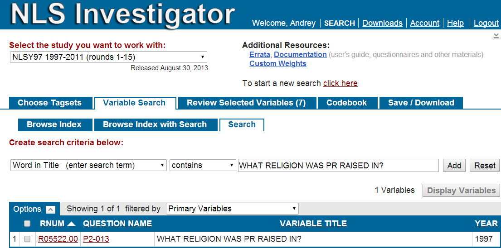

Reproducibility Instructions
=================================================
This report narrates the manipulations of the NLSY97 dataset in preparing it for longitudinal modeling.


<!--  Set the working directory to the repository's base directory; this assumes the report is nested inside of only one directory.-->


<!-- Set the report-wide options, and point to the external code file. -->


## Data Retrieval
Using [NLS Investigator](https://www.nlsinfo.org/investigator/pages/login.jsp) a list of variables was downloaded from [NLS](http://www.bls.gov/nls/) datasets. All the downloaded materials  were unzipped into  the folder "**/Data/Extracts/NLSY97_Religiosity_20042014**", located in the GitHub Repository. 
(The naming convention is "Study_Focus_DDMMYYYofDownload")   

#### The forlder includes:    
NLSY97_Religiosity_20042014.cdb - **codebook** containing item descriptions  
NLSY97_Religiosity_20042014.csv - **data** in comma delimited format  
NLSY97_Religiosity_20042014.NLSY97 - **tagset**, the list of variables in the downloaded dataset  
NLSY97_Religiosity_20042014.dtc - STATA **dictionary** file of selected variables, contains data as well
  

We import the raw data of NLSY97 and make initial clean up
<!-- run initial import from the databank defined by tagset. --> 

```r
### Import the data ###
pathDir<-file.path(getwd()) # define path for project root directory

# Links to the data source # for now keep the link non-dynamic
# pathDataSource <- "./Data/Extracts/NLSY97_Religiosity_20042014/NLSY97_Religiosity_20042014.csv"
tagset<-c("NLSY97_Religiosity_20042014") #"Database_ResponseOfInterest_DateOfDownload"
pathDataFolder<-file.path("./Data/Extracts",tagset)
pathDataSource<-file.path(pathDataFolder,paste0(tagset,".csv")) 
pathDataSourceLabels<-file.path(pathDataFolder,paste0(tagset,".dct"))

# reading in the data
dsSource<-read.csv(pathDataSource,header=TRUE, skip=0,sep=",")
varOrig<-ncol(dsSource) # Original number of variables in the NLS download
dsSource$T6650500<-NULL # Remove "Version number"  for cleaner dataset

dim(dsSource)
```

[1] 8984  133

```r

### NLSY97 variable id are linked to the descriptive label in the file dictionary file "NLSY97_Religiosity_20042014.dtc" ###
dsSourceLabels<-read.csv(pathDataSourceLabels,header=TRUE, skip=0,nrow=varOrig, sep="")
dsSourceLabels$X.<-NULL
# rename to match NLS Web Investigator format
dsSourceLabels<-rename(dsSourceLabels,replace=c("infile"="RNUM","dictionary"="VARIABLE_TITLE")) 
# remove "Version number" from list of variables
dsSourceLabels<-dsSourceLabels[dsSourceLabels$RNUM!="T6650500",] 
dsSourceLabels<-arrange(dsSourceLabels,VARIABLE_TITLE) # sort by Variable Title
write.table(dsSourceLabels, "./Data/ItemMapping/dsSourceLabels.csv", sep=",")

dim(dsSourceLabels)
```

[1] 133   2

```r


# Using renaming template "NLSY97_Religiosity_20042014.xlsx" located in "Documentation\data" folder
# rename the native variable names of NLSY97 (left) into custom chosen names for programming convenience (right)


############################
```

The **dictionary** file is querried to obtain unique NLSY97 item reference numbers (RNUM) connected to descriptive labels. The Excel file "ItemMapping_20042014.xlsx" contains several tabs, the first of which ""


```
       sample id sex race bmonth byear attendPR relprefPR relraisedPR       variable value
1           1  1   2    4      9  1981        7        21          21    famrel_1997    NA
8985        1  1   2    4      9  1981        7        21          21    agemon_1997   190
17969       1  1   2    4      9  1981        7        21          21   ageyear_1997    15
26953       1  1   2    4      9  1981        7        21          21    famrel_1998    NA
35937       1  1   2    4      9  1981        7        21          21    agemon_1998   206
44921       1  1   2    4      9  1981        7        21          21   ageyear_1998    17
53905       1  1   2    4      9  1981        7        21          21    famrel_1999    NA
62889       1  1   2    4      9  1981        7        21          21    agemon_1999   219
71873       1  1   2    4      9  1981        7        21          21   ageyear_1999    18
80857       1  1   2    4      9  1981        7        21          21    famrel_2000    NA
89841       1  1   2    4      9  1981        7        21          21    attend_2000     1
98825       1  1   2    4      9  1981        7        21          21   nervous_2000     3
107809      1  1   2    4      9  1981        7        21          21      calm_2000     3
116793      1  1   2    4      9  1981        7        21          21      blue_2000     3
125777      1  1   2    4      9  1981        7        21          21     happy_2000     3
134761      1  1   2    4      9  1981        7        21          21 depressed_2000     3
143745      1  1   2    4      9  1981        7        21          21    agemon_2000   231
152729      1  1   2    4      9  1981        7        21          21   ageyear_2000    19
161713      1  1   2    4      9  1981        7        21          21    attend_2001     6
170697      1  1   2    4      9  1981        7        21          21    agemon_2001   243
```

```
        sample id sex race bmonth byear attendPR relprefPR relraisedPR  variable value year
8985         1  1   2    4      9  1981        7        21          21    agemon   190 1997
35937        1  1   2    4      9  1981        7        21          21    agemon   206 1998
62889        1  1   2    4      9  1981        7        21          21    agemon   219 1999
143745       1  1   2    4      9  1981        7        21          21    agemon   231 2000
170697       1  1   2    4      9  1981        7        21          21    agemon   243 2001
305457       1  1   2    4      9  1981        7        21          21    agemon   256 2002
323425       1  1   2    4      9  1981        7        21          21    agemon   266 2003
359361       1  1   2    4      9  1981        7        21          21    agemon   279 2004
440217       1  1   2    4      9  1981        7        21          21    agemon   290 2005
530057       1  1   2    4      9  1981        7        21          21    agemon   302 2006
610913       1  1   2    4      9  1981        7        21          21    agemon   313 2007
664817       1  1   2    4      9  1981        7        21          21    agemon   325 2008
835513       1  1   2    4      9  1981        7        21          21    agemon   337 2009
889417       1  1   2    4      9  1981        7        21          21    agemon   350 2010
988241       1  1   2    4      9  1981        7        21          21    agemon   360 2011
17969        1  1   2    4      9  1981        7        21          21   ageyear    15 1997
44921        1  1   2    4      9  1981        7        21          21   ageyear    17 1998
71873        1  1   2    4      9  1981        7        21          21   ageyear    18 1999
152729       1  1   2    4      9  1981        7        21          21   ageyear    19 2000
179681       1  1   2    4      9  1981        7        21          21   ageyear    20 2001
314441       1  1   2    4      9  1981        7        21          21   ageyear    21 2002
332409       1  1   2    4      9  1981        7        21          21   ageyear    22 2003
368345       1  1   2    4      9  1981        7        21          21   ageyear    23 2004
449201       1  1   2    4      9  1981        7        21          21   ageyear    24 2005
539041       1  1   2    4      9  1981        7        21          21   ageyear    25 2006
619897       1  1   2    4      9  1981        7        21          21   ageyear    26 2007
673801       1  1   2    4      9  1981        7        21          21   ageyear    27 2008
844497       1  1   2    4      9  1981        7        21          21   ageyear    28 2009
898401       1  1   2    4      9  1981        7        21          21   ageyear    29 2010
997225       1  1   2    4      9  1981        7        21          21   ageyear    29 2011
89841        1  1   2    4      9  1981        7        21          21    attend     1 2000
161713       1  1   2    4      9  1981        7        21          21    attend     6 2001
188665       1  1   2    4      9  1981        7        21          21    attend     2 2002
350377       1  1   2    4      9  1981        7        21          21    attend     1 2003
386313       1  1   2    4      9  1981        7        21          21    attend     1 2004
476153       1  1   2    4      9  1981        7        21          21    attend     1 2005
557009       1  1   2    4      9  1981        7        21          21    attend     1 2006
637865       1  1   2    4      9  1981        7        21          21    attend     1 2007
709737       1  1   2    4      9  1981        7        21          21    attend     1 2008
862465       1  1   2    4      9  1981        7        21          21    attend     1 2009
916369       1  1   2    4      9  1981        7        21          21    attend     1 2010
1033161      1  1   2    4      9  1981        7        21          21    attend     1 2011
116793       1  1   2    4      9  1981        7        21          21      blue     3 2000
260537       1  1   2    4      9  1981        7        21          21      blue     2 2002
413265       1  1   2    4      9  1981        7        21          21      blue     1 2004
583961       1  1   2    4      9  1981        7        21          21      blue     1 2006
790593       1  1   2    4      9  1981        7        21          21      blue     3 2008
943321       1  1   2    4      9  1981        7        21          21      blue     3 2010
691769       1  1   2    4      9  1981        7        21          21 bornagain    NA 2008
1015193      1  1   2    4      9  1981        7        21          21 bornagain    NA 2011
107809       1  1   2    4      9  1981        7        21          21      calm     3 2000
251553       1  1   2    4      9  1981        7        21          21      calm     4 2002
404281       1  1   2    4      9  1981        7        21          21      calm     4 2004
574977       1  1   2    4      9  1981        7        21          21      calm     4 2006
781609       1  1   2    4      9  1981        7        21          21      calm     3 2008
934337       1  1   2    4      9  1981        7        21          21      calm     3 2010
287489       1  1   2    4      9  1981        7        21          21  computer     5 2002
646849       1  1   2    4      9  1981        7        21          21  computer     6 2007
817545       1  1   2    4      9  1981        7        21          21  computer    NA 2008
871449       1  1   2    4      9  1981        7        21          21  computer     6 2009
970273       1  1   2    4      9  1981        7        21          21  computer     6 2010
1087065      1  1   2    4      9  1981        7        21          21  computer     6 2011
215617       1  1   2    4      9  1981        7        21          21 decisions     1 2002
503105       1  1   2    4      9  1981        7        21          21 decisions     1 2005
736689       1  1   2    4      9  1981        7        21          21 decisions     1 2008
1060113      1  1   2    4      9  1981        7        21          21 decisions     1 2011
134761       1  1   2    4      9  1981        7        21          21 depressed     3 2000
278505       1  1   2    4      9  1981        7        21          21 depressed     2 2002
431233       1  1   2    4      9  1981        7        21          21 depressed     1 2004
601929       1  1   2    4      9  1981        7        21          21 depressed     1 2006
808561       1  1   2    4      9  1981        7        21          21 depressed     3 2008
961289       1  1   2    4      9  1981        7        21          21 depressed     3 2010
763641       1  1   2    4      9  1981        7        21          21     faith     3 2008
1096049      1  1   2    4      9  1981        7        21          21     faith     1 2011
1            1  1   2    4      9  1981        7        21          21    famrel    NA 1997
26953        1  1   2    4      9  1981        7        21          21    famrel    NA 1998
53905        1  1   2    4      9  1981        7        21          21    famrel    NA 1999
80857        1  1   2    4      9  1981        7        21          21    famrel    NA 2000
125777       1  1   2    4      9  1981        7        21          21     happy     3 2000
269521       1  1   2    4      9  1981        7        21          21     happy     3 2002
422249       1  1   2    4      9  1981        7        21          21     happy     4 2004
592945       1  1   2    4      9  1981        7        21          21     happy     4 2006
799577       1  1   2    4      9  1981        7        21          21     happy     3 2008
952305       1  1   2    4      9  1981        7        21          21     happy     3 2010
341393       1  1   2    4      9  1981        7        21          21  internet     1 2003
377329       1  1   2    4      9  1981        7        21          21  internet     0 2004
467169       1  1   2    4      9  1981        7        21          21  internet     1 2005
548025       1  1   2    4      9  1981        7        21          21  internet     1 2006
628881       1  1   2    4      9  1981        7        21          21  internet     1 2007
700753       1  1   2    4      9  1981        7        21          21  internet     1 2008
853481       1  1   2    4      9  1981        7        21          21  internet     1 2009
907385       1  1   2    4      9  1981        7        21          21  internet     1 2010
1024177      1  1   2    4      9  1981        7        21          21  internet     1 2011
98825        1  1   2    4      9  1981        7        21          21   nervous     3 2000
242569       1  1   2    4      9  1981        7        21          21   nervous     1 2002
395297       1  1   2    4      9  1981        7        21          21   nervous     1 2004
565993       1  1   2    4      9  1981        7        21          21   nervous     1 2006
772625       1  1   2    4      9  1981        7        21          21   nervous     3 2008
925353       1  1   2    4      9  1981        7        21          21   nervous     3 2010
206633       1  1   2    4      9  1981        7        21          21    obeyed     1 2002
494121       1  1   2    4      9  1981        7        21          21    obeyed     0 2005
727705       1  1   2    4      9  1981        7        21          21    obeyed     0 2008
1051129      1  1   2    4      9  1981        7        21          21    obeyed     0 2011
233585       1  1   2    4      9  1981        7        21          21      pray     0 2002
521073       1  1   2    4      9  1981        7        21          21      pray     0 2005
754657       1  1   2    4      9  1981        7        21          21      pray     0 2008
1078081      1  1   2    4      9  1981        7        21          21      pray     0 2011
458185       1  1   2    4      9  1981        7        21          21   relpref    21 2005
682785       1  1   2    4      9  1981        7        21          21   relpref    21 2008
1006209      1  1   2    4      9  1981        7        21          21   relpref    21 2011
224601       1  1   2    4      9  1981        7        21          21      todo     1 2002
512089       1  1   2    4      9  1981        7        21          21      todo     1 2005
745673       1  1   2    4      9  1981        7        21          21      todo     1 2008
1069097      1  1   2    4      9  1981        7        21          21      todo     1 2011
296473       1  1   2    4      9  1981        7        21          21        tv     2 2002
655833       1  1   2    4      9  1981        7        21          21        tv     2 2007
826529       1  1   2    4      9  1981        7        21          21        tv    NA 2008
880433       1  1   2    4      9  1981        7        21          21        tv     2 2009
979257       1  1   2    4      9  1981        7        21          21        tv     1 2010
197649       1  1   2    4      9  1981        7        21          21    values     1 2002
485137       1  1   2    4      9  1981        7        21          21    values     0 2005
718721       1  1   2    4      9  1981        7        21          21    values     0 2008
1042145      1  1   2    4      9  1981        7        21          21    values     0 2011
```

```
[1] "sample"      "id"          "sex"         "race"        "bmonth"      "byear"       "attendPR"    "relprefPR"  
[9] "relraisedPR"
```

```
    sample id sex race bmonth byear attendPR relprefPR relraisedPR year agemon ageyear famrel attend values todo obeyed
1        1  1   2    4      9  1981        7        21          21 1997    190      15     NA     NA     NA   NA     NA
2        1  1   2    4      9  1981        7        21          21 1998    206      17     NA     NA     NA   NA     NA
3        1  1   2    4      9  1981        7        21          21 1999    219      18     NA     NA     NA   NA     NA
4        1  1   2    4      9  1981        7        21          21 2000    231      19     NA      1     NA   NA     NA
5        1  1   2    4      9  1981        7        21          21 2001    243      20     NA      6     NA   NA     NA
6        1  1   2    4      9  1981        7        21          21 2002    256      21     NA      2      1    1      1
7        1  1   2    4      9  1981        7        21          21 2003    266      22     NA      1     NA   NA     NA
8        1  1   2    4      9  1981        7        21          21 2004    279      23     NA      1     NA   NA     NA
9        1  1   2    4      9  1981        7        21          21 2005    290      24     NA      1      0    1      0
10       1  1   2    4      9  1981        7        21          21 2006    302      25     NA      1     NA   NA     NA
11       1  1   2    4      9  1981        7        21          21 2007    313      26     NA      1     NA   NA     NA
12       1  1   2    4      9  1981        7        21          21 2008    325      27     NA      1      0    1      0
13       1  1   2    4      9  1981        7        21          21 2009    337      28     NA      1     NA   NA     NA
14       1  1   2    4      9  1981        7        21          21 2010    350      29     NA      1     NA   NA     NA
15       1  1   2    4      9  1981        7        21          21 2011    360      29     NA      1      0    1      0
16       1  2   1    2      7  1982       NA        NA          NA 1997    178      14      3     NA     NA   NA     NA
17       1  2   1    2      7  1982       NA        NA          NA 1998    196      16      1     NA     NA   NA     NA
18       1  2   1    2      7  1982       NA        NA          NA 1999    209      17      0     NA     NA   NA     NA
19       1  2   1    2      7  1982       NA        NA          NA 2000    221      18      0      2     NA   NA     NA
20       1  2   1    2      7  1982       NA        NA          NA 2001    232      19     NA      2     NA   NA     NA
21       1  2   1    2      7  1982       NA        NA          NA 2002    245      20     NA      1      0    1      0
22       1  2   1    2      7  1982       NA        NA          NA 2003    256      21     NA      1     NA   NA     NA
23       1  2   1    2      7  1982       NA        NA          NA 2004    268      22     NA      2     NA   NA     NA
24       1  2   1    2      7  1982       NA        NA          NA 2005    284      23     NA      2      0    0      0
25       1  2   1    2      7  1982       NA        NA          NA 2006     NA      NA     NA     NA     NA   NA     NA
26       1  2   1    2      7  1982       NA        NA          NA 2007     NA      NA     NA     NA     NA   NA     NA
27       1  2   1    2      7  1982       NA        NA          NA 2008    318      26     NA      3      1    1      0
28       1  2   1    2      7  1982       NA        NA          NA 2009    330      27     NA      1     NA   NA     NA
29       1  2   1    2      7  1982       NA        NA          NA 2010    344      28     NA      2     NA   NA     NA
30       1  2   1    2      7  1982       NA        NA          NA 2011    354      29     NA      2      1    1      0
31       1  3   2    2      9  1983        3        12          12 1997    163      13      0     NA     NA   NA     NA
32       1  3   2    2      9  1983        3        12          12 1998    182      15      0     NA     NA   NA     NA
33       1  3   2    2      9  1983        3        12          12 1999    197      16      1     NA     NA   NA     NA
34       1  3   2    2      9  1983        3        12          12 2000    210      17      0      3     NA   NA     NA
35       1  3   2    2      9  1983        3        12          12 2001    222      18     NA      2     NA   NA     NA
36       1  3   2    2      9  1983        3        12          12 2002    232      19     NA      2      0    1      1
37       1  3   2    2      9  1983        3        12          12 2003    249      20     NA      2     NA   NA     NA
38       1  3   2    2      9  1983        3        12          12 2004    255      21     NA      1     NA   NA     NA
39       1  3   2    2      9  1983        3        12          12 2005     NA      NA     NA     NA     NA   NA     NA
40       1  3   2    2      9  1983        3        12          12 2006     NA      NA     NA     NA     NA   NA     NA
41       1  3   2    2      9  1983        3        12          12 2007     NA      NA     NA     NA     NA   NA     NA
42       1  3   2    2      9  1983        3        12          12 2008     NA      NA     NA     NA     NA   NA     NA
43       1  3   2    2      9  1983        3        12          12 2009    317      26     NA      6     NA   NA     NA
44       1  3   2    2      9  1983        3        12          12 2010     NA      NA     NA     NA     NA   NA     NA
45       1  3   2    2      9  1983        3        12          12 2011    339      28     NA      2      1    1     NA
46       1  4   2    2      2  1981        5         1           1 1997    192      15     NA     NA     NA   NA     NA
47       1  4   2    2      2  1981        5         1           1 1998    213      17     NA     NA     NA   NA     NA
48       1  4   2    2      2  1981        5         1           1 1999    228      18     NA     NA     NA   NA     NA
49       1  4   2    2      2  1981        5         1           1 2000    238      19     NA      2     NA   NA     NA
50       1  4   2    2      2  1981        5         1           1 2001    251      20     NA      1     NA   NA     NA
51       1  4   2    2      2  1981        5         1           1 2002    262      21     NA      3      0    1      0
52       1  4   2    2      2  1981        5         1           1 2003    276      22     NA      1     NA   NA     NA
53       1  4   2    2      2  1981        5         1           1 2004    287      23     NA      2     NA   NA     NA
54       1  4   2    2      2  1981        5         1           1 2005    297      24     NA      2      0    0      0
55       1  4   2    2      2  1981        5         1           1 2006    309      25     NA      2     NA   NA     NA
56       1  4   2    2      2  1981        5         1           1 2007    320      26     NA      2     NA   NA     NA
57       1  4   2    2      2  1981        5         1           1 2008    336      27     NA      2      0   NA     NA
58       1  4   2    2      2  1981        5         1           1 2009    344      28     NA      1     NA   NA     NA
59       1  4   2    2      2  1981        5         1           1 2010    357      29     NA      2     NA   NA     NA
60       1  4   2    2      2  1981        5         1           1 2011    368      30     NA      5      0    0      0
61       1  5   1    2     10  1982        2         1           1 1997    186      15      3     NA     NA   NA     NA
62       1  5   1    2     10  1982        2         1           1 1998    194      16      1     NA     NA   NA     NA
63       1  5   1    2     10  1982        2         1           1 1999    205      17      1     NA     NA   NA     NA
64       1  5   1    2     10  1982        2         1           1 2000    218      18     NA      3     NA   NA     NA
65       1  5   1    2     10  1982        2         1           1 2001    234      19     NA      3     NA   NA     NA
66       1  5   1    2     10  1982        2         1           1 2002    243      20     NA      3      0    1      0
67       1  5   1    2     10  1982        2         1           1 2003    255      21     NA      2     NA   NA     NA
68       1  5   1    2     10  1982        2         1           1 2004    266      22     NA      1     NA   NA     NA
69       1  5   1    2     10  1982        2         1           1 2005    277      23     NA      2      1    1      0
70       1  5   1    2     10  1982        2         1           1 2006    289      24     NA      1     NA   NA     NA
71       1  5   1    2     10  1982        2         1           1 2007    300      25     NA      1     NA   NA     NA
72       1  5   1    2     10  1982        2         1           1 2008    312      26     NA      4      1    1      0
73       1  5   1    2     10  1982        2         1           1 2009    323      26     NA      3     NA   NA     NA
74       1  5   1    2     10  1982        2         1           1 2010    338      28     NA      2     NA   NA     NA
75       1  5   1    2     10  1982        2         1           1 2011    348      29     NA      2      0    1      0
76       1  6   2    2      1  1982        6         1           1 1997    188      15      4     NA     NA   NA     NA
77       1  6   2    2      1  1982        6         1           1 1998    202      16      0     NA     NA   NA     NA
78       1  6   2    2      1  1982        6         1           1 1999    215      17      0     NA     NA   NA     NA
79       1  6   2    2      1  1982        6         1           1 2000    229      19      5      2     NA   NA     NA
80       1  6   2    2      1  1982        6         1           1 2001    242      20     NA      3     NA   NA     NA
81       1  6   2    2      1  1982        6         1           1 2002    251      20     NA      2      0    1      1
82       1  6   2    2      1  1982        6         1           1 2003    266      22     NA      7     NA   NA     NA
83       1  6   2    2      1  1982        6         1           1 2004    278      23     NA      7     NA   NA     NA
84       1  6   2    2      1  1982        6         1           1 2005    290      24     NA      2      1    1      1
85       1  6   2    2      1  1982        6         1           1 2006    302      25     NA      7     NA   NA     NA
86       1  6   2    2      1  1982        6         1           1 2007    310      25     NA      7     NA   NA     NA
87       1  6   2    2      1  1982        6         1           1 2008    323      26     NA      7      1    1      1
88       1  6   2    2      1  1982        6         1           1 2009    334      27     NA      7     NA   NA     NA
89       1  6   2    2      1  1982        6         1           1 2010    346      28     NA      7     NA   NA     NA
90       1  6   2    2      1  1982        6         1           1 2011    356      29     NA      7      1    1      1
91       1  7   1    2      4  1983        6         1           1 1997    173      14      5     NA     NA   NA     NA
92       1  7   1    2      4  1983        6         1           1 1998    187      15      0     NA     NA   NA     NA
93       1  7   1    2      4  1983        6         1           1 1999    200      16      2     NA     NA   NA     NA
94       1  7   1    2      4  1983        6         1           1 2000    214      17      0      6     NA   NA     NA
95       1  7   1    2      4  1983        6         1           1 2001    224      18     NA      1     NA   NA     NA
96       1  7   1    2      4  1983        6         1           1 2002    237      19     NA      1      0    1      1
97       1  7   1    2      4  1983        6         1           1 2003     NA      NA     NA     NA     NA   NA     NA
98       1  7   1    2      4  1983        6         1           1 2004     NA      NA     NA     NA     NA   NA     NA
99       1  7   1    2      4  1983        6         1           1 2005    275      22     NA      1      1   NA      1
100      1  7   1    2      4  1983        6         1           1 2006    283      23     NA      1     NA   NA     NA
101      1  7   1    2      4  1983        6         1           1 2007     NA      NA     NA     NA     NA   NA     NA
102      1  7   1    2      4  1983        6         1           1 2008     NA      NA     NA     NA     NA   NA     NA
103      1  7   1    2      4  1983        6         1           1 2009    319      26     NA      1     NA   NA     NA
104      1  7   1    2      4  1983        6         1           1 2010    332      27     NA      1     NA   NA     NA
105      1  7   1    2      4  1983        6         1           1 2011    343      28     NA     NA     NA   NA     NA
106      1  8   2    4      6  1981        6         1           1 1997    202      16     NA     NA     NA   NA     NA
107      1  8   2    4      6  1981        6         1           1 1998    210      17     NA     NA     NA   NA     NA
108      1  8   2    4      6  1981        6         1           1 1999    221      18     NA     NA     NA   NA     NA
109      1  8   2    4      6  1981        6         1           1 2000    234      19     NA      2     NA   NA     NA
110      1  8   2    4      6  1981        6         1           1 2001    246      20     NA      2     NA   NA     NA
111      1  8   2    4      6  1981        6         1           1 2002    258      21     NA      4      1    1      0
112      1  8   2    4      6  1981        6         1           1 2003    273      22     NA      3     NA   NA     NA
113      1  8   2    4      6  1981        6         1           1 2004    282      23     NA      3     NA   NA     NA
114      1  8   2    4      6  1981        6         1           1 2005    295      24     NA      3      1    1      0
115      1  8   2    4      6  1981        6         1           1 2006    307      25     NA      3     NA   NA     NA
116      1  8   2    4      6  1981        6         1           1 2007    318      26     NA      3     NA   NA     NA
117      1  8   2    4      6  1981        6         1           1 2008     NA      NA     NA     NA     NA   NA     NA
118      1  8   2    4      6  1981        6         1           1 2009    344      28     NA      3     NA   NA     NA
119      1  8   2    4      6  1981        6         1           1 2010     NA      NA     NA     NA     NA   NA     NA
120      1  8   2    4      6  1981        6         1           1 2011    367      30     NA      3      0    1      0
121      1  9   1    4     10  1982        6         1           1 1997    186      15      1     NA     NA   NA     NA
122      1  9   1    4     10  1982        6         1           1 1998    194      16      1     NA     NA   NA     NA
123      1  9   1    4     10  1982        6         1           1 1999    205      17      0     NA     NA   NA     NA
    pray decisions relpref bornagain faith calm blue happy depressed nervous tv computer internet
1     NA        NA      NA        NA    NA   NA   NA    NA        NA      NA NA       NA       NA
2     NA        NA      NA        NA    NA   NA   NA    NA        NA      NA NA       NA       NA
3     NA        NA      NA        NA    NA   NA   NA    NA        NA      NA NA       NA       NA
4     NA        NA      NA        NA    NA    3    3     3         3       3 NA       NA       NA
5     NA        NA      NA        NA    NA   NA   NA    NA        NA      NA NA       NA       NA
6      0         1      NA        NA    NA    4    2     3         2       1  2        5       NA
7     NA        NA      NA        NA    NA   NA   NA    NA        NA      NA NA       NA        1
8     NA        NA      NA        NA    NA    4    1     4         1       1 NA       NA        0
9      0         1      21        NA    NA   NA   NA    NA        NA      NA NA       NA        1
10    NA        NA      NA        NA    NA    4    1     4         1       1 NA       NA        1
11    NA        NA      NA        NA    NA   NA   NA    NA        NA      NA  2        6        1
12     0         1      21        NA     3    3    3     3         3       3 NA       NA        1
13    NA        NA      NA        NA    NA   NA   NA    NA        NA      NA  2        6        1
14    NA        NA      NA        NA    NA    3    3     3         3       3  1        6        1
15     0         1      21        NA     1   NA   NA    NA        NA      NA NA        6        1
16    NA        NA      NA        NA    NA   NA   NA    NA        NA      NA NA       NA       NA
17    NA        NA      NA        NA    NA   NA   NA    NA        NA      NA NA       NA       NA
18    NA        NA      NA        NA    NA   NA   NA    NA        NA      NA NA       NA       NA
19    NA        NA      NA        NA    NA    3    3     2         4       4 NA       NA       NA
20    NA        NA      NA        NA    NA   NA   NA    NA        NA      NA NA       NA       NA
21     0         0      NA        NA    NA    2    3     2         4       4  1        6       NA
22    NA        NA      NA        NA    NA   NA   NA    NA        NA      NA NA       NA        1
23    NA        NA      NA        NA    NA    2    4     2         4       4 NA       NA        1
24     0         1      27        NA    NA   NA   NA    NA        NA      NA NA       NA        1
25    NA        NA      NA        NA    NA   NA   NA    NA        NA      NA NA       NA       NA
26    NA        NA      NA        NA    NA   NA   NA    NA        NA      NA NA       NA       NA
27     0         0       1         0     3    2    4     2         4       4  2        3        1
28    NA        NA      NA        NA    NA   NA   NA    NA        NA      NA  2        5        1
29    NA        NA      NA        NA    NA    2    4     2         4       4  3        6        1
30     0         1       1         0     2   NA   NA    NA        NA      NA NA        5        1
31    NA        NA      NA        NA    NA   NA   NA    NA        NA      NA NA       NA       NA
32    NA        NA      NA        NA    NA   NA   NA    NA        NA      NA NA       NA       NA
33    NA        NA      NA        NA    NA   NA   NA    NA        NA      NA NA       NA       NA
34    NA        NA      NA        NA    NA    2    4     1         4       4 NA       NA       NA
35    NA        NA      NA        NA    NA   NA   NA    NA        NA      NA NA       NA       NA
36     1         1      NA        NA    NA    3    3     2         3       3  6        6       NA
37    NA        NA      NA        NA    NA   NA   NA    NA        NA      NA NA       NA        1
38    NA        NA      NA        NA    NA    2    3     2         4       3 NA       NA        1
39    NA        NA      NA        NA    NA   NA   NA    NA        NA      NA NA       NA       NA
40    NA        NA      NA        NA    NA   NA   NA    NA        NA      NA NA       NA       NA
41    NA        NA      NA        NA    NA   NA   NA    NA        NA      NA NA       NA       NA
42    NA        NA      NA        NA    NA   NA   NA    NA        NA      NA NA       NA       NA
43    NA        NA      NA        NA    NA   NA   NA    NA        NA      NA  2        5        1
44    NA        NA      NA        NA    NA   NA   NA    NA        NA      NA NA       NA       NA
45     1         1      12         1     2   NA   NA    NA        NA      NA NA        6        1
46    NA        NA      NA        NA    NA   NA   NA    NA        NA      NA NA       NA       NA
47    NA        NA      NA        NA    NA   NA   NA    NA        NA      NA NA       NA       NA
48    NA        NA      NA        NA    NA   NA   NA    NA        NA      NA NA       NA       NA
49    NA        NA      NA        NA    NA    2    4     2         4       4 NA       NA       NA
50    NA        NA      NA        NA    NA   NA   NA    NA        NA      NA NA       NA       NA
51     1         1      NA        NA    NA    2    4     1         4       4  2        3       NA
52    NA        NA      NA        NA    NA   NA   NA    NA        NA      NA NA       NA        1
53    NA        NA      NA        NA    NA    2    4     2         4       4 NA       NA        1
54     0         1       1        NA    NA   NA   NA    NA        NA      NA NA       NA        1
55    NA        NA      NA        NA    NA    1    4     1         4       4 NA       NA        1
56    NA        NA      NA        NA    NA   NA   NA    NA        NA      NA  2        6        1
57    NA        NA       1         0    NA    2    4     1         4       4 NA       NA        1
58    NA        NA      NA        NA    NA   NA   NA    NA        NA      NA  1        6        1
59    NA        NA      NA        NA    NA    2    4     1         4       4  1        6        1
60     0         1       1         0     3   NA   NA    NA        NA      NA NA        4        1
61    NA        NA      NA        NA    NA   NA   NA    NA        NA      NA NA       NA       NA
62    NA        NA      NA        NA    NA   NA   NA    NA        NA      NA NA       NA       NA
63    NA        NA      NA        NA    NA   NA   NA    NA        NA      NA NA       NA       NA
64    NA        NA      NA        NA    NA    2    2     3         3       4 NA       NA       NA
65    NA        NA      NA        NA    NA   NA   NA    NA        NA      NA NA       NA       NA
66     1         1      NA        NA    NA    3    3     2         2       4  1        3       NA
67    NA        NA      NA        NA    NA   NA   NA    NA        NA      NA NA       NA        1
68    NA        NA      NA        NA    NA    2    3     2         3       4 NA       NA        1
69     0         1       1        NA    NA   NA   NA    NA        NA      NA NA       NA        1
70    NA        NA      NA        NA    NA    2    4     2         4       4 NA       NA        1
71    NA        NA      NA        NA    NA   NA   NA    NA        NA      NA  2        3        1
72     0         0       1         0     3    2    4     2         4       4 NA       NA        0
73    NA        NA      NA        NA    NA   NA   NA    NA        NA      NA  2        2        1
74    NA        NA      NA        NA    NA    1    4     1         4       4  2        2        1
75     0         1       1         0     2   NA   NA    NA        NA      NA NA        2        1
76    NA        NA      NA        NA    NA   NA   NA    NA        NA      NA NA       NA       NA
77    NA        NA      NA        NA    NA   NA   NA    NA        NA      NA NA       NA       NA
78    NA        NA      NA        NA    NA   NA   NA    NA        NA      NA NA       NA       NA
79    NA        NA      NA        NA    NA    3    2     2         4       3 NA       NA       NA
80    NA        NA      NA        NA    NA   NA   NA    NA        NA      NA NA       NA       NA
81     1         1      NA        NA    NA    2    4     1         4       4  2        4       NA
82    NA        NA      NA        NA    NA   NA   NA    NA        NA      NA NA       NA        0
83    NA        NA      NA        NA    NA    1    4     2         4       4 NA       NA        0
84     0         1      12        NA    NA   NA   NA    NA        NA      NA NA       NA        0
85    NA        NA      NA        NA    NA    1    4     1         4       4 NA       NA        1
86    NA        NA      NA        NA    NA   NA   NA    NA        NA      NA  2        4        1
87     1         1       7         1     1    1    4     1         4       4 NA       NA        1
88    NA        NA      NA        NA    NA   NA   NA    NA        NA      NA  2        4        0
89    NA        NA      NA        NA    NA    1    4     1         4       4  1        3        0
90     1         1       8         1     1   NA   NA    NA        NA      NA NA        3        0
91    NA        NA      NA        NA    NA   NA   NA    NA        NA      NA NA       NA       NA
92    NA        NA      NA        NA    NA   NA   NA    NA        NA      NA NA       NA       NA
93    NA        NA      NA        NA    NA   NA   NA    NA        NA      NA NA       NA       NA
94    NA        NA      NA        NA    NA    3    3     2         4       4 NA       NA       NA
95    NA        NA      NA        NA    NA   NA   NA    NA        NA      NA NA       NA       NA
96     1         1      NA        NA    NA    3    3     3         2       3  2        3       NA
97    NA        NA      NA        NA    NA   NA   NA    NA        NA      NA NA       NA       NA
98    NA        NA      NA        NA    NA   NA   NA    NA        NA      NA NA       NA       NA
99    NA         0      27        NA    NA   NA   NA    NA        NA      NA NA       NA        0
100   NA        NA      NA        NA    NA    3    3     3         3       4 NA       NA        0
101   NA        NA      NA        NA    NA   NA   NA    NA        NA      NA NA       NA       NA
102   NA        NA      NA        NA    NA   NA   NA    NA        NA      NA NA       NA       NA
103   NA        NA      NA        NA    NA   NA   NA    NA        NA      NA  3        2        1
104   NA        NA      NA        NA    NA    3    3     2         2       2  2        1        0
105   NA        NA       1         0     1   NA   NA    NA        NA      NA NA        1        0
106   NA        NA      NA        NA    NA   NA   NA    NA        NA      NA NA       NA       NA
107   NA        NA      NA        NA    NA   NA   NA    NA        NA      NA NA       NA       NA
108   NA        NA      NA        NA    NA   NA   NA    NA        NA      NA NA       NA       NA
109   NA        NA      NA        NA    NA    4    3     2         4       3 NA       NA       NA
110   NA        NA      NA        NA    NA   NA   NA    NA        NA      NA NA       NA       NA
111    0         1      NA        NA    NA    3    3     2         4       3  1        4       NA
112   NA        NA      NA        NA    NA   NA   NA    NA        NA      NA NA       NA        1
113   NA        NA      NA        NA    NA    3    3     2         4       3 NA       NA        1
114    0         0       1        NA    NA   NA   NA    NA        NA      NA NA       NA        1
115   NA        NA      NA        NA    NA    2    3     2         4       3 NA       NA        1
116   NA        NA      NA        NA    NA   NA   NA    NA        NA      NA  1        6        1
117   NA        NA      NA        NA    NA   NA   NA    NA        NA      NA NA       NA       NA
118   NA        NA      NA        NA    NA   NA   NA    NA        NA      NA  2        6        1
119   NA        NA      NA        NA    NA   NA   NA    NA        NA      NA NA       NA       NA
120    0         1       1         0     2   NA   NA    NA        NA      NA NA        6        1
121   NA        NA      NA        NA    NA   NA   NA    NA        NA      NA NA       NA       NA
122   NA        NA      NA        NA    NA   NA   NA    NA        NA      NA NA       NA       NA
123   NA        NA      NA        NA    NA   NA   NA    NA        NA      NA NA       NA       NA
```


we have created the initial wide dataset with

```r
# dsSource  - cointains all imported variables
nrow(dsSource)
```

```
[1] 8984
```

individuals. Of them,

```r
# 1 - Cross-sectional
# 0 - Oversample
table(dsSource$sample)
```

```

   0    1 
2236 6748 
```


```r
# dsSourceLabels - contains the RNUM (NLSY97 Variables codes) and VARIABLE_TITLE used by NLY Investigator 
print(dsSourceLabels) 
```

```
        RNUM                                VARIABLE_TITLE
1   R0323900              # DAYS/WK TYP FAM RELIGIOUS 1997
2   R2165200              # DAYS/WK TYP FAM RELIGIOUS 1998
3   R3483100              # DAYS/WK TYP FAM RELIGIOUS 1999
4   R4881300              # DAYS/WK TYP FAM RELIGIOUS 2000
5   S2977900 CURRENTLY HAVE ACCESS TO INTERNET? (SAQ) 2003
6   S4676700 CURRENTLY HAVE ACCESS TO INTERNET? (SAQ) 2004
7   S6308900 CURRENTLY HAVE ACCESS TO INTERNET? (SAQ) 2005
8   S8329800 CURRENTLY HAVE ACCESS TO INTERNET? (SAQ) 2006
9   T0737600 CURRENTLY HAVE ACCESS TO INTERNET? (SAQ) 2007
10  T2779700 CURRENTLY HAVE ACCESS TO INTERNET? (SAQ) 2008
11  T4494400 CURRENTLY HAVE ACCESS TO INTERNET? (SAQ) 2009
12  T6141400 CURRENTLY HAVE ACCESS TO INTERNET? (SAQ) 2010
13  T7635300 CURRENTLY HAVE ACCESS TO INTERNET? (SAQ) 2011
14  R1193900                  CV_AGE(MONTHS)_INT_DATE 1997
15  R2553400                  CV_AGE(MONTHS)_INT_DATE 1998
16  R3876200                  CV_AGE(MONTHS)_INT_DATE 1999
17  R5453600                  CV_AGE(MONTHS)_INT_DATE 2000
18  R7215900                  CV_AGE(MONTHS)_INT_DATE 2001
19  S1531300                  CV_AGE(MONTHS)_INT_DATE 2002
20  S2000900                  CV_AGE(MONTHS)_INT_DATE 2003
21  S3801000                  CV_AGE(MONTHS)_INT_DATE 2004
22  S5400900                  CV_AGE(MONTHS)_INT_DATE 2005
23  S7501100                  CV_AGE(MONTHS)_INT_DATE 2006
24  T0008400                  CV_AGE(MONTHS)_INT_DATE 2007
25  T2011000                  CV_AGE(MONTHS)_INT_DATE 2008
26  T3601400                  CV_AGE(MONTHS)_INT_DATE 2009
27  T5201300                  CV_AGE(MONTHS)_INT_DATE 2010
28  T6651200                  CV_AGE(MONTHS)_INT_DATE 2011
29  R1194100                          CV_AGE_INT_DATE 1997
30  R2553500                          CV_AGE_INT_DATE 1998
31  R3876300                          CV_AGE_INT_DATE 1999
32  R5453700                          CV_AGE_INT_DATE 2000
33  R7216000                          CV_AGE_INT_DATE 2001
34  S1531400                          CV_AGE_INT_DATE 2002
35  S2001000                          CV_AGE_INT_DATE 2003
36  S3801100                          CV_AGE_INT_DATE 2004
37  S5401000                          CV_AGE_INT_DATE 2005
38  S7501200                          CV_AGE_INT_DATE 2006
39  T0008500                          CV_AGE_INT_DATE 2007
40  T2011100                          CV_AGE_INT_DATE 2008
41  T3601500                          CV_AGE_INT_DATE 2009
42  T5201400                          CV_AGE_INT_DATE 2010
43  T6651300                          CV_AGE_INT_DATE 2011
44  R1235800                           CV_SAMPLE_TYPE 1997
45  S0919700           GOD NOTHING TO DO HAPPENS TO R 2002
46  S6317100           GOD NOTHING TO DO HAPPENS TO R 2005
47  T2782200           GOD NOTHING TO DO HAPPENS TO R 2008
48  T7637800           GOD NOTHING TO DO HAPPENS TO R 2011
49  R4893900              HOW OFT R BEEN HAPPY PERSON 2000
50  S0921100              HOW OFT R BEEN HAPPY PERSON 2002
51  S4682200              HOW OFT R BEEN HAPPY PERSON 2004
52  S8332600              HOW OFT R BEEN HAPPY PERSON 2006
53  T2782900              HOW OFT R BEEN HAPPY PERSON 2008
54  T6144000              HOW OFT R BEEN HAPPY PERSON 2010
55  R4893600            HOW OFT R BEEN NERVOUS PERSON 2000
56  S0920800            HOW OFT R BEEN NERVOUS PERSON 2002
57  S4681900            HOW OFT R BEEN NERVOUS PERSON 2004
58  S8332300            HOW OFT R BEEN NERVOUS PERSON 2006
59  T2782600            HOW OFT R BEEN NERVOUS PERSON 2008
60  T6143700            HOW OFT R BEEN NERVOUS PERSON 2010
61  R4893700          HOW OFT R CALM/PEACEFUL PAST MO 2000
62  S0920900          HOW OFT R CALM/PEACEFUL PAST MO 2002
63  S4682000          HOW OFT R CALM/PEACEFUL PAST MO 2004
64  S8332400          HOW OFT R CALM/PEACEFUL PAST MO 2006
65  T2782700          HOW OFT R CALM/PEACEFUL PAST MO 2008
66  T6143800          HOW OFT R CALM/PEACEFUL PAST MO 2010
67  R4894000           HOW OFT R DEPRESSED LAST MONTH 2000
68  S0921200           HOW OFT R DEPRESSED LAST MONTH 2002
69  S4682300           HOW OFT R DEPRESSED LAST MONTH 2004
70  S8332700           HOW OFT R DEPRESSED LAST MONTH 2006
71  T2783000           HOW OFT R DEPRESSED LAST MONTH 2008
72  T6144100           HOW OFT R DEPRESSED LAST MONTH 2010
73  R4893800              HOW OFT R FELT DOWN OR BLUE 2000
74  S0921000              HOW OFT R FELT DOWN OR BLUE 2002
75  S4682100              HOW OFT R FELT DOWN OR BLUE 2004
76  S8332500              HOW OFT R FELT DOWN OR BLUE 2006
77  T2782800              HOW OFT R FELT DOWN OR BLUE 2008
78  T6143900              HOW OFT R FELT DOWN OR BLUE 2010
79  R0552400             HOW OFTEN PR CHURCH LAST YR? 1997
80  R4893400          HOW OFTEN R ATTEND WORSHIP SERV 2000
81  R6520100          HOW OFTEN R ATTEND WORSHIP SERV 2001
82  S0919300          HOW OFTEN R ATTEND WORSHIP SERV 2002
83  S2987800          HOW OFTEN R ATTEND WORSHIP SERV 2003
84  S4681700          HOW OFTEN R ATTEND WORSHIP SERV 2004
85  S6316700          HOW OFTEN R ATTEND WORSHIP SERV 2005
86  S8331500          HOW OFTEN R ATTEND WORSHIP SERV 2006
87  T0739400          HOW OFTEN R ATTEND WORSHIP SERV 2007
88  T2781700          HOW OFTEN R ATTEND WORSHIP SERV 2008
89  T4495000          HOW OFTEN R ATTEND WORSHIP SERV 2009
90  T6143400          HOW OFTEN R ATTEND WORSHIP SERV 2010
91  T7637300          HOW OFTEN R ATTEND WORSHIP SERV 2011
92  S1225400                 HRS/WK R USES A COMPUTER 2002
93  T1049900                 HRS/WK R USES A COMPUTER 2007
94  T3145100                 HRS/WK R USES A COMPUTER 2008
95  T4565400                 HRS/WK R USES A COMPUTER 2009
96  T6209600                 HRS/WK R USES A COMPUTER 2010
97  T7707000                 HRS/WK R USES A COMPUTER 2011
98  S1225500              HRS/WK R WATCHES TELEVISION 2002
99  T1050000              HRS/WK R WATCHES TELEVISION 2007
100 T3145200              HRS/WK R WATCHES TELEVISION 2008
101 T4565500              HRS/WK R WATCHES TELEVISION 2009
102 T6209700              HRS/WK R WATCHES TELEVISION 2010
103 T7707100              HRS/WK R WATCHES TELEVISION 2011
104 T2782400  IMPORT OF RELIGIOUS FAITH IN DAILY LIFE 2008
105 T7638000  IMPORT OF RELIGIOUS FAITH IN DAILY LIFE 2011
106 R0536401                   KEY!BDATE M/Y (SYMBOL) 1997
107 R0536402                   KEY!BDATE M/Y (SYMBOL) 1997
108 R1482600              KEY!RACE_ETHNICITY (SYMBOL) 1997
109 R0536300                         KEY!SEX (SYMBOL) 1997
110 R0000100                      PUBID - YTH ID CODE 1997
111 T2111500    R A BORN-AGAIN EVANGELICAL CHRISTIAN? 2008
112 T6759400    R A BORN-AGAIN EVANGELICAL CHRISTIAN? 2011
113 S0919600           R ASKS GOD HELP MAKE DECISIONS 2002
114 S6317000           R ASKS GOD HELP MAKE DECISIONS 2005
115 T2782100           R ASKS GOD HELP MAKE DECISIONS 2008
116 T7637700           R ASKS GOD HELP MAKE DECISIONS 2011
117 S0919500         R BELIEVE RELIG TEACHINGS OBEYED 2002
118 S6316900         R BELIEVE RELIG TEACHINGS OBEYED 2005
119 T2782000         R BELIEVE RELIG TEACHINGS OBEYED 2008
120 T7637600         R BELIEVE RELIG TEACHINGS OBEYED 2011
121 S5532800                          R CURR REL PREF 2005
122 T2111400                          R CURR REL PREF 2008
123 T6759300                          R CURR REL PREF 2011
124 S0919400       R NOT NEED RELIGION TO HAVE VALUES 2002
125 S6316800       R NOT NEED RELIGION TO HAVE VALUES 2005
126 T2781900       R NOT NEED RELIGION TO HAVE VALUES 2008
127 T7637500       R NOT NEED RELIGION TO HAVE VALUES 2011
128 S0919800             R PRAYS MORE THAN ONCE A DAY 2002
129 S6317200             R PRAYS MORE THAN ONCE A DAY 2005
130 T2782300             R PRAYS MORE THAN ONCE A DAY 2008
131 T7637900             R PRAYS MORE THAN ONCE A DAY 2011
132 R0552300              WHAT IS PR CURR RELIG PREF? 1997
133 R0552200                 WHAT RELIG PR RAISED IN? 1997
```


To explore the variables in the native context of NLS, go to [NLS Investigator](https://www.nlsinfo.org/investigator/pages/login.jsp), select "NLYS97 1997-2011" in the first dropdown box and then click on "Choose File" under "Upload Tagset." Select the file "NLSY97_Religiosity_20042014.NLSY97" from the folder "**/Documentation/data/NLSY97_Religiosity_20042014**", in the GitHub repository.

## Variables by Occasions
To better understand the longitudinal structure of the selected variables, the dataset was re-arranged in the two-dimensional slice of Cattell's databox: variables by occasions.
## Figure 1
  
[Interactive version]("./www/slice-vo.html")

This databox slice indicates in what year measurement was taken for selected variables  and describes the variables extracted from NLYS97 for analysis. Three descriptions are given:  
**Variable Title**, which is verbatim identifier from NLSY97,  
**Unit**, which attemps to give a brief desription of the scale on which the variable is measured, and  
**Codename**, which spells the name of the variable, as it is used in R code that services the analysis

The excel spreadsheet (*NLYS97_Religiosity_20042014.xlsx*) in the "./Documentation/data" folder, hosts this list, as well as a semi-automated routine (Tab "Renaming") to aid in renaming the repeated endings in the variable names for easier coding. The values in the "Variable Title" can be used to locate the item in the [NLS Investigator](https://www.nlsinfo.org/investigator/pages/login.jsp) by copy/pasting it into "Word in Title" search line
## Figure 2



```r
pathOutputSubject <- file.path(pathDir,"Data/Derived/dsL.rds")
saveRDS(object=dsL, file=pathOutputSubject, compress="xz")

###########################
```


