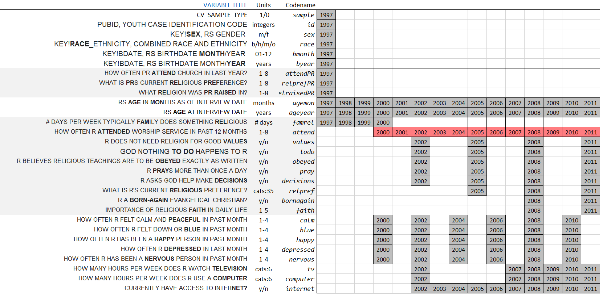

Working with NLSY97 Extract
========================================================

## Trace the origins of datasets - prepare for modeling

The folder [/Extracts](./Extracts)contains the original objects downloaded from [NLS Investigator](https://www.nlsinfo.org/investigator/pages/login.jsp). Extract is transformed into the dataset ***dsL.csv***  by manipulations of the code in [Desrive_dsL_from_Extract.R](./Derive_dsL_from_Extract.R) Detailed description of this process are provided in [Derive_dsL_from_Extract.md](./Derive_dsL_from_Extract.md) or [html](./Derive_dsL_from_Extract.html).

## Variable-Occasion Slice (**VO**) 
  

<!--
pathMd <- base::file.path("./", c("README.md"))
pathHtml <- base::gsub(pattern=".md$", replacement=".html", x=pathMd)
markdown::markdownToHTML(file=pathMd, output=pathHtml)
-->

