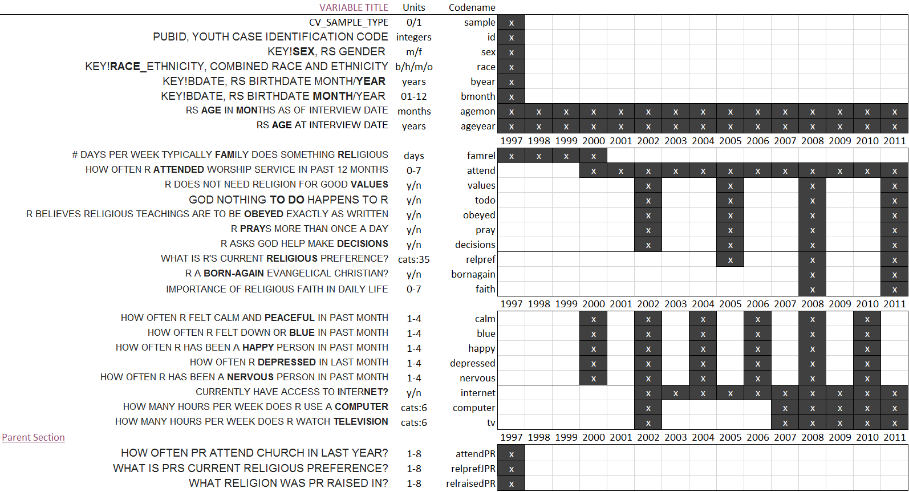
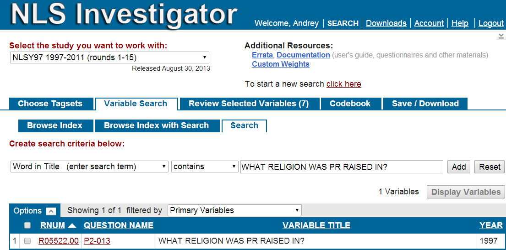

Reproducibility Instructions
=================================================
This report narrates data preparations for the Longitudinal Models of Religiosity in NLSY97

<!--  Set the working directory to the repository's base directory; this assumes the report is nested inside of only one directory.-->
```{r, echo=F, message=F} 
opts_knit$set(root.dir='../')  #Don't combine this call with any other chunk -especially one that uses file paths.
```

<!-- Set the report-wide options, and point to the external code file. -->
```{r set_options, echo=F, message=T}
require(knitr)
opts_chunk$set(
  results='show', 
  message = TRUE,
  comment = NA, 
  tidy = FALSE,
  fig.height = 4, 
  fig.width = 5.5, 
  out.width = "550px",
  fig.path = 'figure_rmd/',     
  dev = "png",
#   fig.path = 'figure_pdf/',     
#   dev = "pdf",
  dpi = 400
)
echoChunks <- FALSE
options(width=120) #So the output is 50% wider than the default.
read_chunk("./Documentation/Reproduce.R") # the file to which knitr calls for the chunks
```


## Data Retrieval
Using [NLS Investigator](https://www.nlsinfo.org/investigator/pages/login.jsp) a list of variables was downloaded from [NLS](http://www.bls.gov/nls/) datasets. All the downloaded materials  were unzipped into  the folder "**/Documentation/data/NLSY97_Religiosity_20042014**", located in the GitHub Repository. 
(The naming convention is "Study_Focus_DDMMYYYofDownload")   

#### The files include:    
NLSY97_Religiosity_20042014.cdb - **codebook** containing item descriptions  
NLSY97_Religiosity_20042014.csv - **data** in comma delimited format  
NLSY97_Religiosity_20042014.NLSY97 - **tagset**, the list of variables in the downloaded dataset  
NLSY97_Religiosity_20042014.dtc - STATA® **dictionary** file of selected variables, contains data as well
  

After importing the data from the datafile,
<!-- run initial import from the databank NLSY97_Religiosity_20042014. --> 
```{r LoadData, echo=echoChunks, message=FALSE, results="hide"}
```
we have created datasets 
```{r ,echo=TRUE}
# dsSource  - cointains all imported variables
nrow(dsSource) # number of individuals in the total sample
```
Of them,
``` {r , echo=TRUE}
# 1 - Cross-sectional
# 0 - Oversample
table(dsSource$R1235800)

```

``` {r , echo=TRUE}
# dsSourceLabels - contains the RNUM (NLSY97 Variables codes) and VARIABLE_TITLE used by NLY Investigator 
print(dsSourceLabels) 

```

To explore the variables in the native context of NLS, go to [NLS Investigator](https://www.nlsinfo.org/investigator/pages/login.jsp), select "NLYS97 1997-2011" in the first dropdown box and then click on "Choose File" under "Upload Tagset." Select the file "NLSY97_Religiosity_20042014.NLSY97" from the folder "**/Documentation/data/NLSY97_Religiosity_20042014**", in the GitHub repository.

## Variables by Occasions
To better understand the longitudinal structure of the selected variables, the dataset was re-arranged in the two-dimensional slice of Cattell's databox: variables by occasions.
## Figure 1


This databox slice indicates in what year measurement was taken for selected variables  and describes the variables extracted from NLYS97 for analysis. Three descriptions are given:  
**Variable Title**, which is verbatim identifier from NLYY97,  
**Unit**, which attemps to give a brief desription of the scale on which the variable is measured, and  
**Codename**, which spells the name of the variable, as it is used in R code that services the analysis

The excel spreadsheet (*NLYS97_Religiosity_20042014.xlsx*) in the "./Documentation/data" folder, hosts this list, as well as a semi-automated routine (Tab "Renaming") to aid in renaming the automatic variable names for easier coding. The values in the "Variable Title" can be used to copy/paste and locate the item in the [NLS Investigator](https://www.nlsinfo.org/investigator/pages/login.jsp) by copy/pasting it into "Word in Title" search line
## Figure 2


After renaming, we arrive at the basic clean dataset in wide format.
```{r TweakData, echo=TRUE, message=FALSE, results="hide"}
#dsSource
```


