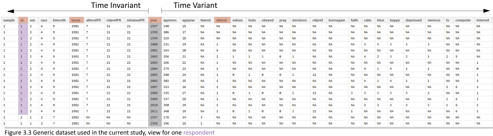

<!--  Set the working directory to the repository's base directory; this assumes the report is nested inside of only one directory.-->
```{r, echo=F, message=F} 
require(knitr)
opts_knit$set(root.dir='../')  #Don't combine this call with any other chunk -especially one that uses file paths.

```

```{r set_options, echo=F, message=F}
require(knitr)
# getwd()
opts_chunk$set(
  results='show', 
  message = TRUE,
  comment = NA, 
  tidy = FALSE,
#   fig.height = 4.8, 
#   fig.width = 6.5, 
  out.width = NULL,
  fig.path = 'appendix/',     
  dev = "png",
  dpi = 400
)
echoChunks <- FALSE
warningChunks<- FALSE
options(width=120) #So the output is 50% wider than the default.
read_chunk("Models/Descriptives/Descriptives.R") # the file to which knitr calls for the chunks
```

```{r DeclareGlobals, echo=F, message=FALSE, results='hide'}
# aesDefs
```

```{r LoadPackages, echo=echoChunks, message=F}
```

```{r LoadData, echo=echoChunks, message=T}
# select only respondence in the cross-sectional sample
```

Metrics 
===

Labeling factors and exploring scales.   
[back to Appendix][appendix]


## Data preliminaries

Initial point of departure - the [databox][databox] of the selected variables, described in the Methods chapter.  

This [databox][databoxStatcanvas] corresponds to the dataset **dsL** produced by [Derive_dsL_from_Extract][derive] report, given in the Appendix.     
```{r echo=T, message=T}
dsL<-readRDS("./Data/Derived/dsL.rds")
```
     

Note that the variable **year** serves as a natural devided between time invariant (TIvars) and time variant (TVvars) variables. All modeling operations beging with subsetting this dataset.  For the grammer rules of operations with relevant data see [Data Manipulation Guide][manipulate].


```{r child, child = '/Models/Descriptives/Citations.Rmd'}

```
