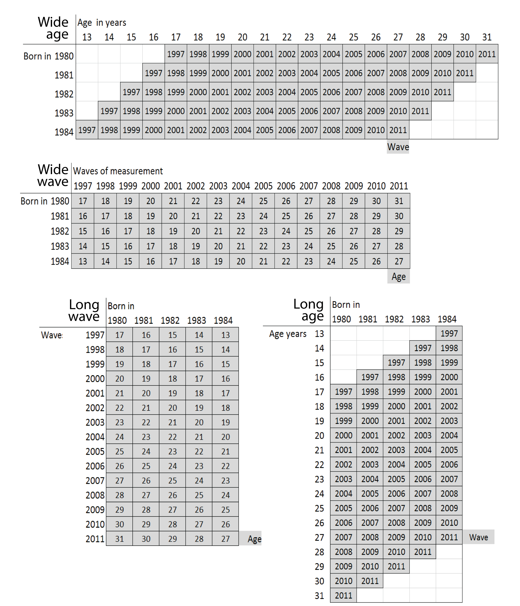

<!--  Set the working directory to the repository's base directory; this assumes the report is nested inside of only one directory.-->
```{r, echo=F, message=F} 
require(knitr)
opts_knit$set(root.dir='../')  #Don't combine this call with any other chunk -especially one that uses file paths.

```

```{r set_options, echo=F, message=F}
require(knitr)
# getwd()
opts_chunk$set(
  results='show', 
  message = TRUE,
  comment = NA, 
  tidy = FALSE,
#   fig.height = 4.8, 
#   fig.width = 6.5, 
  out.width = NULL,
  fig.path = 'appendix/',     
  dev = "png",
  dpi = 400
)
echoChunks <- FALSE
warningChunks<- FALSE
options(width=120) #So the output is 50% wider than the default.
read_chunk("Models/Descriptives/Descriptives.R") # the file to which knitr calls for the chunks
```

```{r DeclareGlobals, echo=F, message=FALSE, results='hide'}
# aesDefs
```

```{r LoadPackages, echo=echoChunks, message=F}
```

```{r LoadData, echo=echoChunks, message=T}
# select only respondence in the cross-sectional sample
```

Metrics 
===

Labeling factors and exploring scales.   
[back to Appendix][appendix]


## Data preliminaries

Initial point of departure - the [databox][databox] of the selected variables, described in the Methods chapter.  

This [databox][databoxStatcanvas] corresponds to the dataset **dsL** produced by [Derive_dsL_from_Extract][derive] report, given in the Appendix.     
```{r echo=T, message=T}
dsL<-readRDS("./Data/Derived/dsL.rds")
```
     

Note that the variable **year** serves as a natural devided between time invariant (TIvars) and time variant (TVvars) variables. All modeling operations beging with subsetting this dataset.  For the grammer rules of operations with relevant data see [Data Manipulation Guide][manipulate].


##  Labeling Factor Levels
Review of the item reference [cards][databoxStatcanvas] shows that initially, all items were recorded on some discrete scale, either counting occasions or assigning an intiger to a category of response. However, data were saved as numerical values or  intigers
```{r}
require(dplyr)
ds<- dsL %>%
  dplyr::select(
        sample, id, sex, race, bmonth,byear, attendPR, relprefPR,relraisedPR,
    year,
        agemon, ageyear, famrel, attend,
        values, todo, obeyed, pray, decisions, 
        relpref, bornagain, faith, 
        calm, blue, happy, depressed, nervous,
        tv, computer, internet)               
str(ds)
```

[LabelingFactorLevels.R][labels] sourced at the end of [Derive_dsL_from_Extract][derive] matches numeric values with response labels from the questionnaire and adds copies of the variables, saved as labeled factors, to **dsL**. For estimations routines such as <code>lme4</code> or graphing  functions such as <code>ggplot2</code>, the  data type (string,numeric,  factor) is a meaningful input, so a quick access to both formats frequently proves useful.  It is convenient to think that **dsL** contains only
```{r}
ncol(dsL)/2
```
variables, but each of them has a double, a labeled factor.
```{r}
str(dsL)
```
This give a certain flexibity in assembling needed dataset quickly and have access to factor labels. One can alternate between the raw metric and labeled factor by adding "F" suffix to the end of the variable name:
```{r}
ds<- dsL %>%
  dplyr::filter(id==25) %>%
  dplyr::select(id,byear,year, attend,attendF)
ds
```
Having quick access to factor labels will be especially useful during graph production.


## Time metrics : Age, Period, Cohort
NLSY97 sample includes individuals from five cohorts, born between 1980 and 1984.The following graphics shows how birth cohort, age of respondents, and round of observation are related in NSLY97.  


### Counts of respondents across age, period, and cohort
```{r}
ds<- dsL %>%  # chose conditions to apply in creating the dataset 
  dplyr::filter(id %in% c(1:9022)) %.% # 1:9022
  dplyr::filter(year %in% c(2000:2011)) %.% # 1997:2011
  dplyr::filter(sample %in% c(0,1)) %.% # 0-Oversample; 1-Cross-Sectional
  dplyr::filter(race %in% c(1:4)) %.% # 1-Black; 2-Hispanis; 3-Mixed; 4-White
  dplyr::filter(byear %in% c(1980:1984)) %.%
  dplyr::mutate(age=year-byear) # define bin for age
```

#### Wide age  
```{r}
table(ds$byear, ds$age)

```

#### Wide wave  
```{r}
table(ds$byear,ds$year)

```

#### Long wave  
```{r}
table(ds$year,ds$byear)

```
#### Long age  
```{r}
table(ds$age,ds$byear)

```

#### Two time metrics: rounds across ages 
```{r}
table(ds$age,ds$year)

```

NSLY97 contains static (**bmonth**, **byear**) and dynamic (**agemon**, **ageyear**) indicators of age : 

```{r age_data_25}
ds<- dsL %>% 
  dplyr::filter(id==25, year %in% c(1997:2011)) %>% 
  dplyr::select(id,byear,bmonthF,year,agemon,ageyear)
print(ds)
```

Variable **year** is used as cohort indicator. Variable **year** enumerates NLSY97 rounds, recording the calendaric year during which it took place. When transforming the metric of time, and using biological age instead of **year** as the temporal dimension, the value of age at the time of the interview will be computed as **age** = **agemon**/12  

```{r age_data_25_2}
ds<- dsL %>% 
  dplyr::filter(id==25, year %in% c(1997:2011)) %>% 
  dplyr::select(id,bmonthF,byear,year, agemon,ageyear) %>%
  dplyr::mutate (age =  agemon/12)
print(ds)
```

## Attendance  

NLSY97 asked to report church attendance (**attend**) for the past 12 months preceding the interview date. The response card offered a choice of 7 categories ordered by magnitude.  

```{r attend_2000, echo=echoChunks, message=T, fig.height=3.5,fig.cap="Figure caption test"}
require(ggplot2)
ds<- dsL %>%  dplyr::filter(year==2000,sample==1)
p<-ggplot(ds, aes(x=attendF, fill=attendF))
p <- p + geom_bar(color="black")
p <- p + scale_fill_manual(values=attendCol8, na.value=NACol, guide=FALSE)
p <- p + coord_flip()
# p <- p + guides(fill = guide_legend(reverse=TRUE, title="Attendence")) #http://www.cookbook-r.com/Graphs/Legends_(ggplot2)/#reversing-the-order-of-items-in-the-legend
p <- p + labs(title="How often have you attended a worship service (2000)?", x="Church attendance", y="Count")
p <- p + ggplot2::theme_bw()
p <- p + ggplot2::theme_bw(base_size=baseSize)
p <- p + ggplot2::theme(title=ggplot2::element_text(colour="gray20",size = 12)) 
p <- p + ggplot2::theme(axis.text=ggplot2::element_text(colour="gray40"))
p <- p + ggplot2::theme(axis.title=ggplot2::element_text(colour="gray40"))
p <- p + ggplot2::theme(panel.border = ggplot2::element_rect(colour="gray80"))
p <- p + ggplot2::theme(axis.ticks.length = grid::unit(0, "cm"))
p

```

Descriptives
===


Basic descriptives reports on the selected NLSY97 items   
[back to Appendix][appendix]

## Basic demographics 
A clean dataset **dsL** contains data on

```{r}
dplyr::summarize(dsL,count=n_distinct(id))
```
respondents. Of them one (id = 467) was removed from the dataset due to abberant age score that seemed as a coding mistake. NLSY97 contains representative household sample and the oversample of racial minorities. 

```{r, warning=F}
ds<- dsL %>% 
  dplyr::group_by(sampleF) %>% 
  dplyr::summarize (count=n_distinct(id))
ds
```


```{r basic_demo, echo=F, message=F, warning=F, fig.height=4.2}
ds<- dsL %>% dplyr::filter(id %in% c(1:9000), year==1997) %>% dplyr::select(id,sampleF,sexF, raceF) %>%
  dplyr::group_by(sampleF, sexF,raceF) %>% dplyr::summarize (count= n()) 

# ds<- reshape2::melt(ds,id.vars= colnames(ds))
# ds
p<- ggplot(ds, aes(x=raceF, y=count, fill=sexF))
#geoms
p<- p+ geom_bar(stat="identity", position="dodge")
p<- p+ facet_grid(sampleF~.)
p<- p+ geom_text(aes(label=count), position=position_dodge(.9), vjust=-.2, size=3.5)
# scales
p<- p + scale_y_continuous( limits= c(0,2700))
# annotations
p<- p + guides(fill = guide_legend( title="Sex")) 
p<- p+ labs(title = "Basic demographic constitution of NLSY97",
                         x="Race",
                         y="Sampling frame")
# themes
p <- p + ggplot2::theme_bw()
p <- p + ggplot2::theme_bw(base_size=baseSize)
p <- p + ggplot2::theme(title=ggplot2::element_text(colour="gray20",size = 12)) 
p <- p + ggplot2::theme(axis.text=ggplot2::element_text(colour="gray40"))
p <- p + ggplot2::theme(axis.title=ggplot2::element_text(colour="gray40"))
p <- p + ggplot2::theme(panel.border = ggplot2::element_rect(colour="gray80"))
p

```

## Distribution of age variables
The age of respondents was of particular interest and was entered as a predictor of the model outcome. NSLY97 contains static and dynamic indicators of age age. Variables  byear and bmonth were recorded once in 1997 (static) and contain respondents’ birth year and birth month respectively. Two age variables were recorded continuously at each interview (dynamic): age at the time of the interview in months (**agemon**) and in years (**ageyear**).   Next graph shows how births in the NLSY97 sample  was distributed over calendric months from 1980 to 1984:

### Months of births
```{r bmonth_dist, echo=F, warning=F, fig.height=3.3}
ds<- dsL %>% dplyr::filter(year %in% c(1997)) %>% 
  dplyr::select(id,year,byear,bmonth,bmonthF,agemon,ageyear) %>%
  dplyr::group_by(bmonth, bmonthF,byear) %>%
  dplyr::summarize(count=n()) %>% 
  dplyr::mutate (born= (byear*12+bmonth)/12) %>%
  dplyr::arrange(byear, bmonth)
head(ds, 10)
p<-ggplot(ds, aes(x=factor(born), y=count, fill=factor(byear)))
#geoms 
p<-p+geom_bar(stat="identity")
p<- p + scale_fill_manual(values=byearCol5)
p<- p + scale_x_discrete(labels=ds$bmonthF)
# annotations
p<- p + guides(fill = guide_legend(reverse=TRUE, title="Birth year")) 
p<-  p+ labs(title = "Distribution of births among NLSY97 repsondents",
                         x="The month of birth",
                         y="Count")
# themes
p <- p + ggplot2::theme_bw()
p <- p + ggplot2::theme_bw(base_size=baseSize)
p <- p + ggplot2::theme(title=ggplot2::element_text(colour="gray20",size = 12)) 
p <- p + ggplot2::theme(axis.text=ggplot2::element_text(colour="gray40", size=8))
p <- p + ggplot2::theme(axis.title=ggplot2::element_text(colour="gray40"))
p <- p + ggplot2::theme(panel.border = ggplot2::element_rect(colour="gray80"))
p <- p + ggplot2::theme(axis.ticks.length = grid::unit(0, "cm"))
p<- p + theme(axis.text.x = element_text(angle=90, hjust=1, vjust=.5))
p
```


### Age and cohort structure 
```{r agemon_dist, echo=F, warning=F, fig.height=3.3}
ds<- dsL %>% dplyr::filter(id %in% c(1:19000), year %in% c(2000)) %>% dplyr::select(id,year,byearF,attend,agemon,ageyear) %>%
  mutate(time=year-2000, age=agemon/12)
# canvas
p<- ggplot(ds, aes(x=age, fill=byearF))
p<- p + geom_bar(bin=1/12)
p<- p + scale_fill_manual(values=byearCol5)
# scales
p<- p + scale_x_continuous(breaks=seq(16,32,1))
# annotations
p<- p + guides(fill = guide_legend(reverse=TRUE, title="Birth year")) 
p<- p + labs(title = "Age and cohort structure (2000)",
                         x="Age in years. Bin = 1 month",
                         y="Count")
# themes
p <- p + ggplot2::theme_bw()
p <- p + ggplot2::theme_bw(base_size=baseSize)
p <- p + ggplot2::theme(title=ggplot2::element_text(colour="gray20",size = 12)) 
p <- p + ggplot2::theme(axis.text=ggplot2::element_text(colour="gray40"))
p <- p + ggplot2::theme(axis.title=ggplot2::element_text(colour="gray40"))
p <- p + ggplot2::theme(panel.border = ggplot2::element_rect(colour="gray80"))
p <- p + ggplot2::theme(axis.ticks.length = grid::unit(0, "cm"))
p
```


###  Count of respondents in age bins
The amounts of respondents in in the age bin =16 is not big, so results should be interpreted with caution.
```{r attend_race_age_binsize, echo=F, message=F, warning=F, fig.height=4, fig.width=10}
ds<- dsL %.%
  dplyr::mutate(ageF = as.factor(round(agemon/12 ))) %>%
  dplyr::filter(year %in% c(2000:2011), !is.na(attend), race !=3) %.%   
  dplyr::group_by(sampleF,raceF,ageF) %.%
  dplyr::summarize(count = n()) 
# canvas
p<- ggplot( ds, aes(x=ageF, y=count)) 
# geoms
p<- p + geom_bar(stat="identity")
p<- p+ facet_grid(sampleF~raceF)
# scales
# p<- p+ scale_fill_manual(values = c(basicDark,"white")) 
p<- p+ scale_y_continuous(limits=c(0, 4500),
                          breaks=c(1000,2000,3000,4000))
p<- p+ scale_x_discrete(limits=as.character(c(16:31)))
# # annotations
p<- p + guides(fill = guide_legend(reverse=FALSE, title="Response category")) 
p<- p + guides(color = FALSE) 
p<-  p+ labs(title = "In the past year, how often have you attended a worship service?",
             x="Wave of measurement",
             y="Proportion of total")
# # themes
p <- p + ggplot2::theme_bw()
p <- p + ggplot2::theme_bw(base_size=baseSize)
p <- p + ggplot2::theme(title=ggplot2::element_text(colour="gray20",size = 12)) 
p <- p + ggplot2::theme(axis.text=ggplot2::element_text(colour="gray40"))
p <- p + ggplot2::theme(axis.title=ggplot2::element_text(colour="gray40"))
p <- p + ggplot2::theme(panel.border = ggplot2::element_rect(colour="gray80"))
p <- p + ggplot2::theme(axis.ticks.length = grid::unit(0, "cm"))
p <- p + ggplot2::theme(axis.text.x = element_text(angle=90, hjust=1, vjust=.5, size=8))
p
```

```{r}
ds<- dsL %.%
  dplyr::mutate(ageF = as.factor(round(agemon/12 ))) %>%
  dplyr::filter(year %in% c(2000:2011), !is.na(attend),ageF %in% c(16,32),race !=3) %.%   
  dplyr::group_by(sampleF,raceF) %.%
  dplyr::summarize(count = n()) 
head(ds, 10)

```


## Counts for data used in models
The following tables inspect the counts of valid responses (church attendance) across two time metircs (age and NLSY97 round) and cohort membership. 
```{r}
ds<- dsL %>%  # chose conditions to apply in creating dataset for modeling
  dplyr::filter(id %in% c(1:9022)) %.% # 1:9022
  dplyr::filter(year %in% c(2000:2011)) %.% # 1997:2011
  dplyr::filter(sample %in% c(0,1)) %.% # 0-Oversample; 1-Cross-Sectional
  dplyr::filter(race %in% c(1:4)) %.% # 1-Black; 2-Hispanis; 3-Mixed; 4-White
  dplyr::filter(byear %in% c(1980:1984)) %>% # birth year 1980:1984
  dplyr::mutate(age=round(agemon/12,0)) # define bin for age
length(unique(ds$id)) # total No. of respondents in dataset
``` 

```{r}
d<- ds %>% 
  filter(!is.na(attend)) # only nonmissing datapoints
table(d$byear,d$year) # Number of respondent in each NLSY97 round 
table(d$byear, d$age) # Number of respondent in each age bin 
table(d$age,d$year) # cross-section of age and round of NLSY97
```

When subsetting data to run throught the sequence of models, it would of use to see such counts. Insufficient number of observation per cell might be behind poor model estimation. For example, male blacks from the oversample may not be a good subset to fit a complex model. 
```{r}
ds<- dsL %>%  # chose conditions to apply in creating dataset for modeling
  dplyr::filter(id %in% c(1:9022)) %.% # 1:9022
  dplyr::filter(year %in% c(2000:2011)) %.% # 1997:2011
  dplyr::filter(sample %in% c(0)) %.% # 0-Oversample; 1-Cross-Sectional
  dplyr::filter(race %in% c(1)) %.% # 1-Black; 2-Hispanis; 3-Mixed; 4-White
  dplyr::filter(byear %in% c(1980:1984)) %>% # birth year 1980:1984
  dplyr::filter(sex==1) %>% # 1-Male; 2-Female
  dplyr::mutate(age=round(agemon/12,0)) # define bin for age

length(unique(ds$id)) # total No. of respondents in dataset
``` 

```{r}
d<- ds %>% 
  filter(!is.na(attend)) # only nonmissing datapoints
table(d$byear,d$year) # Number of respondent in each NLSY97 round 
table(d$byear, d$age) # Number of respondent in each age bin 
table(d$age,d$year) # cross-section of age and round of NLSY97
```

Attendance
===
Mapping church attendance in time   
[back to Appendix][appendix]

# Cross-Sectional View  

The focal variable of interest is **attend**, the item measuring church attendance for the year that preceded the interview date. The questionnaire recorded the responses on the ordinal scale.

```{r attend_2000b, echo=echoChunks, message=T, fig.height=3.5,fig.cap="Figure caption test"}
ds<- dsL %>%  dplyr::filter(year==2000,sample==1)
p<-ggplot(ds, aes(x=attendF, fill=attendF))
p <- p + geom_bar(color="black")
p <- p + scale_fill_manual(values=attendCol8, na.value=NACol, guide=FALSE)
p <- p + coord_flip()
# p <- p + guides(fill = guide_legend(reverse=TRUE, title="Attendence")) #http://www.cookbook-r.com/Graphs/Legends_(ggplot2)/#reversing-the-order-of-items-in-the-legend
p <- p + labs(title="How often have you attended a worship service (2000)?", x="Church attendance", y="Count")
p <- p + ggplot2::theme_bw()
p <- p + ggplot2::theme_bw(base_size=baseSize)
p <- p + ggplot2::theme(title=ggplot2::element_text(colour="gray20",size = 12)) 
p <- p + ggplot2::theme(axis.text=ggplot2::element_text(colour="gray40"))
p <- p + ggplot2::theme(axis.title=ggplot2::element_text(colour="gray40"))
p <- p + ggplot2::theme(panel.border = ggplot2::element_rect(colour="gray80"))
p <- p + ggplot2::theme(axis.ticks.length = grid::unit(0, "cm"))
p

```

Creating frequency distributions for each of the measurement wave we have:    

```{r attend_2000_2011, echo=echoChunks,warning=F, message=F, fig.height=3.5}
ds<- dsL %.%
  dplyr::filter(sample==1) %.%   # comment out to count NA in the total
  dplyr::group_by(yearF,attendF) %.%
  dplyr::summarize(count = length( attendF)) %.%
  dplyr::mutate(total = sum(count),
              percent= count/total)
# canvas
p<- ggplot( ds, aes(x=yearF, y=percent, fill=attendF))  #  keeping NA in calculations
# geoms
p<- p+ geom_bar(position="stack", stat="identity")
# scales
p<- p+ scale_fill_manual(values = attendCol8,na.value="white")
p<- p+ scale_y_continuous(limits=c(0, 1),
                          breaks=c(.1,.2,.3,.4,.5,.6,.7,.8,.9,1))
p<- p+ scale_x_discrete(limits=as.character(c(2000:2011)))
# annotations
p<- p + guides(fill = guide_legend(reverse=TRUE, title="Response category")) 
p<-  p+ labs(title = "In the past year, how often have you attended a worship service?",
                         x="Wave of measurement",
                         y="Proportion of total")
# themes
p <- p + ggplot2::theme_bw()
p <- p + ggplot2::theme_bw(base_size=baseSize)
p <- p + ggplot2::theme(title=ggplot2::element_text(colour="gray20",size = 12)) 
p <- p + ggplot2::theme(axis.text=ggplot2::element_text(colour="gray40"))
p <- p + ggplot2::theme(axis.title=ggplot2::element_text(colour="gray40"))
p <- p + ggplot2::theme(panel.border = ggplot2::element_rect(colour="gray80"))
p <- p + ggplot2::theme(axis.ticks.length = grid::unit(0, "cm"))
p<-  p + ggplot2::geom_hline(yintercept=1)
p
```

Here, missing values are used in the calculation of total responses to show the natural attrition in the study. Assuming that attrition is not significantly associated with  the outcome measure, we can remove missing values from the calculation of the total and look at prevalence of response endorsements over time.     

```{r attend_2000_2011_na,echo=F, message=F, warning=F, fig.height=3.5}
ds<- dsL %.%
  dplyr::filter(sample==1, !is.na(attendF)) %.%   # comment out to count NA in the total
  dplyr::group_by(yearF,attendF) %.%
  dplyr::summarize(count = length( attendF)) %.%
  dplyr::mutate(total = sum(count),
              percent= count/total)
# canvas
p<- ggplot( ds, aes(x=yearF, y=percent, fill=attendF))  #  keeping NA in calculations
# geoms
p<- p+ geom_bar(position="stack", stat="identity")
# scales
p<- p+ scale_fill_manual(values = attendCol8)
p<- p+ scale_y_continuous(limits=c(0, 1),
                          breaks=c(.1,.2,.3,.4,.5,.6,.7,.8,.9,1))
p<- p+ scale_x_discrete(limits=as.character(c(2000:2011)))
# annotations
p<- p + guides(fill = guide_legend(reverse=TRUE, title="Response category")) 
p<-  p+ labs(title = "In the past year, how often have you attended a worship service?",
                         x="Wave of measurement",
                         y="Proportion of total")
# themes
p <- p + ggplot2::theme_bw()
p <- p + ggplot2::theme_bw(base_size=baseSize)
p <- p + ggplot2::theme(title=ggplot2::element_text(colour="gray20",size = 12)) 
p <- p + ggplot2::theme(axis.text=ggplot2::element_text(colour="gray40"))
p <- p + ggplot2::theme(axis.title=ggplot2::element_text(colour="gray40"))
p <- p + ggplot2::theme(panel.border = ggplot2::element_rect(colour="gray80"))
p <- p + ggplot2::theme(axis.ticks.length = grid::unit(0, "cm"))
p
```

## Change in prevalences
Tracing the rate of change of prevalence in a line graph, we see more clearly which  categores increase over time (e.g. "Never"), which decline (e.g. ""About once/week), and which stay relatively stable (e.g. "About twice/month").    

```{r attend_freq_lines, echo=F, message=F, warning=F, fig.height=4.2}
ds<- dsL %.%
  dplyr::filter(sample==1, year %in% c(2000:2011), !is.na(attend)) %.%   # comment out to count NA in the total
  dplyr::group_by(yearF,attendF) %.%
  dplyr::summarize(count = length( attendF)) %.%
  dplyr::mutate(total = sum(count),
              percent= count/total)
# canvas
p<- ggplot( ds, aes(x=yearF, y=percent, color=attendF))  #  keeping NA in calculations
# geoms
p<- p+ geom_line(aes(group=attendF), stat="identity", size=.7)
p<- p+ geom_point(aes(fill=attendF), shape=21, size=3, color="black",position=position_dodge(0.2) )
# scales
p<- p+ scale_color_manual(values = attendCol8,na.value=NACol)
p<- p+ scale_fill_manual(values = attendCol8,na.value=NACol)
p<- p+ scale_y_continuous(limits=c(0, .4),
                          breaks=c(0,.1,.2,.3,.4))
p<- p+ scale_x_discrete(limits=as.character(c(2000:2011)))
# # annotations
p<- p + guides(fill = guide_legend(reverse=FALSE, title="Response category")) 
p<- p + guides(color = FALSE) 
p<-  p+ labs(title = "In the past year, how often have you attended a worship service?",
                         x="Wave of measurement",
                         y="Proportion of total")
# # themes
p <- p + ggplot2::theme_bw()
p <- p + ggplot2::theme_bw(base_size=baseSize)
p <- p + ggplot2::theme(title=ggplot2::element_text(colour="gray20",size = 12)) 
p <- p + ggplot2::theme(axis.text=ggplot2::element_text(colour="gray40"))
p <- p + ggplot2::theme(axis.title=ggplot2::element_text(colour="gray40"))
p <- p + ggplot2::theme(panel.border = ggplot2::element_rect(colour="gray80"))
p <- p + ggplot2::theme(axis.ticks.length = grid::unit(0, "cm"))
p
```

## Prevalence change and race 

Inspecting the prevalence trajectories across races.     

### Attend over race and years   
```{r attend_freq_lines_race, echo=F, message=F, warning=F, fig.height=7, fig.width=10}
ds<- dsL %.%
  dplyr::filter(year %in% c(2000:2011), !is.na(attend), race !=3) %.%   # comment out to count NA in the total
  dplyr::group_by(sampleF,yearF,raceF,attendF) %.%
  dplyr::summarize(count = n()) %.%
  dplyr::mutate(total = sum(count),
                percent= count/total)
# canvas
p<- ggplot( ds, aes(x=yearF, y=percent, color=attendF)) 
# geoms
p<- p+ geom_line(aes(group=attendF), stat="identity", size=.4)
p<- p+ geom_point(aes(fill=attendF), shape=21, size=2, color="black",linesize=1,position=position_dodge(0.2) )
p<- p+ facet_grid(sampleF ~ raceF)
# scales
p<- p+ scale_color_manual(values = attendCol8,na.value=NACol)
p<- p+ scale_fill_manual(values = attendCol8,na.value=NACol)
p<- p+ scale_y_continuous(limits=c(0, .5),
                          breaks=c(0,.1,.2,.3,.4,.5))
p<- p+ scale_x_discrete(limits=as.character(c(2000:2011)))
# # annotations
p<- p + guides(fill = guide_legend(reverse=FALSE, title="Response category")) 
p<- p + guides(color = FALSE) 
p<-  p+ labs(title = "In the past year, how often have you attended a worship service?",
             x="Wave of measurement",
             y="Proportion of total")
# # themes
p <- p + ggplot2::theme_bw()
p <- p + ggplot2::theme_bw(base_size=baseSize)
p <- p + ggplot2::theme(title=ggplot2::element_text(colour="gray20",size = 12)) 
p <- p + ggplot2::theme(axis.text=ggplot2::element_text(colour="gray40"))
p <- p + ggplot2::theme(axis.title=ggplot2::element_text(colour="gray40"))
p <- p + ggplot2::theme(panel.border = ggplot2::element_rect(colour="gray80"))
p <- p + ggplot2::theme(axis.ticks.length = grid::unit(0, "cm"))
p <- p + ggplot2::theme(axis.text.x = element_text(angle=90, hjust=1, vjust=.5, size=8))
p
```

### Attend over race and ages
Bin includes all respondents who were +/- 6 months from a given age expressed as an intiger.s
For example, a 16 year-old  is defined as an individual between 15.5 and 16.5 years of age at the time of the interview.   

```{r attend_freq_lines_race_ages, echo=F, message=F, warning=F, fig.height=7, fig.width=10}
ds<- dsL %.%
  dplyr::mutate(ageF = as.factor(round(agemon/12 ))) %>%
  dplyr::filter(year %in% c(2000:2011), !is.na(attend), race !=3) %.%   
  dplyr::group_by(sampleF,ageF,raceF,attendF) %.%
  dplyr::summarize(count = n()) %.%
  dplyr::mutate(total = sum(count),
                percent= count/total)
# canvas
p<- ggplot( ds, aes(x=ageF, y=percent, color=attendF)) 
# geoms
p<- p+ geom_line(aes(group=attendF), stat="identity", size=.4)
p<- p+ geom_point(aes(fill=attendF), shape=21, size=2, color="black",linesize=1,position=position_dodge(0.2) )
p<- p+ facet_grid(sampleF ~ raceF)
# scales
p<- p+ scale_color_manual(values = attendCol8,na.value=NACol)
p<- p+ scale_fill_manual(values = attendCol8,na.value=NACol)
p<- p+ scale_y_continuous(limits=c(0, .5),
                          breaks=c(0,.1,.2,.3,.4,.5))
p<- p+ scale_x_discrete(limits=as.character(c(16:31)))
# # annotations
p<- p + guides(fill = guide_legend(reverse=FALSE, title="Response category")) 
p<- p + guides(color = FALSE) 
p<-  p+ labs(title = "In the past year, how often have you attended a worship service?",
             x="Ages. Bin = 1 year.",
             y="Proportion of total")
# # themes
p <- p + ggplot2::theme_bw()
p <- p + ggplot2::theme_bw(base_size=baseSize)
p <- p + ggplot2::theme(title=ggplot2::element_text(colour="gray20",size = 12)) 
p <- p + ggplot2::theme(axis.text=ggplot2::element_text(colour="gray40"))
p <- p + ggplot2::theme(axis.title=ggplot2::element_text(colour="gray40"))
p <- p + ggplot2::theme(panel.border = ggplot2::element_rect(colour="gray80"))
p <- p + ggplot2::theme(axis.ticks.length = grid::unit(0, "cm"))
p <- p + ggplot2::theme(axis.text.x = element_text(angle=90, hjust=1, vjust=.5, size=8))
p
```

### Race and attendance for each year
```{r attend_race_2000, echo=F, message=F, warning=F, fig.height=5, fig.width=10}
ds<- dsL %.%
  dplyr::filter(year %in% c(2000), !is.na(attend), race !=3) %.%   # comment out to count NA in the total
  dplyr::group_by(sampleF,yearF,raceF,attendF) %.%
  dplyr::summarize(count = n()) %.%
  dplyr::mutate(total = sum(count),
                percent= count/total)
# canvas
p<- ggplot( ds, aes(x=attendF, y=percent, fill=attendF)) 
# geoms
p<- p+ geom_bar(stat="identity")
p<- p+ facet_grid(sampleF ~ raceF)
p<- p+ geom_text(aes(label=round(percent,2)), position=position_dodge(.9), vjust=-.2, size=3.5)
# scales

p<- p+ scale_fill_manual(values = attendCol8,na.value=NACol)
p<- p+ scale_y_continuous(limits=c(0, .3),
                          breaks=c(0,.1,.2,.3,.4,.5))
# # annotations
p<- p + guides(fill = guide_legend(reverse=FALSE, title="Response category")) 
p<- p + guides(color = FALSE) 
p<-  p+ labs(title = "In the past year(2000), how often have you attended a worship service?",
             x="Church attendance",
             y="Proportion of total")
# # themes
p <- p + ggplot2::theme_bw()
p <- p + ggplot2::theme_bw(base_size=baseSize)
p <- p + ggplot2::theme(title=ggplot2::element_text(colour="gray20",size = 12)) 
p <- p + ggplot2::theme(axis.text=ggplot2::element_text(colour="gray40"))
p <- p + ggplot2::theme(axis.title=ggplot2::element_text(colour="gray40"))
p <- p + ggplot2::theme(panel.border = ggplot2::element_rect(colour="gray80"))
p <- p + ggplot2::theme(axis.ticks.length = grid::unit(0, "cm"))
p <- p + ggplot2::theme(axis.text.x = element_blank())
p
```

### Race and attendance for each age bin
```{r attend_race_16, echo=F, message=F, warning=F, fig.height=5, fig.width=10}
t<- 16
ds<- dsL %.%
  dplyr::mutate(ageF = as.factor(round(agemon/12 ))) %>%
  dplyr::filter(ageF %in% c(t), !is.na(attend), race !=3) %.%   
  dplyr::group_by(sampleF,ageF,raceF,attendF) %.%
  dplyr::summarize(count = n()) %.%
  dplyr::mutate(total = sum(count),
                percent= count/total)
# canvas
p<- ggplot( ds, aes(x=attendF, y=percent, fill=attendF)) 
# geoms
p<- p+ geom_bar(stat="identity")
p<- p+ facet_grid(sampleF ~ raceF)
p<- p+ geom_text(aes(label=round(percent,2)), position=position_dodge(.9), vjust=-.2, size=3.5)
# scales

p<- p+ scale_fill_manual(values = attendCol8,na.value=NACol)
p<- p+ scale_y_continuous(limits=c(0, .5),
                          breaks=c(0,.1,.2,.3,.4,.5))
# # annotations
p<- p + guides(fill = guide_legend(reverse=FALSE, title="Response category")) 
p<- p + guides(color = FALSE) 
p<-  p+ labs(title = paste0("In the past year, how often have you attended a worship service? (age ", t, ")"),
             x="Church attendance",
             y="Proportion of total")
# # themes
p <- p + ggplot2::theme_bw()
p <- p + ggplot2::theme_bw(base_size=baseSize)
p <- p + ggplot2::theme(title=ggplot2::element_text(colour="gray20",size = 12)) 
p <- p + ggplot2::theme(axis.text=ggplot2::element_text(colour="gray40"))
p <- p + ggplot2::theme(axis.title=ggplot2::element_text(colour="gray40"))
p <- p + ggplot2::theme(panel.border = ggplot2::element_rect(colour="gray80"))
p <- p + ggplot2::theme(axis.ticks.length = grid::unit(0, "cm"))
p <- p + ggplot2::theme(axis.text.x = element_blank())
p
```

## Counts for data used in models
The following tables inspect the counts of valid responses (church attendance) across two time metircs (age and NLSY97 round) and cohort membership. 
```{r}
dsL<-readRDS("./Data/Derived/dsL.rds")
ds<- dsL %>%  # chose conditions to apply in creating dataset for modeling
  dplyr::filter(id %in% c(1:9022)) %.% # 1:9022
  dplyr::filter(year %in% c(2000:2011)) %.% # 1997:2011
  dplyr::filter(sample %in% c(0,1)) %.% # 0-Oversample; 1-Cross-Sectional
  dplyr::filter(race %in% c(1:4)) %.% # 1-Black; 2-Hispanis; 3-Mixed; 4-White
  dplyr::filter(byear %in% c(1980:1984)) %>% # birth year 1980:1984
  dplyr::mutate(age=year-byear) # define bin for age
length(unique(ds$id)) # total No. of respondents in dataset

``` 

```{r}
d<- ds %>% 
  filter(is.na(attend)) # only nonmissing datapoints
table(d$byear,d$year) # Number of respondent in each NLSY97 round 
table(d$byear, d$age) # Number of respondent in each age bin 
table(d$age,d$year) # cross-section of age and round of NLSY97
table(d$attend,useNA="always")
```

Such view allows to see quickly whether each cell contains enough observations to offer stability for estimated solutions. 

```{r}
ds<- dsL %>%  # chose conditions to apply in creating dataset for modeling
  dplyr::filter(id %in% c(1:9022)) %.% # 1:9022
  dplyr::filter(year %in% c(2000:2011)) %.% # 1997:2011
  dplyr::filter(sample %in% c(0)) %.% # 0-Oversample; 1-Cross-Sectional
  dplyr::filter(race %in% c(1)) %.% # 1-Black; 2-Hispanis; 3-Mixed; 4-White
  dplyr::filter(byear %in% c(1980:1984)) %>% # birth year 1980:1984
  dplyr::filter(sex==1) %>% # 1-Male; 2-Female
  dplyr::mutate(age=round(agemon/12,0)) # define bin for age
length(unique(ds$id)) # total No. of respondents in dataset
``` 

```{r}
d<- ds %>% 
  filter(!is.na(attend)) # only nonmissing datapoints
table(d$byear,d$year) # Number of respondent in each NLSY97 round 
table(d$byear, d$age) # Number of respondent in each age bin 
table(d$age,d$year) # cross-section of age and round of NLSY97
```


# Longitudinal View

Graphs above shows change in the cross-sectional distribution of responses over the years. Modeling the change in these response frequencies is handled well by Markov  models.  LCM, however, works with longitudinal data, modeling the trajectory of each individual and treating attendance as a continuous outcome.   

To demonstrate mapping of individual trajectories to time, let's select a  dataset that would include personal identifyer (**id**), cohort indicator (**byear**), wave of measurement (**year**) and the focal variable of interest - worship attendance (**attend**).    

```{r, echo=T, message=F, warning=warningChunks}
ds<- dsL %>%  dplyr::filter(year %in% c(2000:2011), id==47) %>%
              dplyr:: select(id, byear, year, attend, attendF)
print(ds)
```

The view above lists attendance data for subjust with id = 47. Mapping his attendance to time we have  .  

```{r attend_line_1id,echo=echoChunks, message=F, warning=warningChunks, fig.height=3.3 }
ds<- dsL %>% dplyr::filter(id==47,year %in% c(2000:2011)) %>% dplyr::select(idF,year,attend) %>%
  mutate(time=year-2000)

p<-ggplot(ds, aes(x=time,y=attend, color=idF))
p<-p+ geom_line(size=.4)
p<-p+ geom_point(size=2)
p<-p+ scale_y_continuous("Church attendance",
                     limits=c(0, 8),
                     breaks=c(1:8))
p<-p+ scale_x_continuous("Years since 2000",
                   limits=c(0,11),
                   breaks=c(0:11))
p <- p + scale_color_manual(values=c("purple"))
# annotations
p<-p+ labs(title=paste0("In the past year, how often have you attended a worship service?"))
p <- p + guides(color = guide_legend(title="Respondents"))
# themes
p <- p + ggplot2::theme_bw()
p <- p + ggplot2::theme_bw(base_size=baseSize)
p <- p + ggplot2::theme(title=ggplot2::element_text(colour="gray20",size = 12)) 
p <- p + ggplot2::theme(axis.text=ggplot2::element_text(colour="gray40"))
p <- p + ggplot2::theme(axis.title=ggplot2::element_text(colour="gray40"))
p <- p + ggplot2::theme(panel.border = ggplot2::element_rect(colour="gray80"))
p <- p + ggplot2::theme(axis.ticks.length = grid::unit(0, "cm"))
p
```  

where vertical dimension maps the outcome value and the horizontal maps the time. There will be a trajecory for each of the respondents. Each of such trajectories imply a story, a life scenario. Why one person grows in his religious involvement, while other declines, or never develops an interest in the first place? To demostrate how interpretations of trajectories can vary among individuals consider the following example.     

## Attendance over waves 
Attendance trajectories of subjects with **id**s  4, 25, 35, and 47 are plotted in the next graph     

```{r attend_line_4id_years,echo=echoChunks, message=F, warning=F, fig.height=3.3}
ds<- dsL %>% dplyr::filter(id %in% c(4,25,35,47),year %in% c(2000:2011)) %>% dplyr::select(idF,year,attend) %>%
  mutate(time=year-2000)
p<-ggplot(ds, aes(x=time,y=attend, color=idF))
# geoms
p<-p+ geom_line(size=.4)
p<-p+ geom_point(size=2, position=position_dodge(0.2))
# scales
p<-p+ scale_y_continuous("Church attendance",
                     limits=c(0, 8),
                     breaks=c(1:8))
p<-p+ scale_x_continuous("Years since 2000",
                   limits=c(0,11),
                   breaks=c(0:11))
p <- p + scale_color_manual(values=c("black","red","green", "purple"))
# annotations
p<-p+ labs(title=paste0("In the past year, how often have you attended a worship service?"))
p <- p + guides(color = guide_legend(title="Respondents"))
# themes
p <- p + ggplot2::theme_bw()
p <- p + ggplot2::theme_bw(base_size=baseSize)
p <- p + ggplot2::theme(title=ggplot2::element_text(colour="gray20",size = 12)) 
p <- p + ggplot2::theme(axis.text=ggplot2::element_text(colour="gray40"))
p <- p + ggplot2::theme(axis.title=ggplot2::element_text(colour="gray40"))
p <- p + ggplot2::theme(panel.border = ggplot2::element_rect(colour="gray80"))
p <- p + ggplot2::theme(axis.ticks.length = grid::unit(0, "cm"))
p

```

The respondent  **id** = 35 reported attending no worship services in any of the years, while respodent **id** = 25 seemed to frequent it, indicating weekly attendance in 8 out of the 12 years. Individual **id** = 47 started as a fairly regular attendee of religious services in 2000 (5 = "about twice a month"), then gradually declined his involvement to nill in 2009 and on. Respondent **id** = 4, on the other hand started off with a rather passive involvement, reporting  attended church only "Once or twice"  in 2000,  maintained a low level of participation throughout the years, only to surge his attendance in 2011.  Latent curve models will describe intraindividual trajectories of change, while summarizinig the interindividual similarities and trends.    

### Changing the metric of time  
Previous research in religiousity indicated that age might be one of the primary factors explaining interindividual differences in church attendance. To examine the role of age, we change the metric of time from waves of measurement, as in the previous graph, to biological age. Consult [Metrics][metrics] report for details on measurement of age. 
```{r comparing_age, warning=F }
ds<- dsL %>% dplyr::filter(id %in% c(4,25,35,47),year %in% c(2000:2011)) %>% 
  dplyr::select(idF,byear,bmonth,year,ageyear,agemon) %.%
  dplyr::mutate(time=year-2000, age=agemon/12)
print(ds[ds$idF==25,])
```

## Attendance over ages  
Plotting individual trajectories, with age as the metric of time.  

```{r attend_line_4id_age3,echo=echoChunks, message=F, error=FALSE, warning=FALSE, fig.height = 3.3 }
ds<- dsL %>% dplyr::filter(id %in% c(4,25,35,47),year %in% c(2000:2011)) %>% 
  dplyr::select(idF,byear,bmonth,year,ageyear,agemon,attend) %.%
  dplyr::mutate(time=year-2000, age=agemon/12)

p<-ggplot(ds, aes(x=age,y=attend, color=idF))
# geoms
p<- p + geom_line(size=.4)
p<- p + geom_point(size=2, position=position_dodge(0.2))
# scales
p<- p + scale_y_continuous("Church attendance",
                     limits=c(0, 8),
                     breaks=c(1:8))
p<- p + scale_x_continuous("Age in years",
                   limits=c(16,31),
                   breaks=seq(from=12, to=31,by=1))
p <- p + scale_color_manual(values=c("black","red","green", "purple"))
# annotations
p<-  p + labs(title=paste0("In the past year, how often have you attended a worship service?"))
p<-  p + guides(color = guide_legend(title="Respondents"))
p<-  p + geom_point(position=position_dodge(0.2) )
# themes
p <- p + ggplot2::theme_bw()
p <- p + ggplot2::theme_bw(base_size=baseSize)
p <- p + ggplot2::theme(title=ggplot2::element_text(colour="gray20",size = 12)) 
p <- p + ggplot2::theme(axis.text=ggplot2::element_text(colour="gray40"))
p <- p + ggplot2::theme(axis.title=ggplot2::element_text(colour="gray40"))
p <- p + ggplot2::theme(panel.border = ggplot2::element_rect(colour="gray80"))
p <- p + ggplot2::theme(axis.ticks.length = grid::unit(0, "cm"))
p
```

Data Manipulation Guide
===

Demonstrating the language of data manipulation in <code>dplyr</code> packages using  **dsL** as an example   
[back to Appendix][appendix]


<!-- Run this three chunks to get to the starting point -->
```{r DeclareGlobals, echo=echoChunks, message=FALSE}
```

```{r LoadPackages, echo=echoChunks, message=F}
```

```{r LoadData, echo=echoChunks, message=FALSE}
```


## Five basic functions in data handling

For a more detailed discussion of basic verbs and operations consult the [R-Studio guide][1] or internal [vignette][2]
```{r,eval=FALSE}
vignette("introduction",package="dplyr")
```

The following is a brief demonstration of <code>dplyr</code> syntax using **dsL** dataset as an example. I attach prefix <code>dplyr::</code> to avoid possible conflicts with <code>plyr</code> package on which <code>ggplot2</code> package relies. I recommend such practice in all <code>dplyr</code>  expressions in sharable publications.  

One of the innovations in <code>dplyr</code> is the ability to chain phrases in the data manipulationsentence. The operator <code>%>%</code> (or <code>%.%</code>), accomplishes this, turning <code>x %>% f(y)</code> into <code>f(x, y) </code>.   


###<code>select()</code> 
selects variables into a smaller data set
```{r}
ds<-dsL
dim(ds)
ds<- dsL %>%
  dplyr::select(id,year, byear, attend, attendF)
head(ds,13)
dim(ds)
```

###<code>filter()</code> 
Removes observations that do not meet criteria. The following code selects observation based on the type of sample    

```{r, echo=F}
ds<- dsL %>%
  dplyr::filter(id %in% c(1, 6803) & year==2000 ) %>%
  dplyr::select(sample, sampleF)
ds
```
and only between years 2000 and 2011, as only during those years the outcome of interest <code>attend</code> was recorded. 
```{r, echo=T, message=F}
ds<- dsL %>%
  dplyr::filter(sample==1, year %in% c(2000:2011))%>%
  dplyr::select(id, year, attend, attendF)
head(ds,13)
```


###<code>arrange()</code> 
Sorts observations
```{r, echo=T, message=F}
ds<- dsL %>%
  dplyr::filter(sample==1, year %in% c(2000:2011)) %>%
  dplyr::select(id, year, attend) %>%
  dplyr::arrange(year, desc(id))
head(ds,13)
ds<- dplyr::arrange(ds, id, year)
head(ds, 13)
```


###<code>mutate()</code> 

Creates additional variables from the values of existing.
```{r, echo=T, message=F}
ds<- dsL %>%
  dplyr::filter(sample==1, year %in% c(2000:2011)) %>%
  dplyr::select(id, byear, year, attend) %>%
  dplyr::mutate(age = year-byear, 
                timec = year-2000,
                linear= timec,
                quadratic= linear^2,
                cubic= linear^3)
head(ds,13)
```

###<code>summarize()</code> 
collapses data into a single value computed according to the aggregate functions.


```{r}
require(dplyr)
ds<- dsL %>%
  dplyr::filter(sample==1) %>%
  dplyr::summarize(N= n_distinct(id))
ds
```
Other functions one could use with <code>summarize()</code> include:

From <code>base</code>   

+ <code> min() </code>   
+ <code> max() </code>   
+ <code> mean() </code>   
+ <code> sum() </code>   
+ <code> sd() </code>   
+ <code> median() </code>   
+ <code> IQR()  </code>   

Native to <code>dplyr</code>    

+ <code> n() </code>  -  number of observations in the current group   
+ <code> n_distinct(x) </code>  -    count the number of unique values in x.    
+ <code> first(x) </code>  -  similar to <code>x[ 1 ]</code> + control over <code>NA</code>      
+ <code> last(x) </code>  -  similar to <code>x[length(x)] </code> + control over <code>NA</code>      
+ <code> nth(x, n)  </code>  -  similar to<code> x[n] </code>  + control over <code>NA</code>     

## Grouping and Combining 
The function <code>group_by()</code> is used to identify groups in split-apply-combine (SAC) procedure: it splits the initial data into smaller datasets (according to all possible interactions between the levels of supplied variables). It is these smaller datasets that <code>summarize()</code> will individually collapse into a single computed value according to its formula.  
```{r, echo=T, message=F}
ds<- dsL %>%
  dplyr::filter(sample==1, year %in% c(2000:2011)) %>%
  dplyr::select(id, year, attendF) %>%
  dplyr::group_by(year,attendF) %>%
  dplyr::summarise(count = n()) %>%
  dplyr::mutate(total = sum(count),
              percent= count/total)
head(ds,10)

```

To verify :
```{r, echo=T, message=F}
dplyr::summarize( filter(ds, year==2000), should.be.one=sum(percent))
```


## Base subsetting
Generally, we can compose any desired dataset by using matrix calls. The general formula is of the form:
**ds**[  _rowCond_  ,  _colCond_  ], where **ds** is a dataframe, and  _rowCond_ and _colCond_ are conditions for including rows and columns of the new dataset, respectively. One can also call a variable by attaching <code> $ </code> followed variable name to the name of the dataset:    <code>**ds**_$variableName_</code>. 
```{r, echo=T}
ds<-dsL[dsL$year %in% c(2000:2011),c('id',"byear","year","agemon","attendF","ageyearF")]
print(ds[ds$id==1,]) 
```

The following is a list of operatiors that can be used in these calls. 
<ul>
<li>basic math operators: <code>+</code>, <code>-</code>, <code>*</code>, <code>/</code>, <code>%%</code>, <code>^</code></li>
<li>math functions: <code>abs</code>, <code>acos</code>, <code>acosh</code>, <code>asin</code>, <code>asinh</code>, <code>atan</code>, <code>atan2</code>,
<code>atanh</code>, <code>ceiling</code>, <code>cos</code>, <code>cosh</code>, <code>cot</code>, <code>coth</code>, <code>exp</code>, <code>floor</code>,
<code>log</code>, <code>log10</code>, <code>round</code>, <code>sign</code>, <code>sin</code>, <code>sinh</code>, <code>sqrt</code>, <code>tan</code>, <code>tanh</code></li>
<li>logical comparisons: <code>&lt;</code>, <code>&lt;=</code>, <code>!=</code>, <code>&gt;=</code>, <code>&gt;</code>, <code>==</code>, <code>%in%</code></li>
<li>boolean operations: <code>&amp;</code>, <code>&amp;&amp;</code>, <code>|</code>, <code>||</code>, <code>!</code>, <code>xor</code></li>
<li>basic aggregations: <code>mean</code>, <code>sum</code>, <code>min</code>, <code>max</code>, <code>sd</code>, <code>var</code></li>
</ul>

<code>dplyr</code> can translate all of these into SQL. For more of on <code>dplyr</code> and SQL compatibility consult another built-in [vignette][3]
```{r,eval=FALSE}
vignette("database",package="dplyr")
```

## Base Reference

The following unary and binary operators are defined for <code> base</code>. They are listed in precedence groups, from highest to lowest.


+ <code> :: :::   </code> -  access variables in a namespace  
+ <code> $ @      </code> - component / slot extraction   
+ <code> [ [[	    </code> - indexing  
+ <code> ^	      </code>  - exponentiation (right to left)   
+ <code> - +	 </code>  - unary minus and plus   
+ <code> :	 </code>  - sequence operator   
+ <code> %any%	 </code>  - special operators (including %% and %/%)   
+ <code> * /	 </code>  - multiply, divide   
+ <code> + -	 </code>  - (binary) add, subtract   
+ <code> < > <= >= == !=	 </code>  - ordering and comparison   
+ <code> !	 </code>  - negation   
+ <code> & &&	 </code>  - and   
+ <code> | ||	 </code>  - or   
+ <code> ~	 </code>  - as in formulae   
+ <code> -> ->>	 </code>  - rightwards assignment   
+ <code> <- <<-	 </code>  - assignment (right to left)   
+ <code> =	 </code>  - assignment (right to left)   
+ <code> ?	 </code>  - help (unary and binary)   

## Joining data with dplyr  

While <code>merge</code> works just fine , joining data frames with <code>dplyr</code> might offer some additional conveniences:   

+ rows are kept in existing order
+ much faster
+ tells you what keys you're merging by (if you don't supply)
+ also work with database tables.

dplyr implements the four most useful joins from SQL:  

+ <code>inner_join</code> - similar to <code>merge(..., all.x=F, all.y=F)</code>   
+ <code>ileft_join</code> - similar to <code>merge(..., all.x=T, all.y=F)</code>   
+ <code>isemi_join</code> - no equivalent in <code>merge()</code> unless y includes only join fields       
+ <code>ianti_join</code> - no equivalent in <code>merge()</code>, this is all x without a match in y  


lmer syntax and S4 architecture
===  

Locating model estimation results in S4 objects produced by of <code>lmer()</code> calls of *lme4* package.
[back to Appendix][appendix]


## Basics 
Prepare data for modeling. 
Only the first 200 respondents will be selected to keep illustration light.
```{r}
dsL<-readRDS("./Data/Derived/dsL.rds")
ds<- dsL %>% dplyr::filter(id %in% c(1:200),year %in% c(2000:2011)) %>% 
  dplyr::mutate(timec=year-2000, timec2= timec^2, timec3= timec^3, 
                agec= round( (agemon/12),0)-16) %>% 
  dplyr::select(id,year,attend, timec,timec2, timec3, agec)
head(ds, 20)
```

Fit the model with <code>lmer</code>
```{r}
require(lme4)
m10 <-lmer (attend ~ 
               1  + agec + timec + timec2 + timec3
             + agec:timec +agec:timec2 + agec:timec3
             + (1 + timec + timec2 + timec3 | id),
             data = ds, REML=0)
model<- m10
```

Print the basic results of  the fitted model
```{r}
print(model) 
```

Or get a more detailed summary
```{r}
summary(model)
```

For a list of objects that can be extracted from the model
```{r}
str(summary(model))
```


There a number of ways one could extract the needed element from the S4 object. In addition, some of the elements might be stored in several locations.   

## Model formula
```{r}
model@call # 1
(summary(model))$call #2
```

## Fit and Information indices

```{r}
# get indicies
mInfo<-summary(model)$AICtab
mInfo
mInfo['logLik']
```

Aleternatively,
```{r}
logLik<-logLik(model)
dev<-deviance(model)
AIC <- AIC(model) 
BIC <- BIC(model)
N<- model@devcomp$dims["N"] # Looks like the total number of data points ( individual-by-time)
p<- model@devcomp$dims["p"] # Looks like the number of estimated parameters, verify
ids<- (summary(model))$ngrps # number of units on level-2, here: individuals
mInfo<- c("logLik"=logLik,"dev"=dev,"AIC"=AIC,"BIC"=BIC,"N"=N, "p"=p, "ids"=ids)
mInfo
```

## Random Effects (RE)

### Matrix of RE
```{r}
str(summary(model)$varcor)
# extract RE covariance matrix
mRE<- data.frame(summary(model)$varcor$id) 
mRE
mRE<- data.frame(VarCorr(model)$id)
mRE
```

```{r}
mREcor<-  data.frame(attr(summary(model)$varcor$id,"correlation")) # corrleation 
mREcor
mREcor<- data.frame( attr(VarCorr(model)$id,"correlation"))
mREcor
mREsd<-   data.frame(STD=(attr(summary(model)$varcor$id,"stddev"))) 
mREsd
```


### extracting RE for each individual
```{r}
RE<- lme4:::ranef.merMod(model)$id 
head(RE,5)
tail(RE,5)
mRE
cor(RE)  # not the same as mRE, find out why
var(RE)  # not the same as mRE, find out why
```

## Fixed Effects (RE)

### Matrix of FE
```{r}
str(summary(model)$vcov)
mFE<- (summary(model)$vcov@factors$correlation) # notice that this is object of class corMatrix
str(mFE)
```

### estimate of the FE
```{r}
# similar ways to extract FE estimates, #3 is the fullest
FE1<- fixef(model) #1 
FE2<- getME(model, "beta") # 2
FE3<- summary(model)$coefficients # 3
coefs<- FE1
```

## Prediction and Residuals
### Restatement of model input
First, recover information that went into the model
```{r}
# dsP - P for predicted
dsp<-data.frame(model@frame) # original vars used by the model (no interaction terms)
head(dsp,13)
```

Another way, which includes interaction terms, but no outcome
```{r}
dsp<- data.frame(getME(model,"X")) # no Y, only predictors (with interaction terms)
head(dsp,13)
```

We can add response vector and the grouping factor for the second level (individual)
```{r}
dsp$id<-getME(model,"flist")$id # first level grouping factor, individual
dsp$y<-getME(model,"y") # response vector
head(dsp,13)
```

### Adding model output
There are several way to extract the predictions made by the model
```{r}
# model outcome, predicted values
yHat1<- fitted(model) # 1
yHat2<- predict(model) # 2
yHat3<- getME(model,"mu") # 3

identical(yHat1,yHat2)
identical(as.numeric(yHat2),yHat3)
dsp$yHat<- predict(model)
head(dsp,13)
```

### Adding residual
```{r}
dsp$resid<- lme4:::residuals.merMod(model) # individual residual (id and time)
head(dsp,13)
identical (  dsp$y-dsp$yHat, dsp$resid)

```

Getting the standard error of residuals
```{r}
getME(model,"sigma") # standard error of residuals, same sigma(model)
sigma(model) # std.error of residuals <- this methods is preferred
# however
sd(dsp$resid) # not the same as sigma(model) = find out why
identical (sigma(model),sd(dsp$resid)) # WHY?
```

## Conditional values
Predictions form fixed effects only, no individual variability is used in calculation

```{r}
# create object "coefs" for easy reference
coefs <- fixef(model)
# use fixed effects estimates to find conditional predictions??
dsp$yPar<-(
  (coefs["(Intercept)"])         +(coefs["agec"]*dsp$agec)
  +(coefs["timec"]*dsp$timec)    +(coefs["agec:timec"]*dsp$agec*dsp$timec)
  +(coefs["timec2"]*dsp$timec2)  +(coefs["agec:timec2"]*dsp$agec*dsp$timec2)
  +(coefs["timec3"]*dsp$timec3)  +(coefs["agec:timec3"]*dsp$agec*dsp$timec3)
)
head(dsp,13)
````

```{r child, child = 'Descriptives/Citations.Rmd'}

```
