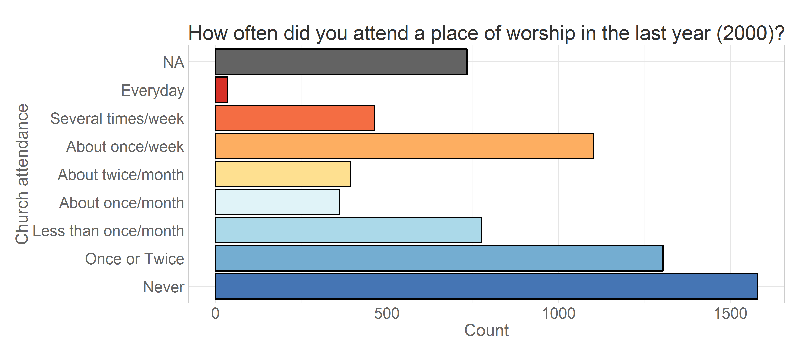

-   Mapping Church Attendance in Time
    -   Cross-Sectional View
    -   Longitudinal View

<!--  Set the working directory to the repository's base directory; this assumes the report is nested inside of only one directory.-->

Mapping Church Attendance in Time
=================================

Cross-Sectional View
--------------------

The focal variable of interest is **attend**, the item measuring church
attendance for the year that preceded the interview date. The
questionnaire recorded the responses on the ordinal scale.

Creating frequency distributions for each of the measurement wave we
have:

Here, missing values are used in the calculation of total responses to
show the natural attrition in the study. Assuming that attrition is not
significantly associated with the outcome measure, we can remove missing
values from the calculation of the total and look at prevalence of
response endorsements over time.

Tracing the rate of change of prevalence in a line graph, we see more
clearly which categores increase over time (e.g. "Never"), which decline
(e.g. ""About once/week), and which stay relatively stable (e.g. "About
twice/month").

Inspecting the prevalence trajectories across races.

Longitudinal View
-----------------

Graphs above shows change in the cross-sectional distribution of
responses over the years. Modeling the change in these response
frequencies is handled well by Markov models. LCM, however, works with
longitudinal data, modeling the trajectory of each individual and
treating attendance as a continuous outcome.

To demonstrate mapping of individual trajectories to time, let's select
a dataset that would include personal identifyer (**id**), cohort
indicator (**byear**), wave of measurement (**year**) and the focal
variable of interest - worship attendance (**attend**).

    ds<- dsL %>%  dplyr::filter(year %in% c(2000:2011), id==47) %>%
                  dplyr:: select(id, byear, year, attend, attendF)
    print(ds)

       id byear year attend              attendF
    1  47  1982 2000      5    About twice/month
    2  47  1982 2001      2        Once or Twice
    3  47  1982 2002      4     About once/month
    4  47  1982 2003      2        Once or Twice
    5  47  1982 2004      3 Less than once/month
    6  47  1982 2005      2        Once or Twice
    7  47  1982 2006      2        Once or Twice
    8  47  1982 2007      3 Less than once/month
    9  47  1982 2008      2        Once or Twice
    10 47  1982 2009      1                Never
    11 47  1982 2010      1                Never
    12 47  1982 2011      1                Never

The view above lists attendance data for subjust with id = 47. Mapping
his attendance to time we have .

where vertical dimension maps the outcome value and the horizontal maps
the time. There will be a trajecory for each of the

    length(unique(dsL$id))

    [1] 8983

subjects in total. Unless specified otherwise, only individuals from the
cross-sample will be used in the model to increase external validity.

    ds<- dsL %>% dplyr::filter(sample==1)

Each of such trajectories imply a story, a life scenario. Why one person
grows in his religious involvement, while other declines, or never
develops an interest in the first place? To demostrate how
interpretations of trajectories can vary among individuals consider the
following scenario.

Attendance trajectories of subjects with **id**s 4, 25, 35, and 47 are
plotted in the next graph

The respondent **id**=35 reported attending no worship services in any
of the years, while respodent **id**=25 seemed to frequent it,
indicating weekly attendance in 8 out of the 12 years. Individual
**id**=47 started as a fairly regular attendee of religious services in
2000 (5= "about twice a month"), then gradually declined his involvement
to nill in 2009 and on. Respondent **id**=4, on the other hand started
off with a rather passive involvement, reporting attended church only
"Once or twice" in 2000, maintained a low level of participation
throughout the years, only to surge his attendance in 2011. Latent curve
models will describe intraindividual trajectories of change, while
summarizinig the interindividual similarities and trends.

Previous research in religiousity indicated that age might be one of the
primary factors explaining interindividual differences in church
attendance. To examine the role of age, we change the metric of time
from waves of measurement, as in the previous graph, to biological age.
There are, however, a number of ways information about age was recorded.

    ds<- dsL %>% dplyr::filter(id %in% c(4,25,35,47),year %in% c(2000:2011)) %>% 
      dplyr::select(idF,attend, year, byear, ageyear, agemon, ageyear) %>% 
      mutate(time=year-2000, age=(year-byear+1), ageCurrent = agemon/12)
    print(ds[ds$idF==25,])

       idF attend year byear ageyear agemon time age ageCurrent
    13  25      5 2000  1983      17    214    0  18      17.83
    14  25      7 2001  1983      18    226    1  19      18.83
    15  25      7 2002  1983      19    236    2  20      19.67
    16  25      2 2003  1983      21    254    3  21      21.17
    17  25      7 2004  1983      21    261    4  22      21.75
    18  25      5 2005  1983      22    272    5  23      22.67
    19  25      7 2006  1983      23    284    6  24      23.67
    20  25      5 2007  1983      24    295    7  25      24.58
    21  25      7 2008  1983      25    307    8  26      25.58
    22  25      7 2009  1983      26    319    9  27      26.58
    23  25      7 2010  1983      27    332   10  28      27.67
    24  25      7 2011  1983      28    342   11  29      28.50

    ds

       idF attend year byear ageyear agemon time age ageCurrent
    1    4      2 2000  1981      19    238    0  20      19.83
    2    4      1 2001  1981      20    251    1  21      20.92
    3    4      3 2002  1981      21    262    2  22      21.83
    4    4      1 2003  1981      22    276    3  23      23.00
    5    4      2 2004  1981      23    287    4  24      23.92
    6    4      2 2005  1981      24    297    5  25      24.75
    7    4      2 2006  1981      25    309    6  26      25.75
    8    4      2 2007  1981      26    320    7  27      26.67
    9    4      2 2008  1981      27    336    8  28      28.00
    10   4      1 2009  1981      28    344    9  29      28.67
    11   4      2 2010  1981      29    357   10  30      29.75
    12   4      5 2011  1981      30    368   11  31      30.67
    13  25      5 2000  1983      17    214    0  18      17.83
    14  25      7 2001  1983      18    226    1  19      18.83
    15  25      7 2002  1983      19    236    2  20      19.67
    16  25      2 2003  1983      21    254    3  21      21.17
    17  25      7 2004  1983      21    261    4  22      21.75
    18  25      5 2005  1983      22    272    5  23      22.67
    19  25      7 2006  1983      23    284    6  24      23.67
    20  25      5 2007  1983      24    295    7  25      24.58
    21  25      7 2008  1983      25    307    8  26      25.58
    22  25      7 2009  1983      26    319    9  27      26.58
    23  25      7 2010  1983      27    332   10  28      27.67
    24  25      7 2011  1983      28    342   11  29      28.50
    25  35      1 2000  1983      17    216    0  18      18.00
    26  35      1 2001  1983      18    227    1  19      18.92
    27  35      1 2002  1983      19    239    2  20      19.92
    28  35      1 2003  1983      20    250    3  21      20.83
    29  35      1 2004  1983      21    264    4  22      22.00
    30  35      1 2005  1983      22    274    5  23      22.83
    31  35      1 2006  1983      23    286    6  24      23.83
    32  35      1 2007  1983      24    297    7  25      24.75
    33  35      1 2008  1983      25    310    8  26      25.83
    34  35      1 2009  1983      26    320    9  27      26.67
    35  35      1 2010  1983      27    334   10  28      27.83
    36  35      1 2011  1983      28    345   11  29      28.75
    37  47      5 2000  1982      18    220    0  19      18.33
    38  47      2 2001  1982      19    233    1  20      19.42
    39  47      4 2002  1982      20    243    2  21      20.25
    40  47      2 2003  1982      21    257    3  22      21.42
    41  47      3 2004  1982      22    266    4  23      22.17
    42  47      2 2005  1982      23    280    5  24      23.33
    43  47      2 2006  1982      24    292    6  25      24.33
    44  47      3 2007  1982      25    302    7  26      25.17
    45  47      2 2008  1982      26    315    8  27      26.25
    46  47      1 2009  1982      27    326    9  28      27.17
    47  47      1 2010  1982      28    339   10  29      28.25
    48  47      1 2011  1982      29    351   11  30      29.25

Note that for person **id** = 25 the age was recorded as 21 years for
both 2003 and 2004. However, when you examine age in months (**agemon**)
you can see this is rounding issue that disappears once a more precise
scale is used. To avoid this potentially confusing peculiarity, age in
years will be either calculated as (**age** = **year** - **byear** + 1)

Plotting age, caclulated as <code> age = year - byear + 1 </code>

    ds<- dsL %>% dplyr::filter(id %in% c(4,25,35,47),year %in% c(2000:2011)) %>% 
      dplyr::select(idF,year,attend,agemon,ageyear) %>% 
      mutate(time=year-2000, age=ageyear)
    head(ds,12)

       idF year attend agemon ageyear time age
    1    4 2000      2    238      19    0  19
    2    4 2001      1    251      20    1  20
    3    4 2002      3    262      21    2  21
    4    4 2003      1    276      22    3  22
    5    4 2004      2    287      23    4  23
    6    4 2005      2    297      24    5  24
    7    4 2006      2    309      25    6  25
    8    4 2007      2    320      26    7  26
    9    4 2008      2    336      27    8  27
    10   4 2009      1    344      28    9  28
    11   4 2010      2    357      29   10  29
    12   4 2011      5    368      30   11  30

Plotting age, caclulated as <code> age = ageyear </code>

Plotting age, caclulated as <code> age = agemon/12 </code>

    ds<- dsL %>% dplyr::filter(id %in% c(4,25,35,47),year %in% c(2000:2011)) %>% 
      dplyr::select(idF,year,attend,agemon,ageyear,byear) %>% 
      mutate(time=year-2000, age=agemon/12)
    head(ds,12)

       idF year attend agemon ageyear byear time   age
    1    4 2000      2    238      19  1981    0 19.83
    2    4 2001      1    251      20  1981    1 20.92
    3    4 2002      3    262      21  1981    2 21.83
    4    4 2003      1    276      22  1981    3 23.00
    5    4 2004      2    287      23  1981    4 23.92
    6    4 2005      2    297      24  1981    5 24.75
    7    4 2006      2    309      25  1981    6 25.75
    8    4 2007      2    320      26  1981    7 26.67
    9    4 2008      2    336      27  1981    8 28.00
    10   4 2009      1    344      28  1981    9 28.67
    11   4 2010      2    357      29  1981   10 29.75
    12   4 2011      5    368      30  1981   11 30.67

