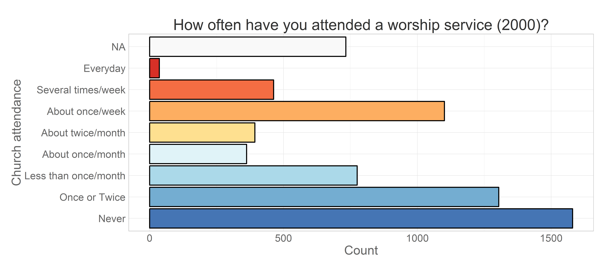

-   Cross-Sectional View
    -   Change in prevalences
    -   Prevalence change and race
-   Longitudinal View
    -   Attendance over waves
    -   Changing the metric of time
    -   Attendance over ages
-   Read more

<!--  Set the working directory to the repository's base directory; this assumes the report is nested inside of only one directory.-->

Mapping church attendance in time

Cross-Sectional View
--------------------

The focal variable of interest is **attend**, the item measuring church
attendance for the year that preceded the interview date. The
questionnaire recorded the responses on the ordinal scale.

Creating frequency distributions for each of the measurement wave we
have:

Here, missing values are used in the calculation of total responses to
show the natural attrition in the study. Assuming that attrition is not
significantly associated with the outcome measure, we can remove missing
values from the calculation of the total and look at prevalence of
response endorsements over time.

### Change in prevalences

Tracing the rate of change of prevalence in a line graph, we see more
clearly which categores increase over time (e.g. "Never"), which decline
(e.g. ""About once/week), and which stay relatively stable (e.g. "About
twice/month").

### Prevalence change and race

Inspecting the prevalence trajectories across races.

Longitudinal View
-----------------

Graphs above shows change in the cross-sectional distribution of
responses over the years. Modeling the change in these response
frequencies is handled well by Markov models. LCM, however, works with
longitudinal data, modeling the trajectory of each individual and
treating attendance as a continuous outcome.

To demonstrate mapping of individual trajectories to time, let's select
a dataset that would include personal identifyer (**id**), cohort
indicator (**byear**), wave of measurement (**year**) and the focal
variable of interest - worship attendance (**attend**).

    ds<- dsL %>%  dplyr::filter(year %in% c(2000:2011), id==47) %>%
                  dplyr:: select(id, byear, year, attend, attendF)
    print(ds)

       id byear year attend              attendF
    1  47  1982 2000      5    About twice/month
    2  47  1982 2001      2        Once or Twice
    3  47  1982 2002      4     About once/month
    4  47  1982 2003      2        Once or Twice
    5  47  1982 2004      3 Less than once/month
    6  47  1982 2005      2        Once or Twice
    7  47  1982 2006      2        Once or Twice
    8  47  1982 2007      3 Less than once/month
    9  47  1982 2008      2        Once or Twice
    10 47  1982 2009      1                Never
    11 47  1982 2010      1                Never
    12 47  1982 2011      1                Never

The view above lists attendance data for subjust with id = 47. Mapping
his attendance to time we have .

where vertical dimension maps the outcome value and the horizontal maps
the time. There will be a trajecory for each of the respondents. Each of
such trajectories imply a story, a life scenario. Why one person grows
in his religious involvement, while other declines, or never develops an
interest in the first place? To demostrate how interpretations of
trajectories can vary among individuals consider the following example.

### Attendance over waves

Attendance trajectories of subjects with **id**s 4, 25, 35, and 47 are
plotted in the next graph

The respondent **id** = 35 reported attending no worship services in any
of the years, while respodent **id** = 25 seemed to frequent it,
indicating weekly attendance in 8 out of the 12 years. Individual **id**
= 47 started as a fairly regular attendee of religious services in 2000
(5 = "about twice a month"), then gradually declined his involvement to
nill in 2009 and on. Respondent **id** = 4, on the other hand started
off with a rather passive involvement, reporting attended church only
"Once or twice" in 2000, maintained a low level of participation
throughout the years, only to surge his attendance in 2011. Latent curve
models will describe intraindividual trajectories of change, while
summarizinig the interindividual similarities and trends.

### Changing the metric of time

Previous research in religiousity indicated that age might be one of the
primary factors explaining interindividual differences in church
attendance. To examine the role of age, we change the metric of time
from waves of measurement, as in the previous graph, to biological age.
Consult
[Metrics](https://github.com/andkov/Longitudinal_Models_of_Religiosity_NLSY97/blob/master/Models/Descriptives/Metrics.md)
report for details on measurement of age.

    ds<- dsL %>% dplyr::filter(id %in% c(4,25,35,47),year %in% c(2000:2011)) %>% 
      dplyr::select(idF,byear,bmonth,year,ageyear,agemon) %.%
      dplyr::mutate(time=year-2000, age=agemon/12)
    print(ds[ds$idF==25,])

       idF byear bmonth year ageyear agemon time   age
    13  25  1983      3 2000      17    214    0 17.83
    14  25  1983      3 2001      18    226    1 18.83
    15  25  1983      3 2002      19    236    2 19.67
    16  25  1983      3 2003      21    254    3 21.17
    17  25  1983      3 2004      21    261    4 21.75
    18  25  1983      3 2005      22    272    5 22.67
    19  25  1983      3 2006      23    284    6 23.67
    20  25  1983      3 2007      24    295    7 24.58
    21  25  1983      3 2008      25    307    8 25.58
    22  25  1983      3 2009      26    319    9 26.58
    23  25  1983      3 2010      27    332   10 27.67
    24  25  1983      3 2011      28    342   11 28.50

### Attendance over ages

Plotting individual trajectories, with age as the metric of time.

Read more
---------

in <code>./Models/Descriptives</code>:

-   [Metrics](https://github.com/andkov/Longitudinal_Models_of_Religiosity_NLSY97/blob/master/Models/Descriptives/Metrics.md)
    - how values of items are labeled  
-   [Descriptives](https://github.com/andkov/Longitudinal_Models_of_Religiosity_NLSY97/blob/master/Models/Descriptives/Descriptives.md)
    - basic stats of various items  
-   [Attendance](https://github.com/andkov/Longitudinal_Models_of_Religiosity_NLSY97/blob/master/Models/Descriptives/Attendance.md)
    - focus on church attendence over time  
-   [Databox](https://github.com/andkov/Longitudinal_Models_of_Religiosity_NLSY97/blob/master/Models/Descriptives/Databox.Rmd)

See also

-   [Deriving Data from NLYS97
    extract](https://github.com/andkov/Longitudinal_Models_of_Religiosity_NLSY97/blob/master/Data/Derive_dsL_from_Extract.md)
-   [Data Manipulation
    Guide](https://github.com/andkov/Longitudinal_Models_of_Religiosity_NLSY97/blob/master/Vignettes/dplyr/Data_Manipulation_Guide.md)
