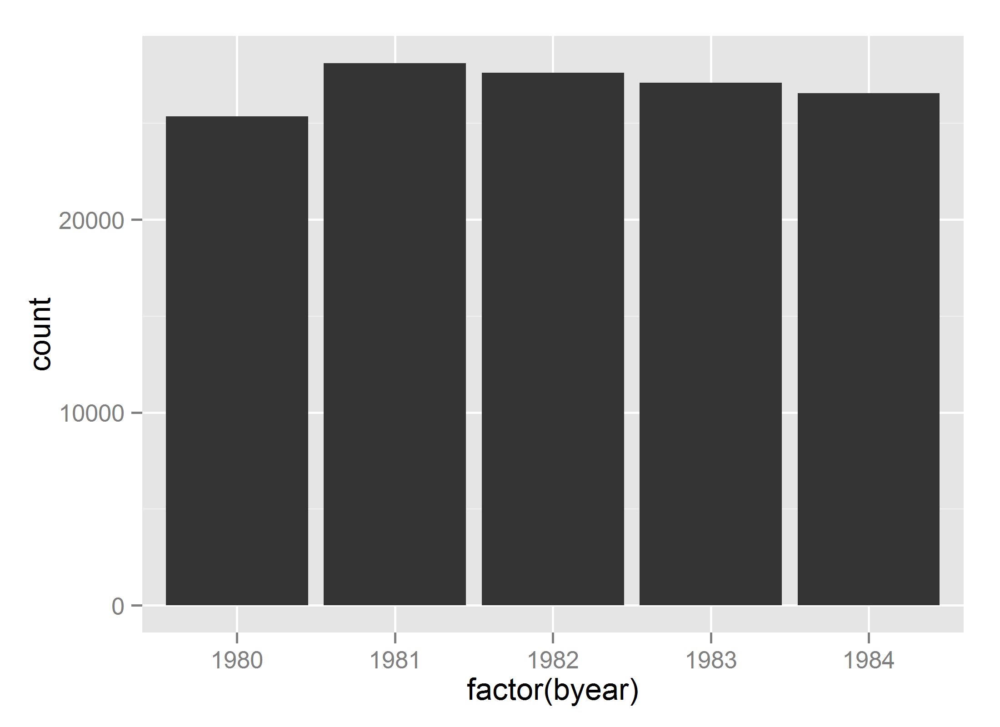
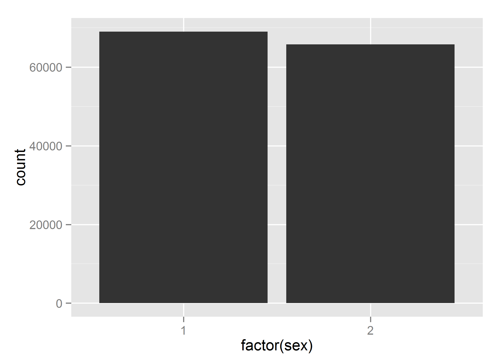
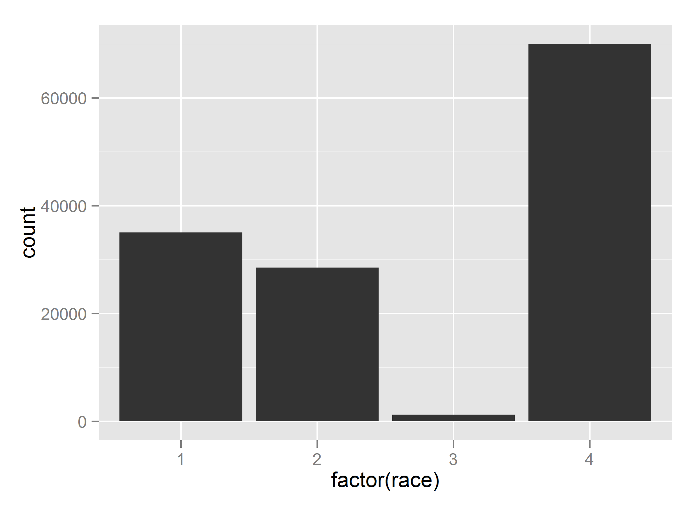

Descriptive statistics
=================================================
This report tracks down the visualizations of the NLSY97 religiosity data as defined by the extract NLSY97_Religiosity_20042014 


<!--  Set the working directory to the repository's base directory; this assumes the report is nested inside of only one directory.-->

```r
opts_knit$set(root.dir = "../")  #Don't combine this call with any other chunk -especially one that uses file paths.
# This .Rmd is in ./Models/Descriptives/
getwd()
```

```
## [1] "C:/Users/inspirion/Documents/GitHub/Longitudinal_Models_of_Religiosity_NLSY97/Models/Descriptives"
```


<!-- Set the report-wide options, and point to the external code file. -->

```r
require(knitr)
opts_chunk$set(
  results='show', 
  message = TRUE,
  comment = NA, 
  tidy = FALSE,
  fig.height = 4, 
  fig.width = 5.5, 
  out.width = "550px",
  fig.path = 'figure_rmd/',     
  dev = "png",
#   fig.path = 'figure_pdf/',     
#   dev = "pdf",
  dpi = 400
)
echoChunks <- FALSE
options(width=120) #So the output is 50% wider than the default.
read_chunk("./Descriptives/Descriptives.R") # the file to which knitr calls for the chunks
getwd()
```

```
## [1] "C:/Users/inspirion/Documents/GitHub/Longitudinal_Models_of_Religiosity_NLSY97/Models"
```





