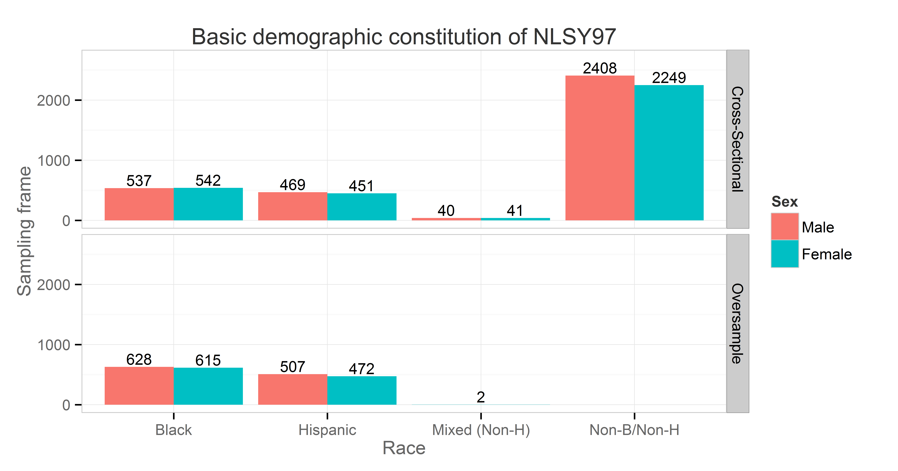

<!--  Set the working directory to the repository's base directory; this assumes the report is nested inside of only one directory.-->

There are total of

    cat(length(unique(dsL$id)))

    8983

respondents.

    ds<- dsL %>% group_by(sampleF) %>% summarize (count=n_distinct(id))
    ds

      count
    1  8983

Basic demographics is given in Figure 4.\#

    ymax not defined: adjusting position using y instead
    ymax not defined: adjusting position using y instead

Respondents’ age was of particular interest and was entered as a
predictor of church attendance. NSLY97 contains static and dynamic
indicators of age age. Variables byear and bmonth were recorded once in
1997 (static) and contain respondents’ birth year and birth month
respectively. Two age variables were recorded continuously at each
interview (dynamic): age at the time of the interview in months agemon
and in years ageyear. Figure 4.2 shows how births in the NLSY97 sample
(static age) was distributed over calendric months from 1980 to 1984:

    Source: local data frame [13 x 4]
    Groups: bmonth

       bmonth byearF count  born
    1       1   1980   159  80-1
    2       2   1980   136  80-2
    3       3   1980   139  80-3
    4       4   1980   125  80-4
    5       5   1980   128  80-5
    6       6   1980   137  80-6
    7       7   1980   136  80-7
    8       8   1980   141  80-8
    9       9   1980   144  80-9
    10     10   1980   146 80-10
    11     11   1980   146 80-11
    12     12   1980   154 80-12
    13      1   1981   160  81-1

