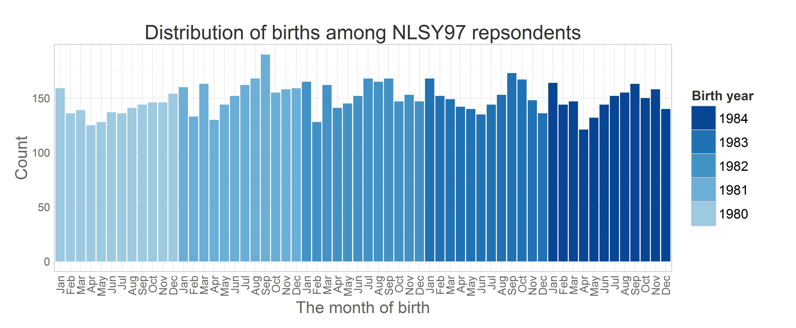

-   Basic demographics
-   Distribution of age variables
    -   Months of births
    -   Age and cohort structure
-   Read more

<!--  Set the working directory to the repository's base directory; this assumes the report is nested inside of only one directory.-->

Basic descriptives reports on selected NLSY97 items

Basic demographics
------------------

A clean dataset **dsL** contains data on

    dplyr::summarize(dsL,N=n_distinct(id))

         N
    1 8983

respondents. Of them one (id = 467) was removed from the dataset due to
abberant age score that seemed as a coding mistake. NLSY97 contains
representative household sample and the oversample of racial minorities.

    ds<- dsL %>% 
      dplyr::group_by(sampleF) %>% 
      dplyr::summarize (count=n_distinct(id))
    ds

    Source: local data frame [2 x 2]

              sampleF count
    1 Cross-Sectional  6747
    2      Oversample  2236

    ymax not defined: adjusting position using y instead
    ymax not defined: adjusting position using y instead

Distribution of age variables
-----------------------------

The age of respondents was of particular interest and was entered as a
predictor of the model outcome. NSLY97 contains static and dynamic
indicators of age age. Variables byear and bmonth were recorded once in
1997 (static) and contain respondents’ birth year and birth month
respectively. Two age variables were recorded continuously at each
interview (dynamic): age at the time of the interview in months agemon
and in years ageyear. Next graph shows how births in the NLSY97 sample
(static age) was distributed over calendric months from 1980 to 1984:

### Months of births

### Age and cohort structure

Read more
---------

in <code>./Models/Descriptives</code>:

-   [Metrics](https://github.com/andkov/Longitudinal_Models_of_Religiosity_NLSY97/blob/master/Models/Descriptives/Metrics.md)
    - how values of items are labeled  
-   [Descriptives](https://github.com/andkov/Longitudinal_Models_of_Religiosity_NLSY97/blob/master/Models/Descriptives/Descriptives.md)
    - basic stats of various items  
-   [Attendance](https://github.com/andkov/Longitudinal_Models_of_Religiosity_NLSY97/blob/master/Models/Descriptives/Attendance.md)
    - focus on church attendence over time (**Continue**)  
-   [Databox](https://github.com/andkov/Longitudinal_Models_of_Religiosity_NLSY97/blob/master/Models/Descriptives/Databox.Rmd)

See also

-   [Deriving Data from NLYS97
    extract](https://github.com/andkov/Longitudinal_Models_of_Religiosity_NLSY97/blob/master/Data/Derive_dsL_from_Extract.md)
-   [Data Manipulation
    Guide](https://github.com/andkov/Longitudinal_Models_of_Religiosity_NLSY97/blob/master/Vignettes/dplyr/Data_Manipulation_Guide.md)
