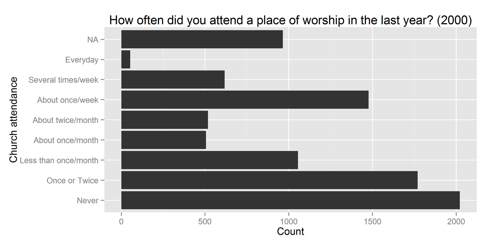
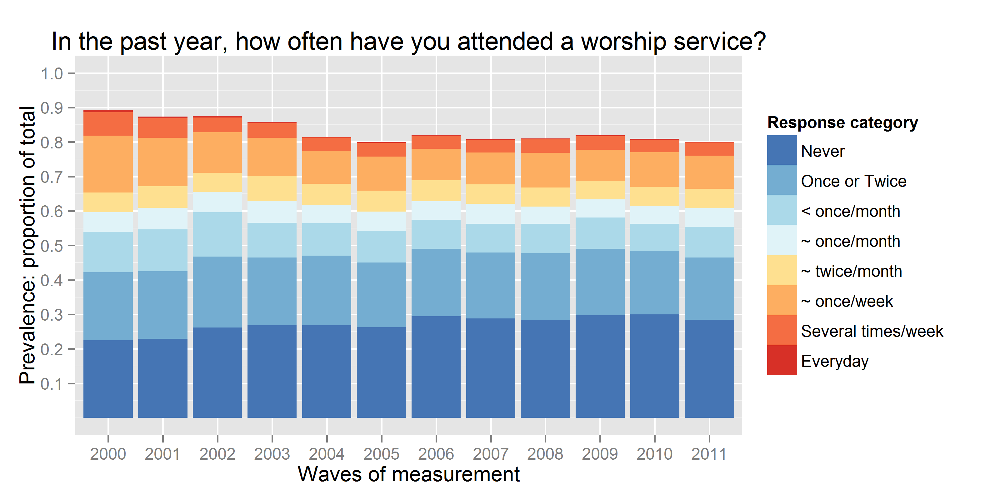
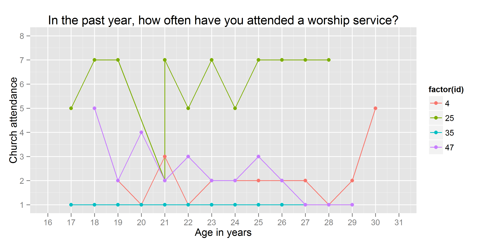

<!--  Set the working directory to the repository's base directory; this assumes the report is nested inside of only one directory.-->


<!-- Set the report-wide options, and point to the external code file. -->


Church attendance
=================================================

The focal variable of interest is **attend**, an item measuring church attendance in the current year. Although it was recorded on ordinal scale, 


its precision allows us to treat it as continuous for the purpose of fitting statistical models. 

```r
ds<-(subset(dsLCM, year==2000)) # only for year 2000
summary(as.numeric(ds$attend)) # summarize as continuous variable
```

```
   Min. 1st Qu.  Median    Mean 3rd Qu.    Max.    NA's 
    1.0     1.0     3.0     3.4     6.0     8.0     965 
```

The basic dataset contains personal identifyer (**id**), birth year which is also used as cohort indicator (**byear**), wave of measurement (**year**) and the focal variable of interest - worship attendance (**attend**). 

```
    id byear year attend attendCategory
694 47  1982 2000      5  ~ twice/month
695 47  1982 2001      2  Once or Twice
696 47  1982 2002      4   ~ once/month
697 47  1982 2003      2  Once or Twice
698 47  1982 2004      3   < once/month
699 47  1982 2005      2  Once or Twice
700 47  1982 2006      2  Once or Twice
701 47  1982 2007      3   < once/month
702 47  1982 2008      2  Once or Twice
703 47  1982 2009      1          Never
704 47  1982 2010      1          Never
705 47  1982 2011      1          Never
```


The view lists all the data for a single subjust (id=1). There are 

```
8984
```

subjects in total.

We have data on attendance for 12 years, from 2000 to 2011. Figure 2 gives a cross-sectional frequency distribution of the data across the years. 
#### Figure 2. Relative frequency of responses for each observed wave



Modeling how the frequencies of endorsing particular response item will be the focus of Markov model, which renders well in cross-sectional representations. However, LCM and GMM work with longitudinal data, modeling the trajectory of each individual. The trajectories of subjects with **id**s of 4, 25, 35, and 47 are plotted in the next graph


The respondent  **id**=35 reported attending no worship services in any of the years, while respodent **id**=25 seemed to frequent it, indicating weekly attendance in 8 out of the 12 years. Individual **id**=47 started as a fairly regular attendee of religious services in 2000 (5= "about twice a month"), then gradually declined his involvement to nill in 2009 and on. Respondent **id**=4, on the other hand started off with a rather passive involvement, reporting  attended church only "Once or twice"  in 2000,  maintained a low level of participation throughout the years, only to surge his attendance in 2011. Each of these trajectories imply a story, a life scenario. Why one person grows in his religious involvement, while other declines, or never develops an interest in the first place? Latent curve models will describe intraindividual trajectories of change, while summarizinig the interindividual similarities and trends.  

Previous research in religiousity indicated that age might be one of the primary factors explaining interindividual differences in church attendance. To examine the role of age, we change the metric of time from waves of measurement, as in the previous graph, to biological age.




Persons **id**=35 and **id**=25 are peers, in 2000 they were both 17.  Respondent **id**=47 is a year older, in 2000 he was 18. The oldest is **id**=4, who by the last round of measurement in 2011 is 30 years of age. Perhaps, his increased church attendance could be explained by starting a family of his own?

(ASIDE NOTE: this figure reveals an important detail about the NLSY97 data. The variable **ageyear** records the full number of years a respondent reached at the time of the interview. Due to difficulties of administering the survey, time intervals between the waves could differ. For example, for person **id**=25 the age was recorded as 21 years for both 2003 and 2004. However, when you examine age in months (**agemon**) you can see this is rounding issue that disappears once a more precise scale is used. To avoid this potentially confusing peculiarity, age in years will be either calculated as computed as (age = **year** - **byear**) or as (ageALT = **agemon**/12).


```r
dsLCM<-dsL[dsL$year %in% c(2000:2011),c('id',"byear","year","attend","ageyear","agemon")]
ds<- dsLCM[dsLCM$id %in% c(25),]
ds$age<-ds$year-ds$byear
ds$ageALT<- ds$agemon/12
print(ds)
```

```
    id byear year             attend ageyear agemon age ageALT
364 25  1983 2000      ~ twice/month      17    214  17  17.83
365 25  1983 2001 Several times/week      18    226  18  18.83
366 25  1983 2002 Several times/week      19    236  19  19.67
367 25  1983 2003      Once or Twice      21    254  20  21.17
368 25  1983 2004 Several times/week      21    261  21  21.75
369 25  1983 2005      ~ twice/month      22    272  22  22.67
370 25  1983 2006 Several times/week      23    284  23  23.67
371 25  1983 2007      ~ twice/month      24    295  24  24.58
372 25  1983 2008 Several times/week      25    307  25  25.58
373 25  1983 2009 Several times/week      26    319  26  26.58
374 25  1983 2010 Several times/week      27    332  27  27.67
375 25  1983 2011 Several times/week      28    342  28  28.50
```


