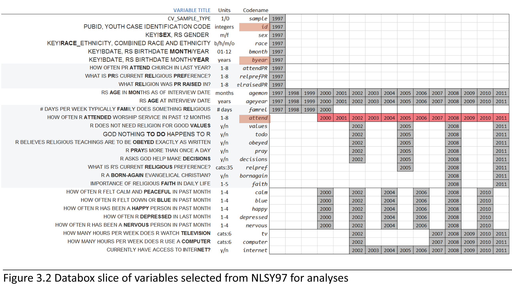

Label Factors
=================================================
This report offers several technical explanations about the properties of data and how work with it during modeling and graphing. 

<!--  Set the working directory to the repository's base directory; this assumes the report is nested inside of only one directory.-->


<!-- Set the report-wide options, and point to the external code file. -->


```r
# see code in .Rmd file
```


Initial point of departure - the [databox](http://statcanvas.net/thesis/databox/) of the selected sample, described in the [Methods](http://statcanvas.net/thesis/III_methods/03_Methods.htm) chapter and located in the [Results](http://statcanvas.net/thesis/IV_Results/04_Results.htm) chapter of the dissertation.

This [databox](http://statcanvas.net/thesis/databox/) corresponds to the dataset **dsL** the screenshot of which is given below
 
We load the dataset **dsL**, which was obtained by the report [Derive_dsL_from_Extract](https://github.com/andkov/Longitudinal_Models_of_Religiosity_NLSY97/blob/master/Data/Derive_dsL_from_Extract.md) and saved as a **.rds** dataset file, native to R.

### Organizing the metrics 
Review of the item reference [cards](http://statcanvas.net/thesis/databox/) shows that initially, all items were recorded on some discrete scale, either counting occasions or assigning an intiger to a category of response. However, in the original dataset they are recorded as either a numerical value or an intiger

```r
str(dsL)
```

```
'data.frame':	134760 obs. of  30 variables:
 $ sample     : int  1 1 1 1 1 1 1 1 1 1 ...
 $ id         : int  1 1 1 1 1 1 1 1 1 1 ...
 $ sex        : int  2 2 2 2 2 2 2 2 2 2 ...
 $ race       : int  4 4 4 4 4 4 4 4 4 4 ...
 $ bmonth     : int  9 9 9 9 9 9 9 9 9 9 ...
 $ byear      : int  1981 1981 1981 1981 1981 1981 1981 1981 1981 1981 ...
 $ attendPR   : int  7 7 7 7 7 7 7 7 7 7 ...
 $ relprefPR  : int  21 21 21 21 21 21 21 21 21 21 ...
 $ relraisedPR: int  21 21 21 21 21 21 21 21 21 21 ...
 $ year       : int  1997 1998 1999 2000 2001 2002 2003 2004 2005 2006 ...
 $ agemon     : num  190 206 219 231 243 256 266 279 290 302 ...
 $ ageyear    : num  15 17 18 19 20 21 22 23 24 25 ...
 $ famrel     : num  NA NA NA NA NA NA NA NA NA NA ...
 $ attend     : num  NA NA NA 1 6 2 1 1 1 1 ...
 $ values     : num  NA NA NA NA NA 1 NA NA 0 NA ...
 $ todo       : num  NA NA NA NA NA 1 NA NA 1 NA ...
 $ obeyed     : num  NA NA NA NA NA 1 NA NA 0 NA ...
 $ pray       : num  NA NA NA NA NA 0 NA NA 0 NA ...
 $ decisions  : num  NA NA NA NA NA 1 NA NA 1 NA ...
 $ relpref    : num  NA NA NA NA NA NA NA NA 21 NA ...
 $ bornagain  : num  NA NA NA NA NA NA NA NA NA NA ...
 $ faith      : num  NA NA NA NA NA NA NA NA NA NA ...
 $ calm       : num  NA NA NA 3 NA 4 NA 4 NA 4 ...
 $ blue       : num  NA NA NA 3 NA 2 NA 1 NA 1 ...
 $ happy      : num  NA NA NA 3 NA 3 NA 4 NA 4 ...
 $ depressed  : num  NA NA NA 3 NA 2 NA 1 NA 1 ...
 $ nervous    : num  NA NA NA 3 NA 1 NA 1 NA 1 ...
 $ tv         : num  NA NA NA NA NA 2 NA NA NA NA ...
 $ computer   : num  NA NA NA NA NA 5 NA NA NA NA ...
 $ internet   : num  NA NA NA NA NA NA 1 0 1 1 ...
```

Estimations routines such as lm4 or graphing  functions such as ggplot sometimes get fussy about passing factors as opposed to integers or numbers. It's convenient to have quick access to both. So instead of replacing the initial variables with factors and decode them back later when we need access to raw values, we'll create parallel set of variables in the original dataset. The script [LabelingFactorLevels](https://github.com/andkov/Longitudinal_Models_of_Religiosity_NLSY97/blob/master/Manipulation/LabelingFactorLevels.R) augments the initial dataset **dsL** with a copy variables as factors, with mannually assigned factor labels. See the script in "./Manipulation/LabelingFactorLevels.R". Now each variable in the dataset **dsL** contains a twin - marked by suffix "F" attached to end of the variable name. 

```r
str(dsL)
```

```
'data.frame':	134760 obs. of  30 variables:
 $ sample     : int  1 1 1 1 1 1 1 1 1 1 ...
 $ id         : int  1 1 1 1 1 1 1 1 1 1 ...
 $ sex        : int  2 2 2 2 2 2 2 2 2 2 ...
 $ race       : int  4 4 4 4 4 4 4 4 4 4 ...
 $ bmonth     : int  9 9 9 9 9 9 9 9 9 9 ...
 $ byear      : int  1981 1981 1981 1981 1981 1981 1981 1981 1981 1981 ...
 $ attendPR   : int  7 7 7 7 7 7 7 7 7 7 ...
 $ relprefPR  : int  21 21 21 21 21 21 21 21 21 21 ...
 $ relraisedPR: int  21 21 21 21 21 21 21 21 21 21 ...
 $ year       : int  1997 1998 1999 2000 2001 2002 2003 2004 2005 2006 ...
 $ agemon     : num  190 206 219 231 243 256 266 279 290 302 ...
 $ ageyear    : num  15 17 18 19 20 21 22 23 24 25 ...
 $ famrel     : num  NA NA NA NA NA NA NA NA NA NA ...
 $ attend     : num  NA NA NA 1 6 2 1 1 1 1 ...
 $ values     : num  NA NA NA NA NA 1 NA NA 0 NA ...
 $ todo       : num  NA NA NA NA NA 1 NA NA 1 NA ...
 $ obeyed     : num  NA NA NA NA NA 1 NA NA 0 NA ...
 $ pray       : num  NA NA NA NA NA 0 NA NA 0 NA ...
 $ decisions  : num  NA NA NA NA NA 1 NA NA 1 NA ...
 $ relpref    : num  NA NA NA NA NA NA NA NA 21 NA ...
 $ bornagain  : num  NA NA NA NA NA NA NA NA NA NA ...
 $ faith      : num  NA NA NA NA NA NA NA NA NA NA ...
 $ calm       : num  NA NA NA 3 NA 4 NA 4 NA 4 ...
 $ blue       : num  NA NA NA 3 NA 2 NA 1 NA 1 ...
 $ happy      : num  NA NA NA 3 NA 3 NA 4 NA 4 ...
 $ depressed  : num  NA NA NA 3 NA 2 NA 1 NA 1 ...
 $ nervous    : num  NA NA NA 3 NA 1 NA 1 NA 1 ...
 $ tv         : num  NA NA NA NA NA 2 NA NA NA NA ...
 $ computer   : num  NA NA NA NA NA 5 NA NA NA NA ...
 $ internet   : num  NA NA NA NA NA NA 1 0 1 1 ...
```

This give a certain flexibiity to assemble needed dataset quickly and have access to factor labels.

```r
selectCols<-c("year","id","byear","attend","attendF") # type in variable name
ds<-dsLF[,selectCols] # select all rows and only columns listed in the object selectCols
print(ds[ds$id==1,])  # print all availible data for respondent with ID number of 1
```

```
   year id byear attend         attendF
1  1997  1  1981     NA            <NA>
2  1998  1  1981     NA            <NA>
3  1999  1  1981     NA            <NA>
4  2000  1  1981      1           Never
5  2001  1  1981      6 About once/week
6  2002  1  1981      2   Once or Twice
7  2003  1  1981      1           Never
8  2004  1  1981      1           Never
9  2005  1  1981      1           Never
10 2006  1  1981      1           Never
11 2007  1  1981      1           Never
12 2008  1  1981      1           Never
13 2009  1  1981      1           Never
14 2010  1  1981      1           Never
15 2011  1  1981      1           Never
```

Having quick access to factor labels will come especially handy during graph production.

### Selecting working datasets
We don't need all the variables at the moment, so let's select only those we need to describe how respondents' church attendance was changing across time. Let's start with picking person's id, wave of measurement, and church attendance

```r
print (dsL[dsL$id==1,c("id","year","attend")])
```

```
   id year attend
1   1 1997     NA
2   1 1998     NA
3   1 1999     NA
4   1 2000      1
5   1 2001      6
6   1 2002      2
7   1 2003      1
8   1 2004      1
9   1 2005      1
10  1 2006      1
11  1 2007      1
12  1 2008      1
13  1 2009      1
14  1 2010      1
15  1 2011      1
```

Now, let's add to the selection person's year of birth and age in months at the time of the interview

```r
selectCols<-c("year","id","byear","agemon","attend") # type in variable name
ds<-dsL[,selectCols] # select all rows and only columns listed in the object selectCols
print(ds[ds$id==1,])  # print all availible data for respondent with ID number of 1
```

```
   year id byear agemon attend
1  1997  1  1981    190     NA
2  1998  1  1981    206     NA
3  1999  1  1981    219     NA
4  2000  1  1981    231      1
5  2001  1  1981    243      6
6  2002  1  1981    256      2
7  2003  1  1981    266      1
8  2004  1  1981    279      1
9  2005  1  1981    290      1
10 2006  1  1981    302      1
11 2007  1  1981    313      1
12 2008  1  1981    325      1
13 2009  1  1981    337      1
14 2010  1  1981    350      1
15 2011  1  1981    360      1
```

Generally we can select any desired dataset by formula **dataset**[  _condition for rows_  ,  _condition for columns_  ]

```r
ds<-dsL[dsL$year %in% c(2000:2011),c('id',"byear","year","attendF","ageyearF","agemon")]
```

```
Error: undefined columns selected
```

```r
print(ds[ds$id==1,]) 
```

```
   year id byear agemon attend
1  1997  1  1981    190     NA
2  1998  1  1981    206     NA
3  1999  1  1981    219     NA
4  2000  1  1981    231      1
5  2001  1  1981    243      6
6  2002  1  1981    256      2
7  2003  1  1981    266      1
8  2004  1  1981    279      1
9  2005  1  1981    290      1
10 2006  1  1981    302      1
11 2007  1  1981    313      1
12 2008  1  1981    325      1
13 2009  1  1981    337      1
14 2010  1  1981    350      1
15 2011  1  1981    360      1
```


```r
source(file.path(pathDir,"UtilityScripts/produceMDandHTML.R"))
```

```
Error: object 'pathDir' not found
```


