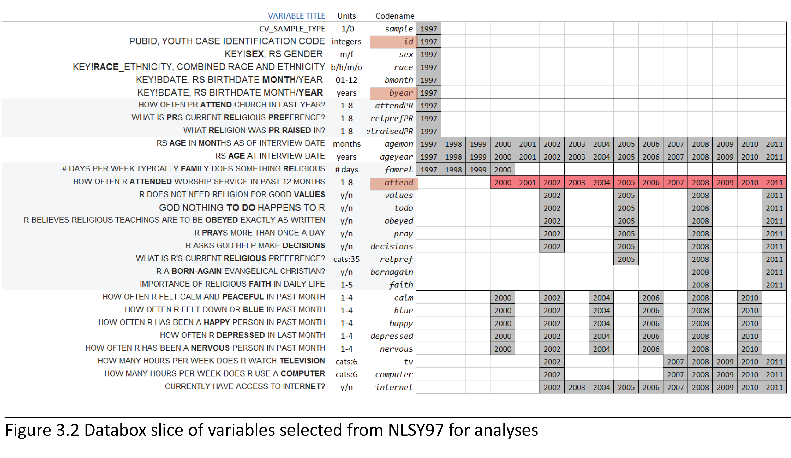
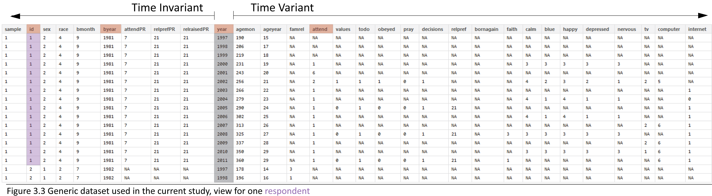
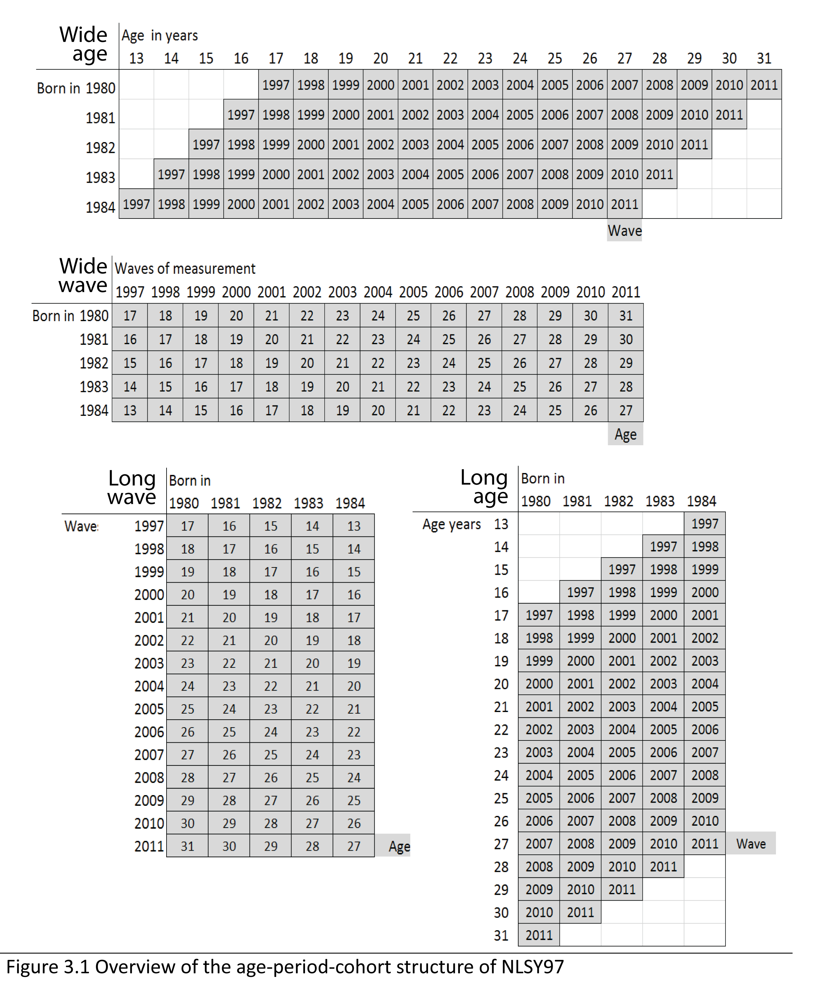

<!--  Set the working directory to the repository's base directory; this assumes the report is nested inside of only one directory.-->
```{r, echo=F, message=F} 
require(knitr)
opts_knit$set(root.dir='../../')  #Don't combine this call with any other chunk -especially one that uses file paths.

```

```{r set_options, echo=F, message=F}
require(knitr)
# getwd()
opts_chunk$set(
  results='show', 
  message = TRUE,
  comment = NA, 
  tidy = FALSE,
  fig.height = 4.8, 
  fig.width = 6.5, 
  out.width = "550px",
  fig.path = 'figure_rmd/',     
  dev = "png",
#   fig.path = 'figure_pdf/',     
#   dev = "pdf",
  dpi = 400
)
echoChunks <- FALSE
options(width=120) #So the output is 50% wider than the default.
read_chunk("./Models/Descriptives/Descriptives.R") # the file to which knitr calls for the chunks
```


Report explains how the response categories from NLSY97 questionnaire are labeled and demonstrates application of labeled factors in data operations and graphing.

Sections:  
1. Labeling Factor Levels  
2. Age-Period-Cohort structure  
3. Mapping Church Attendance  
4. Selecting & Augmenting datasets for modeling  

```{r DeclareGlobals, echo=echoChunks, message=FALSE}
# attANDANCE colOUR 8 categories - set up default colors for "attend"
```

```{r LoadPackages, echo=echoChunks, message=F}
```

```{r LoadData, echo=echoChunks, message=T}
dsL<-readRDS("./Data/Derived/dsL.rds")
```


### Data In
Initial point of departure - the [databox][1] of the selected sample, described in the [Methods][2] chapter.

This [databox][1] corresponds to the dataset **dsL** produced by [Derive_dsL_from_Extract][3] report. 
```{r echo=T, message=T}
dsL<-readRDS("./Data/Derived/dsL.rds")
```
< 


## 1. Labeling Factor Levels
Review of the item reference [cards][1] shows that initially, all items were recorded on some discrete scale, either counting occasions or assigning an intiger to a category of response. However, in the original dataset they are recorded as either a numerical value or an intiger
```{r}
str(dsL)

```
For estimations routines such as lm4 or graphing  functions such as ggplot, the  data type (string,numeric,  factor) is a meaningful input, so a quick access to both formats frequently proves to be convenience. Instead of replacing the initial variables with factors, we'll create parallel set of variables. The script  at the end of [LabelingFactorLevels][4] augments the initial dataset **dsL** with copy of initial variables saved as labeled factors. 
```{r}
str(dsL)
```
This give a certain flexibiity to assemble needed dataset quickly and have access to factor labels.
```{r}
selectCols<-c("year","id","byear","attend","attendF") # type in variable name
ds<-dsL[,selectCols] # select all rows and only columns listed in the object selectCols
print(ds[ds$id==1,])  # print all availible data for respondent with ID number of 1
```
Having quick access to factor labels will come especially handy during graph production.


## 2. Time metrics : Age, Period, Cohort
NLSY97 sample includes individuals from five cohorts, born between 1980 and 1984.The following graphics shows how birth cohort, age of respondents, and round of observation are related in NSLY97.


There are several indicators of age in NSLY97 that vary in precision. Birth cohort is the most general one, it was recorded once. Two variables were recorded at each interview: age at the time of the interview in months (**agemon**) and years (**ageyear**). Those are not derivatives of each other, but, understandably, are closely related. The variable **ageyear** records the full number of years a respondent reached at the time of the interview. Due to difficulties of administering the survey, time intervals between the waves could differ. 
```{r}
ds<-dsL[dsL$year %in% c(2000:2011),c('id',"byear","year","attend","ageyear","agemon")]
ds<- ds[ds$id %in% c(25),]
ds$age<-ds$year-ds$byear
ds$ageALT<- ds$agemon/12
print(ds)
```
For example, for one person **id**=25 the age was recorded as 21 years for both 2003 and 2004 (see **ageyear**). However, when you examine age in months (**agemon**) you can see this is rounding issue that disappears once a more precise scale is used. To avoid this potentially confusing peculiarity, age in years will be either calculated as computed as (**age** = **year** - **byear**) or as (**ageALT** = **agemon**/12).


## 3. Mapping Church Attendance


The focal variable of interest is **attend**, an item measuring church attendance in the current year. Although it was recorded on ordinal scale, 
```{r, echo=echoChunks, message=T, fig.width = 8}
p<-ggplot(subset(dsL,year==2000), aes(x=attendF))
p<-p+geom_bar()
p<-p+coord_flip()
p<-p+xlab("Church attendance") 
p<-p+ylab("Count")
p<-p+labs(title="How often did you attend a place of worship in the last year? (2000)")
p
```
its resolution allows us to treat it as continuous for the purpose of fitting statistical models. 
```{r , echo=T, message=F, results='hold'}
ds<-(subset(dsL, year==2000)) # only for year 2000
summary(as.numeric(ds$attend)) # summarize as continuous variable
```
The basic dataset contains personal identifyer (**id**), birth year which is also used as cohort indicator (**byear**), wave of measurement (**year**) and the focal variable of interest - worship attendance (**attend**). 
```{r, echo=echoChunks, message=F}
ds<-dsL[,c('id',"byear","year","attend","attendF")] # select needed variables
print(ds[ds$id==47,])# for a single subject with id=1
```

The view lists all the data for a single subjust (id=1). There are 
```{r, echo=echoChunks, message=F}
cat(length(unique(dsL$id)))
```
subjects in total.

We have data on attendance for 12 years, from 2000 to 2011. Figure 2 gives a cross-sectional frequency distribution of the data across the years. 
#### Figure 2. Relative frequency of responses for each observed wave
```{r,echo=echoChunks, message=F, out.width="700px", fig.width = 8 }
# attcol8 is defined in DeclareGlobal chunk of  the .R file
ds<- dsL
p<-ggplot(ds, aes(x=factor(year), fill=attendF))
p<-p+ geom_bar(position="fill")
p<-p+ scale_fill_manual(values = attcol8,
                    name="Response category" )
p<-p+ scale_y_continuous("Prevalence: proportion of total",
                     limits=c(0, 1),
                     breaks=c(.1,.2,.3,.4,.5,.6,.7,.8,.9,1))
p<-p+ scale_x_discrete("Waves of measurement",
                   limits=as.character(c(2000:2011)))
p<-p+ labs(title=paste0("In the past year, how often have you attended a worship service?"))
p

```

Modeling how the frequencies of endorsing particular response item will be the focus of Markov model, which renders well in cross-sectional representations. However, LCM and GMM work with longitudinal data, modeling the trajectory of each individual. The trajectories of subjects with **id**s of 4, 25, 35, and 47 are plotted in the next graph

```{r,echo=echoChunks, message=F, out.width="700px", fig.width = 8 }

ds<- dsL[dsL$id %in% c(4, 25, 35, 47),]
p<-ggplot(ds, aes(x=year,y=attend, color=idF))
p<-p+ geom_line()
# p<-p+ geom_smooth(method=lm)
p<-p+ geom_point()
p<-p+ scale_y_continuous("Church attendance",
                     limits=c(1, 8),
                     breaks=c(1:8))
p<-p+ scale_x_continuous("Waves of measurement",
                   limits=c(2000,2011),
                   breaks=c(2000:2011))
p<-p+ labs(title=paste0("In the past year, how often have you attended a worship service?"))
p
```

The respondent  **id**=35 reported attending no worship services in any of the years, while respodent **id**=25 seemed to frequent it, indicating weekly attendance in 8 out of the 12 years. Individual **id**=47 started as a fairly regular attendee of religious services in 2000 (5= "about twice a month"), then gradually declined his involvement to nill in 2009 and on. Respondent **id**=4, on the other hand started off with a rather passive involvement, reporting  attended church only "Once or twice"  in 2000,  maintained a low level of participation throughout the years, only to surge his attendance in 2011. Each of these trajectories imply a story, a life scenario. Why one person grows in his religious involvement, while other declines, or never develops an interest in the first place? Latent curve models will describe intraindividual trajectories of change, while summarizinig the interindividual similarities and trends.  

Previous research in religiousity indicated that age might be one of the primary factors explaining interindividual differences in church attendance. To examine the role of age, we change the metric of time from waves of measurement, as in the previous graph, to biological age.

```{r,echo=echoChunks, message=F, out.width="700px", fig.width = 8 }

ds<- dsL[dsL$id %in% c(4, 25, 35, 47),]
p<-ggplot(ds, aes(x=ageyear,y=as.numeric(attend), color=factor(id) ))
p<-p+ geom_line()
# p<-p+ geom_smooth(method=lm)
p<-p+ geom_point()
p<-p+ scale_y_continuous("Church attendance",
                     limits=c(1, 8),
                     breaks=c(1:8))
p<-p+ scale_x_continuous("Age in years",
                   limits=c(16,31),
                   breaks=seq(from=12, to=31,by=1))
p<-p+ labs(title=paste0("In the past year, how often have you attended a worship service?"))
p
```

Persons **id**=35 and **id**=25 are peers, in 2000 they were both 17.  Respondent **id**=47 is a year older, in 2000 he was 18. The oldest is **id**=4, who by the last round of measurement in 2011 is 30 years of age. Perhaps, his increased church attendance could be explained by starting a family of his own?

(ASIDE NOTE: this figure reveals an important detail about the NLSY97 data. The variable **ageyear** records the full number of years a respondent reached at the time of the interview. Due to difficulties of administering the survey, time intervals between the waves could differ. For example, for person **id**=25 the age was recorded as 21 years for both 2003 and 2004. However, when you examine age in months (**agemon**) you can see this is rounding issue that disappears once a more precise scale is used. To avoid this potentially confusing peculiarity, age in years will be either calculated as computed as (age = **year** - **byear**) or as (ageALT = **agemon**/12).

```{r}
ds<- dsL[dsL$year %in% c(2000:2011),c('id',"byear","year","attend","ageyear","agemon")]
ds<- ds[ds$id %in% c(25),]
ds$age<-ds$year-ds$byear
ds$ageALT<- ds$agemon/12
print(ds)

```


## 4. Selecting and Augmenting data for modeling
We need only a few variables at any given moment in the process of modeling, so let's select only those we need to describe how respondents' church attendance was changing across time and age. Let's start with picking person's id, wave of measurement, and church attendance
```{r}
print (dsL[dsL$id==1,c("id","year","attend")])
```
Now, let's add to the selection person's year of birth and age in months at the time of the interview
```{r, echo=TRUE}
selectCols<-c("year","id","byear","agemon","attend") # type in variable name
ds<-dsL[,selectCols] # select all rows and only columns listed in the object selectCols
print(ds[ds$id==1,])  # print all availible data for respondent with ID number of 1
```
Generally we can select any desired dataset by formula **dataset**[  _condition for rows_  ,  _condition for columns_  ]
```{r}
ds<-dsL[dsL$year %in% c(2000:2011),c('id',"byear","year","attendF","ageyearF","agemon")]
print(ds[ds$id==1,]) 
```


[1]:http://statcanvas.net/thesis/databox/
[2]:http://statcanvas.net/thesis/III_methods/03_Methods.htm
[3]:https://github.com/andkov/Longitudinal_Models_of_Religiosity_NLSY97/blob/master/Data/Derive_dsL_from_Extract.md
[4]:https://github.com/andkov/Longitudinal_Models_of_Religiosity_NLSY97/blob/master/Manipulation/LabelingFactorLevels.R