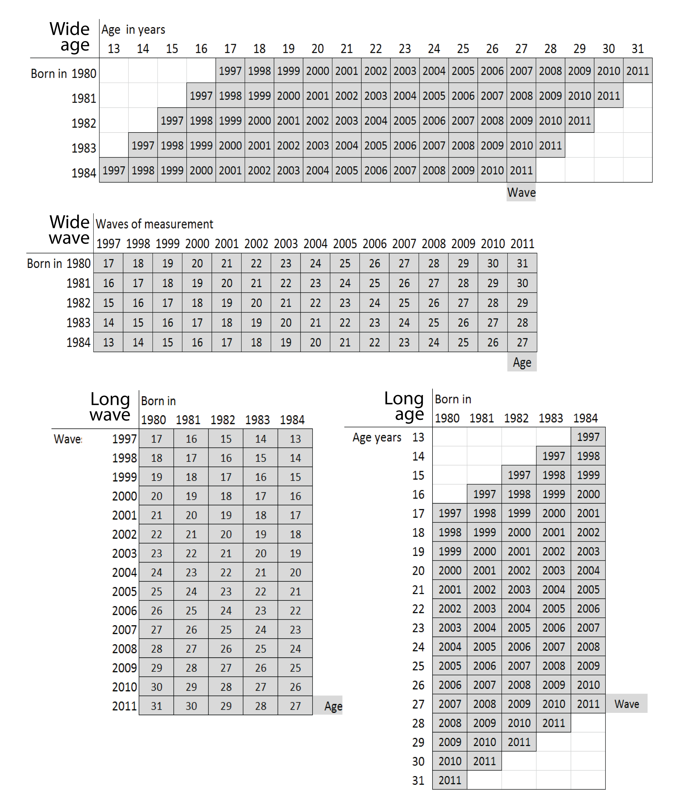

<!--  Set the working directory to the repository's base directory; this assumes the report is nested inside of only one directory.-->
```{r, echo=F, message=F} 
require(knitr)
opts_knit$set(root.dir='../../')  #Don't combine this call with any other chunk -especially one that uses file paths.

```

```{r set_options, echo=F, message=F}
require(knitr)
# getwd()
opts_chunk$set(
  results='show', 
  message = TRUE,
  comment = NA, 
  tidy = FALSE,
#   fig.height = 4.8, 
#   fig.width = 6.5, 
  out.width = NULL,
  fig.path = 'figure_rmd/Metrics/',     
  dev = "png",
  dpi = 400
)
echoChunks <- FALSE
warningChunks<- FALSE
options(width=120) #So the output is 50% wider than the default.
read_chunk("./Models/Descriptives/Descriptives.R") # the file to which knitr calls for the chunks
```

===   

Labeling factors and exploring scales.   

```{r DeclareGlobals, echo=F, message=FALSE, results='hide'}
# aesDefs
```

```{r LoadPackages, echo=echoChunks, message=F}
```

```{r LoadData, echo=echoChunks, message=T}
# select only respondence in the cross-sectional sample

```

## Data preliminaries

Initial point of departure - the [databox][databox] of the selected variables, described in the Methods chapter.  

This [databox][databoxStatcanvas] corresponds to the dataset **dsL** produced by [Derive_dsL_from_Extract][derive] report, given in the Appendix.     
```{r echo=T, message=T}
dsL<-readRDS("./Data/Derived/dsL.rds")
```
     

Note that the variable **year** serves as a natural devided between time invariant (TIvars) and time variant (TVvars) variables. All modeling operations beging with subsetting this dataset.  For the grammer rules of operations with relevant data see [Data Manipulation Guide][manipulate].


##  Labeling Factor Levels
Review of the item reference [cards][databoxStatcanvas] shows that initially, all items were recorded on some discrete scale, either counting occasions or assigning an intiger to a category of response. However, data were saved as numerical values or  intigers
```{r}
ds<- dsL %>%
  dplyr::select(
        sample, id, sex, race, bmonth,byear, attendPR, relprefPR,relraisedPR,
    year,
        agemon, ageyear, famrel, attend,
        values, todo, obeyed, pray, decisions, 
        relpref, bornagain, faith, 
        calm, blue, happy, depressed, nervous,
        tv, computer, internet)               
str(ds)
```

[LabelingFactorLevels.R][labels] sourced at the end of [Derive_dsL_from_Extract][derive] matches numeric values with response labels from the questionnaire and adds copies of the variables, saved as labeled factors, to **dsL**. For estimations routines such as <code>lme4</code> or graphing  functions such as <code>ggplot2</code>, the  data type (string,numeric,  factor) is a meaningful input, so a quick access to both formats frequently proves useful.  It is convenient to think that **dsL** contains only
```{r}
ncol(dsL)/2
```
variables, but each of them has a double, a labeled factor.
```{r}
str(dsL)
```
This give a certain flexibity in assembling needed dataset quickly and have access to factor labels. One can alternate between the raw metric and labeled factor by adding "F" suffix to the end of the variable name:
```{r}
ds<- dsL %>%
  dplyr::filter(id==25) %>%
  dplyr::select(id,byear,year, attend,attendF)
ds
```
Having quick access to factor labels will be especially useful during graph production.


## Time metrics : Age, Period, Cohort
NLSY97 sample includes individuals from five cohorts, born between 1980 and 1984.The following graphics shows how birth cohort, age of respondents, and round of observation are related in NSLY97.  



NSLY97 contains static (**bmonth**, **byear**) and dynamic (**agemon**, **ageyear**) indicators of age : 

```{r age_data_25}
ds<- dsL %>% 
  dplyr::filter(id==25, year %in% c(1997:2011)) %>% 
  dplyr::select(id,byear,bmonthF,year,agemon,ageyear)
print(ds)
```

Variable **year** is used as cohort indicator. Variable **year** enumerates NLSY97 rounds, recording the calendaric year during which it took place. When transforming the metric of time, and using biological age instead of **year** as the temporal dimension, the value of age at the time of the interview will be computed as **age** = **agemon**/12  

```{r age_data_25_2}
ds<- dsL %>% 
  dplyr::filter(id==25, year %in% c(1997:2011)) %>% 
  dplyr::select(id,bmonthF,byear,year, agemon,ageyear) %>%
  dplyr::mutate (age =  agemon/12)
print(ds)
```

## Attendance  

NLSY97 asked to report church attendance (**attend**) for the past 12 months preceding the interview date. The response card offered a choice of 7 categories ordered by magnitude.  

```{r attend_2000, echo=echoChunks, message=T, fig.height=3.5,fig.cap="Figure caption test"}
ds<- dsL %>%  dplyr::filter(year==2000,sample==1)
p<-ggplot(ds, aes(x=attendF, fill=attendF))
p <- p + geom_bar(color="black")
p <- p + scale_fill_manual(values=attendCol8, na.value=NACol, guide=FALSE)
p <- p + coord_flip()
# p <- p + guides(fill = guide_legend(reverse=TRUE, title="Attendence")) #http://www.cookbook-r.com/Graphs/Legends_(ggplot2)/#reversing-the-order-of-items-in-the-legend
p <- p + labs(title="How often have you attended a worship service (2000)?", x="Church attendance", y="Count")
p <- p + ggplot2::theme_bw()
p <- p + ggplot2::theme_bw(base_size=baseSize)
p <- p + ggplot2::theme(title=ggplot2::element_text(colour="gray20",size = 12)) 
p <- p + ggplot2::theme(axis.text=ggplot2::element_text(colour="gray40"))
p <- p + ggplot2::theme(axis.title=ggplot2::element_text(colour="gray40"))
p <- p + ggplot2::theme(panel.border = ggplot2::element_rect(colour="gray80"))
p <- p + ggplot2::theme(axis.ticks.length = grid::unit(0, "cm"))
p

```


## Read more 

in <code>./Models/Descriptives</code>:   

+ [Metrics][metrics] - how values of items are labeled       
+ [Descriptives][descriptives] - basic stats of various items (__Continue__)      
+ [Attendance][attend] - focus on church attendence over time      
+ [Databox][databox]  

See also   

+ [Deriving Data from NLYS97 extract][derive]
+ [Data Manipulation Guide][manipulate]

```{r child, child_citations = 'Citations.Rmd'}

```

