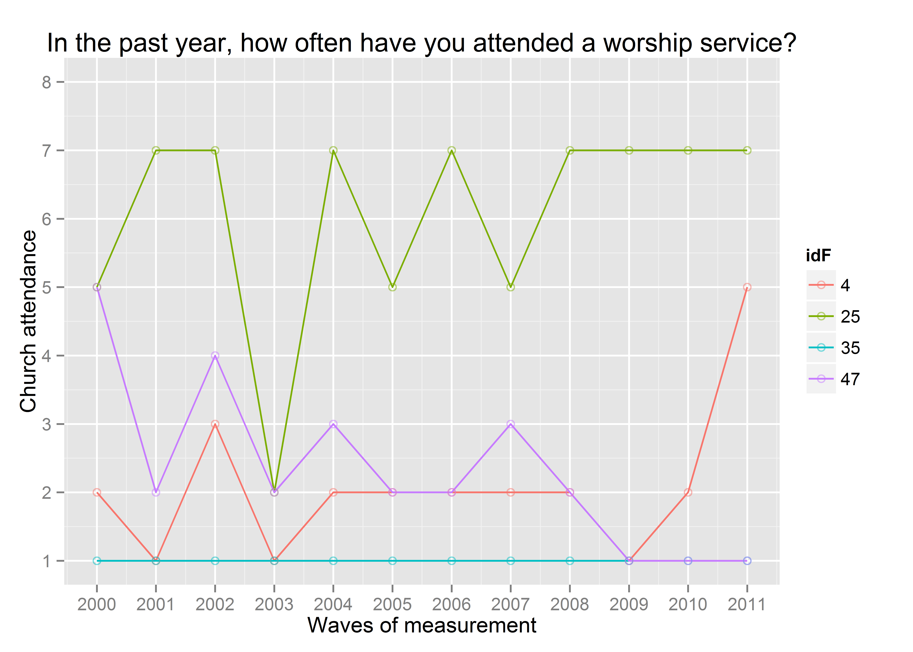
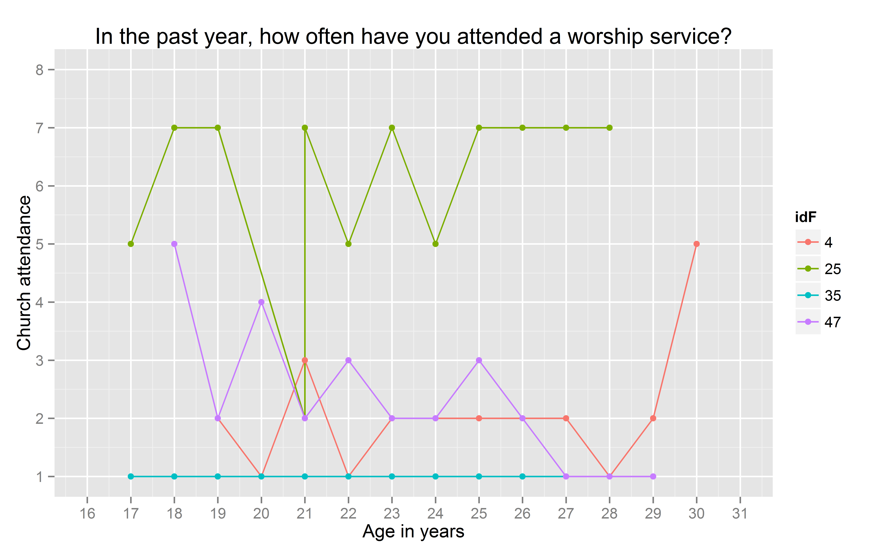
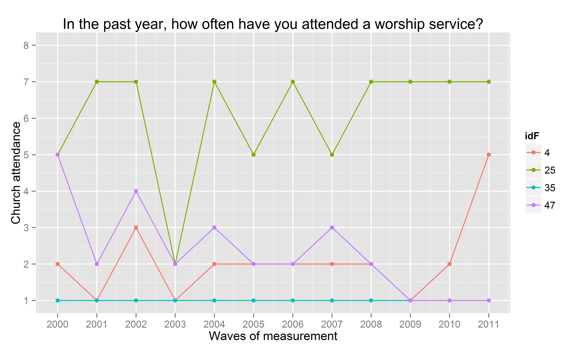

-   Metrics: labeling factors and exploring scales
    -   Data In
    -   Labeling Factor Levels
    -   Time metrics : Age, Period, Cohort
    -   Mapping Church Attendance
    -   Selecting and Augmenting data for modeling

<!--  Set the working directory to the repository's base directory; this assumes the report is nested inside of only one directory.-->


Metrics: labeling factors and exploring scales
==============================================

Report explains how the response categories from NLSY97 questionnaire are labeled and demonstrates application of labeled factors in data operations and graphing.

Data In
-------

Initial point of departure - the [databox](http://statcanvas.net/thesis/databox/) of the selected sample, described in the [Methods](http://statcanvas.net/thesis/III_methods/03_Methods.htm) chapter.  This [databox](http://statcanvas.net/thesis/databox/) corresponds to the dataset **dsL** produced by [Derive\_dsL\_from\_Extract](https://github.com/andkov/Longitudinal_Models_of_Religiosity_NLSY97/blob/master/Data/Derive_dsL_from_Extract.md) report.

``` {.r}
dsL<-readRDS("./Data/Derived/dsL.rds")
```


Labeling Factor Levels
----------------------

Review of the item reference [cards](http://statcanvas.net/thesis/databox/) shows that initially, all items were recorded on some discrete scale, either counting occasions or assigning an intiger to a category of response. However, data were saved as a numerical value or an intigers to optimize storage

``` {.r}
ds<- dsL[,1:(ncol(dsL)/2)]# selects the first half of variables
str(ds)
```

    'data.frame':   134760 obs. of  30 variables:
     $ sample     : int  1 1 1 1 1 1 1 1 1 1 ...
     $ id         : int  1 1 1 1 1 1 1 1 1 1 ...
     $ sex        : int  2 2 2 2 2 2 2 2 2 2 ...
     $ race       : int  4 4 4 4 4 4 4 4 4 4 ...
     $ bmonth     : int  9 9 9 9 9 9 9 9 9 9 ...
     $ byear      : int  1981 1981 1981 1981 1981 1981 1981 1981 1981 1981 ...
     $ attendPR   : int  7 7 7 7 7 7 7 7 7 7 ...
     $ relprefPR  : int  21 21 21 21 21 21 21 21 21 21 ...
     $ relraisedPR: int  21 21 21 21 21 21 21 21 21 21 ...
     $ year       : int  1997 1998 1999 2000 2001 2002 2003 2004 2005 2006 ...
     $ agemon     : num  190 206 219 231 243 256 266 279 290 302 ...
     $ ageyear    : num  15 17 18 19 20 21 22 23 24 25 ...
     $ famrel     : num  NA NA NA NA NA NA NA NA NA NA ...
     $ attend     : num  NA NA NA 1 6 2 1 1 1 1 ...
     $ values     : num  NA NA NA NA NA 1 NA NA 0 NA ...
     $ todo       : num  NA NA NA NA NA 1 NA NA 1 NA ...
     $ obeyed     : num  NA NA NA NA NA 1 NA NA 0 NA ...
     $ pray       : num  NA NA NA NA NA 0 NA NA 0 NA ...
     $ decisions  : num  NA NA NA NA NA 1 NA NA 1 NA ...
     $ relpref    : num  NA NA NA NA NA NA NA NA 21 NA ...
     $ bornagain  : num  NA NA NA NA NA NA NA NA NA NA ...
     $ faith      : num  NA NA NA NA NA NA NA NA NA NA ...
     $ calm       : num  NA NA NA 3 NA 4 NA 4 NA 4 ...
     $ blue       : num  NA NA NA 3 NA 2 NA 1 NA 1 ...
     $ happy      : num  NA NA NA 3 NA 3 NA 4 NA 4 ...
     $ depressed  : num  NA NA NA 3 NA 2 NA 1 NA 1 ...
     $ nervous    : num  NA NA NA 3 NA 1 NA 1 NA 1 ...
     $ tv         : num  NA NA NA NA NA 2 NA NA NA NA ...
     $ computer   : num  NA NA NA NA NA 5 NA NA NA NA ...
     $ internet   : num  NA NA NA NA NA NA 1 0 1 1 ...

[LabelingFactorLevels.R](https://github.com/andkov/Longitudinal_Models_of_Religiosity_NLSY97/blob/master/Manipulation/LabelingFactorLevels.R) sourced at the end of [Derive\_dsL\_from\_Extract](https://github.com/andkov/Longitudinal_Models_of_Religiosity_NLSY97/blob/master/Data/Derive_dsL_from_Extract.md) matches numeric values with response labels from the questionnaire and adds to **dsL** copy of variables saved as labeled factors. For estimations routines such as lm4 or graphing functions such as ggplot, the data type (string,numeric, factor) is a meaningful input, so a quick access to both formats frequently proves to be useful. It is convenient to think that **dsL** has really only

``` {.r}
ncol(dsL)/2
```

    [1] 30

variables, but each of them has a double, an ordered factor.

``` {.r}
str(dsL)
```

    'data.frame':   134760 obs. of  60 variables:
     $ sample      : int  1 1 1 1 1 1 1 1 1 1 ...
     $ id          : int  1 1 1 1 1 1 1 1 1 1 ...
     $ sex         : int  2 2 2 2 2 2 2 2 2 2 ...
     $ race        : int  4 4 4 4 4 4 4 4 4 4 ...
     $ bmonth      : int  9 9 9 9 9 9 9 9 9 9 ...
     $ byear       : int  1981 1981 1981 1981 1981 1981 1981 1981 1981 1981 ...
     $ attendPR    : int  7 7 7 7 7 7 7 7 7 7 ...
     $ relprefPR   : int  21 21 21 21 21 21 21 21 21 21 ...
     $ relraisedPR : int  21 21 21 21 21 21 21 21 21 21 ...
     $ year        : int  1997 1998 1999 2000 2001 2002 2003 2004 2005 2006 ...
     $ agemon      : num  190 206 219 231 243 256 266 279 290 302 ...
     $ ageyear     : num  15 17 18 19 20 21 22 23 24 25 ...
     $ famrel      : num  NA NA NA NA NA NA NA NA NA NA ...
     $ attend      : num  NA NA NA 1 6 2 1 1 1 1 ...
     $ values      : num  NA NA NA NA NA 1 NA NA 0 NA ...
     $ todo        : num  NA NA NA NA NA 1 NA NA 1 NA ...
     $ obeyed      : num  NA NA NA NA NA 1 NA NA 0 NA ...
     $ pray        : num  NA NA NA NA NA 0 NA NA 0 NA ...
     $ decisions   : num  NA NA NA NA NA 1 NA NA 1 NA ...
     $ relpref     : num  NA NA NA NA NA NA NA NA 21 NA ...
     $ bornagain   : num  NA NA NA NA NA NA NA NA NA NA ...
     $ faith       : num  NA NA NA NA NA NA NA NA NA NA ...
     $ calm        : num  NA NA NA 3 NA 4 NA 4 NA 4 ...
     $ blue        : num  NA NA NA 3 NA 2 NA 1 NA 1 ...
     $ happy       : num  NA NA NA 3 NA 3 NA 4 NA 4 ...
     $ depressed   : num  NA NA NA 3 NA 2 NA 1 NA 1 ...
     $ nervous     : num  NA NA NA 3 NA 1 NA 1 NA 1 ...
     $ tv          : num  NA NA NA NA NA 2 NA NA NA NA ...
     $ computer    : num  NA NA NA NA NA 5 NA NA NA NA ...
     $ internet    : num  NA NA NA NA NA NA 1 0 1 1 ...
     $ sampleF     : Ord.factor w/ 2 levels "Cross-Sectional"<..: 1 1 1 1 1 1 1 1 1 1 ...
     $ idF         : Factor w/ 8984 levels "1","2","3","4",..: 1 1 1 1 1 1 1 1 1 1 ...
     $ sexF        : Ord.factor w/ 3 levels "Male"<"Female"<..: 2 2 2 2 2 2 2 2 2 2 ...
     $ raceF       : Ord.factor w/ 4 levels "Black"<"Hispanic"<..: NA NA NA NA NA NA NA NA NA NA ...
     $ bmonthF     : Ord.factor w/ 12 levels "Jan"<"Feb"<"Mar"<..: 9 9 9 9 9 9 9 9 9 9 ...
     $ byearF      : Factor w/ 5 levels "1980","1981",..: 2 2 2 2 2 2 2 2 2 2 ...
     $ attendPRF   : Ord.factor w/ 8 levels "Never"<"Once or Twice"<..: 7 7 7 7 7 7 7 7 7 7 ...
     $ relprefPRF  : Ord.factor w/ 33 levels "Catholic"<"Baptist"<..: 21 21 21 21 21 21 21 21 21 21 ...
     $ relraisedPRF: Ord.factor w/ 33 levels "Catholic"<"Baptist"<..: 21 21 21 21 21 21 21 21 21 21 ...
     $ yearF       : Factor w/ 15 levels "1997","1998",..: 1 2 3 4 5 6 7 8 9 10 ...
     $ agemonF     : Factor w/ 244 levels "146","147","148",..: 45 61 74 86 98 111 121 134 145 157 ...
     $ ageyearF    : Factor w/ 21 levels "12","13","14",..: 4 6 7 8 9 10 11 12 13 14 ...
     $ famrelF     : Factor w/ 8 levels "0","1","2","3",..: NA NA NA NA NA NA NA NA NA NA ...
     $ attendF     : Ord.factor w/ 8 levels "Never"<"Once or Twice"<..: NA NA NA 1 6 2 1 1 1 1 ...
     $ valuesF     : Ord.factor w/ 2 levels "FALSE/less Religious"<..: NA NA NA NA NA 2 NA NA 1 NA ...
     $ todoF       : Ord.factor w/ 2 levels "FALSE/less Religious"<..: NA NA NA NA NA 2 NA NA 2 NA ...
     $ obeyedF     : Ord.factor w/ 2 levels "FALSE/less Religious"<..: NA NA NA NA NA 2 NA NA 1 NA ...
     $ prayF       : Ord.factor w/ 2 levels "FALSE/less Religious"<..: NA NA NA NA NA 1 NA NA 1 NA ...
     $ decisionsF  : Ord.factor w/ 2 levels "FALSE/less Religious"<..: NA NA NA NA NA 2 NA NA 2 NA ...
     $ relprefF    : Ord.factor w/ 33 levels "Catholic"<"Baptist"<..: NA NA NA NA NA NA NA NA 21 NA ...
     $ bornagainF  : Ord.factor w/ 2 levels "NO"<"YES": NA NA NA NA NA NA NA NA NA NA ...
     $ faithF      : Ord.factor w/ 5 levels "Exrtemely"<"Very"<..: NA NA NA NA NA NA NA NA NA NA ...
     $ calmF       : Ord.factor w/ 4 levels "All of the time"<..: NA NA NA NA NA NA NA NA NA NA ...
     $ blueF       : Ord.factor w/ 4 levels "All of the time"<..: NA NA NA NA NA NA NA NA NA NA ...
     $ happyF      : Ord.factor w/ 4 levels "All of the time"<..: NA NA NA NA NA NA NA NA NA NA ...
     $ depressedF  : Ord.factor w/ 4 levels "All of the time"<..: NA NA NA NA NA NA NA NA NA NA ...
     $ nervousF    : Ord.factor w/ 4 levels "All of the time"<..: NA NA NA NA NA NA NA NA NA NA ...
     $ tvF         : Ord.factor w/ 6 levels "less than 2"<..: NA NA NA NA NA 2 NA NA NA NA ...
     $ computerF   : Ord.factor w/ 6 levels "None"<"less than 1"<..: NA NA NA NA NA 5 NA NA NA NA ...
     $ internetF   : Ord.factor w/ 2 levels "No"<"Yes": NA NA NA NA NA NA 2 1 2 2 ...

This give a certain flexibiity to assemble needed dataset quickly and have access to factor labels.

``` {.r}
selectCols<-c("year","id","byear","attend","attendF") # type in variable name
ds<-dsL[,selectCols] # select all rows and only columns listed in the object selectCols
print(ds[ds$id==1,])  # print all availible data for respondent with ID number of 1
```

       year id byear attend         attendF
    1  1997  1  1981     NA            <NA>
    2  1998  1  1981     NA            <NA>
    3  1999  1  1981     NA            <NA>
    4  2000  1  1981      1           Never
    5  2001  1  1981      6 About once/week
    6  2002  1  1981      2   Once or Twice
    7  2003  1  1981      1           Never
    8  2004  1  1981      1           Never
    9  2005  1  1981      1           Never
    10 2006  1  1981      1           Never
    11 2007  1  1981      1           Never
    12 2008  1  1981      1           Never
    13 2009  1  1981      1           Never
    14 2010  1  1981      1           Never
    15 2011  1  1981      1           Never

Having quick access to factor labels will be especially useful during graph production.

Time metrics : Age, Period, Cohort
----------------------------------

NLSY97 sample includes individuals from five cohorts, born between 1980 and 1984.The following graphics shows how birth cohort, age of respondents, and round of observation are related in NSLY97. 

There are several indicators of age in NSLY97 that vary in precision. Birth cohort is the most general one, it was recorded once. Two variables were recorded at each interview: age at the time of the interview in months (**agemon**) and years (**ageyear**). Those are not derivatives of each other, but, understandably, are closely related. The variable **ageyear** records the full number of years a respondent reached at the time of the interview. Due to difficulties of administering the survey, time intervals between the waves could differ.

``` {.r}
ds<-dsL[dsL$year %in% c(2000:2011),c('id',"byear","year","attend","ageyear","agemon")]
ds<- ds[ds$id %in% c(25),]
ds$age<-ds$year-ds$byear
ds$ageALT<- ds$agemon/12
print(ds)
```

        id byear year attend ageyear agemon age ageALT
    364 25  1983 2000      5      17    214  17  17.83
    365 25  1983 2001      7      18    226  18  18.83
    366 25  1983 2002      7      19    236  19  19.67
    367 25  1983 2003      2      21    254  20  21.17
    368 25  1983 2004      7      21    261  21  21.75
    369 25  1983 2005      5      22    272  22  22.67
    370 25  1983 2006      7      23    284  23  23.67
    371 25  1983 2007      5      24    295  24  24.58
    372 25  1983 2008      7      25    307  25  25.58
    373 25  1983 2009      7      26    319  26  26.58
    374 25  1983 2010      7      27    332  27  27.67
    375 25  1983 2011      7      28    342  28  28.50

For example, for one person **id**=25 the age was recorded as 21 years for both 2003 and 2004 (see **ageyear**). However, when you examine age in months (**agemon**) you can see this is rounding issue that disappears once a more precise scale is used. To avoid this potentially confusing peculiarity, age in years will be either calculated as computed as (**age** = **year** - **byear**) or as (**ageALT** = **agemon**/12).

Mapping Church Attendance
-------------------------

The focal variable of interest is **attend**, an item measuring church attendance in the current year. Although it was recorded on ordinal scale,  its resolution allows us to treat it as continuous for the purpose of fitting statistical models.

``` {.r}
ds<-(subset(dsL, year==2000)) # only for year 2000
summary(as.numeric(ds$attend)) # summarize as continuous variable
```

       Min. 1st Qu.  Median    Mean 3rd Qu.    Max.    NA's 
        1.0     1.0     3.0     3.4     6.0     8.0     965 

The basic dataset contains personal identifyer (**id**), birth year which is also used as cohort indicator (**byear**), wave of measurement (**year**) and the focal variable of interest - worship attendance (**attend**).

        id byear year attend              attendF
    691 47  1982 1997     NA                 <NA>
    692 47  1982 1998     NA                 <NA>
    693 47  1982 1999     NA                 <NA>
    694 47  1982 2000      5    About twice/month
    695 47  1982 2001      2        Once or Twice
    696 47  1982 2002      4     About once/month
    697 47  1982 2003      2        Once or Twice
    698 47  1982 2004      3 Less than once/month
    699 47  1982 2005      2        Once or Twice
    700 47  1982 2006      2        Once or Twice
    701 47  1982 2007      3 Less than once/month
    702 47  1982 2008      2        Once or Twice
    703 47  1982 2009      1                Never
    704 47  1982 2010      1                Never
    705 47  1982 2011      1                Never

The view lists all the data for a single subjust (id=1). There are

    8984

subjects in total.

We have data on attendance for 12 years, from 2000 to 2011. Figure 2 gives a cross-sectional frequency distribution of the data across the years. \#\#\#\# Figure 2. Relative frequency of responses for each observed wave 

Modeling how the frequencies of endorsing particular response item will be the focus of Markov model, which renders well in cross-sectional representations. However, LCM and GMM work with longitudinal data, modeling the trajectory of each individual. The trajectories of subjects with **id**s of 4, 25, 35, and 47 are plotted in the next graph

    Warning: Removed 12 rows containing missing values (geom_path).
    Warning: Removed 12 rows containing missing values (geom_point).



The respondent **id**=35 reported attending no worship services in any of the years, while respodent **id**=25 seemed to frequent it, indicating weekly attendance in 8 out of the 12 years. Individual **id**=47 started as a fairly regular attendee of religious services in 2000 (5= "about twice a month"), then gradually declined his involvement to nill in 2009 and on. Respondent **id**=4, on the other hand started off with a rather passive involvement, reporting attended church only "Once or twice" in 2000, maintained a low level of participation throughout the years, only to surge his attendance in 2011. Each of these trajectories imply a story, a life scenario. Why one person grows in his religious involvement, while other declines, or never develops an interest in the first place? Latent curve models will describe intraindividual trajectories of change, while summarizinig the interindividual similarities and trends.

Previous research in religiousity indicated that age might be one of the primary factors explaining interindividual differences in church attendance. To examine the role of age, we change the metric of time from waves of measurement, as in the previous graph, to biological age.

    Warning: Removed 12 rows containing missing values (geom_path).
    Warning: Removed 12 rows containing missing values (geom_point).



Persons **id**=35 and **id**=25 are peers, in 2000 they were both 17. Respondent **id**=47 is a year older, in 2000 he was 18. The oldest is **id**=4, who by the last round of measurement in 2011 is 30 years of age. Perhaps, his increased church attendance could be explained by starting a family of his own?

(ASIDE NOTE: this figure reveals an important detail about the NLSY97 data. The variable **ageyear** records the full number of years a respondent reached at the time of the interview. Due to difficulties of administering the survey, time intervals between the waves could differ. For example, for person **id**=25 the age was recorded as 21 years for both 2003 and 2004. However, when you examine age in months (**agemon**) you can see this is rounding issue that disappears once a more precise scale is used. To avoid this potentially confusing peculiarity, age in years will be either calculated as computed as (age = **year** - **byear**) or as (ageALT = **agemon**/12).

``` {.r}
ds<- dsL[dsL$year %in% c(2000:2011),c('id',"byear","year","attend","ageyear","agemon")]
ds<- ds[ds$id %in% c(25),]
ds$age<-ds$year-ds$byear
ds$ageALT<- ds$agemon/12
print(ds)
```

        id byear year attend ageyear agemon age ageALT
    364 25  1983 2000      5      17    214  17  17.83
    365 25  1983 2001      7      18    226  18  18.83
    366 25  1983 2002      7      19    236  19  19.67
    367 25  1983 2003      2      21    254  20  21.17
    368 25  1983 2004      7      21    261  21  21.75
    369 25  1983 2005      5      22    272  22  22.67
    370 25  1983 2006      7      23    284  23  23.67
    371 25  1983 2007      5      24    295  24  24.58
    372 25  1983 2008      7      25    307  25  25.58
    373 25  1983 2009      7      26    319  26  26.58
    374 25  1983 2010      7      27    332  27  27.67
    375 25  1983 2011      7      28    342  28  28.50

Selecting and Augmenting data for modeling
------------------------------------------

We need only a few variables at any given moment in the process of modeling, so let's select only those we need to describe how respondents' church attendance was changing across time and age. Let's start with picking person's id, wave of measurement, and church attendance

``` {.r}
print (dsL[dsL$id==1,c("id","year","attend")])
```

       id year attend
    1   1 1997     NA
    2   1 1998     NA
    3   1 1999     NA
    4   1 2000      1
    5   1 2001      6
    6   1 2002      2
    7   1 2003      1
    8   1 2004      1
    9   1 2005      1
    10  1 2006      1
    11  1 2007      1
    12  1 2008      1
    13  1 2009      1
    14  1 2010      1
    15  1 2011      1

Now, let's add to the selection person's year of birth and age in months at the time of the interview

``` {.r}
selectCols<-c("year","id","byear","agemon","attend") # type in variable name
ds<-dsL[,selectCols] # select all rows and only columns listed in the object selectCols
print(ds[ds$id==1,])  # print all availible data for respondent with ID number of 1
```

       year id byear agemon attend
    1  1997  1  1981    190     NA
    2  1998  1  1981    206     NA
    3  1999  1  1981    219     NA
    4  2000  1  1981    231      1
    5  2001  1  1981    243      6
    6  2002  1  1981    256      2
    7  2003  1  1981    266      1
    8  2004  1  1981    279      1
    9  2005  1  1981    290      1
    10 2006  1  1981    302      1
    11 2007  1  1981    313      1
    12 2008  1  1981    325      1
    13 2009  1  1981    337      1
    14 2010  1  1981    350      1
    15 2011  1  1981    360      1

Generally we can select any desired dataset by formula **dataset**[ *condition for rows* , *condition for columns* ]

``` {.r}
ds<-dsL[dsL$year %in% c(2000:2011),c('id',"byear","year","attendF","ageyearF","agemon")]
print(ds[ds$id==1,]) 
```

       id byear year         attendF ageyearF agemon
    4   1  1981 2000           Never       19    231
    5   1  1981 2001 About once/week       20    243
    6   1  1981 2002   Once or Twice       21    256
    7   1  1981 2003           Never       22    266
    8   1  1981 2004           Never       23    279
    9   1  1981 2005           Never       24    290
    10  1  1981 2006           Never       25    302
    11  1  1981 2007           Never       26    313
    12  1  1981 2008           Never       27    325
    13  1  1981 2009           Never       28    337
    14  1  1981 2010           Never       29    350
    15  1  1981 2011           Never       29    360
