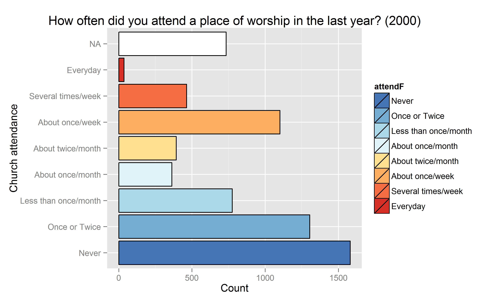
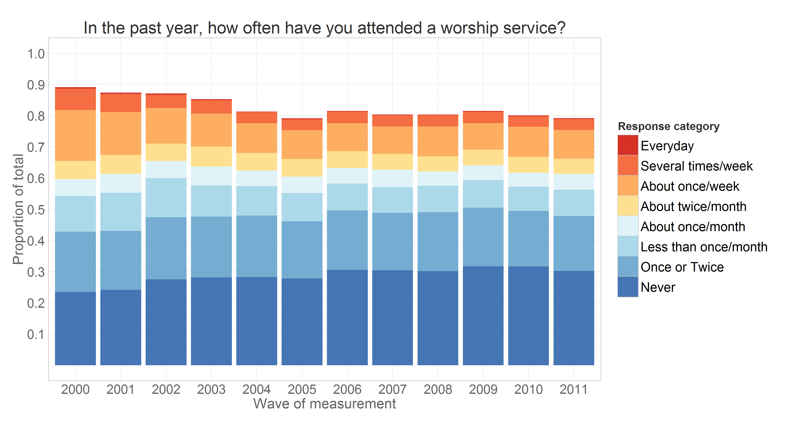
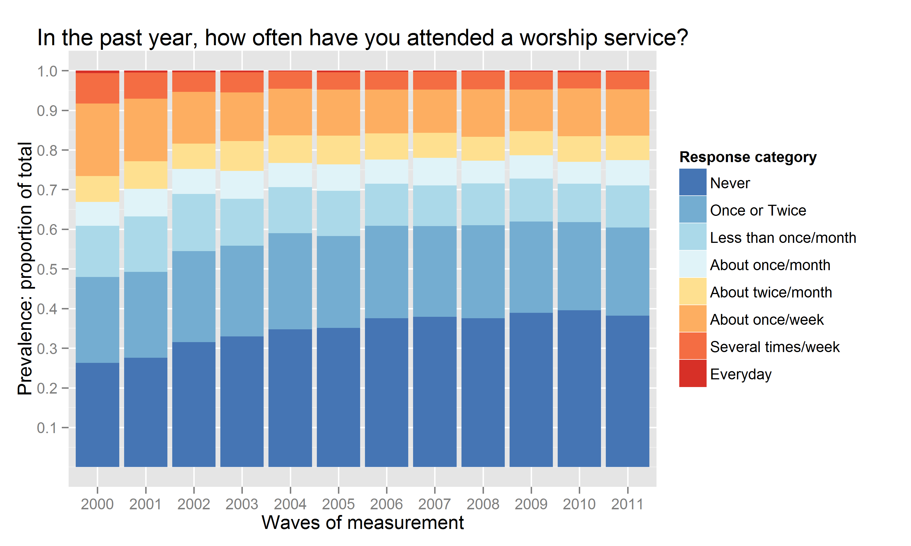
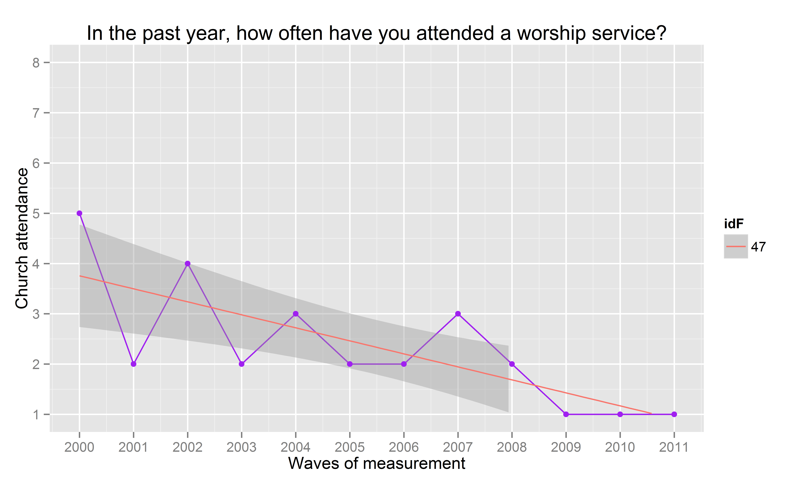
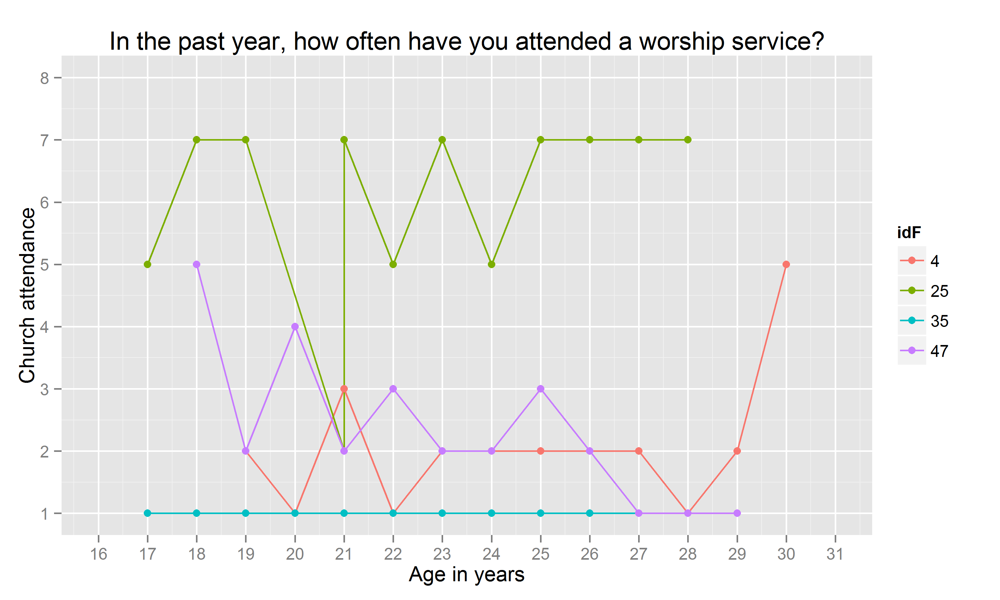
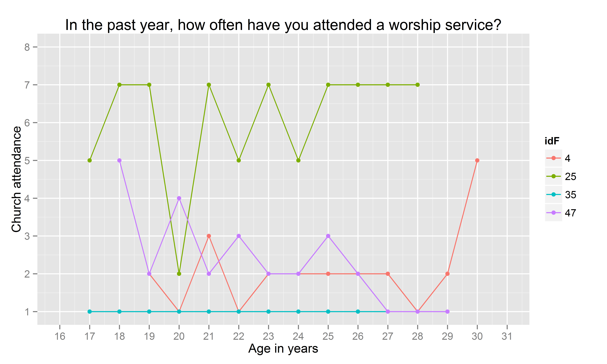

---
output:
  html_document:
    css: '\~/GitHub/Longitudinal\_Models\_of\_Religiosity\_NLSY97/www/css/thesis.css'
    fig_caption: True
    fig_height: '4.5'
    fig_width: '6.5'
    highlight: textmate
    keep_md: True
    number_sections: True
    theme: united
    toc: True
  md_document:
    toc: True
    variant: markdown
  pdf_document:
    fig_crop: False
    highlight: kate
    latex_engine: xelatex
    number_sections: True
    toc: True
    toc_depth: 3
title: Metrics
...

-   Metrics: labeling factors and exploring scales
    -   Data In
    -   Time metrics : Age, Period, Cohort
    -   Mapping Church Attendance

<!--  Set the working directory to the repository's base directory; this assumes the report is nested inside of only one directory.-->


Metrics: labeling factors and exploring scales
==============================================

Report explains how the response categories from NLSY97 questionnaire
are labeled and demonstrates application of labeled factors in data
operations and graphing.

Data In
-------

Initial point of departure - the
[databox](http://statcanvas.net/thesis/databox/) of the selected sample,
described in the
[Methods](http://statcanvas.net/thesis/III_methods/03_Methods.htm)
chapter.

This [databox](http://statcanvas.net/thesis/databox/) corresponds to the
dataset **dsL** produced by
[Derive\_dsL\_from\_Extract](https://github.com/andkov/Longitudinal_Models_of_Religiosity_NLSY97/blob/master/Data/Derive_dsL_from_Extract.md)
report.

``` {.r}
dsL<-readRDS("./Data/Derived/dsL.rds")
dsL<- dsL[dsL$sample==1,] # cross-sample only
```


Time metrics : Age, Period, Cohort
----------------------------------

NLSY97 sample includes individuals from five cohorts, born between 1980
and 1984.The following graphics shows how birth cohort, age of
respondents, and round of observation are related in NSLY97.


There are several indicators of age in NSLY97 that vary in precision.
Birth cohort (**byear**) is the most general one, it was recorded once.
Two age variables were recorded at each interview: age at the time of
the interview in months (**agemon**) and in years (**ageyear**). Those
are not derivatives of each other, but are are closely related. The
variable **ageyear** records the full number of years a respondent
reached at the time of the interview. Due to difficulties of
administering the survey, time intervals between the waves could differ.
For example, for one person **id** = 25 the age was recorded as 21 years
for both 2003 and 2004 (see **ageyear**). However, when you examine age
in months (**agemon**) you can see this rounding issue disappears once a
more precise scale is used. To avoid this potentially confusing
peculiarity, age in years will be calculated as (**age** = **year** -
**byear**) or as (**ageALT** = **agemon**/12).

``` {.r}
ds<-dsL[dsL$year %in% c(2000:2011),c('id',"byear","year","attend","ageyear","agemon")]
ds<- ds[ds$id %in% c(25),]
ds$age<-ds$year-ds$byear
ds$ageALT<- ds$agemon/12
print(ds)
```

        id byear year attend ageyear agemon age ageALT
    364 25  1983 2000      5      17    214  17  17.83
    365 25  1983 2001      7      18    226  18  18.83
    366 25  1983 2002      7      19    236  19  19.67
    367 25  1983 2003      2      21    254  20  21.17
    368 25  1983 2004      7      21    261  21  21.75
    369 25  1983 2005      5      22    272  22  22.67
    370 25  1983 2006      7      23    284  23  23.67
    371 25  1983 2007      5      24    295  24  24.58
    372 25  1983 2008      7      25    307  25  25.58
    373 25  1983 2009      7      26    319  26  26.58
    374 25  1983 2010      7      27    332  27  27.67
    375 25  1983 2011      7      28    342  28  28.50

* * * * *

Mapping Church Attendance
-------------------------

The focal variable of interest is **attend**, an item measuring church
attendance in the current year. The questionnaire recorded the responses
on the ordinal scale.\


Creating frequency distributions for each of the measurement wave we
have:\


Missing values are used in the calculation of total responses to show
the natural attrition in the study. Assumming that attrition is not
significantly associated with the outcome measure, we can remove missing
values from the calculation of the total of responses and look at
percentages that each response was endorsed at each time point.



Graphs above shows change in the cross-sectional distribution of
responses over the years. Modeling the change in these response
frequencies is handled well by Markov models. LCM, however, works with
longitudinal data, modeling the trajectory of each individual and
treating attendance as a continuous outcome.

To demonstrate mapping of individual trajectories to time, let's select
a dataset that would include personal identifyer (**id**), cohort
indicator (**byear**), wave of measurement (**year**) and the focal
variable of interest - worship attendance (**attend**).

``` {.r}
ds<-dsL[dsL$year %in% c(2000:2011),c('id',"byear","year","attend","attendF")] # select needed variables
print(ds[ds$id==47,])# for a single subject with id=47
```

        id byear year attend              attendF
    694 47  1982 2000      5    About twice/month
    695 47  1982 2001      2        Once or Twice
    696 47  1982 2002      4     About once/month
    697 47  1982 2003      2        Once or Twice
    698 47  1982 2004      3 Less than once/month
    699 47  1982 2005      2        Once or Twice
    700 47  1982 2006      2        Once or Twice
    701 47  1982 2007      3 Less than once/month
    702 47  1982 2008      2        Once or Twice
    703 47  1982 2009      1                Never
    704 47  1982 2010      1                Never
    705 47  1982 2011      1                Never

The view above lists attendance data for subjust with id = 47. Mapping
his attendance to time we have


where vertical dimension maps the outcome value and the horizontal maps
the time. There will be a trajecory for each of the

``` {.r}
cat(length(unique(dsL$id)))
```

    6748

subjects in total. Unless specified otherwise, only individuals from the
cross-sample will be used in the model to increase external validity.

``` {.r}
ds<- dsL[dsL$sample==1,]
```

Each of such trajectories imply a story, a life scenario. Why one person
grows in his religious involvement, while other declines, or never
develops an interest in the first place? To demostrate how
interpretations of trajectories can vary among individuals consider the
following scenario.

Attendance trajectories of subjects with **id**s 4, 25, 35, and 47 are
plotted in the next graph

    Warning: Removed 12 rows containing missing values (geom_path).
    Warning: Removed 12 rows containing missing values (geom_point).


The respondent **id**=35 reported attending no worship services in any
of the years, while respodent **id**=25 seemed to frequent it,
indicating weekly attendance in 8 out of the 12 years. Individual
**id**=47 started as a fairly regular attendee of religious services in
2000 (5= "about twice a month"), then gradually declined his involvement
to nill in 2009 and on. Respondent **id**=4, on the other hand started
off with a rather passive involvement, reporting attended church only
"Once or twice" in 2000, maintained a low level of participation
throughout the years, only to surge his attendance in 2011. Latent curve
models will describe intraindividual trajectories of change, while
summarizinig the interindividual similarities and trends.

Previous research in religiousity indicated that age might be one of the
primary factors explaining interindividual differences in church
attendance. To examine the role of age, we change the metric of time
from waves of measurement, as in the previous graph, to biological age.

    Warning: Removed 12 rows containing missing values (geom_path).
    Warning: Removed 12 rows containing missing values (geom_point).



Persons **id** = 35 and **id** = 25 are peers, in 2000 they were both
17. Respondent **id** = 47 is a year older, in 2000 he was 18. The
oldest is **id** = 4, who by the last round of measurement in 2011 is 30
years of age. Perhaps, his increased church attendance could be
explained by starting a family of his own?

Note that for person **id** = 25 the age was recorded as 21 years for
both 2003 and 2004. However, when you examine age in months (**agemon**)
you can see this is rounding issue that disappears once a more precise
scale is used. To avoid this potentially confusing peculiarity, age in
years will be either calculated as (**age** = **year** - **byear**) or
as (**ageALT** = **agemon**/12). See "Mime metrics" section of this
report for details.


