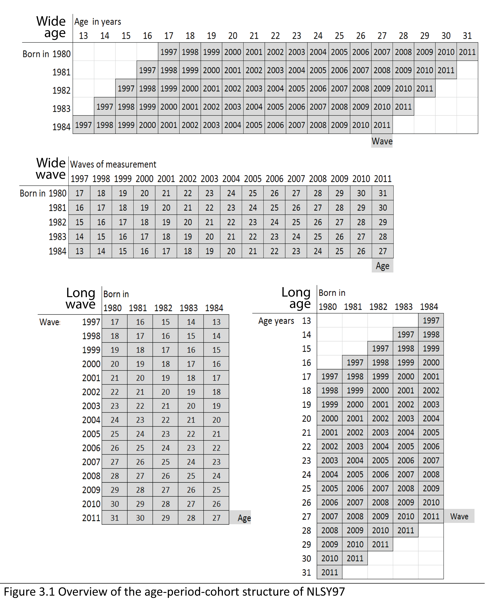

-   Metrics:labeling factors and exploring scales
    -   Data preliminaries
    -   Labeling Factor Levels
    -   Time metrics : Age, Period, Cohort

<!--  Set the working directory to the repository's base directory; this assumes the report is nested inside of only one directory.-->

Metrics:labeling factors and exploring scales
=============================================

Report explains how the response categories from NLSY97 questionnaire
are labeled and demonstrates application of labeled factors in data
operations and graphing.

Data preliminaries
------------------

Initial point of departure - the
[databox](http://statcanvas.net/thesis/databox/) of the selected
variables, described in the Methods chapter.  This
[databox](http://statcanvas.net/thesis/databox/) corresponds to the
dataset **dsL** produced by
[Derive\_dsL\_from\_Extract](https://github.com/andkov/Longitudinal_Models_of_Religiosity_NLSY97/blob/master/Data/Derive_dsL_from_Extract.md)
report, given in the Appendix.

    dsL<-readRDS("./Data/Derived/dsL.rds")

Labeling Factor Levels
----------------------

Review of the item reference
[cards](http://statcanvas.net/thesis/databox/) shows that initially, all
items were recorded on some discrete scale, either counting occasions or
assigning an intiger to a category of response. However, data were saved
as numerical values or intigers

    ds<- dsL[,1:(ncol(dsL)/2)]# selects the first half of variables
    str(ds)

    'data.frame':   134745 obs. of  30 variables:
     $ sample     : int  1 1 1 1 1 1 1 1 1 1 ...
     $ id         : int  1 1 1 1 1 1 1 1 1 1 ...
     $ sex        : int  2 2 2 2 2 2 2 2 2 2 ...
     $ race       : int  4 4 4 4 4 4 4 4 4 4 ...
     $ bmonth     : int  9 9 9 9 9 9 9 9 9 9 ...
     $ byear      : int  1981 1981 1981 1981 1981 1981 1981 1981 1981 1981 ...
     $ attendPR   : int  7 7 7 7 7 7 7 7 7 7 ...
     $ relprefPR  : int  21 21 21 21 21 21 21 21 21 21 ...
     $ relraisedPR: int  21 21 21 21 21 21 21 21 21 21 ...
     $ year       : int  1997 1998 1999 2000 2001 2002 2003 2004 2005 2006 ...
     $ agemon     : num  190 206 219 231 243 256 266 279 290 302 ...
     $ ageyear    : num  15 17 18 19 20 21 22 23 24 25 ...
     $ famrel     : num  NA NA NA NA NA NA NA NA NA NA ...
     $ attend     : num  NA NA NA 1 6 2 1 1 1 1 ...
     $ values     : num  NA NA NA NA NA 1 NA NA 0 NA ...
     $ todo       : num  NA NA NA NA NA 1 NA NA 1 NA ...
     $ obeyed     : num  NA NA NA NA NA 1 NA NA 0 NA ...
     $ pray       : num  NA NA NA NA NA 0 NA NA 0 NA ...
     $ decisions  : num  NA NA NA NA NA 1 NA NA 1 NA ...
     $ relpref    : num  NA NA NA NA NA NA NA NA 21 NA ...
     $ bornagain  : num  NA NA NA NA NA NA NA NA NA NA ...
     $ faith      : num  NA NA NA NA NA NA NA NA NA NA ...
     $ calm       : num  NA NA NA 3 NA 4 NA 4 NA 4 ...
     $ blue       : num  NA NA NA 3 NA 2 NA 1 NA 1 ...
     $ happy      : num  NA NA NA 3 NA 3 NA 4 NA 4 ...
     $ depressed  : num  NA NA NA 3 NA 2 NA 1 NA 1 ...
     $ nervous    : num  NA NA NA 3 NA 1 NA 1 NA 1 ...
     $ tv         : num  NA NA NA NA NA 2 NA NA NA NA ...
     $ computer   : num  NA NA NA NA NA 5 NA NA NA NA ...
     $ internet   : num  NA NA NA NA NA NA 1 0 1 1 ...

[LabelingFactorLevels.R](https://github.com/andkov/Longitudinal_Models_of_Religiosity_NLSY97/blob/master/Scripts/Data/LabelingFactorLevels.R)
sourced at the end of
[Derive\_dsL\_from\_Extract](https://github.com/andkov/Longitudinal_Models_of_Religiosity_NLSY97/blob/master/Data/Derive_dsL_from_Extract.md)
matches numeric values with response labels from the questionnaire and
adds to **dsL** copies of the variables, saved as labeled factors. For
estimations routines such as <code>lme4</code> or graphing functions
such as <code>ggplot</code>, the data type (string,numeric, factor) is a
meaningful input, so a quick access to both formats frequently proves
useful. It is convenient to think that **dsL** contains only

    ncol(dsL)/2

    [1] 30

variables, but each of them has a double, a labeled factor.

    str(dsL)

    'data.frame':   134745 obs. of  60 variables:
     $ sample      : int  1 1 1 1 1 1 1 1 1 1 ...
     $ id          : int  1 1 1 1 1 1 1 1 1 1 ...
     $ sex         : int  2 2 2 2 2 2 2 2 2 2 ...
     $ race        : int  4 4 4 4 4 4 4 4 4 4 ...
     $ bmonth      : int  9 9 9 9 9 9 9 9 9 9 ...
     $ byear       : int  1981 1981 1981 1981 1981 1981 1981 1981 1981 1981 ...
     $ attendPR    : int  7 7 7 7 7 7 7 7 7 7 ...
     $ relprefPR   : int  21 21 21 21 21 21 21 21 21 21 ...
     $ relraisedPR : int  21 21 21 21 21 21 21 21 21 21 ...
     $ year        : int  1997 1998 1999 2000 2001 2002 2003 2004 2005 2006 ...
     $ agemon      : num  190 206 219 231 243 256 266 279 290 302 ...
     $ ageyear     : num  15 17 18 19 20 21 22 23 24 25 ...
     $ famrel      : num  NA NA NA NA NA NA NA NA NA NA ...
     $ attend      : num  NA NA NA 1 6 2 1 1 1 1 ...
     $ values      : num  NA NA NA NA NA 1 NA NA 0 NA ...
     $ todo        : num  NA NA NA NA NA 1 NA NA 1 NA ...
     $ obeyed      : num  NA NA NA NA NA 1 NA NA 0 NA ...
     $ pray        : num  NA NA NA NA NA 0 NA NA 0 NA ...
     $ decisions   : num  NA NA NA NA NA 1 NA NA 1 NA ...
     $ relpref     : num  NA NA NA NA NA NA NA NA 21 NA ...
     $ bornagain   : num  NA NA NA NA NA NA NA NA NA NA ...
     $ faith       : num  NA NA NA NA NA NA NA NA NA NA ...
     $ calm        : num  NA NA NA 3 NA 4 NA 4 NA 4 ...
     $ blue        : num  NA NA NA 3 NA 2 NA 1 NA 1 ...
     $ happy       : num  NA NA NA 3 NA 3 NA 4 NA 4 ...
     $ depressed   : num  NA NA NA 3 NA 2 NA 1 NA 1 ...
     $ nervous     : num  NA NA NA 3 NA 1 NA 1 NA 1 ...
     $ tv          : num  NA NA NA NA NA 2 NA NA NA NA ...
     $ computer    : num  NA NA NA NA NA 5 NA NA NA NA ...
     $ internet    : num  NA NA NA NA NA NA 1 0 1 1 ...
     $ sampleF     : Ord.factor w/ 2 levels "Cross-Sectional"<..: 1 1 1 1 1 1 1 1 1 1 ...
     $ idF         : Factor w/ 8983 levels "1","2","3","4",..: 1 1 1 1 1 1 1 1 1 1 ...
     $ sexF        : Ord.factor w/ 3 levels "Male"<"Female"<..: 2 2 2 2 2 2 2 2 2 2 ...
     $ raceF       : Ord.factor w/ 4 levels "Black"<"Hispanic"<..: 4 4 4 4 4 4 4 4 4 4 ...
     $ bmonthF     : Ord.factor w/ 12 levels "Jan"<"Feb"<"Mar"<..: 9 9 9 9 9 9 9 9 9 9 ...
     $ byearF      : Factor w/ 5 levels "1980","1981",..: 2 2 2 2 2 2 2 2 2 2 ...
     $ attendPRF   : Ord.factor w/ 8 levels "Never"<"Once or Twice"<..: 7 7 7 7 7 7 7 7 7 7 ...
     $ relprefPRF  : Ord.factor w/ 33 levels "Catholic"<"Baptist"<..: 21 21 21 21 21 21 21 21 21 21 ...
     $ relraisedPRF: Ord.factor w/ 33 levels "Catholic"<"Baptist"<..: 21 21 21 21 21 21 21 21 21 21 ...
     $ yearF       : Factor w/ 15 levels "1997","1998",..: 1 2 3 4 5 6 7 8 9 10 ...
     $ agemonF     : Factor w/ 244 levels "146","147","148",..: 45 61 74 86 98 111 121 134 145 157 ...
     $ ageyearF    : Factor w/ 21 levels "12","13","14",..: 4 6 7 8 9 10 11 12 13 14 ...
     $ famrelF     : Factor w/ 8 levels "0","1","2","3",..: NA NA NA NA NA NA NA NA NA NA ...
     $ attendF     : Ord.factor w/ 8 levels "Never"<"Once or Twice"<..: NA NA NA 1 6 2 1 1 1 1 ...
     $ valuesF     : Ord.factor w/ 2 levels "FALSE/less Religious"<..: NA NA NA NA NA 2 NA NA 1 NA ...
     $ todoF       : Ord.factor w/ 2 levels "FALSE/less Religious"<..: NA NA NA NA NA 2 NA NA 2 NA ...
     $ obeyedF     : Ord.factor w/ 2 levels "FALSE/less Religious"<..: NA NA NA NA NA 2 NA NA 1 NA ...
     $ prayF       : Ord.factor w/ 2 levels "FALSE/less Religious"<..: NA NA NA NA NA 1 NA NA 1 NA ...
     $ decisionsF  : Ord.factor w/ 2 levels "FALSE/less Religious"<..: NA NA NA NA NA 2 NA NA 2 NA ...
     $ relprefF    : Ord.factor w/ 33 levels "Catholic"<"Baptist"<..: NA NA NA NA NA NA NA NA 21 NA ...
     $ bornagainF  : Ord.factor w/ 2 levels "NO"<"YES": NA NA NA NA NA NA NA NA NA NA ...
     $ faithF      : Ord.factor w/ 5 levels "Exrtemely"<"Very"<..: NA NA NA NA NA NA NA NA NA NA ...
     $ calmF       : Ord.factor w/ 4 levels "All of the time"<..: NA NA NA NA NA NA NA NA NA NA ...
     $ blueF       : Ord.factor w/ 4 levels "All of the time"<..: NA NA NA NA NA NA NA NA NA NA ...
     $ happyF      : Ord.factor w/ 4 levels "All of the time"<..: NA NA NA NA NA NA NA NA NA NA ...
     $ depressedF  : Ord.factor w/ 4 levels "All of the time"<..: NA NA NA NA NA NA NA NA NA NA ...
     $ nervousF    : Ord.factor w/ 4 levels "All of the time"<..: NA NA NA NA NA NA NA NA NA NA ...
     $ tvF         : Ord.factor w/ 6 levels "less than 2"<..: NA NA NA NA NA 2 NA NA NA NA ...
     $ computerF   : Ord.factor w/ 6 levels "None"<"less than 1"<..: NA NA NA NA NA 5 NA NA NA NA ...
     $ internetF   : Ord.factor w/ 2 levels "No"<"Yes": NA NA NA NA NA NA 2 1 2 2 ...

This give a certain flexibity to assemble needed dataset quickly and
have access to factor labels. One can alternate between the raw metric
and labeled factor by adding "F" suffix to the end of the variable name:

    selectCols<-c("year","id","byear","attend","attendF") # select the columns with these names
    ds<-dsL[,selectCols] # select all rows for the columns listed  selectCols
    print(ds[ds$id==1,]) # print all availible data for respondent with ID 1

       year id byear attend         attendF
    1  1997  1  1981     NA            <NA>
    2  1998  1  1981     NA            <NA>
    3  1999  1  1981     NA            <NA>
    4  2000  1  1981      1           Never
    5  2001  1  1981      6 About once/week
    6  2002  1  1981      2   Once or Twice
    7  2003  1  1981      1           Never
    8  2004  1  1981      1           Never
    9  2005  1  1981      1           Never
    10 2006  1  1981      1           Never
    11 2007  1  1981      1           Never
    12 2008  1  1981      1           Never
    13 2009  1  1981      1           Never
    14 2010  1  1981      1           Never
    15 2011  1  1981      1           Never

Having quick access to factor labels will be especially useful during
graph production. For the grammer rules of operations with relevant data
see [Data Manipulation
Guide](https://github.com/andkov/Longitudinal_Models_of_Religiosity_NLSY97/blob/master/Vignettes/dplyr/Data_Manipulation_Guide.md).

Time metrics : Age, Period, Cohort
----------------------------------

NLSY97 sample includes individuals from five cohorts, born between 1980
and 1984.The following graphics shows how birth cohort, age of
respondents, and round of observation are related in NSLY97.  

NSLY97 contains static and dynamic indicators of age. Variables byear
and bmonth were recorded once in 1997 (static) and contain
respondents’ birth year and birth month respectively. Two age
variables were recorded continuously at each interview (dynamic): age at
the time of the interview in months (agemon) and in years (ageyear).

    ds<- dsL %>% dplyr::filter(id==25, year %in% c(1997:2011)) %>% dplyr::select(id,bmonthF,byear,year, agemon,ageyear) %>%
      mutate (age = (year-byear+1), ageD = agemon/12)
    print(ds)

       id bmonthF byear year agemon ageyear age  ageD
    1  25     Mar  1983 1997    167      13  15 13.92
    2  25     Mar  1983 1998    188      15  16 15.67
    3  25     Mar  1983 1999    201      16  17 16.75
    4  25     Mar  1983 2000    214      17  18 17.83
    5  25     Mar  1983 2001    226      18  19 18.83
    6  25     Mar  1983 2002    236      19  20 19.67
    7  25     Mar  1983 2003    254      21  21 21.17
    8  25     Mar  1983 2004    261      21  22 21.75
    9  25     Mar  1983 2005    272      22  23 22.67
    10 25     Mar  1983 2006    284      23  24 23.67
    11 25     Mar  1983 2007    295      24  25 24.58
    12 25     Mar  1983 2008    307      25  26 25.58
    13 25     Mar  1983 2009    319      26  27 26.58
    14 25     Mar  1983 2010    332      27  28 27.67
    15 25     Mar  1983 2011    342      28  29 28.50

The variable ageyear records the full number of years a respondent
reached at the time of the interview. Due to difficulties of
administering the survey, time intervals between the waves could differ.
For example, for one person id = 25 the age was recorded as 21 years for
both 2003 and 2004 (see ageyear). However, when you examine age in
months (agemon) you can see this rounding issue disappears, once a more
precise scale is used. To avoid this potentially confusing peculiarity,
age in years will be calculated as age = year – byear +1 or as (ageD =
agemon/12). The suffix D in ageD refers to the fact that it was
calculated from a dynamic age indicator.

=== Read more in <code>./Models/Descriptives</code>:  
+
[Metrics](https://github.com/andkov/Longitudinal_Models_of_Religiosity_NLSY97/blob/master/Models/Descriptives/Metrics.md)
- how values of items are labeled +
[Descriptives](https://github.com/andkov/Longitudinal_Models_of_Religiosity_NLSY97/blob/master/Models/Descriptives/Descriptives.md)
- basic stats of various items  
+ [Attendance](attend) - focus on church attendence over time  
+
[Databox](https://github.com/andkov/Longitudinal_Models_of_Religiosity_NLSY97/blob/master/Models/Descriptives/Databox.md)
