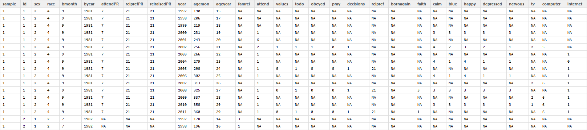

Latent Curve Modeling
=================================================
This report analyzes a sequence of multilevel curve models of church attendance in the NLSY97 religiosity data as defined by the extract NLSY97_Religiosity_20042014.  


<!--  Set the working directory to the repository's base directory; this assumes the report is nested inside of only one directory.-->


<!-- Set the report-wide options, and point to the external code file. -->


### Data preparation
We start with the dataset dsL, the preparation of which is surveyed in Chapter 2 and detailed in the [Appendix](https://github.com/andkov/Longitudinal_Models_of_Religiosity_NLSY97/blob/master/Data/Derive_dsL_from_Extract.md).

### Figure 1 : View of the initial **dsL** dataset
  

The focal variable of interest is **attend**, an item measuring church attendance in the current year. Although it was recorded at the ordinal scale

```r
p<-ggplot(subset(ds,year==2000), aes(x=attend))
```

```
Error: object 'ds' not found
```

```r
p<-p+geom_bar()
```

```
Error: object 'p' not found
```

```r
p<-p+coord_flip()
```

```
Error: object 'p' not found
```

```r
p<-p+xlab("Church attendance") 
```

```
Error: object 'p' not found
```

```r
p<-p+ylab("Count")
```

```
Error: object 'p' not found
```

```r
# p<-p+scale_color_manual(values=attcol8,breaks = attlevels)
p
```

```
Error: object 'p' not found
```

its precision allows us to treat it as continuous for the purpose of fitting statistical models. 


