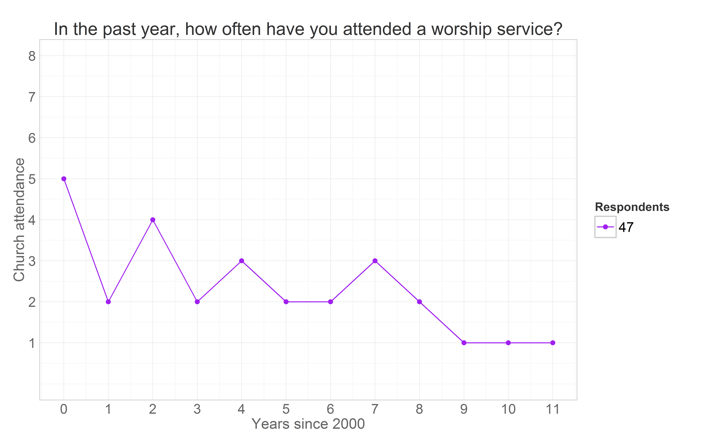

<!--  Set the working directory to the repository's base directory; this assumes the report is nested inside of only one directory.-->


<!-- Set the report-wide options, and point to the external code file. -->


Latent Curve Modeling 
=================================================
This report analyzes a sequence of multilevel latent curve models of church attendance in NLSY97.

### Data

The variables selected for current analyses from NLSY97 database are represented in Fig 3.2

 

This databox slice corresponds to the dataset **dsL**.

  
 
The preparation of this dataset is surveyed [here](https://github.com/andkov/Longitudinal_Models_of_Religiosity_NLSY97/tree/master/Data) and detailed in the [Reproducibility Instructions](https://github.com/andkov/Longitudinal_Models_of_Religiosity_NLSY97/blob/master/Data/Derive_dsL_from_Extract.md).

Basic LCM relies on four variables from **dsL**: identifyer (**id**), birth year which is also used as cohort indicator (**byear**), wave of measurement (**year**) and the variable of interest - worship attendance (**attend**). This is how the data look for one respondent 

```
   id byear year attend
1   1  1981 1997     NA
2   1  1981 1998     NA
3   1  1981 1999     NA
4   1  1981 2000      1
5   1  1981 2001      6
6   1  1981 2002      2
7   1  1981 2003      1
8   1  1981 2004      1
9   1  1981 2005      1
10  1  1981 2006      1
11  1  1981 2007      1
12  1  1981 2008      1
13  1  1981 2009      1
14  1  1981 2010      1
15  1  1981 2011      1
```

The total number of respondents in the current data set is

```
8984
```


The focal variable of interest is **attend**, an item measuring church attendance in the current year. Although it was recorded on an ordinal scale, 


the integers used to record the response (1 through 8) are treated as measurements on the continuous scale when fit in these statistical models. The interpretations of the estimates, therefore, should be done in the context of this scale.


Service variables computed  and time effects are added, encoded as  weights of the Lambda matrix

```
   id byear year attend timec age linear quadratic cubic
4   1  1981 2000      1     0  19      0         0     0
5   1  1981 2001      6     1  20      1         1     1
6   1  1981 2002      2     2  21      2         4     8
7   1  1981 2003      1     3  22      3         9    27
8   1  1981 2004      1     4  23      4        16    64
9   1  1981 2005      1     5  24      5        25   125
10  1  1981 2006      1     6  25      6        36   216
11  1  1981 2007      1     7  26      7        49   343
12  1  1981 2008      1     8  27      8        64   512
13  1  1981 2009      1     9  28      9        81   729
14  1  1981 2010      1    10  29     10       100  1000
15  1  1981 2011      1    11  30     11       121  1331
```


We have data on attendance for 12 years, from 2000 to 2011. Figure 2 gives a cross-sectional frequency distribution of the data across the years.
#### Figure 2. Relative frequency of responses for each observed wave


However, LCM works with longitudinal data, modeling the trajectory of each individual. The trajectories of subjects with **id**s of 4, 25, 35, and 47 are plotted in the next graph


The respondent  **id**=35 reported attending no worship services in any of the years, while respodent **id**=25 seemed to frequent it, indicating weekly attendance in 8 out of the 12 years. Individual **id**=47 started as a fairly regular attendee of religious services in 2000 (5= "about twice a month"), then gradually declined his involvement to nill in 2009 and on. Respondent **id**=4, on the other hand started off with a rather passive involvement, reporting  attended church only "Once or twice"  in 2000,  maintained a low level of participation throughout the years, only to surge his attendance in 2011. Each of these trajectories imply a story, a life scenario. Why one person grows in his religious involvement, while other declines, or never develops an interest in the first place? Latent curve models will describe intraindividual trajectories of change, while summarizinig the interindividual similarities and trends.  

Previous research in religiousity indicated that age might be one of the primary factors explaining interindividual differences in church attendance. To examine the role of age, we change the metric of time from waves of measurement, as in the previous graph, to biological age.


Persons **id**=35 and **id**=25 are peers, in 2000 they were both 17.  Respondent **id**=47 is a year older, in 2000 he was 18. The oldest is **id**=4, who by the last round of measurement in 2011 is 30 years of age. Perhaps, his increased church attendance could be explained by starting a family of his own?


```r
source("./Manipulation/produceMDandHTML.R")
```


