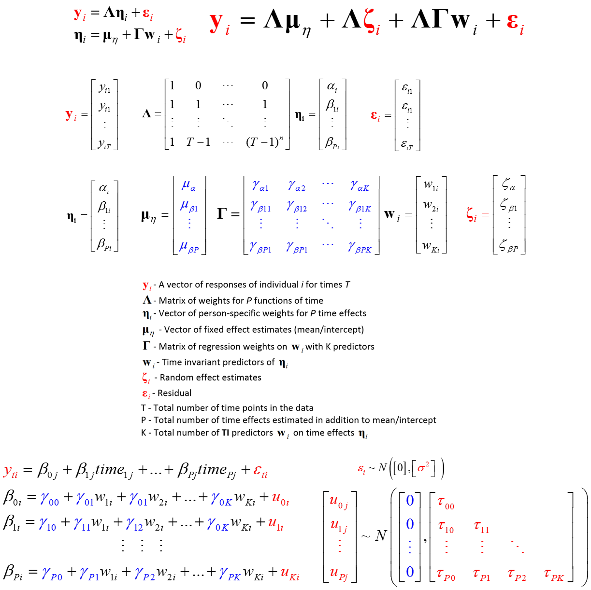

Latent Curve Models
========================================================

The LCM models used here are of the form
  

* Bollen, K. A. & Curran, P. J. (2006). Latent curve models: A structural equation perspective (Vol. 467). Wiley.
* Snijders, T. A. B., & Bosker, R. J. (2012). Multilevel analysis: An introduction to basic and advanced multilevel modeling (2 ed.). London: SAGE.