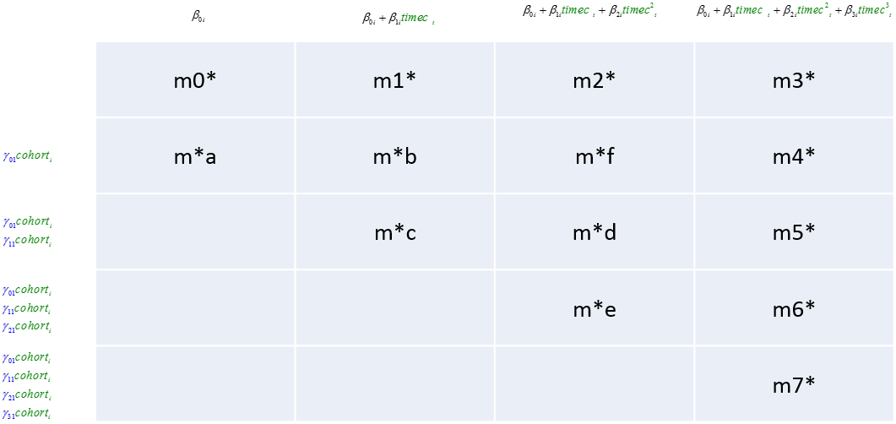
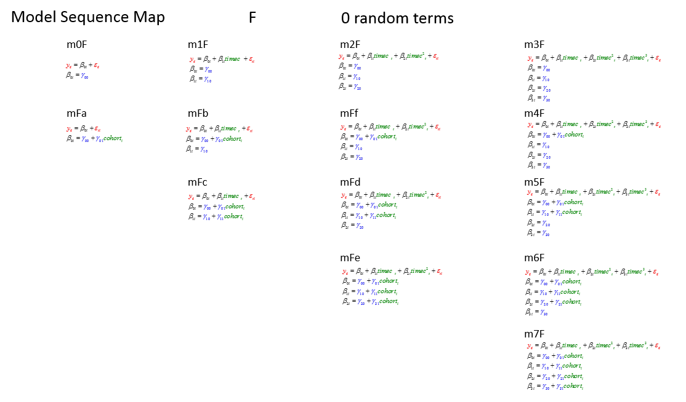
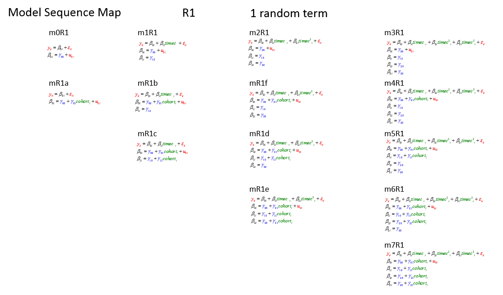
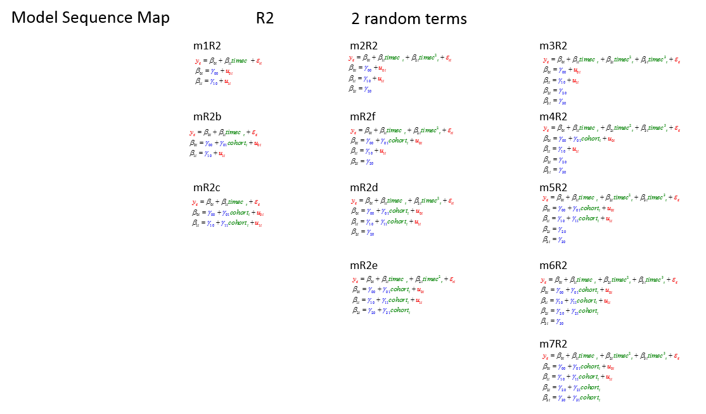
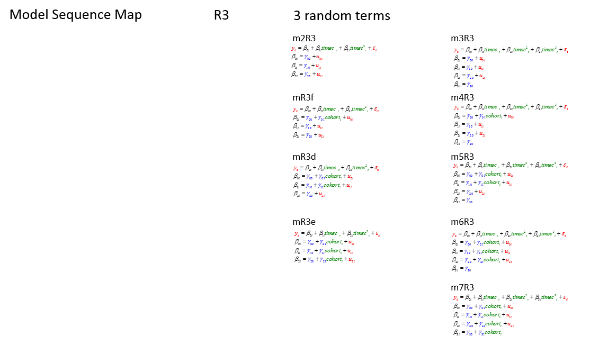
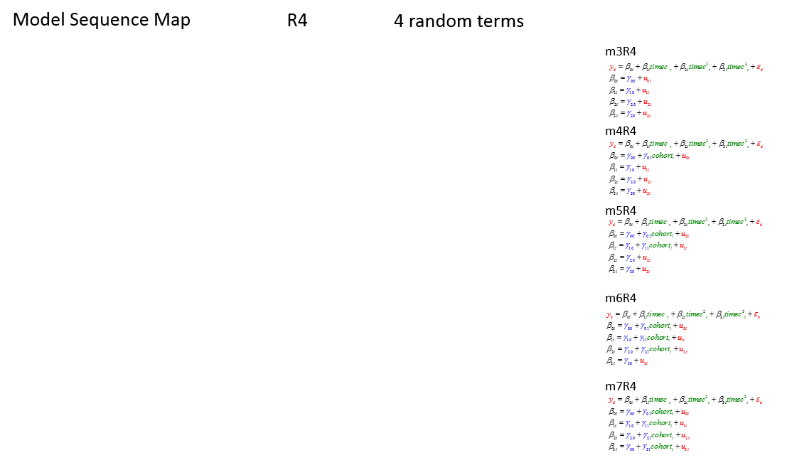

<!--  Set the working directory to the repository's base directory; this assumes the report is nested inside of only one directory.-->
```{r, echo=F, message=F} 
require(knitr)
opts_knit$set(root.dir='../../../')  #Don't combine this call with any other chunk -especially one that uses file paths.

```

```{r set_options, echo=F, message=F}
require(knitr)
# getwd()
opts_chunk$set(
  results='show', 
  message = TRUE,
  comment = NA, 
  tidy = FALSE,
  fig.height = 7, 
  fig.width = 10, 
#   out.width = NULL,
  fig.path = 'figureRmd/',     
  warning = FALSE,
  dev = "png"
  #, dpi = 300
)
echoChunks <- FALSE
warningChunks<- FALSE
options(width=120) #So the output is 50% wider than the default.
read_chunk("./Models/LCM/fit/customFit.R") # the file to which knitr calls for the chunks
```

```{r LoadPackages, echo=echoChunks, message=F}
```

```{r LoadSources, echo=echoChunks, message=F}
```

```{r DeclareGlobals, echo=echoChunks, message=FALSE}
```

```{r LoadData, echo=echoChunks, message=T}
# select only respondence in the cross-sectional sample
```

```{r loadRDS, echo=echoChunks}
# string definitions should be copied from "LCModels.R" file
  mF<-   c("m0F",  "m1F",  "m2F",  "m3F",  "m4F",    "m5F",    "m6F",    "m7F")
  mFi<-  c("mFa",  "mFb",  "mFc",  "mFf",  "mFd",    "mFe")
  mR1<-  c("m0R1", "m1R1", "m2R1", "m3R1", "m4R1",   "m5R1",   "m6R1",   "m7R1") 
  mR1i<- c("mR1a", "mR1b", "mR1c", "mR1f", "mR1d",   "mR1e") 
  mR2<-  c("m1R2", "m2R2", "m3R2", "m4R2", "m5R2",   "m6R2",   "m7R2")
  mR2i<- c("mR2b", "mR2c", "mR2f", "mR2d", "mR2e")
  mR3<-  c("m2R3", "m3R3", "m4R3", "m5R3", "m6R3",   "m7R3")              
  mR3i<- c("mR3f", "mR3d", "mR3e")
  mR4<-  c("m3R4", "m4R4", "m5R4", "m6R4", "m7R4")   
#  Composite lists of models
  mOrder1 <- c(mF, mFi, mR1, mR1i, mR2, mR2i, mR3, mR3i, mR4)
  FF <- c(mF, mFi)
  R1 <- c(mR1, mR1i)
  R2 <- c(mR2, mR2i)
  R3 <- c(mR3, mR3i)
  R4 <- mR4

  F_row <- c("m0F", "m1F", "m2F", "m3F", 
             "mFa", "mFb", "mFf", "m4F", 
                    "mFc", "mFd", "m5F", 
                           "mFe", "m6F", 
                                  "m7F")
  F_col <- c("m0F", "mFa", 
             "m1F", "mFb", "mFc", 
             "m2F", "mFf", "mFd", "mFe", 
             "m3F", "m4F", "m5F", "m6F", "m7F")

  R1_row <- c("m0R1", "m1R1", "m2R1", "m3R1", 
              "mR1a", "mR1b", "mR1f", "m4R1", 
                      "mR1c", "mR1d", "m5R1", 
                              "mR1e", "m6R1", 
                                      "m7R1")
  R1_col <- c("m0R1", "mR1a", 
              "m1R1", "mR1b",  "mR1c", 
              "m2R1", "mR1f",  "mR1d", "mR1e", 
              "m3R1", "m4R1",  "m5R1", "m6R1", "m7R1")

  R2_row <- c(        "m1R2", "m2R2", "m3R2", 
                      "mR2b", "mR2f", "m4R2", 
                      "mR2c", "mR2d", "m5R2", 
                              "mR2e", "m6R2", 
                                      "m7R2")
  R2_col <- c( 
              "m1R2", "mR2b",  "mR2c", 
              "m2R2", "mR2f",  "mR2d", "mR2e", 
              "m3R2", "m4R2",  "m5R2", "m6R2", "m7R2")
              
  R3_row <- c(                "m2R3", "m3R3", 
                              "mR3f", "m4R3", 
                              "mR3d", "m5R3", 
                              "mR3e", "m6R3", 
                                      "m7R3")
  R3_col <- c( 
              
              "m2R3", "mR3f",  "mR3d", "mR3e", 
              "m3R3", "m4R3",  "m5R3", "m6R3", "m7R3")

  R4_row <- c(                        "m3R4", 
                                      "m4R4", 
                                      "m5R4", 
                                      "m6R4", 
                                      "m7R4")
  R4_col <- c( 
              
              
              "m3R4", "m4R4",  "m5R4", "m6R4", "m7R4")

```


# All models 

```{r allModels, echo=echoChunks, results="hide"}
out<-c(
#         mF,  mFi,
#         mR1,  mR1i,
#         mR2,  mR2i,
#         mR3,  mR3i,
#         mR4
)
excludeModels <- c(out)  
axisModels  <-mOrder1
source("./Models/LCM/fit/fitGraph.R")
g
```

There are total of 54 distinct models, which can be organized into 4 groups:  

+ models with fixed effects only
+ models with 1 random term
+ models with 2 random terms
+ models with 3 random temrs

The following layout helps understand how each of the models was constructed. The columns count the number of terms  on the first level, the rows shows what predictors are added to the second level. Replace the stars in the name of the model with **F** for models with only the fixed effects  and **R1**, **R2**, **R3**, and **R4**  for models with the corresponding number of random terms in the second level. 




# Models w/ fixed only


## F by row
```{r F_row, echo=echoChunks, results="hide"}
out<-c(
#         mF,  mFi,
        mR1,  mR1i,
        mR2,  mR2i,
        mR3,  mR3i,
        mR4
)
excludeModels <- c(out)  
axisModels  <-F_row
source("./Models/LCM/fit/fitGraph.R")
g
```

## F by column
```{r F_col, echo=echoChunks, results="hide" }
out<-c(
#         mF,  mFi,
        mR1,  mR1i,
        mR2,  mR2i,
        mR3,  mR3i,
        mR4
)
excludeModels <- c(out)  
axisModels  <- F_col
source("./Models/LCM/fit/fitGraph.R")
g
```

# Models w/ 1 random


## R1 by row
```{r R1_row, echo=echoChunks, results="hide"}
out<-c(
        mF,  mFi,
#         mR1,  mR1i,
        mR2,  mR2i,
        mR3,  mR3i,
        mR4
)
excludeModels <- c(out)  
axisModels  <-R1_row
source("./Models/LCM/fit/fitGraph.R")
g
```

## R1 by column
```{r R1_col, echo=echoChunks, results="hide"}
out<-c(
        mF,  mFi,
#         mR1,  mR1i,
        mR2,  mR2i,
        mR3,  mR3i,
        mR4
)
excludeModels <- c(out)  
axisModels  <-R1_col
source("./Models/LCM/fit/fitGraph.R")
g
```

# Models w/ 2 random


## R2 by row
```{r R2_row, echo=echoChunks, results="hide"}
out<-c(
        mF,  mFi,
        mR1,  mR1i,
#         mR2,  mR2i,
        mR3,  mR3i,
        mR4
)
excludeModels <- c(out)  
axisModels  <-R2_row
source("./Models/LCM/fit/fitGraph.R")
g
```

## R2 by column
```{r R2_col, echo=echoChunks, results="hide"}
out<-c(
        mF,  mFi,
        mR1,  mR1i,
#         mR2,  mR2i,
        mR3,  mR3i,
        mR4
)
excludeModels <- c(out)  
axisModels  <-R2_col
source("./Models/LCM/fit/fitGraph.R")
g
```


# Models w/ 3 random


## R3 by row
```{r R3_row, echo=echoChunks, results="hide"}
out<-c(
        mF,  mFi,
        mR1,  mR1i,
        mR2,  mR2i,
#         mR3,  mR3i,
        mR4
)
excludeModels <- c(out)  
axisModels  <-R3_row
source("./Models/LCM/fit/fitGraph.R")
g
```

## R3 by column
```{r R3_col, echo=echoChunks, results="hide"}
out<-c(
        mF,  mFi,
        mR1,  mR1i,
        mR2,  mR2i,
#         mR3,  mR3i,
        mR4
)
excludeModels <- c(out)  
axisModels  <-R3_col
source("./Models/LCM/fit/fitGraph.R")
g
```


# Models w/ 4 random


## R4 by row
```{r R4_row, echo=echoChunks, results="hide"}
out<-c(
        mF,  mFi,
        mR1,  mR1i,
        mR2,  mR2i,
        mR3,  mR3i
#         mR4
)
excludeModels <- c(out)  
axisModels  <-R4
source("./Models/LCM/fit/fitGraph.R")
g
```


# General form
