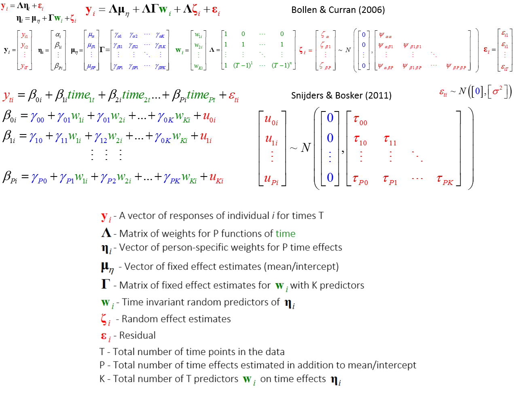

<!--  Set the working directory to the repository's base directory; this assumes the report is nested inside of only one directory.-->
```{r, echo=F, message=F} 
require(knitr)
opts_knit$set(root.dir='../../')  #Don't combine this call with any other chunk -especially one that uses file paths.

```

```{r set_options, echo=F, message=F}
require(knitr)
# getwd()
opts_chunk$set(
  results='show', 
  message = TRUE,
  comment = NA, 
  tidy = FALSE,
  fig.height = 12, 
  fig.width = 14, 
#   out.width = NULL,
  fig.path = 'sequence/',     
  warning = FALSE,
  dev = "png"
  #, dpi = 300
)
echoChunks <- FALSE
warningChunks<- FALSE
options(width=120) #So the output is 50% wider than the default.
read_chunk("./Models/LCM/sequenceLCM.R") # the file to which knitr calls for the chunks
```

```{r LoadPackages, echo=echoChunks, message=F}
```

```{r LoadSources, echo=echoChunks, message=F}
```

```{r DeclareGlobals, echo=echoChunks, message=FALSE}
```

```{r LoadData, echo=echoChunks, message=T}
# select only respondence in the cross-sectional sample
```

The data for the models was derived for the initial dataset **dsL**:  
```{r echo=TRUE, eval=FALSE,}
numID<- 9022 # highest id value (max = 9022)
### Define the data that will populate the model
ds<- dsL %>%  # chose conditions to apply in creating dataset for modeling
  dplyr::filter(id < numID) %.% # 1:9022
  dplyr::filter(year %in% c(2000:2011)) %.% # 1997:2011
  dplyr::filter(sample %in% c(1)) %.% # 0-Oversample; 1-Cross-Sectional
  dplyr::filter(race %in% c(4)) %.% # 1-Black; 2-Hispanis; 3-Mixed; 4-White
  dplyr::filter(byear %in% c(1980:1984)) %.% # birth year 1980:1984
  dplyr::filter(ave(!is.na(attend), id, FUN = all)) %.% # only complete trajectories
  dplyr::mutate( # compute new variables
    age= year-byear, # definition of age to be used in the model    
    timec=year-2000, # metric of time is rounds of NSLY97 in years, centered at 2000
    timec2= timec^2, 
    timec3= timec^3,
    #         timec= age-16, # metric of time is bilogical age in years, centered at 16
    #         timec2= timec^2,
    #         timec3= timec^3,# 
    cohort=byear-1980) %.% # age difference, years younger (unit - 1 cohort away)
  dplyr::select( # assemble the dataset for modeling
    id, sample, race, byear,cohort, # Time Invariant variables
    year,
    age, timec,timec2,timec3, attend)  # Time Variant variables
```


## m0F -- Fixed only
```{r m0F, echo=echoChunks}
```

## m1F 
```{r m1F, echo=echoChunks}
```

## m2F 
```{r m2F, echo=echoChunks}
```

## m3F 
```{r m3F, echo=echoChunks}
```

## m4F 
```{r m4F, echo=echoChunks}
```

## m5F 
```{r m5F, echo=echoChunks}
```

## m6F 
```{r m6F, echo=echoChunks}
```

## m7F 
```{r m7F, echo=echoChunks}
```

## mFa --  
```{r mFa, echo=echoChunks}
```

## mFb 
```{r mFb, echo=echoChunks}
```

## mFc 
```{r mFc, echo=echoChunks}
```

## mFf 
```{r mFf, echo=echoChunks}
```

## mFd 
```{r mFd, echo=echoChunks}
```

## mFe 
```{r mFe, echo=echoChunks}
```

## m1R1 -- 1 Random
```{r m1R1, echo=echoChunks}
```

## m2R1 
```{r m2R1, echo=echoChunks}
```

## m3R1 
```{r m3R1, echo=echoChunks}
```

## m4R1 
```{r m4R1, echo=echoChunks}
```

## m5R1 
```{r m5R1, echo=echoChunks}
```

## m6R1 
```{r m6R1, echo=echoChunks}
```

## m7R1 
```{r m7R1, echo=echoChunks}
```

## mR1a -- 
```{r mR1a, echo=echoChunks}
```

## mR1b 
```{r mR1b, echo=echoChunks}
```

## mR1c 
```{r mR1c, echo=echoChunks}
```

## mR1f 
```{r mR1f, echo=echoChunks}
```

## mR1d 
```{r mR1d, echo=echoChunks}
```

## mR1e 
```{r mR1e, echo=echoChunks}
```

## m1R2  -- 2 Random
```{r m1R2, echo=echoChunks}
```

## m2R2 
```{r m2R2, echo=echoChunks}
```

## m3R2 
```{r m3R2, echo=echoChunks}
```

## m4R2 
```{r m4R2, echo=echoChunks}
```

## m5R2 
```{r m5R2, echo=echoChunks}
```

## m6R2 
```{r m6R2, echo=echoChunks}
```

## m7R2 
```{r m7R2, echo=echoChunks}
```

## mR2b --
```{r mR2b, echo=echoChunks}
```

## mR2c 
```{r mR2c, echo=echoChunks}
```

## mR2f 
```{r mR2f, echo=echoChunks}
```

## mR2d 
```{r mR2d, echo=echoChunks}
```

## mR2e 
```{r mR2e, echo=echoChunks}
```

## m2R3  -- 3 Random
```{r m2R3, echo=echoChunks}
```

## m3R3 
```{r m3R3, echo=echoChunks}
```

## m4R3 
```{r m4R3, echo=echoChunks}
```

## m5R3 
```{r m5R3, echo=echoChunks}
```

## m6R3 
```{r m6R3, echo=echoChunks}
```

## m7R3 
```{r m7R3, echo=echoChunks}
```

## mR3f --
```{r mR3f, echo=echoChunks}
```

## mR3d 
```{r mR3d, echo=echoChunks}
```

## mR3e 
```{r mR3e, echo=echoChunks}
```

## m3R4  -- 4 Random
```{r m3R4, echo=echoChunks}
```

## m4R4 
```{r m4R4, echo=echoChunks}
```

## m5R4 
```{r m5R4, echo=echoChunks}
```

## m6R4 
```{r m6R4, echo=echoChunks}
```

## m7R4 
```{r m7R4, echo=echoChunks}
```

# Model specification  
General case of LCM and model sequence are defined as:    

