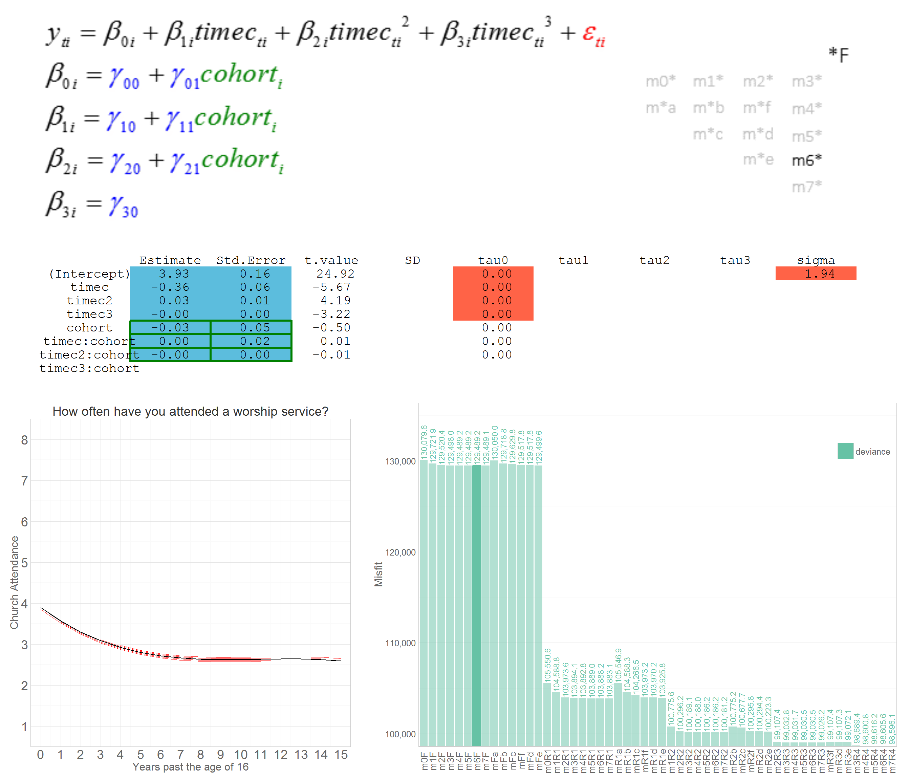
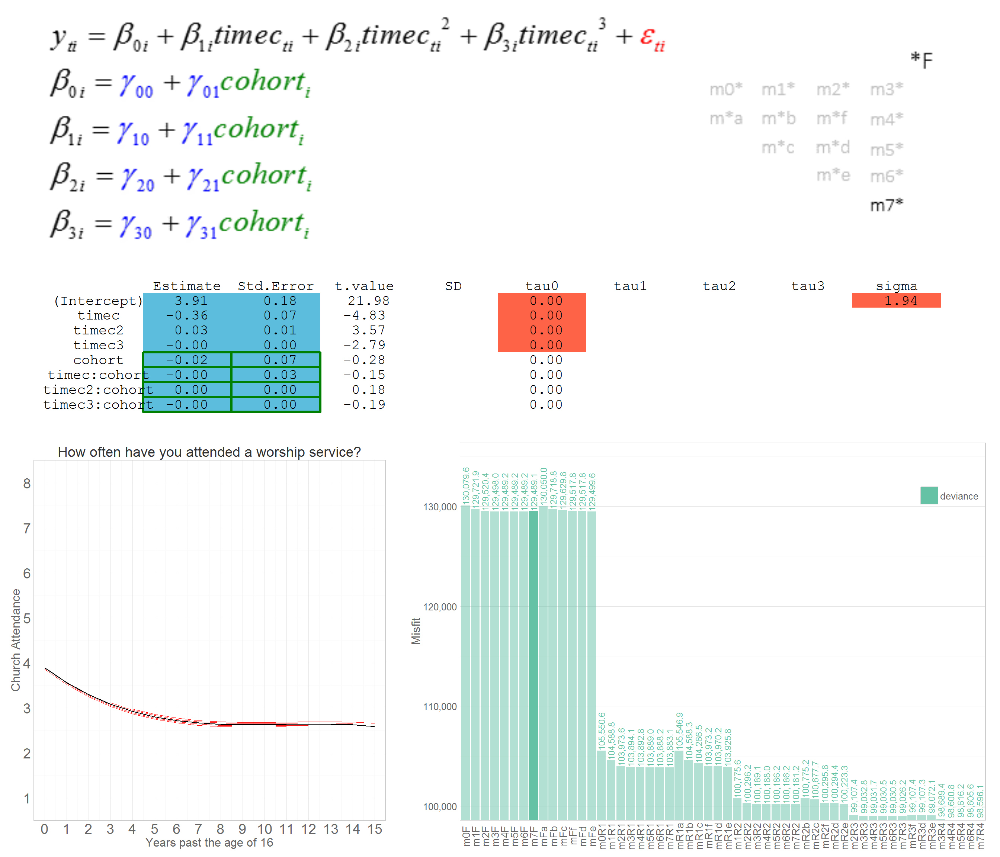
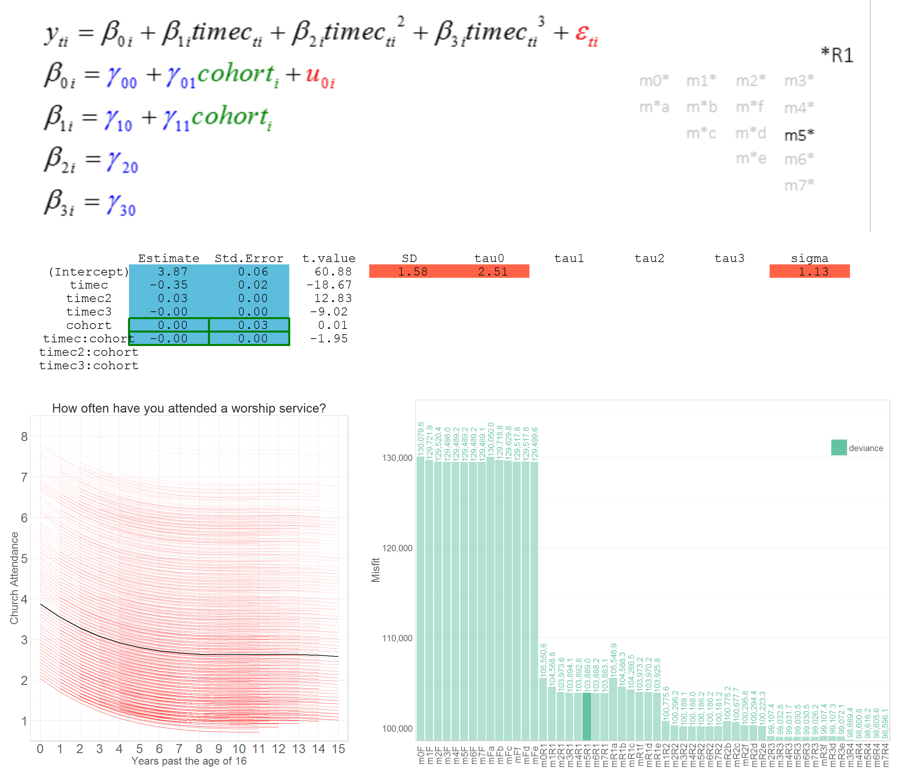
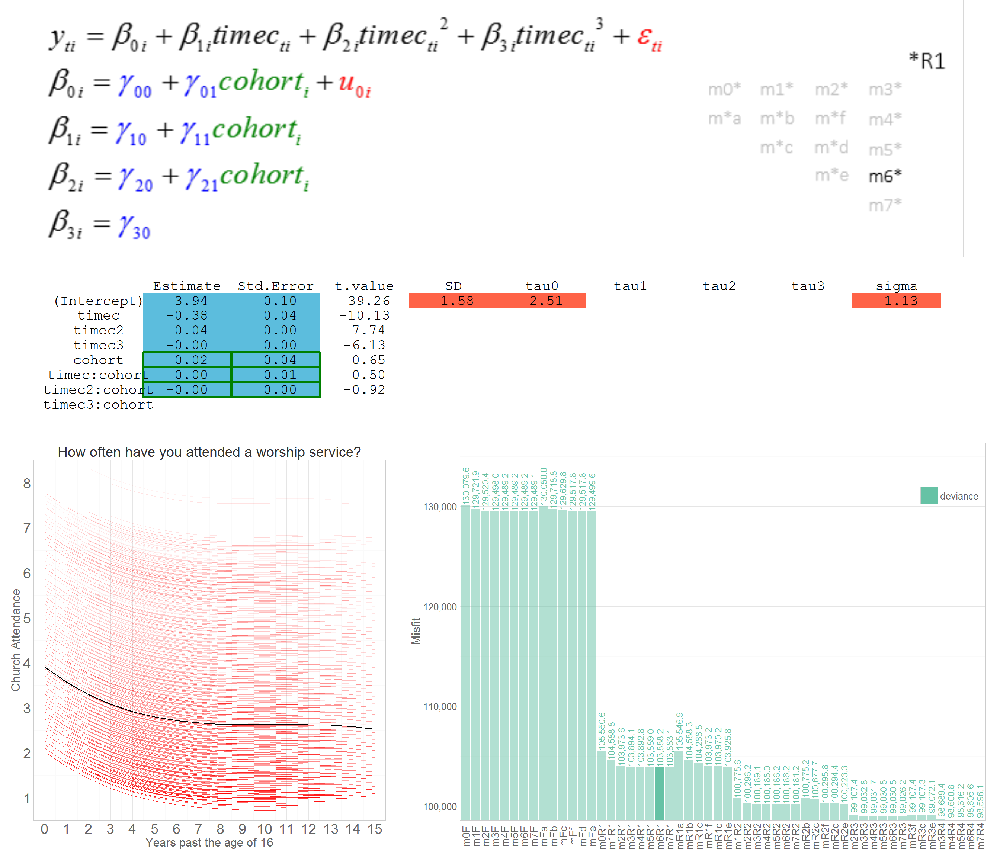
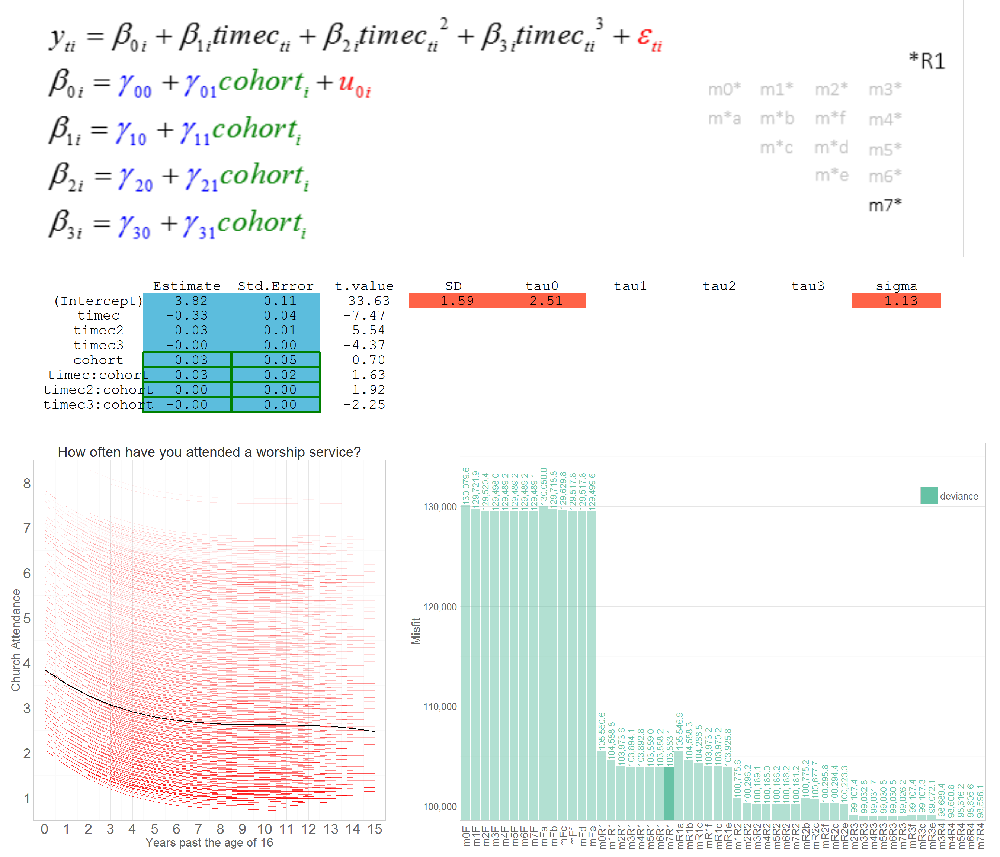
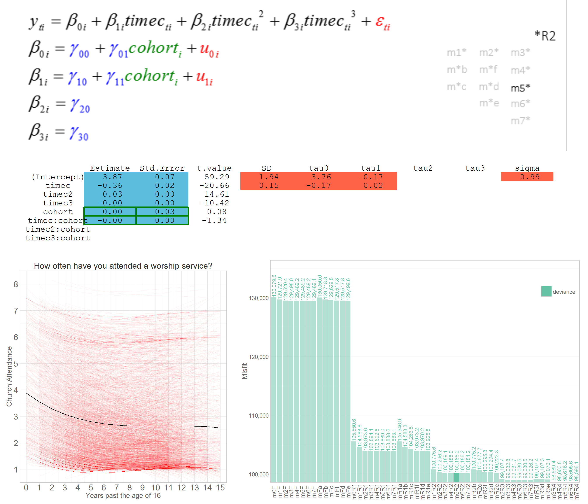
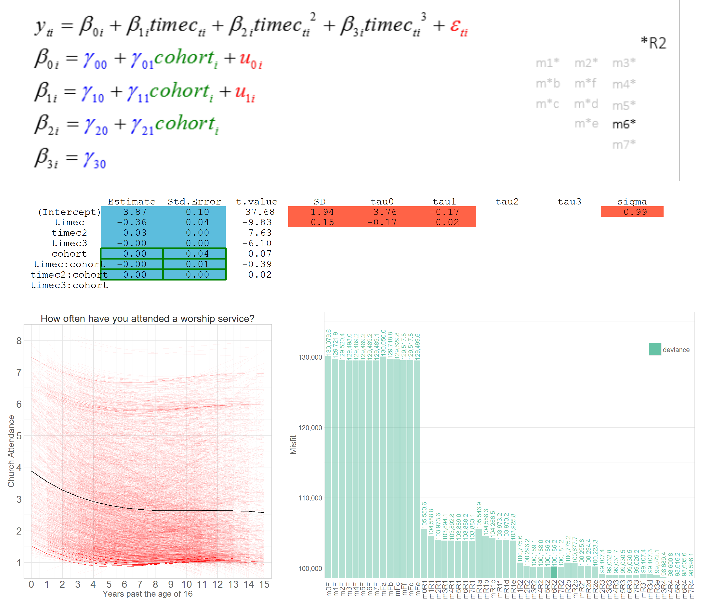
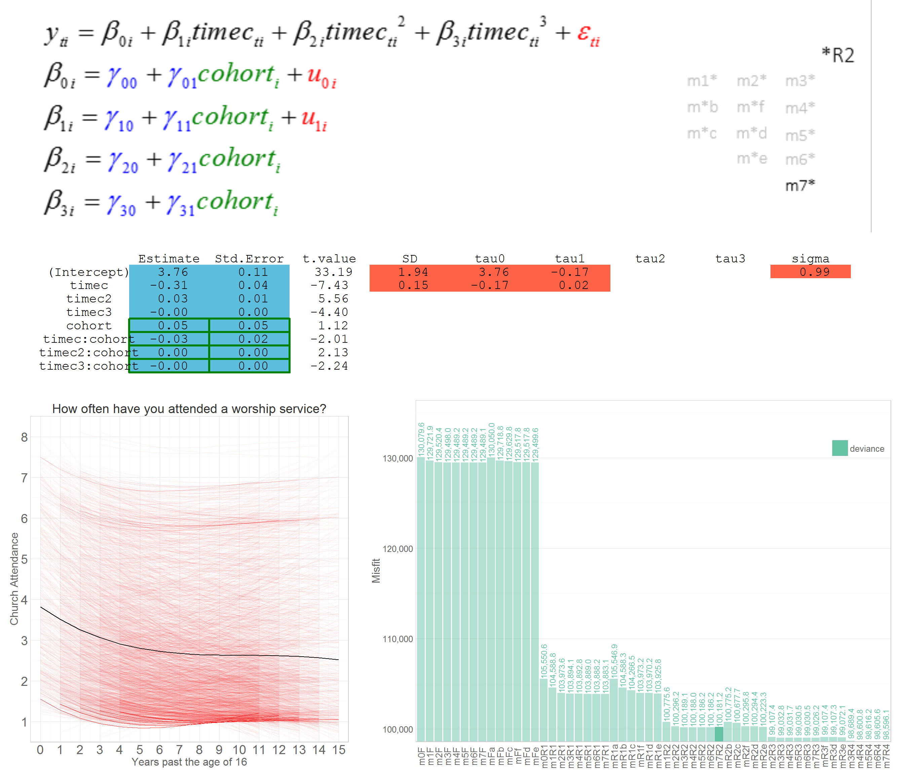

<!--  Set the working directory to the repository's base directory; this assumes the report is nested inside of only one directory.-->


```
 [1] "m0F"  "m0R1" "m1F"  "m1R1" "m1R2" "m2F"  "m2R1" "m2R2" "m2R3" "m3F"  "m3R1" "m3R2" "m3R3" "m3R4" "m4F"  "m4R1"
[17] "m4R2" "m4R3" "m4R4" "m5F"  "m5R1" "m5R2" "m5R3" "m5R4" "m6F"  "m6R1" "m6R2" "m6R3" "m6R4" "m7F"  "m7R1" "m7R2"
[33] "m7R3" "m7R4" "mFa"  "mFb"  "mFc"  "mFd"  "mFe"  "mR1a" "mR1b" "mR1c" "mR1d" "mR1e"
```

# Model specification

```r
############################
```

# m5F 


# m6F 
 

# m7F 
 

## Add more here.

# m5R1 
 

# m6R1 
 

# m7R1 
 

## Add more here.

# m5R2 
 

# m6R2 
 

# m7R2 
 
