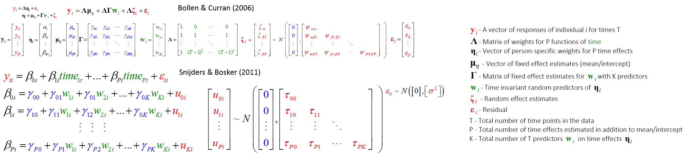

<!--  Set the working directory to the repository's base directory; this assumes the report is nested inside of only one directory.-->
```{r, echo=F, message=F} 
require(knitr)
opts_knit$set(root.dir='../../')  #Don't combine this call with any other chunk -especially one that uses file paths.

```

```{r set_options, echo=F, message=F}
require(knitr)
# getwd()
opts_chunk$set(
  results='show', 
  message = TRUE,
  comment = NA, 
  tidy = FALSE,
#   fig.height = 4.8, 
#   fig.width = 6.5, 
#   out.width = NULL,
  fig.path = 'lmerGuide/',     
  dev = "png",
  dpi = 100
)
echoChunks <- FALSE
warningChunks<- FALSE
options(width=120) #So the output is 50% wider than the default.
read_chunk("./Models/LCM/LCM.R") # the file to which knitr calls for the chunks
```

```{r DeclareGlobals, echo=echoChunks, message=FALSE}
aesDefs
```

```{r LoadPackages, echo=echoChunks, message=F}
```

```{r LoadData, echo=echoChunks, message=T}
# select only respondence in the cross-sectional sample

```
# Model specification   
The model is of the class


# Sequence specification  


# Model and Data specification
```{r}
cat("\014") # clears console
modelNumber<- "m7R"
numID<- 200

modnum<-cat(modelNumber)
dsL<-readRDS("./Data/Derived/dsL.rds")
ds<- dsL %>%  # chose conditions to apply in creating dataset for modeling
  dplyr::filter(id %in% c(1:numID)) %.% # 1:9022
  dplyr::filter(year %in% c(2000:2011)) %.% # 1997:2011
  dplyr::filter(sample %in% c(1)) %.% # 0-Oversample; 1-Cross-Sectional
  dplyr::filter(race %in% c(4)) %.% # 1-Black; 2-Hispanis; 3-Mixed; 4-White
  dplyr::filter(byear %in% c(1980:1984)) %.% # birth year 1980:1984
  dplyr::filter(ave(!is.na(attend), id, FUN = all)) %.% # only complete trajectories
  dplyr::mutate( # create new variables
        age= year-byear, # definition of age to be used in the model    
        timec=year-2000, # metric of time is rounds of NSLY97 in years, centered at 2000
        timec2= timec^2, 
        timec3= timec^3,
#         timec= age-16, # metric of time is bilogical age in years, centered at 16
#         timec2= timec^2,
#         timec3= timec^3,# 
        cohort=byear-1980) %.% # age difference, years younger
  dplyr::select( # assemble the dataset for modeling
    id, sample, race, byear,cohort, # Time Invariant variables
    year,
    age, timec,timec2,timec3, attend)  # Time Variant variables
head(ds)
table(ds$byear) # the year of birth  - metric: YEAR 
table(ds$age) # years past 16 -  metric: AGE
table(ds$year, ds$age) # YEAR by  AGE 
length(unique(ds$id)) # total No. of respondents in dataset
sum(!is.na(ds$attend)) # valid datapoints 
sum(is.na(ds$attend)) # NA in the dataset 
length(unique(ds$timec))
# Estimate the model
modnum <-lmer (attend ~ 
               1  + timec + timec2 +# timec3
       + cohort + cohort:timec + #cohort:timec2 + cohort:timec3
              + (1 + timec + timec2 + timec3 | id),
             data = ds, REML=FALSE, 
             control=lmerControl(optCtrl=list(maxfun=20000)))
        
model<- modnum

```

# Model results

# Basic elements of the S4 object

The full model summary can be accessed by command:
```{r Summary}
summary(model) 
```

After studying 
```{r, eval=FALSE}
str(summary(model)$vcov@x)
str(summary(model)$varcor)
```
we can spot a few complex elements that would be particularly useful

str(summary(model)$varcor)


## Model formula
```{r Call}
model@call 
```

## Fit and Information indices

```{r mInfo}
# get indicies
mInfo<-summary(model)$AICtab
mInfo["N"]<- model@devcomp$dims["N"] # number of datapoints, verify
mInfo["p"]<- model@devcomp$dims["p"] # number of estimated parameters, verify
mInfo["ids"]<- (summary(model))$ngrps # number of units on level-2, here: individuals
mInfo
```

## Random Effects (RE)

### Matrix of RE
```{r mRE}
# extract RE covariance matrix
mREcov<-  data.frame(     summary(model)$varcor$id   ) # covariance matrix of RE
mREcor<-  data.frame(attr(summary(model)$varcor$id,"correlation")) # corrleation matrix of RE
mRE<-   data.frame(sd= (attr(summary(model)$varcor$id,"stddev")))
mRE$var<- mRE$sd^2
mRE<-mRE[c("var","sd")]
mRE
mREcov
```

### extracting RE for each individual
```{r RE}
RE<- lme4:::ranef.merMod(model)$id 
head(RE,6)
# however
cor(RE)  # not the same as mRE, find out why
var(RE)  # not the same as mRE, find out why
```

## Fixed Effects (FE)


### estimate of the FE
```{r FE}
# similar ways to extract FE estimates, #3 is the fullest
FE<- summary(model)$coefficients
FE
```

### Matrix of FE
```{r mFE}
mFE<- (summary(model)$vcov@factors$correlation) # notice that this is object of 
mFE
```


## Model output
```{r dsp_recover_input}
# Read back when went into the model
cat("\014")
dsp<- data.frame(getME(model,"X"))
dsp$id<-getME(model,"flist")$id # first level grouping factor, individual
dsp$y<-getME(model,"y") # observed response vector
head(dsp,13)
```

### Prediction and Residuals

```{r dsp_yHat_resid}
cat("\014")
dsp$yHat<- predict(model) # predicted values
dsp$resid<- lme4:::residuals.merMod(model)
head(dsp,13)
identical ( dsp$y-dsp$yHat, dsp$resid) # check if adds up
```

## Conditional values
The fixed effects  collectivelly define a trajectory that summarises differences among individuals. Uusing the values of the estimated parameters, we reconstruct the trjecectory from which the individual trajectories vary, according to the estimated random effects, if present in the model.

The columns named as fixed effect coefficients (gamma00:gammaKP), contain  predicted trajectories of the outcome (y), computed using only the correspodning term (gamma coefficient x predictor(s), if present). Thus, collumn *gamma00* contains the predicted trajectory of church attendance cumputed using only the grand mean (gamma00) of the current model specification. 

```{r}
cat("\014")
head(dsp)
dsp$gamma00<- ifelse( is.na(FE["(Intercept)"]),0,FE["(Intercept)"])
head(dsp)
```

The effects that were not present in the model will be substituted with zeros. 
```{r}
summary(model)
cat("\014")
dsp<- data.frame(getME(model,"X"))
dsp$id<-getME(model,"flist")$id # first level grouping factor, individual
dsp$y<-getME(model,"y") # observed response vector
head(dsp,13)


model@call


pullMainEffect <- function (timeName){
  possibleNAEffect <- FE[timeName]
  result <- ifelse( is.na(rep(possibleNAEffect,nrow(dsp))), 0,
                  possibleNAEffect*dsp[,timeName]) 
  return(result)
}

pullInteractionEffect <- function (timeName){
  possibleNAEffect <- FE[paste0(timeName,":cohort")]
  result <- ifelse( is.na(rep(possibleNAEffect,nrow(dsp))), 0,
                  possibleNAEffect*dsp[,timeName]) 
  return(result)
}

FE<- fixef(model)
# estimates of the fixed effects 
#  gamma sub(0*) - pure time effects 
# Intercept - gamma sub(00)
dsp$gamma00 <- FE["(Intercept)"]
# Linear trend of time - gamma sub(01)
dsp$gamma01 <- pullMainEffect("timec") 
# Quadratic trend of time - gamma sub(02)
dsp$gamma02 <- pullMainEffect("timec2") 
# Cubic trend of time - gamma sub(03)
dsp$gamma03 <- pullMainEffect("timec3") 
#  gamma subs(1*) - effect of cohort(w1) on: 
#  Intercept - gamma sub(01) 
dsp$gamma10 <- FE["cohort"]
# Linear trend of time - gamma sub(11)  
dsp$gamma11 <- pullInteractionEffect("timec") 
# Quadratic trend of time - gamma sub(12)
dsp$gamma12 <- pullInteractionEffect("timec2") 
# Cubic trend of time - gamma sub(13) 
dsp$gamma13 <- pullInteractionEffect("timec3") 

# Compute the mean trajectory, without the individual variability
# gamma sub(K*) - add more predictors here if expanding sequence
f.effects<- c("gamma00","gamma01","gamma02","gamma03",
              "gamma10","gamma11","gamma12","gamma13")
dsp$yFE <- rowSums (dsp[,colnames(dsp) %in% f.effects],na.rm=TRUE)
head(dsp)
```

Of particular interest is variable **yFE** which has several interpretations. It is:      
  0. the sum of all estimated fixed effects (gamma00:gammaKP) in (person x timepoint) cell    
  1. the overall model solution for the interindividual  differences   
  2. the average intraindividual pattern     
  3. the prediction of the model with interindividual variability factored out, as opposed to **yHat**, generated using both fixed and random effect(s) coefficients.  

The deviations from this average trajectory will be recorded in **RE**, containing a column for each of the random effects estimated.  

```{r}
# tau**sd - standard deviation, sqrt(tau00)
head(RE)
dsp$tau00sd<- 
  =
  dplyr::left_join(dsp["id"],RE["(Intercept)"],by= id)


dsp$tau11sd<- RE["timec"]
dsp$tau22sd<- RE["timec2"]
dsp$tau33sd<- RE["timec3"]
```

Getting the standard error of residuals
```{r}
sigma<-sigma(model) # std.error of scaled residuals 
SDR<-sd(dsp$resid) # raw residuals, not scaled
identical (sigma, SDR) # 
# however, compare
sigma
SDR
sqrt(sigma/SDR)
```


## List of availible elements
```{r}
summary(model)
VarCorr(model)

mInfo # model information indices
RE # random effect corrections for each (person x timepoint)
mRE  # variances and standard deviations of random effects
mREcov # covariance matrix of Random Effects
mREcor # correlation  matrix of Random Effects
FE # estimates of Fixed Effects, SE, t-value
mFE # matrix of correlations among Fixed Effects
sigma # standard deviation of residual
head(dsp,13) # input + output + residual + conditional

effects<- c()

modelSave<-cat(paste0(modelNumber,"S")) 
modS<- list(mInfo,mRE,mREcov,mREcor,FE,mFE,sigma,dsp) # to save in an external file
str(modS)
```


```{r child, child = '../../Models/Descriptives/Citations.Rmd'}

```

