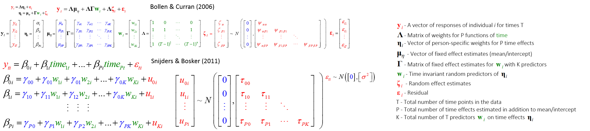

<!--  Set the working directory to the repository's base directory; this assumes the report is nested inside of only one directory.-->


# Model specification   
The model is of the class


# Sequence specification  


# Model and Data specification

```r
cat("\014") # clears console
```



```r
modelNumber<- "m7R"
numID<- 200

modnum<-cat(modelNumber)
```

```
m7R
```

```r
dsL<-readRDS("./Data/Derived/dsL.rds")
ds<- dsL %>%  # chose conditions to apply in creating dataset for modeling
  dplyr::filter(id %in% c(1:numID)) %.% # 1:9022
  dplyr::filter(year %in% c(2000:2011)) %.% # 1997:2011
  dplyr::filter(sample %in% c(1)) %.% # 0-Oversample; 1-Cross-Sectional
  dplyr::filter(race %in% c(4)) %.% # 1-Black; 2-Hispanis; 3-Mixed; 4-White
  dplyr::filter(byear %in% c(1980:1984)) %.% # birth year 1980:1984
  dplyr::filter(ave(!is.na(attend), id, FUN = all)) %.% # only complete trajectories
  dplyr::mutate( # create new variables
        age= year-byear, # definition of age to be used in the model    
        timec=year-2000, # metric of time is rounds of NSLY97 in years, centered at 2000
        timec2= timec^2, 
        timec3= timec^3,
#         timec= age-16, # metric of time is bilogical age in years, centered at 16
#         timec2= timec^2,
#         timec3= timec^3,# 
        cohort=byear-1980) %.% # age difference, years younger
  dplyr::select( # assemble the dataset for modeling
    id, sample, race, byear,cohort, # Time Invariant variables
    year,
    age, timec,timec2,timec3, attend)  # Time Variant variables
head(ds)
```

```
  id sample race byear cohort year age timec timec2 timec3 attend
1  1      1    4  1981      1 2000  19     0      0      0      1
2  1      1    4  1981      1 2001  20     1      1      1      6
3  1      1    4  1981      1 2002  21     2      4      8      2
4  1      1    4  1981      1 2003  22     3      9     27      1
5  1      1    4  1981      1 2004  23     4     16     64      1
6  1      1    4  1981      1 2005  24     5     25    125      1
```

```r
table(ds$byear) # the year of birth  - metric: YEAR 
```

```

1980 1981 1982 1983 1984 
 108   84  132   60  108 
```

```r
table(ds$age) # years past 16 -  metric: AGE
```

```

16 17 18 19 20 21 22 23 24 25 26 27 28 29 30 31 
 9 14 25 32 41 41 41 41 41 41 41 41 32 27 16  9 
```

```r
table(ds$year, ds$age) # YEAR by  AGE 
```

```
      
       16 17 18 19 20 21 22 23 24 25 26 27 28 29 30 31
  2000  9  5 11  7  9  0  0  0  0  0  0  0  0  0  0  0
  2001  0  9  5 11  7  9  0  0  0  0  0  0  0  0  0  0
  2002  0  0  9  5 11  7  9  0  0  0  0  0  0  0  0  0
  2003  0  0  0  9  5 11  7  9  0  0  0  0  0  0  0  0
  2004  0  0  0  0  9  5 11  7  9  0  0  0  0  0  0  0
  2005  0  0  0  0  0  9  5 11  7  9  0  0  0  0  0  0
  2006  0  0  0  0  0  0  9  5 11  7  9  0  0  0  0  0
  2007  0  0  0  0  0  0  0  9  5 11  7  9  0  0  0  0
  2008  0  0  0  0  0  0  0  0  9  5 11  7  9  0  0  0
  2009  0  0  0  0  0  0  0  0  0  9  5 11  7  9  0  0
  2010  0  0  0  0  0  0  0  0  0  0  9  5 11  7  9  0
  2011  0  0  0  0  0  0  0  0  0  0  0  9  5 11  7  9
```

```r
length(unique(ds$id)) # total No. of respondents in dataset
```

```
[1] 41
```

```r
sum(!is.na(ds$attend)) # valid datapoints 
```

```
[1] 492
```

```r
sum(is.na(ds$attend)) # NA in the dataset 
```

```
[1] 0
```

```r
length(unique(ds$timec))
```

```
[1] 12
```

```r
# Estimate the model
modnum <-lmer (attend ~ 
               1  + timec + timec2 + timec3
       + cohort + cohort:timec  #+ cohort:timec2 # + cohort:timec3
              + (1 + timec + timec2  | id),
             data = ds, REML=FALSE, 
             control=lmerControl(optCtrl=list(maxfun=20000)))
        
model<- modnum
```

# Model results

# Basic elements of the S4 object

The full model summary can be accessed by command:

```r
summary(model) 
```

```
Linear mixed model fit by maximum likelihood  ['lmerMod']
Formula: attend ~ 1 + timec + timec2 + timec3 + cohort + cohort:timec +      (1 + timec + timec2 | id)
   Data: ds
Control: lmerControl(optCtrl = list(maxfun = 20000))

     AIC      BIC   logLik deviance df.resid 
  1375.5   1430.0   -674.7   1349.5      479 

Scaled residuals: 
   Min     1Q Median     3Q    Max 
-3.091 -0.390 -0.082  0.328  4.574 

Random effects:
 Groups   Name        Variance Std.Dev. Corr       
 id       (Intercept) 2.600432 1.6126              
          timec       0.145531 0.3815   -0.83      
          timec2      0.000498 0.0223    0.77 -0.95
 Residual             0.577985 0.7603              
Number of obs: 492, groups:  id, 41

Fixed effects:
             Estimate Std. Error t value
(Intercept)   2.64733    0.37948    6.98
timec        -0.46069    0.10910   -4.22
timec2        0.06582    0.01882    3.50
timec3       -0.00266    0.00110   -2.41
cohort        0.25885    0.13549    1.91
timec:cohort -0.03048    0.01699   -1.79

Correlation of Fixed Effects:
            (Intr) timec  timec2 timec3 cohort
timec       -0.609                            
timec2       0.262 -0.833                     
timec3      -0.144  0.703 -0.967              
cohort      -0.697  0.202  0.000  0.000       
timec:cohrt  0.463 -0.304  0.000  0.000 -0.665
```

After studying 

```r
str(summary(model)$vcov@x)
str(summary(model)$varcor)
```
we can spot a few complex elements that would be particularly useful

str(summary(model)$varcor)


## Model formula

```r
model@call 
```

```
lmer(formula = attend ~ 1 + timec + timec2 + timec3 + cohort + 
    cohort:timec + (1 + timec + timec2 | id), data = ds, REML = FALSE, 
    control = lmerControl(optCtrl = list(maxfun = 20000)))
```

## Fit and Information indices


```r
# get indicies
mInfo<-summary(model)$AICtab
mInfo["N"]<- model@devcomp$dims["N"] # number of datapoints, verify
mInfo["p"]<- model@devcomp$dims["p"] # number of estimated parameters, verify
mInfo["ids"]<- (summary(model))$ngrps # number of units on level-2, here: individuals
mInfo
```

```
     AIC      BIC   logLik deviance df.resid        N        p      ids 
  1375.5   1430.0   -674.7   1349.5    479.0    492.0      6.0     41.0 
```

## Random Effects (RE)

### Matrix of RE

```r
# extract RE covariance matrix
mREcov<-  data.frame(     summary(model)$varcor$id   ) # covariance matrix of RE
mREcor<-  data.frame(attr(summary(model)$varcor$id,"correlation")) # corrleation matrix of RE
mRE<-   data.frame(sd= (attr(summary(model)$varcor$id,"stddev")))
mRE$var<- mRE$sd^2
mRE<-mRE[c("var","sd")]
mRE
```

```
                  var      sd
(Intercept) 2.6004323 1.61259
timec       0.1455313 0.38149
timec2      0.0004985 0.02233
```

```r
mREcov
```

```
            X.Intercept.     timec     timec2
(Intercept)      2.60043 -0.513474  0.0278655
timec           -0.51347  0.145531 -0.0081042
timec2           0.02787 -0.008104  0.0004985
```

### extracting RE for each individual

```r
RE<- lme4:::ranef.merMod(model)$id 
head(RE,6)
```

```
   (Intercept)    timec    timec2
1      0.22877 -0.19267  0.008214
33    -0.04575  0.15234 -0.011696
34    -0.73325  0.04679 -0.004558
35    -2.09082  0.31074 -0.017867
37    -1.12394  0.20507 -0.013459
38    -1.13671  0.14570 -0.011178
```

```r
# however
cor(RE)  # in unadjusted RE estimates, not same as mRE
```

```
            (Intercept)   timec  timec2
(Intercept)      1.0000 -0.8442  0.8418
timec           -0.8442  1.0000 -0.9711
timec2           0.8418 -0.9711  1.0000
```

```r
var(RE)  # in unadjusted RE estimates, not same as mRE
```

```
            (Intercept)     timec     timec2
(Intercept)     2.41106 -0.455341  0.0241825
timec          -0.45534  0.120676 -0.0062409
timec2          0.02418 -0.006241  0.0003423
```

```r
mRE
```

```
                  var      sd
(Intercept) 2.6004323 1.61259
timec       0.1455313 0.38149
timec2      0.0004985 0.02233
```

## Fixed Effects (FE)


### estimate of the FE

```r
# similar ways to extract FE estimates, #3 is the fullest
FE<- fixef(model)  
FE # vector used in predition
```

```
 (Intercept)        timec       timec2       timec3       cohort timec:cohort 
    2.647335    -0.460691     0.065823    -0.002659     0.258855    -0.030483 
```

```r
FEt<- summary(model)$coefficients
FEt # contains t-values that test the terms
```

```
              Estimate Std. Error t value
(Intercept)   2.647335   0.379478   6.976
timec        -0.460691   0.109105  -4.222
timec2        0.065823   0.018817   3.498
timec3       -0.002659   0.001103  -2.411
cohort        0.258855   0.135487   1.911
timec:cohort -0.030483   0.016989  -1.794
```

### Matrix of FE

```r
mFE<- (summary(model)$vcov@factors$correlation) # notice that this is object of 
mFE
```

```
6 x 6 Matrix of class "corMatrix"
             (Intercept)   timec     timec2     timec3     cohort timec:cohort
(Intercept)       1.0000 -0.6089  2.615e-01 -1.439e-01 -6.967e-01    4.633e-01
timec            -0.6089  1.0000 -8.327e-01  7.027e-01  2.021e-01   -3.038e-01
timec2            0.2615 -0.8327  1.000e+00 -9.674e-01 -6.765e-15   -9.909e-14
timec3           -0.1439  0.7027 -9.674e-01  1.000e+00 -1.086e-14    1.101e-13
cohort           -0.6967  0.2021 -6.765e-15 -1.086e-14  1.000e+00   -6.650e-01
timec:cohort      0.4633 -0.3038 -9.909e-14  1.101e-13 -6.650e-01    1.000e+00
```


## Model output

```r
# Read back when went into the model
cat("\014")
```



```r
dsp<- data.frame(getME(model,"X"))
dsp$id<-getME(model,"flist")$id # first level grouping factor, individual
dsp$y<-getME(model,"y") # observed response vector
head(dsp,13)
```

```
   X.Intercept. timec timec2 timec3 cohort timec.cohort id y
1             1     0      0      0      1            0  1 1
2             1     1      1      1      1            1  1 6
3             1     2      4      8      1            2  1 2
4             1     3      9     27      1            3  1 1
5             1     4     16     64      1            4  1 1
6             1     5     25    125      1            5  1 1
7             1     6     36    216      1            6  1 1
8             1     7     49    343      1            7  1 1
9             1     8     64    512      1            8  1 1
10            1     9     81    729      1            9  1 1
11            1    10    100   1000      1           10  1 1
12            1    11    121   1331      1           11  1 1
13            1     0      0      0      0            0 33 2
```

### Prediction and Residuals


```r
cat("\014")
```



```r
dsp$yHat<- predict(model) # predicted values
dsp$resid<- lme4:::residuals.merMod(model)
head(dsp,13)
```

```
   X.Intercept. timec timec2 timec3 cohort timec.cohort id y  yHat    resid
1             1     0      0      0      1            0  1 1 3.135 -2.13496
2             1     1      1      1      1            1  1 6 2.522  3.47750
3             1     2      4      8      1            2  1 2 2.042 -0.04215
4             1     3      9     27      1            3  1 1 1.678 -0.67797
5             1     4     16     64      1            4  1 1 1.414 -0.41399
6             1     5     25    125      1            5  1 1 1.234 -0.23425
7             1     6     36    216      1            6  1 1 1.123 -0.12281
8             1     7     49    343      1            7  1 1 1.064 -0.06370
9             1     8     64    512      1            8  1 1 1.041 -0.04096
10            1     9     81    729      1            9  1 1 1.039 -0.03864
11            1    10    100   1000      1           10  1 1 1.041 -0.04079
12            1    11    121   1331      1           11  1 1 1.031 -0.03144
13            1     0      0      0      0            0 33 2 2.602 -0.60159
```

```r
identical ( dsp$y-dsp$yHat, dsp$resid) # check if adds up
```

```
[1] TRUE
```

## Conditional values
The fixed effects  collectivelly define a trajectory that summarises differences among individuals. Uusing the values of the estimated parameters, we reconstruct the trjecectory from which the individual trajectories vary, according to the estimated random effects, if present in the model.

The columns named as fixed effect coefficients (gamma00:gammaKP), contain  predicted trajectories of the outcome (y), computed using only the correspodning term (gamma coefficient x predictor(s), if present). Thus, collumn *gamma00* contains the predicted trajectory of church attendance cumputed using only the grand mean (gamma00) of the current model specification. 


```r
cat("\014")
```



```r
head(dsp)
```

```
  X.Intercept. timec timec2 timec3 cohort timec.cohort id y  yHat    resid
1            1     0      0      0      1            0  1 1 3.135 -2.13496
2            1     1      1      1      1            1  1 6 2.522  3.47750
3            1     2      4      8      1            2  1 2 2.042 -0.04215
4            1     3      9     27      1            3  1 1 1.678 -0.67797
5            1     4     16     64      1            4  1 1 1.414 -0.41399
6            1     5     25    125      1            5  1 1 1.234 -0.23425
```

```r
dsp$gamma00<- ifelse( is.na(FE["(Intercept)"]),0,FE["(Intercept)"])
head(dsp)
```

```
  X.Intercept. timec timec2 timec3 cohort timec.cohort id y  yHat    resid gamma00
1            1     0      0      0      1            0  1 1 3.135 -2.13496   2.647
2            1     1      1      1      1            1  1 6 2.522  3.47750   2.647
3            1     2      4      8      1            2  1 2 2.042 -0.04215   2.647
4            1     3      9     27      1            3  1 1 1.678 -0.67797   2.647
5            1     4     16     64      1            4  1 1 1.414 -0.41399   2.647
6            1     5     25    125      1            5  1 1 1.234 -0.23425   2.647
```

The effects that were not present in the model will be substituted with zeros. 

```r
# cat("\014")
# dsp<- data.frame(getME(model,"X")) # read back the input 
# dsp$id<-getME(model,"flist")$id # first level grouping factor, individual
# dsp$y<-getME(model,"y") # observed response vector
# head(dsp,13)

model@call
```

```
lmer(formula = attend ~ 1 + timec + timec2 + timec3 + cohort + 
    cohort:timec + (1 + timec + timec2 | id), data = ds, REML = FALSE, 
    control = lmerControl(optCtrl = list(maxfun = 20000)))
```

```r
pullMainEffect <- function (timeName){
  possibleNAEffect <- FE[timeName]
  result <- ifelse( is.na(rep(possibleNAEffect,nrow(dsp))), 0,
                  possibleNAEffect*dsp[,timeName]) 
  return(result)
}

pullInteractionEffect <- function (timeName){
  possibleNAEffect <- FE[paste0(timeName,":cohort")]
  result <- ifelse( is.na(rep(possibleNAEffect,nrow(dsp))), 0,
                  possibleNAEffect*dsp[,timeName]) 
  return(result)
}

FE<- fixef(model)
# estimates of the fixed effects 
#  gamma sub(0*) - pure time effects 
# Intercept - gamma sub(00)
dsp$gamma00 <- FE["(Intercept)"]
# Linear trend of time - gamma sub(01)
dsp$gamma01 <- pullMainEffect("timec") 
# Quadratic trend of time - gamma sub(02)
dsp$gamma02 <- pullMainEffect("timec2") 
# Cubic trend of time - gamma sub(03)
dsp$gamma03 <- pullMainEffect("timec3") 
#  gamma subs(1*) - effect of cohort(w1) on: 
#  Intercept - gamma sub(01) 
dsp$gamma10 <- FE["cohort"]
# Linear trend of time - gamma sub(11)  
dsp$gamma11 <- pullInteractionEffect("timec") 
# Quadratic trend of time - gamma sub(12)
dsp$gamma12 <- pullInteractionEffect("timec2") 
# Cubic trend of time - gamma sub(13) 
dsp$gamma13 <- pullInteractionEffect("timec3") 

# Compute the mean trajectory, without the individual variability
# gamma sub(K*) - add more predictors here if expanding sequence
f.effects<- c("gamma00","gamma01","gamma02","gamma03",
              "gamma10","gamma11","gamma12","gamma13")
dsp$yFE <- rowSums (dsp[,colnames(dsp) %in% f.effects],na.rm=TRUE)
head(dsp)
```

```
  X.Intercept. timec timec2 timec3 cohort timec.cohort id y  yHat    resid gamma00 gamma01 gamma02   gamma03 gamma10
1            1     0      0      0      1            0  1 1 3.135 -2.13496   2.647  0.0000 0.00000  0.000000  0.2589
2            1     1      1      1      1            1  1 6 2.522  3.47750   2.647 -0.4607 0.06582 -0.002659  0.2589
3            1     2      4      8      1            2  1 2 2.042 -0.04215   2.647 -0.9214 0.26329 -0.021276  0.2589
4            1     3      9     27      1            3  1 1 1.678 -0.67797   2.647 -1.3821 0.59241 -0.071806  0.2589
5            1     4     16     64      1            4  1 1 1.414 -0.41399   2.647 -1.8428 1.05317 -0.170207  0.2589
6            1     5     25    125      1            5  1 1 1.234 -0.23425   2.647 -2.3035 1.64558 -0.332436  0.2589
   gamma11 gamma12 gamma13   yFE
1  0.00000       0       0 2.906
2 -0.03048       0       0 2.478
3 -0.06097       0       0 2.166
4 -0.09145       0       0 1.953
5 -0.12193       0       0 1.824
6 -0.15241       0       0 1.763
```

Of particular interest is variable **yFE** which has several interpretations. It is:      
  0. the sum of all estimated fixed effects (gamma00:gammaKP) in (person x timepoint) cell    
  1. the overall model solution for the interindividual  differences   
  2. the average intraindividual pattern     
  3. the prediction of the model with interindividual variability factored out, as opposed to **yHat**, generated using both fixed and random effect(s) coefficients.  

The deviations from this average trajectory will be recorded in **RE**, containing a column for each of the random effects estimated.  


```r
# tau**sd - standard deviation, sqrt(tau00)
# dspCopy
# dsp<- dspCopy
RE<- lme4:::ranef.merMod(model)$id 
RE$id=rownames(RE)
oldREnames<- c ("(Intercept)", "timec", "timec2", "timec3")
newREnames<- c("tau00sd","tau11sd", "tau22sd", "tau33sd")
for(i in 1:4)names(RE)[names(RE)==oldREnames[i]]=newREnames[i]


head(RE)
```

```
    tau00sd  tau11sd   tau22sd id
1   0.22877 -0.19267  0.008214  1
33 -0.04575  0.15234 -0.011696 33
34 -0.73325  0.04679 -0.004558 34
35 -2.09082  0.31074 -0.017867 35
37 -1.12394  0.20507 -0.013459 37
38 -1.13671  0.14570 -0.011178 38
```

```r
# attach individual disturbances to dsp by id
dsp<- merge(dsp,RE, by="id" )
head(dsp)
```

```
  id X.Intercept. timec timec2 timec3 cohort timec.cohort y  yHat    resid gamma00 gamma01 gamma02   gamma03 gamma10
1  1            1     0      0      0      1            0 1 3.135 -2.13496   2.647  0.0000 0.00000  0.000000  0.2589
2  1            1     1      1      1      1            1 6 2.522  3.47750   2.647 -0.4607 0.06582 -0.002659  0.2589
3  1            1     2      4      8      1            2 2 2.042 -0.04215   2.647 -0.9214 0.26329 -0.021276  0.2589
4  1            1     3      9     27      1            3 1 1.678 -0.67797   2.647 -1.3821 0.59241 -0.071806  0.2589
5  1            1     4     16     64      1            4 1 1.414 -0.41399   2.647 -1.8428 1.05317 -0.170207  0.2589
6  1            1     5     25    125      1            5 1 1.234 -0.23425   2.647 -2.3035 1.64558 -0.332436  0.2589
   gamma11 gamma12 gamma13   yFE tau00sd tau11sd  tau22sd
1  0.00000       0       0 2.906  0.2288 -0.1927 0.008214
2 -0.03048       0       0 2.478  0.2288 -0.1927 0.008214
3 -0.06097       0       0 2.166  0.2288 -0.1927 0.008214
4 -0.09145       0       0 1.953  0.2288 -0.1927 0.008214
5 -0.12193       0       0 1.824  0.2288 -0.1927 0.008214
6 -0.15241       0       0 1.763  0.2288 -0.1927 0.008214
```

```r
pullRandomEffect <- function (timeName,tauName){
  possibleNAEffect <- dsp[,tauName]
  result <- ifelse( is.na(possibleNAEffect), 0,
                  possibleNAEffect*dsp[,timeName]) 
  return(result)
}

# and produce predictions using the time effects 
# note that tau00sd does not need transformation because it intercept ( *1)
# dsp$tau11sd <- pullRandomEffect(timeName="timec", tauName="tau11sd")
# dsp$tau22sd <- pullRandomEffect(timeName="timec2", tauName="tau22sd")
# dsp$tau33sd <- pullRandomEffect(timeName="timec3", tauName="tau33sd")

dsp$tau11sd <- ifelse( is.na(dsp[,"tau11sd"]), 0, dsp[,"tau11sd"])
dsp$tau22sd <- ifelse( is.na(dsp[,"tau22sd"]), 0, dsp[,"tau22sd"])
dsp$tau33sd <- ifelse( is.na(dsp[,"tau33sd"]), 0, dsp[,"tau33sd"])
```

```
Error: undefined columns selected
```

```r
?exists
```

```
starting httpd help server ... done
```

```r
head(dsp)
```

```
  id X.Intercept. timec timec2 timec3 cohort timec.cohort y  yHat    resid gamma00 gamma01 gamma02   gamma03 gamma10
1  1            1     0      0      0      1            0 1 3.135 -2.13496   2.647  0.0000 0.00000  0.000000  0.2589
2  1            1     1      1      1      1            1 6 2.522  3.47750   2.647 -0.4607 0.06582 -0.002659  0.2589
3  1            1     2      4      8      1            2 2 2.042 -0.04215   2.647 -0.9214 0.26329 -0.021276  0.2589
4  1            1     3      9     27      1            3 1 1.678 -0.67797   2.647 -1.3821 0.59241 -0.071806  0.2589
5  1            1     4     16     64      1            4 1 1.414 -0.41399   2.647 -1.8428 1.05317 -0.170207  0.2589
6  1            1     5     25    125      1            5 1 1.234 -0.23425   2.647 -2.3035 1.64558 -0.332436  0.2589
   gamma11 gamma12 gamma13   yFE tau00sd tau11sd  tau22sd
1  0.00000       0       0 2.906  0.2288 -0.1927 0.008214
2 -0.03048       0       0 2.478  0.2288 -0.1927 0.008214
3 -0.06097       0       0 2.166  0.2288 -0.1927 0.008214
4 -0.09145       0       0 1.953  0.2288 -0.1927 0.008214
5 -0.12193       0       0 1.824  0.2288 -0.1927 0.008214
6 -0.15241       0       0 1.763  0.2288 -0.1927 0.008214
```

Create the individual disturbance

```r
r.effects<- c("tau00sd","tau11sd","tau22sd","tau33sd")
dsp$yRE <- rowSums (dsp[,colnames(dsp) %in% r.effects],na.rm=TRUE)

head(dsp)
```

```
  id X.Intercept. timec timec2 timec3 cohort timec.cohort y  yHat    resid gamma00 gamma01 gamma02   gamma03 gamma10
1  1            1     0      0      0      1            0 1 3.135 -2.13496   2.647  0.0000 0.00000  0.000000  0.2589
2  1            1     1      1      1      1            1 6 2.522  3.47750   2.647 -0.4607 0.06582 -0.002659  0.2589
3  1            1     2      4      8      1            2 2 2.042 -0.04215   2.647 -0.9214 0.26329 -0.021276  0.2589
4  1            1     3      9     27      1            3 1 1.678 -0.67797   2.647 -1.3821 0.59241 -0.071806  0.2589
5  1            1     4     16     64      1            4 1 1.414 -0.41399   2.647 -1.8428 1.05317 -0.170207  0.2589
6  1            1     5     25    125      1            5 1 1.234 -0.23425   2.647 -2.3035 1.64558 -0.332436  0.2589
   gamma11 gamma12 gamma13   yFE tau00sd tau11sd  tau22sd     yRE
1  0.00000       0       0 2.906  0.2288 -0.1927 0.008214 0.04432
2 -0.03048       0       0 2.478  0.2288 -0.1927 0.008214 0.04432
3 -0.06097       0       0 2.166  0.2288 -0.1927 0.008214 0.04432
4 -0.09145       0       0 1.953  0.2288 -0.1927 0.008214 0.04432
5 -0.12193       0       0 1.824  0.2288 -0.1927 0.008214 0.04432
6 -0.15241       0       0 1.763  0.2288 -0.1927 0.008214 0.04432
```


```r
ds<- dsp %>%
  dplyr::select(y,resid,yFE,yRE,yHat) %>%
  dplyr::mutate(
    yFERE=yFE+yRE, # predictions reconstructed manually
    residFERE= y- yFERE,
    residDif= resid- residFERE # residuals might slightly differ due to rounding
         ) 
# Check that the model solution deconstructed from fixed and random coefficient estimates (yFERE) matches the prediction produced by the built in function predict(model) or fitted(model).
all.equal(dsp$yHat1, dsp$yFERE)
```

```
[1] TRUE
```

```r
head(ds,10)
```

```
   y    resid   yFE     yRE  yHat yFERE residFERE   residDif
1  1 -2.13496 2.906 0.04432 3.135 2.951   -1.9505 -1.845e-01
2  6  3.47750 2.478 0.04432 2.522 2.522    3.4775 -4.441e-16
3  2 -0.04215 2.166 0.04432 2.042 2.210   -0.2102  1.680e-01
4  1 -0.67797 1.953 0.04432 1.678 1.998   -0.9976  3.196e-01
5  1 -0.41399 1.824 0.04432 1.414 1.869   -0.8688  4.548e-01
6  1 -0.23425 1.763 0.04432 1.234 1.808   -0.8078  5.735e-01
7  1 -0.12281 1.754 0.04432 1.123 1.799   -0.7986  6.758e-01
8  1 -0.06370 1.781 0.04432 1.064 1.825   -0.8254  7.617e-01
9  1 -0.04096 1.828 0.04432 1.041 1.872   -0.8721  8.312e-01
10 1 -0.03864 1.879 0.04432 1.039 1.923   -0.9228  8.842e-01
```

Getting the standard error of residuals

```r
sigma<-sigma(model) # std.error of scaled residuals 
SDR<-sd(dsp$resid) # st.deviation of the raw residuals, not scaled
sigma
```

```
[1] 0.7603
```

```r
SDR
```

```
[1] 0.6892
```


## List of availible elements

```r
summary(model)
```

```
Linear mixed model fit by maximum likelihood  ['lmerMod']
Formula: attend ~ 1 + timec + timec2 + timec3 + cohort + cohort:timec +      (1 + timec + timec2 | id)
   Data: ds
Control: lmerControl(optCtrl = list(maxfun = 20000))

     AIC      BIC   logLik deviance df.resid 
  1375.5   1430.0   -674.7   1349.5      479 

Scaled residuals: 
   Min     1Q Median     3Q    Max 
-3.091 -0.390 -0.082  0.328  4.574 

Random effects:
 Groups   Name        Variance Std.Dev. Corr       
 id       (Intercept) 2.600432 1.6126              
          timec       0.145531 0.3815   -0.83      
          timec2      0.000498 0.0223    0.77 -0.95
 Residual             0.577985 0.7603              
Number of obs: 492, groups:  id, 41

Fixed effects:
             Estimate Std. Error t value
(Intercept)   2.64733    0.37948    6.98
timec        -0.46069    0.10910   -4.22
timec2        0.06582    0.01882    3.50
timec3       -0.00266    0.00110   -2.41
cohort        0.25885    0.13549    1.91
timec:cohort -0.03048    0.01699   -1.79

Correlation of Fixed Effects:
            (Intr) timec  timec2 timec3 cohort
timec       -0.609                            
timec2       0.262 -0.833                     
timec3      -0.144  0.703 -0.967              
cohort      -0.697  0.202  0.000  0.000       
timec:cohrt  0.463 -0.304  0.000  0.000 -0.665
```

```r
VarCorr(model)
```

```
 Groups   Name        Std.Dev. Corr       
 id       (Intercept) 1.6126              
          timec       0.3815   -0.83      
          timec2      0.0223    0.77 -0.95
 Residual             0.7603              
```

```r
mInfo # model information indices
```

```
     AIC      BIC   logLik deviance df.resid        N        p      ids 
  1375.5   1430.0   -674.7   1349.5    479.0    492.0      6.0     41.0 
```

```r
RE # random effect corrections for each (person x timepoint)
```

```
     tau00sd  tau11sd    tau22sd  id
1    0.22877 -0.19267  8.214e-03   1
33  -0.04575  0.15234 -1.170e-02  33
34  -0.73325  0.04679 -4.558e-03  34
35  -2.09082  0.31074 -1.787e-02  35
37  -1.12394  0.20507 -1.346e-02  37
38  -1.13671  0.14570 -1.118e-02  38
41  -1.39446  0.14636 -7.216e-03  41
56   0.98876 -0.11154  7.445e-03  56
60   2.19379 -0.17393  1.215e-03  60
75  -2.71280  0.85621 -2.513e-02  75
76  -1.83312  0.26577 -1.608e-02  76
78  -1.50694  0.23759 -1.629e-02  78
86  -0.36681 -0.04972  6.571e-05  86
89   2.41451 -0.76088  4.204e-02  89
92  -2.30020  0.61434 -3.402e-02  92
104 -1.33862  0.33441 -1.775e-02 104
105 -1.26664  0.31614 -1.376e-02 105
107  1.51801 -0.11011  7.747e-03 107
108  2.03916 -0.44186  2.349e-02 108
109  0.37069 -0.29553  1.831e-02 109
110 -0.55159  0.01442  3.032e-03 110
114 -1.41974  0.25593 -1.335e-02 114
122  1.21576 -0.45182  2.578e-02 122
126 -0.44611  0.21691 -1.646e-02 126
135 -1.57542  0.22080 -1.429e-02 135
137  1.67718 -0.23959  2.152e-02 137
138  1.92665 -0.62166  3.487e-02 138
147 -0.82973  0.16385 -1.205e-02 147
155  2.46221 -0.72361  3.799e-02 155
156  0.42406 -0.08784  4.651e-03 156
164 -0.96221  0.27101 -1.679e-02 164
165  0.61164  0.13963 -6.859e-03 165
166  0.16452  0.06547 -5.611e-03 166
169  0.88458 -0.32839  1.953e-02 169
170  0.23366 -0.14982  1.147e-02 170
176  3.10050  0.12675 -3.020e-03 176
177 -0.64796  0.22321 -1.408e-02 177
181  2.38423 -0.56228  2.568e-02 181
182  2.21253 -0.39598  2.274e-02 182
183 -0.93529  0.10204 -8.179e-03 183
199 -1.83312  0.26577 -1.608e-02 199
```

```r
mRE  # variances and standard deviations of random effects
```

```
                  var      sd
(Intercept) 2.6004323 1.61259
timec       0.1455313 0.38149
timec2      0.0004985 0.02233
```

```r
mREcov # covariance matrix of Random Effects
```

```
            X.Intercept.     timec     timec2
(Intercept)      2.60043 -0.513474  0.0278655
timec           -0.51347  0.145531 -0.0081042
timec2           0.02787 -0.008104  0.0004985
```

```r
mREcor # correlation  matrix of Random Effects
```

```
            X.Intercept.   timec  timec2
(Intercept)       1.0000 -0.8347  0.7740
timec            -0.8347  1.0000 -0.9515
timec2            0.7740 -0.9515  1.0000
```

```r
FEt # estimates of Fixed Effects, SE, t-value
```

```
              Estimate Std. Error t value
(Intercept)   2.647335   0.379478   6.976
timec        -0.460691   0.109105  -4.222
timec2        0.065823   0.018817   3.498
timec3       -0.002659   0.001103  -2.411
cohort        0.258855   0.135487   1.911
timec:cohort -0.030483   0.016989  -1.794
```

```r
mFE # matrix of correlations among Fixed Effects
```

```
6 x 6 Matrix of class "corMatrix"
             (Intercept)   timec     timec2     timec3     cohort timec:cohort
(Intercept)       1.0000 -0.6089  2.615e-01 -1.439e-01 -6.967e-01    4.633e-01
timec            -0.6089  1.0000 -8.327e-01  7.027e-01  2.021e-01   -3.038e-01
timec2            0.2615 -0.8327  1.000e+00 -9.674e-01 -6.765e-15   -9.909e-14
timec3           -0.1439  0.7027 -9.674e-01  1.000e+00 -1.086e-14    1.101e-13
cohort           -0.6967  0.2021 -6.765e-15 -1.086e-14  1.000e+00   -6.650e-01
timec:cohort      0.4633 -0.3038 -9.909e-14  1.101e-13 -6.650e-01    1.000e+00
```

```r
sigma # standard deviation of residual
```

```
[1] 0.7603
```

```r
head(dsp,13) # input + output + residual + conditional
```

```
    id X.Intercept. timec timec2 timec3 cohort timec.cohort y  yHat    resid gamma00 gamma01 gamma02   gamma03 gamma10
1    1            1     0      0      0      1            0 1 3.135 -2.13496   2.647  0.0000 0.00000  0.000000  0.2589
2    1            1     1      1      1      1            1 6 2.522  3.47750   2.647 -0.4607 0.06582 -0.002659  0.2589
3    1            1     2      4      8      1            2 2 2.042 -0.04215   2.647 -0.9214 0.26329 -0.021276  0.2589
4    1            1     3      9     27      1            3 1 1.678 -0.67797   2.647 -1.3821 0.59241 -0.071806  0.2589
5    1            1     4     16     64      1            4 1 1.414 -0.41399   2.647 -1.8428 1.05317 -0.170207  0.2589
6    1            1     5     25    125      1            5 1 1.234 -0.23425   2.647 -2.3035 1.64558 -0.332436  0.2589
7    1            1     6     36    216      1            6 1 1.123 -0.12281   2.647 -2.7641 2.36963 -0.574450  0.2589
8    1            1     7     49    343      1            7 1 1.064 -0.06370   2.647 -3.2248 3.22533 -0.912205  0.2589
9    1            1     8     64    512      1            8 1 1.041 -0.04096   2.647 -3.6855 4.21268 -1.361659  0.2589
10   1            1     9     81    729      1            9 1 1.039 -0.03864   2.647 -4.1462 5.33167 -1.938769  0.2589
11   1            1    10    100   1000      1           10 1 1.041 -0.04079   2.647 -4.6069 6.58231 -2.659490  0.2589
12   1            1    11    121   1331      1           11 1 1.031 -0.03144   2.647 -5.0676 7.96459 -3.539782  0.2589
13 104            1     0      0      0      0            0 1 1.309 -0.30872   2.647  0.0000 0.00000  0.000000  0.2589
    gamma11 gamma12 gamma13   yFE tau00sd tau11sd   tau22sd      yRE
1   0.00000       0       0 2.906  0.2288 -0.1927  0.008214  0.04432
2  -0.03048       0       0 2.478  0.2288 -0.1927  0.008214  0.04432
3  -0.06097       0       0 2.166  0.2288 -0.1927  0.008214  0.04432
4  -0.09145       0       0 1.953  0.2288 -0.1927  0.008214  0.04432
5  -0.12193       0       0 1.824  0.2288 -0.1927  0.008214  0.04432
6  -0.15241       0       0 1.763  0.2288 -0.1927  0.008214  0.04432
7  -0.18290       0       0 1.754  0.2288 -0.1927  0.008214  0.04432
8  -0.21338       0       0 1.781  0.2288 -0.1927  0.008214  0.04432
9  -0.24386       0       0 1.828  0.2288 -0.1927  0.008214  0.04432
10 -0.27435       0       0 1.879  0.2288 -0.1927  0.008214  0.04432
11 -0.30483       0       0 1.917  0.2288 -0.1927  0.008214  0.04432
12 -0.33531       0       0 1.928  0.2288 -0.1927  0.008214  0.04432
13  0.00000       0       0 2.906 -1.3386  0.3344 -0.017754 -1.02196
```

```r
# str(mFE)
# mFE@x
# mFE@Dimnames


a<- data.frame(FEt)
a$Coefficient <- rownames(a)
rowCountBeforeJoin <- nrow(a)

b<- as.data.frame(matrix(mFE@x, ncol=length(mFE@Dimnames[[1]]), byrow=TRUE, dimnames=mFE@Dimnames))
b$Coefficient <- rownames(b)

dsRE <- mRE
dsRE <- plyr::rename(dsRE, replace=c("var"="varRE", "sd"="sdRE"))
dsRE$Coefficient <- rownames(dsRE)

dsRECov <- mREcov
dsRECov <- plyr::rename(dsRECov, replace=c("X.Intercept."="intVarRE", "timec"="timecVarRE"))
dsRECov$Coefficient <- rownames(dsRECov)

dsRECor <- mREcor
dsRECor <- plyr::rename(dsRECor, replace=c("X.Intercept."="intSDRE", "timec"="timecSDRE"))
dsRECor$Coefficient <- rownames(dsRECor)

dsDaddy <- merge(x=a, y=b, by="Coefficient", all=TRUE)
dsDaddy <- merge(x=dsDaddy, y=dsRE, by="Coefficient", all=TRUE)
dsDaddy <- merge(x=dsDaddy, y=dsRECov, by="Coefficient", all=TRUE)
dsDaddy <- merge(x=dsDaddy, y=dsRECor, by="Coefficient", all=TRUE)

testit::assert("The join shouldn't add new records.",  rowCountBeforeJoin==nrow(a))
testit::assert("The join shouldn't add new records.",  nrow(dsDaddy)==nrow(a))
testit::assert("The join shouldn't add new records.",  nrow(dsDaddy)==nrow(b))

dsmInfo<- data.frame(mInfo)
dsFERE<- dsDaddy
dsp<- data.frame(dsp)
```


```r
modelNumber
```

```
[1] "m7R"
```

```r
pathdsmInfo <- file.path(getwd(),"Models/LCM/models/datasets",paste0(modelNumber,"_mInfo.rds"))
pathdsFERE  <- file.path(getwd(),"Models/LCM/models/datasets",paste0(modelNumber,"_FERE.rds"))
pathdsp  <- file.path(getwd(),"Models/LCM/models/datasets",paste0(modelNumber,"_dsp.rds"))

saveRDS(object=dsmInfo, file=pathdsmInfo, compress="xz")
saveRDS(object=dsFERE, file=pathdsFERE, compress="xz")
saveRDS(object=dsp, file=pathdsp, compress="xz")
```


---
title: "Citations"
output:
  html_document:
    toc: yes
---

[derive]:https://github.com/andkov/Longitudinal_Models_of_Religiosity_NLSY97/blob/master/Data/Derive_dsL_from_Extract.md
[metrics]:https://github.com/andkov/Longitudinal_Models_of_Religiosity_NLSY97/blob/master/Models/Descriptives/Metrics.md
[descriptives]:https://github.com/andkov/Longitudinal_Models_of_Religiosity_NLSY97/blob/master/Models/Descriptives/Descriptives.md
[attend]:https://github.com/andkov/Longitudinal_Models_of_Religiosity_NLSY97/blob/master/Models/Descriptives/Attendance.md
[databox]:https://github.com/andkov/Longitudinal_Models_of_Religiosity_NLSY97/blob/master/Models/Descriptives/Databox.Rmd

[labels]:https://github.com/andkov/Longitudinal_Models_of_Religiosity_NLSY97/blob/master/Scripts/Data/LabelingFactorLevels.R
[manipulate]:https://github.com/andkov/Longitudinal_Models_of_Religiosity_NLSY97/blob/master/Vignettes/dplyr/Data_Manipulation_Guide.md

[databoxStatcanvas]:http://statcanvas.net/thesis/databox/
[NLSWeb]:https://www.nlsinfo.org/investigator/pages/login.jsp
[NLS]:http://www.bls.gov/nls/
[NLSparents]:http://www.bls.gov/nls/quex/r1/y97rd1pquex.htm

[lmr]:https://github.com/andkov/Longitudinal_Models_of_Religiosity_NLSY97

[data]:https://github.com/andkov/Longitudinal_Models_of_Religiosity_NLSY97/tree/master/Data

[models]:https://github.com/andkov/Longitudinal_Models_of_Religiosity_NLSY97/tree/master/Models
[vignettes]::https://github.com/andkov/Longitudinal_Models_of_Religiosity_NLSY97/tree/master/Vignettes

[appendix]:http://statcanvas.net/thesis/appendix/


<!-- Images -->
[model_specification]

