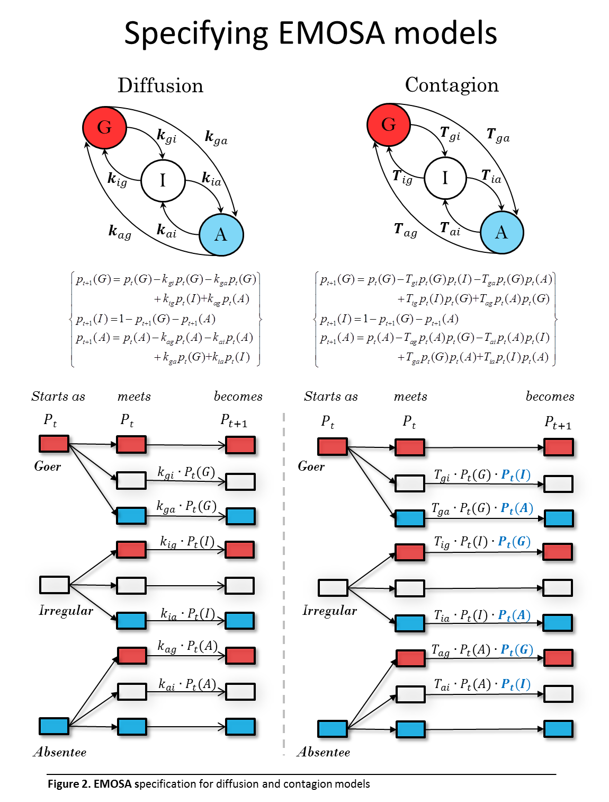

Markov/EMOSA
========================================================

Three EMOSA formulation are examined here. Two of them,  Diffusion and Contagion, are specified below. 
  

* Rodgers, J. L., & Rowe, D. C. (1993). Social contagion and adolescent sexual behavior: A developmental EMOSA model. Psychological Review, 100(3), 479-510. doi: 10.1037/0033-295x.100.3.47