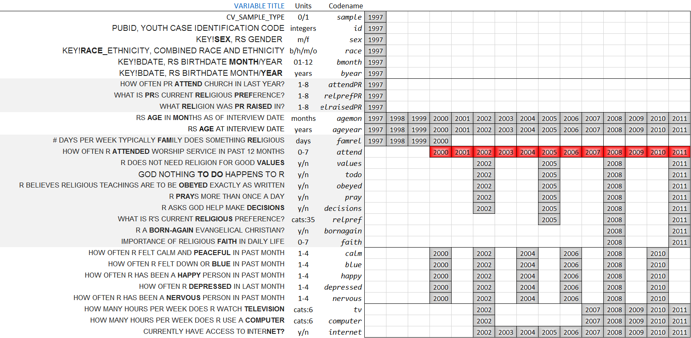
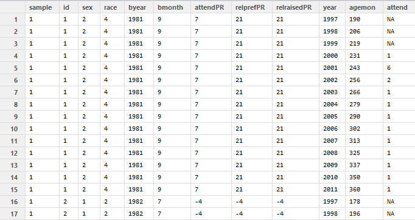

Longitudinal Models of Religiosity: NLSY97 sample
========================================================

## Methodological Overview

The current study analysizes how religiosity changes during adolescence and young adulthood. Three different classes of models are considered to explain the same data. Latent curve models (**LCM**) test  certain shapes of the time effect (linear, quadratic, and cubic ) in search of the best fitting common trajectory that describes church attendance between 2000 and 2011, regressing random terms on cohort membership. Growth mixture models (**GMM**) selects the best fitting solutions of LCM and searchers for latent classes underlying the observed church attendance. Individuals are grouped based on the similarity of their trajectories, and profiled. Cohort memberships is used as predictor in determining membership in such latent profile.  Finally, Markov models (**MM**), such as EMOSA and transition analysis, describe states and transitions among them. Treating the same outcome (church attendance) as categorical (and not as continuous like in LCM and GMM cases), EMOSA accounts for the changing ratio of categories in the population, and how the age of the individual affects the likelihood of staying in one (e.g. "church goer") or another (e.g."non-goer")  behavior category that quantifies religiosity. 

## Sample

The current study uses the data from the [NLSY97](http://www.bls.gov/nls/nlsy97.htm) study, which is a part of a larger effort of the National Longitudinal Surveys [NLS](http://www.bls.gov/nls/). NLSY97 is a nationally representative sample of households including approximately 9,000 participants. The NLSY97 was based on a household probability sample in which all adolescents between certain ages were surveyed within sampled households.  Selected individuals, born between 1980 and 1984, were 12 to 16 years old as of December 31, 1996. They were interviewed annually, starting in 1997 and continuing until today. As of the current date (April, 20014), there are 15 publically available rounds of NLSY97 data (1997-2011). The present study focuses on the span of 12 time points (2000 – 2011) for which uninterrupted measure of religious behavior was taken. It starts with (13-17)-yearolds and describes how they change into (27-31)-yearolds.  

## Domain of Religiosity  

NLYS97 contains several items mapping into the domain of religiosity. One particular variable measuring church attendance (Codename:**attend**) is recorded  uninteruptedly for 12 years (2000-2011) and chosen as the key operationalization of religiosity in all models. Literature on psychology and sociology of religion suggest that church attendance is highly correlated with other facets of religiosity, and might very well be the optimal indicator of broad religiosity in practice. The items selected for analysis and context are shown in the following graph. 

## Variable-Occasion Slice (**VO**) 
  

The first section of variables gives basic context variables: the month and year of birth, age at the time of the interview, sex, race, as well as sample indicator (cross-sectional or oversample).

The second group of variables (in light gray) hosts variables related to religiosity: behaviors (relpref, attend, pray, decisions) and attitudes (values, todo, obeyed, bornagain, faith) of respondents. Another section (aslo in gray) at the bottom lists availible variables concerning religiosity of the [PARENT](http://www.bls.gov/nls/quex/r1/y97rd1pquex.htm) of the respondent (attendPR, relprefPR, relraisedPR).  Between religiosity sections there is a list of covariates that might, in this case a self-report on emotional wellbeing (calm, blue, happy, depressed, nervous) and media activities (internet, computer,tv). 
 
 
## Primary Dataset : View of one case (id=1) 
This variable-occasion slice of Cattell's databox, shows at what time points measurement exists for each of the selected variables. This datamap has a direct relationship with the structure of the primary dataset in the study

  

in which we rotate the previous VO Slice 90 degrees. Here, we can distinguish time invariate (**TI**) variables, which values do not change with time. You can see their values remaining constant for each individual (id). Column with **year** counter separates **TI** variables from time variant (**TV**) variables, which values are availible for more than one time point. The datasets used in specific modeling are derived from this initial dataset

## Manipulation
Special report [Derive_dsL_from_Extrac]("https://github.com/andkov/Longitudinal_Models_of_Religiosity_NLSY97/blob/master/Data/Derive_dsL_from_Extract.md") narrates every step in data preparation, from accessing [NLS Investigator](https://www.nlsinfo.org/investigator/pages/login.jsp) to arriving at the **dsL** dataset shown above. This dataset (**dsL**) is subsetted and transformed to fit the needs of particular modeling techinique. Reports of these transormations are given inside corresponding model analyses (LCM, GMM, MM).

## Modeling

Modeling techniques used in the study are listed in "/Models" folder in the root fo the repository. New modeling projects should be added here. 

## Documentation

<!--
pathMd <- base::file.path("./", c("README.md"))
pathHtml <- base::gsub(pattern=".md$", replacement=".html", x=pathMd)
markdown::markdownToHTML(file=pathMd, output=pathHtml)
-->

