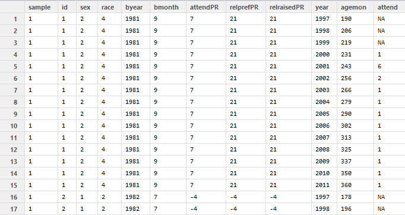

Longitudinal Models of Religiosity: NLSY97 sample
========================================================

**Study Goal**

The current study analysizes how religiosity changes during adolescence and young adulthood. Three different classes of models are considered to explain the same data. Latent curve modeling (**LCM**) fits  several time effects (linear, quadratic, and cubic ) in search of the best fitting trajectory of  church attendance between 2000 and 2011, regressing random terms on cohort membership. Growth mixture modeling (**GMM**) selects the best fitting solutions of LCM and searchers for latent classes underlying the observed church attendance. Individuals are grouped based on the similarity of their trajectories of change in church attendance over the years. Finally, Markov models (**MM**), such as EMOSA and transition analysis, describe the data in terms of categories (of religious attendance) and transitions between them, instead of trajectories. Treating the outcome scale as categorical, instead of continuous, allows to test out research hypotheses different from that of previous two modeling techniques.

**Sample**

The current study uses the data from the [NLSY97](http://www.bls.gov/nls/nlsy97.htm) study, which is a part of a larger effort of the National Longitudinal Surveys [NLS](http://www.bls.gov/nls/). NLSY97 is a nationally representative sample of households including approximately 9,000 participants. Selected individuals were 12 to 16 years old as of December 31, 1996. They were interviewed annually, starting in 1997 and continuing until today. As of current date (April 22, 20014), there are 15 publically availible rounds of NLSY97 data (1997-2011).

**Domain of Religiosity**
NLYS97 contains several items mapping into the domain of religiosity. The items selected for analysis and context are shown in the following graph. 
# VO Slice 
  

This variable-occasion slice of Cattell's databox, shows at what time points measurement exists for each of the selected variables. This datamap has a direct relationship with the structure of the primary dataset in the study
# Primary Dataset
  

in which rotates the previous VO Slice 90 degrees counterclockwise into a common Long dataform.
[Interactive version]("./www/slice-vo.html")
