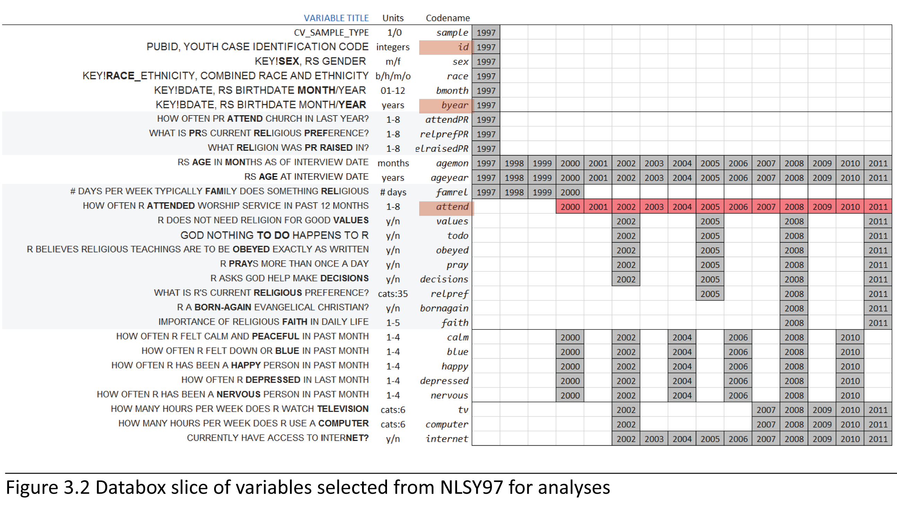

##### Quick Start  
Folder [Data](./Data) contains files involved with data import and preparation. [Derive_dsL_from_Extract.md](https://github.com/andkov/Longitudinal_Models_of_Religiosity_NLSY97/blob/master/Data/Derive_dsL_from_Extract.md) narrates every step in data preparation, from accessing [NLS Investigator](https://www.nlsinfo.org/investigator/pages/login.jsp) to arriving at the **dsL** dataset.  

Folder [Models](./Models) contains modeling projects. In [Descriptives](./Models/Descriptives), report [Metrics.md](./Models/Descriptives/Metrics.md) explains how raw values of selected variables are labeled, focusing the on the metrics of time and church attendance. [Databox.md](./Models/Descriptives/Databox.md)  produces the graphs and statistics for all selected variables that are s in the interactive [databox](http://statcanvas.net/thesis/databox/index.html).

Folder [Scripts](./Scripts) contains files with R code used in various parts of the project.

Folder [wwww](./www) host web templates for assembling results of data analyis and model synthesis.

Graphical Methods for Evaluating Longitudinal Models: Application to NLSY97 Religiosity Data.
========================================================
  The study proposes several graphical innovations for  evaluating and reporting longitudinal models in social sciences.  The graphical methods demonstrated here address practical issues that arise in evaluating **sequences** of statistical models. A meaningful dimension of complexity, formed by a progression of nested or otherwise related models in a sequence, creates a context for model comparisons. The proposed graphical methods provide the researcher with visualization tools to facilitate model evaluation through data mapping and dynamic document design. Ultimately, sequence report mechanism would accomodate three type of models:
  
  1. Latent curve models (Bollen & Curran, 2006),(Snijders & Bosker, 2012) **LCM**
  2. Growth mixture models (Muthen & Asparouhov, 2008) **GMM**
  3. Markov/EMOSA (Rodgers & Row, 1993) **M/E** 
  
The scope of the dissertation work, however, is limited to LCM case. 
The study will apply these methods to examine empirical trends of religious involvement using a nationally representative household sample of American youth, the National Longitudinal Survey of Youth, 1997 (**NLSY97**). Annual measures in the NLSY97 from 2000 to 2011 provided panel data on church attendance from approximately 9,000 individuals born between 1980 and 1984.These data are examined with the help of LCM, GMM, and M/E sequences to explore the nature of change in religious involvement between ages 13 and 31. 
  
#### References

* Bollen, K. A. & Curran, P. J. (2006). Latent curve models: A structural equation perspective (Vol. 467). Wiley.
* Muthén, B., & Asparouhov, T. (2008). Growth mixture modeling: Analysis with non-Gaussian random effects. Longitudinal data analysis, 143-165.
* Rodgers, J. L., & Rowe, D. C. (1993). Social contagion and adolescent sexual behavior: A developmental EMOSA model. Psychological Review, 100(3), 479-510. doi: 10.1037/0033-295x.100.3.47
* Snijders, T. A. B., & Bosker, R. J. (2012). Multilevel analysis: An introduction to basic and advanced multilevel modeling (2 ed.). London: SAGE.

### About the models

The current study analysizes how religious attendance changes during adolescence and young adulthood. Three different classes of models are considered to explain the same data.   
Latent curve models (**LCM**) test  certain shapes of the time effect (linear, quadratic, and cubic ) in search of the best fitting common trajectory that describes church attendance between 2000 and 2011, regressing random terms on cohort membership.  
Growth mixture models (**GMM**) selects the best fitting solutions of LCM and searchers for latent classes underlying the observed trajectory of church attendance. Individuals are grouped based on the similarity of their trajectories, and profiled. Cohort memberships is used as predictor in determining membership in such latent profile.    
Finally, Markov/EMOSA models (**M/E**), such as EMOSA and transition analysis, describe states and transitions among them. Treating the same outcome (church attendance) as categorical (and not as continuous like in LCM and GMM cases), EMOSA accounts for the changing ratio of categories in the population, predicting how the age of the individual affects the likelihood of staying in one (e.g. “church goer”) or another (e.g. “non-goer”) behavior category that quantifies religiosity.

### Sample

The current study uses the data from the [NLSY97](http://www.bls.gov/nls/nlsy97.htm) study, which is a part of a larger effort of the National Longitudinal Surveys [NLS](http://www.bls.gov/nls/). NLSY97 is a nationally representative sample of households including approximately 9,000 participants. 
The NLSY97 was based on a household probability sample in which all adolescents between certain ages were surveyed within sampled households.  Selected individuals, born between 1980 and 1984, were 12 to 16 years old as of December 31, 1996. They were interviewed annually, starting in 1997 and continuing until today.  
As of the current date (April, 20014), there are 15 publically available rounds of NLSY97 data (1997-2011). The present study focuses on the span of 12 time points (2000 – 2011) for which uninterrupted measure of self-reported religious worship attendance was taken. It starts with (13-17)-yearolds and describes how they change into (27-31)-yearolds.    

### Domain of Religiosity  

NLYS97 contains several items mapping into the domain of religiosity. One particular variable measuring church attendance (Codename:**attend**) is recorded  uninteruptedly for 12 years (2000-2011) and chosen as the key operationalization of religiosity in all models. 
Literature on psychology and sociology of religion suggest that church attendance is highly correlated with other facets of religiosity, and might very well be the optimal indicator of broad religiosity in practice. The items selected for analysis and context are shown in the form of a databox slice. 

### Databox

 
###  Dataset dsL
 

### Where to start
If you'd rather explore the code directly, the READMEs in the root of each directory will direct you to needed .Rmd and .R files. Rmd file creates the report in Markdown format that is published to GitHub. It integrates text and images with R code chunks (marked by "## @knitr ChunkName" identifiers) You may want to start with the folder [Data](https://github.com/andkov/Longitudinal_Models_of_Religiosity_NLSY97/tree/master/Data) that narrates the origins of the dataset. There, a 
special report [Derive_dsL_from_Extract.md](https://github.com/andkov/Longitudinal_Models_of_Religiosity_NLSY97/blob/master/Data/Derive_dsL_from_Extract.md) narrates every step in data preparation, from accessing [NLS Investigator](https://www.nlsinfo.org/investigator/pages/login.jsp) to arriving at the **dsL** dataset shown above. 
**ds** stands for "dataset" and **L** indicates that it is in LONG format, used by by most modeling and graphing packages. 
This dataset, **dsL** is later subsetted and transformed to fit the needs of particular modeling method. Reports of these transormations are given inside corresponding model analyses (LCM, GMM, M/E).

Modeling techniques used in the study are listed in [/Models](https://github.com/andkov/Longitudinal_Models_of_Religiosity_NLSY97/tree/master/Models) folder in the root of the repository. Dissertation work applies only [LCM](https://github.com/andkov/Longitudinal_Models_of_Religiosity_NLSY97/tree/master/Models/LCM), but [GMM](https://github.com/andkov/Longitudinal_Models_of_Religiosity_NLSY97/tree/master/Models/GMM), and [Markov/EMOSA](https://github.com/andkov/Longitudinal_Models_of_Religiosity_NLSY97/tree/master/Models/ME) are added to indicate future extensions. New modeling projects also should be added to this directory. 

<!--
pathMd <- base::file.path("./", c("README.md"))
pathHtml <- base::gsub(pattern=".md$", replacement=".html", x=pathMd)
markdown::markdownToHTML(file=pathMd, output=pathHtml)
-->

