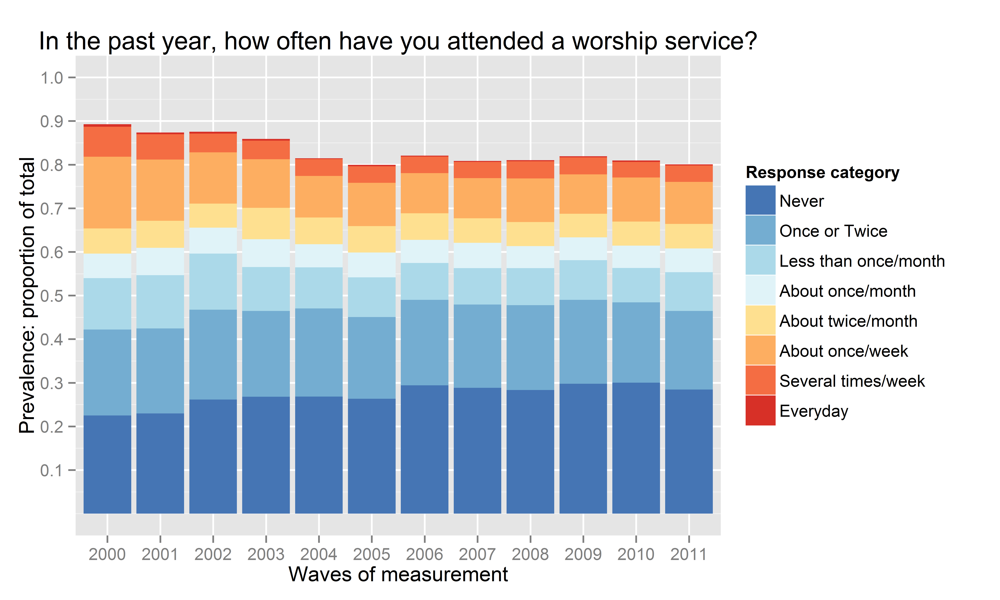

<!--  Set the working directory to the repository's base directory; this assumes the report is nested inside of only one directory.-->

    dsL<-readRDS("./Data/Derived/dsL.rds")
    attcol8<-c("Never"="#4575b4",
               "Once or Twice"="#74add1",
               "Less than once/month"="#abd9e9",
               "About once/month"="#e0f3f8",
               "About twice/month"="#fee090",
               "About once/week"="#fdae61",
               "Several times/week"="#f46d43",
               "Everyday"="#d73027")

    print (dsL[dsL$id==1,c("id","year","attend","attendF")])

       id year attend         attendF
    1   1 1997     NA            <NA>
    2   1 1998     NA            <NA>
    3   1 1999     NA            <NA>
    4   1 2000      1           Never
    5   1 2001      6 About once/week
    6   1 2002      2   Once or Twice
    7   1 2003      1           Never
    8   1 2004      1           Never
    9   1 2005      1           Never
    10  1 2006      1           Never
    11  1 2007      1           Never
    12  1 2008      1           Never
    13  1 2009      1           Never
    14  1 2010      1           Never
    15  1 2011      1           Never

Creating frequency distributions for each of the measurement wave we
have:

    ds<- dsL
    p<-ggplot(ds, aes(x=yearF, fill=attendF))
    p<-p+ geom_bar(position="fill")
    p<-p+ scale_fill_manual(values = attcol8,
                        name="Response category" )
    p<-p+ scale_y_continuous("Prevalence: proportion of total",
                         limits=c(0, 1),
                         breaks=c(.1,.2,.3,.4,.5,.6,.7,.8,.9,1))
    p<-p+ scale_x_discrete("Waves of measurement",
                       limits=as.character(c(2000:2011)))
    p<-p+ labs(title=paste0("In the past year, how often have you attended a worship service?"))
    p

Missing values are used in the calculation of total responses to show
the natural attrition in the study. Assumming that attrition is not
significantly associated with the outcome measure, we can remove missing
values from the calculation of the total of responses and at look at
percentages that each response was endorsed at each time point.

    ds<- dsL
    ### ?
    p<-ggplot(ds, aes(x=yearF, fill=attendF))
    p<-p+ geom_bar(position="fill")
    p<-p+ scale_fill_manual(values = attcol8,
                        name="Response category" )
    p<-p+ scale_y_continuous("Prevalence: proportion of total",
                         limits=c(0, 1),
                         breaks=c(.1,.2,.3,.4,.5,.6,.7,.8,.9,1))
    p<-p+ scale_x_discrete("Waves of measurement",
                       limits=as.character(c(2000:2011)))
    p<-p+ labs(title=paste0("In the past year, how often have you attended a worship service?"))
    p

