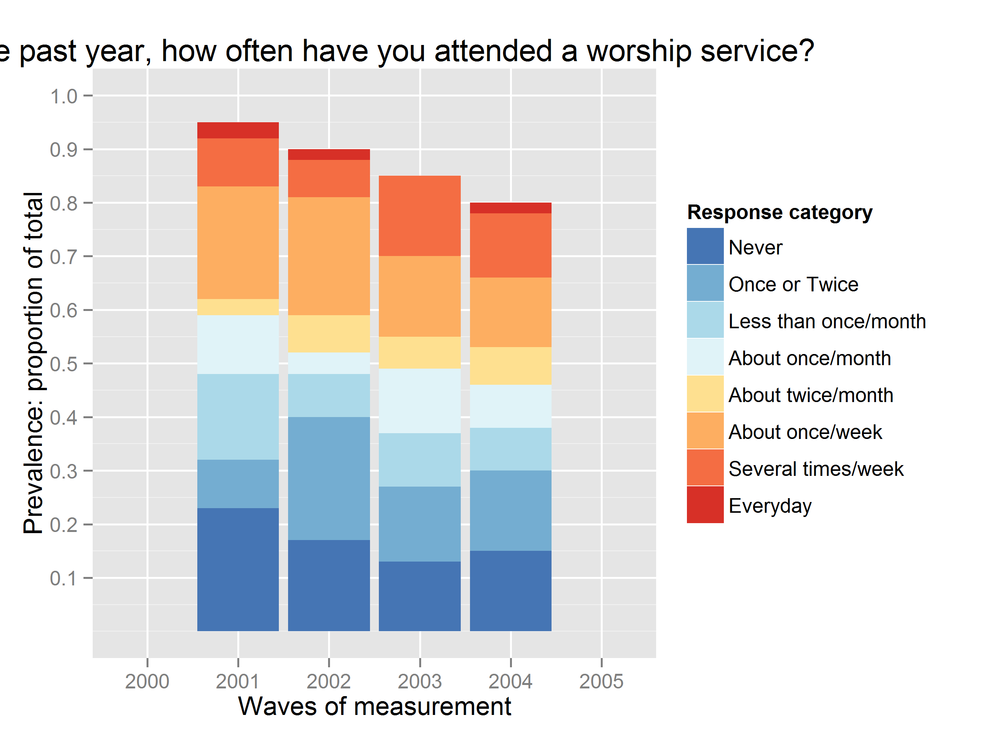
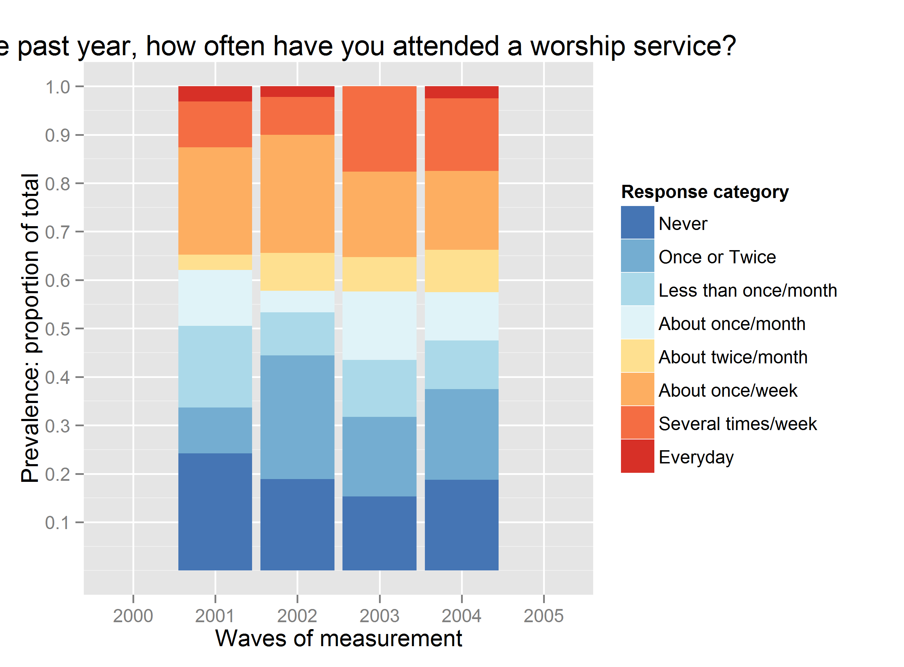

---
output:
  html_document:
    css: '\~/GitHub/Longitudinal\_Models\_of\_Religiosity\_NLSY97/www/css/thesis.css'
    fig_caption: True
    fig_height: '4.5'
    fig_width: '6.5'
    highlight: textmate
    keep_md: True
    theme: united
    toc: True
  md_document:
    toc: True
    variant: markdown
  pdf_document:
    fig_crop: False
    highlight: kate
    latex_engine: xelatex
    number_sections: True
    toc: True
    toc_depth: 3
title: Raw vs Summarized
...

-   Same plot from raw and summarized data
-   Question:
-   Answer from Comment 1

<!--  Set the working directory to the repository's base directory; this assumes the report is nested inside of only one directory.-->


### Same plot from raw and summarized data

For the following data structure

``` {.r}
dsN<-data.frame(
  id=rep(1:100, each=4),
  yearF=factor(rep(2001:2004, 100)),
  attendF=sample(1:8, 400, T, c(.2,.2,.15,.10,.10, .20, .15, .02))
)
dsN[sample(which(dsN$yearF==2001), 5), "attendF"]<-NA
dsN[sample(which(dsN$yearF==2002), 10), "attendF"]<-NA
dsN[sample(which(dsN$yearF==2003), 15), "attendF"]<-NA
dsN[sample(which(dsN$yearF==2004), 20), "attendF"]<-NA

attcol8<-c("Never"="#4575b4",
           "Once or Twice"="#74add1",
           "Less than once/month"="#abd9e9",
           "About once/month"="#e0f3f8",
           "About twice/month"="#fee090",
           "About once/week"="#fdae61",
           "Several times/week"="#f46d43",
           "Everyday"="#d73027")
dsN$attendF<-factor(dsN$attendF, levels=1:8, labels=names(attcol8))
head(dsN,13)
```

       id yearF           attendF
    1   1  2001 About twice/month
    2   1  2002     Once or Twice
    3   1  2003   About once/week
    4   1  2004          Everyday
    5   2  2001             Never
    6   2  2002              <NA>
    7   2  2003     Once or Twice
    8   2  2004              <NA>
    9   3  2001     Once or Twice
    10  3  2002  About once/month
    11  3  2003   About once/week
    12  3  2004     Once or Twice
    13  4  2001              <NA>

we can obtain a series of a stacked bar charts

``` {.r}
require(ggplot2)
# p<- ggplot( subset(dsN,!is.na(attendF)), aes(x=yearF, fill=attendF)) # leaving NA out of
p<- ggplot( dsN, aes(x=yearF, fill=attendF))  #  keeping NA in calculations
p<- p+ geom_bar(position="fill")
p<- p+ scale_fill_manual(values = attcol8,
                         name="Response category" )
p<- p+ scale_y_continuous("Prevalence: proportion of total",
                          limits=c(0, 1),
                          breaks=c(.1,.2,.3,.4,.5,.6,.7,.8,.9,1))
p<- p+ scale_x_discrete("Waves of measurement",
                        limits=as.character(c(2000:2005)))
p<- p+ labs(title=paste0("In the past year, how often have you attended a worship service?"))
p
```



The graph above is produced from the raw data. However, it is sometimes
convenient to produce graphs from summarized data, especially if one
needs control over statistical functions. Below is transformation of dsN
into ds that contains only the values that are actually mapped on the
graph above:

``` {.r}
require(dplyr)
ds<- dsN %.%
  dplyr::filter(!is.na(attendF)) %.%
  dplyr::group_by(yearF,attendF) %.%
  dplyr::summarize(count = sum(attendF)) %.%
  dplyr::mutate(total = sum(count),
              percent= count/total)
head(ds,10)
```

    Source: local data frame [10 x 5]
    Groups: yearF

       yearF              attendF count total percent
    1   2001                Never    23   361 0.06371
    2   2001        Once or Twice    18   361 0.04986
    3   2001 Less than once/month    48   361 0.13296
    4   2001     About once/month    44   361 0.12188
    5   2001    About twice/month    15   361 0.04155
    6   2001      About once/week   126   361 0.34903
    7   2001   Several times/week    63   361 0.17452
    8   2001             Everyday    24   361 0.06648
    9   2002                Never    17   335 0.05075
    10  2002        Once or Twice    46   335 0.13731

``` {.r}
# verify
summarize(filter(ds, yearF==2001), should.be.one=sum(percent))
```

    Source: local data frame [1 x 2]

      yearF should.be.one
    1  2001             1

### Question:

How would one re-create a graph from above using this summary dataset
<code>ds</code>?

### Answer from Comment 1

If we want to leave <code>NA</code> in the calculation of the total:

``` {.r}
ds<- dsN %.%
#   dplyr::filter(!is.na(attendF)) %.%   # comment out to count NA in the total
  dplyr::group_by(yearF,attendF) %.%
  dplyr::summarize(count = length( attendF)) %.%
  dplyr::mutate(total = sum(count),
              percent= count/total)
head(ds,10)
```

    Source: local data frame [10 x 5]
    Groups: yearF

       yearF              attendF count total percent
    1   2001                Never    23   100    0.23
    2   2001        Once or Twice     9   100    0.09
    3   2001 Less than once/month    16   100    0.16
    4   2001     About once/month    11   100    0.11
    5   2001    About twice/month     3   100    0.03
    6   2001      About once/week    21   100    0.21
    7   2001   Several times/week     9   100    0.09
    8   2001             Everyday     3   100    0.03
    9   2001                   NA     5   100    0.05
    10  2002                Never    17   100    0.17

Missing values are used in the calculation of total responses to show
the natural attrition in the study.

``` {.r}
p<- ggplot( ds, aes(x=yearF, y=percent, fill=attendF))  #  keeping NA in calculations
p<- p+ geom_bar(position="stack", stat="identity")
p<- p+ scale_fill_manual(values = attcol8,
                         name="Response category" )
p<- p+ scale_y_continuous("Prevalence: proportion of total",
                          limits=c(0, 1),
                          breaks=c(.1,.2,.3,.4,.5,.6,.7,.8,.9,1))
p<- p+ scale_x_discrete("Waves of measurement",
                        limits=as.character(c(2000:2005)))
p<- p+ labs(title=paste0("In the past year, how often have you attended a worship service?"))
p
```


However, assumming that attrition is not significantly associated with
the outcome measure, it would be of interest to see how relative
prevalence of response endorsement changes over time, or perhaps stays
in an equilibrium. For this we need to remove missing values from the
calculation of the total of responses:

``` {.r}
ds<- dsN %.%
  dplyr::filter(!is.na(attendF)) %.%   # comment out to count NA in the total
  dplyr::group_by(yearF,attendF) %.%
  dplyr::summarize(count = length( attendF)) %.%
  dplyr::mutate(total = sum(count),
              percent= count/total)
head(ds,10)
```

    Source: local data frame [10 x 5]
    Groups: yearF

       yearF              attendF count total percent
    1   2001                Never    23    95 0.24211
    2   2001        Once or Twice     9    95 0.09474
    3   2001 Less than once/month    16    95 0.16842
    4   2001     About once/month    11    95 0.11579
    5   2001    About twice/month     3    95 0.03158
    6   2001      About once/week    21    95 0.22105
    7   2001   Several times/week     9    95 0.09474
    8   2001             Everyday     3    95 0.03158
    9   2002                Never    17    90 0.18889
    10  2002        Once or Twice    23    90 0.25556

Graph reflects this accordingly:

``` {.r}
p<- ggplot( ds, aes(x=yearF, y=percent, fill=attendF))  #  keeping NA in calculations
p<- p+ geom_bar(position="stack", stat="identity")
p<- p+ scale_fill_manual(values = attcol8,
                         name="Response category" )
p<- p+ scale_y_continuous("Prevalence: proportion of total",
                          limits=c(0, 1),
                          breaks=c(.1,.2,.3,.4,.5,.6,.7,.8,.9,1))
p<- p+ scale_x_discrete("Waves of measurement",
                        limits=as.character(c(2000:2005)))
p<- p+ labs(title=paste0("In the past year, how often have you attended a worship service?"))
p
```


