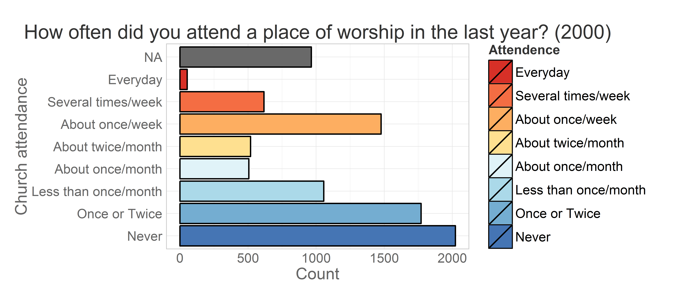
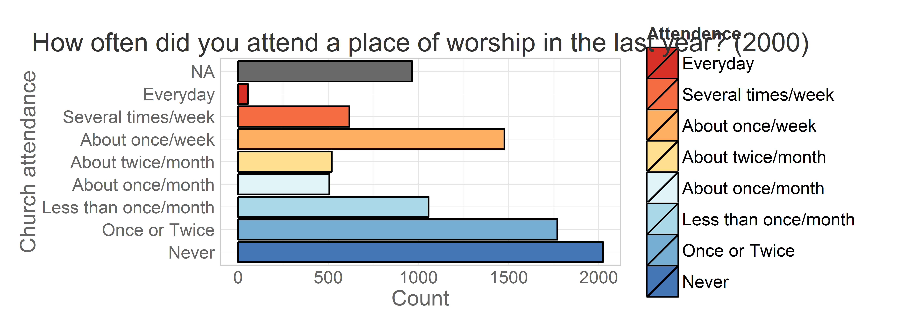
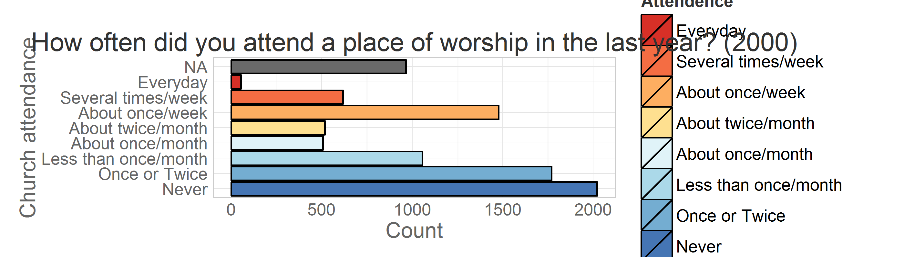
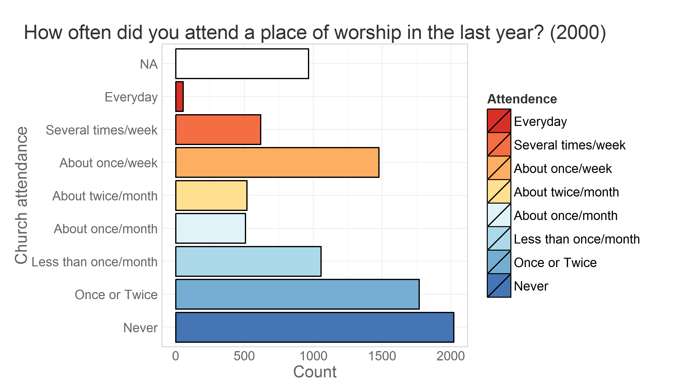
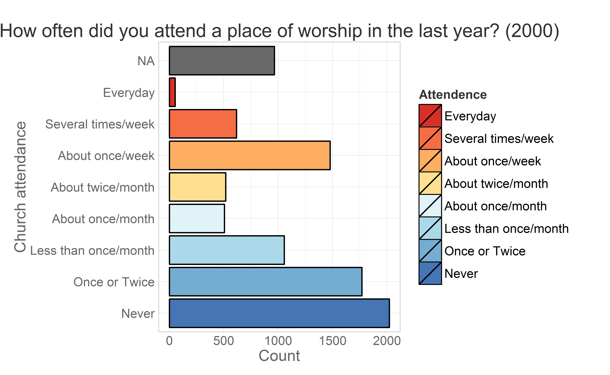
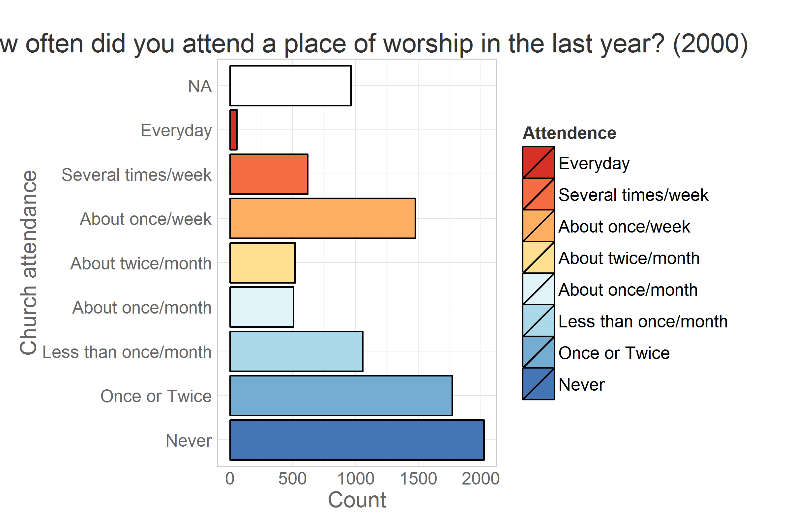
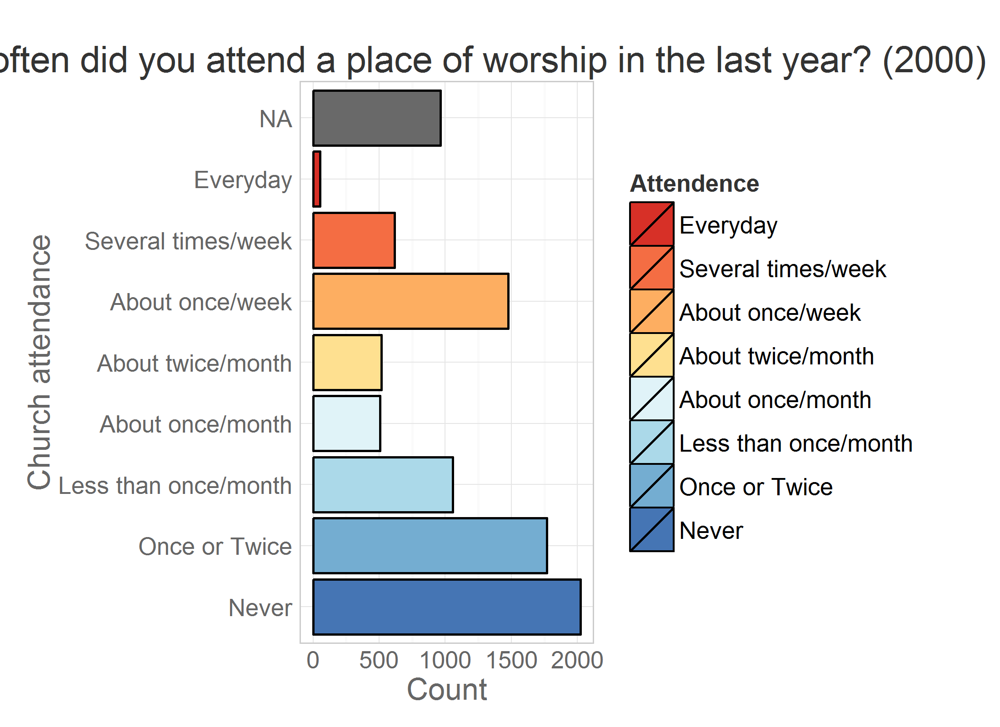
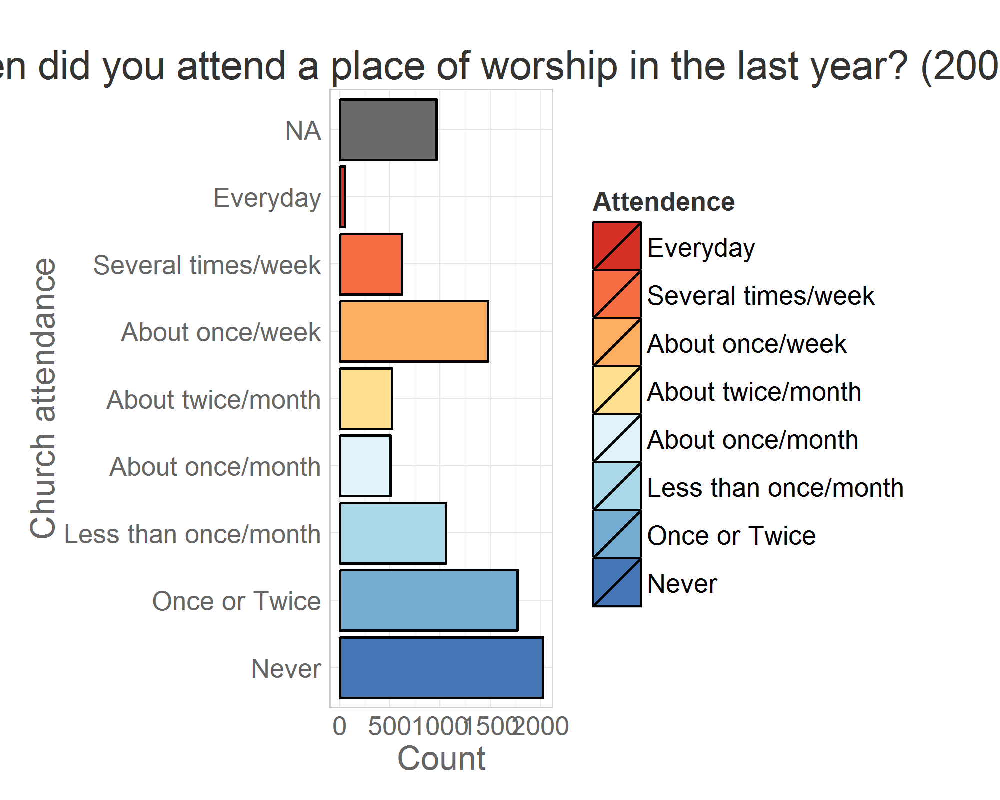
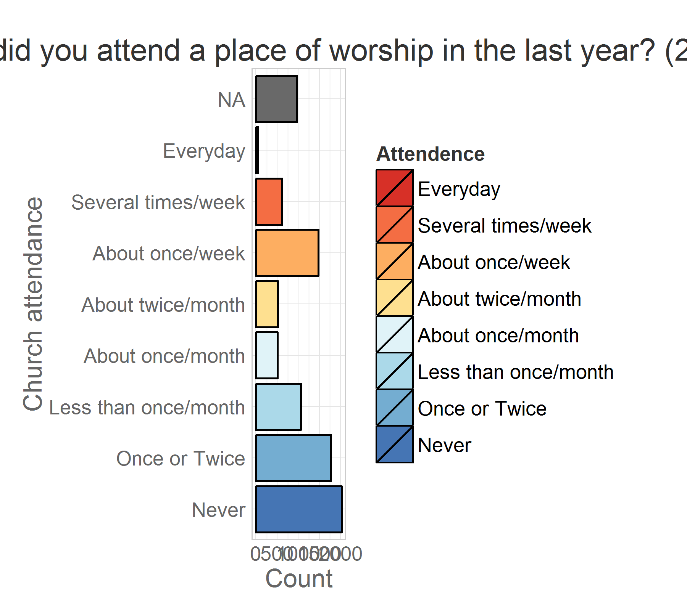
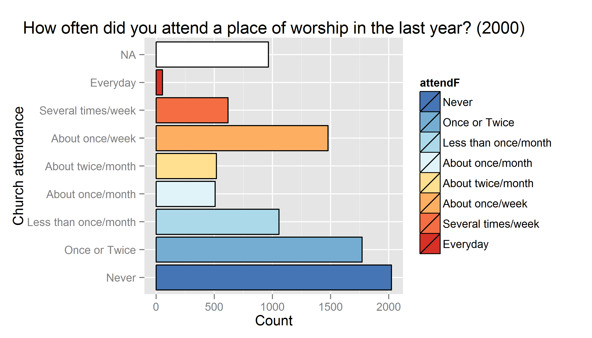

-   Fig.hight
-   Fig.hight
    -   fig.height = 4, fig.width=7, out.width = "600px"
    -   fig.height = 3.5, fig.width=7, out.width = "600px"
    -   fig.height = 3, fig.width=7, out.width = "600px"
    -   fig.height = 2.5, fig.width=7, out.width = "600px"
    -   fig.height = 2, fig.width=7, out.width = "600px"
-   Fig.width
    -   fig.height = 4, fig.width=7, out.width = "600px"
    -   fig.height = 4, fig.width=6.5, out.width = "600px"
    -   fig.height = 4, fig.width=6, out.width = "600px"
    -   fig.height = 4, fig.width=5.5, out.width = "600px"
    -   fig.height = 4, fig.width=5, out.width = "600px"
    -   fig.height = 4, fig.width=4.5, out.width = "600px"
-   out.width
    -   fig.height = 4, fig.width=7, out.width = "600px"
    -   fig.height = 4, fig.width=7, out.width = "550px"
    -   fig.height = 4, fig.width=7, out.width = "500px"
    -   fig.height = 4, fig.width=7, out.width = "450px"
    -   fig.height = 4, fig.width=7, out.width = "400px"
    -   fig.height = 4, fig.width=7, out.width = "350px"

<!--  Set the working directory to the repository's base directory; this assumes the report is nested inside of only one directory.-->

Exploring the figure definitions

-   fig.width
-   fig.height
-   out.width

Fig.hight
=========

Fig.hight
=========

fig.height = 4, fig.width=7, out.width = "600px"
------------------------------------------------

fig.height = 3.5, fig.width=7, out.width = "600px"
--------------------------------------------------

fig.height = 3, fig.width=7, out.width = "600px"
------------------------------------------------

fig.height = 2.5, fig.width=7, out.width = "600px"
--------------------------------------------------

fig.height = 2, fig.width=7, out.width = "600px"
------------------------------------------------

Fig.width
=========

fig.height = 4, fig.width=7, out.width = "600px"
------------------------------------------------

fig.height = 4, fig.width=6.5, out.width = "600px"
--------------------------------------------------

fig.height = 4, fig.width=6, out.width = "600px"
------------------------------------------------

fig.height = 4, fig.width=5.5, out.width = "600px"
--------------------------------------------------

fig.height = 4, fig.width=5, out.width = "600px"
------------------------------------------------

fig.height = 4, fig.width=4.5, out.width = "600px"
--------------------------------------------------

out.width
=========

fig.height = 4, fig.width=7, out.width = "600px"
------------------------------------------------

fig.height = 4, fig.width=7, out.width = "550px"
------------------------------------------------

fig.height = 4, fig.width=7, out.width = "500px"
------------------------------------------------

fig.height = 4, fig.width=7, out.width = "450px"
------------------------------------------------

fig.height = 4, fig.width=7, out.width = "400px"
------------------------------------------------

fig.height = 4, fig.width=7, out.width = "350px"
------------------------------------------------

